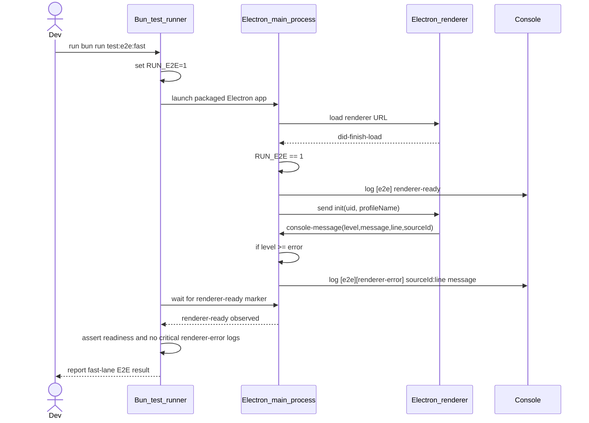
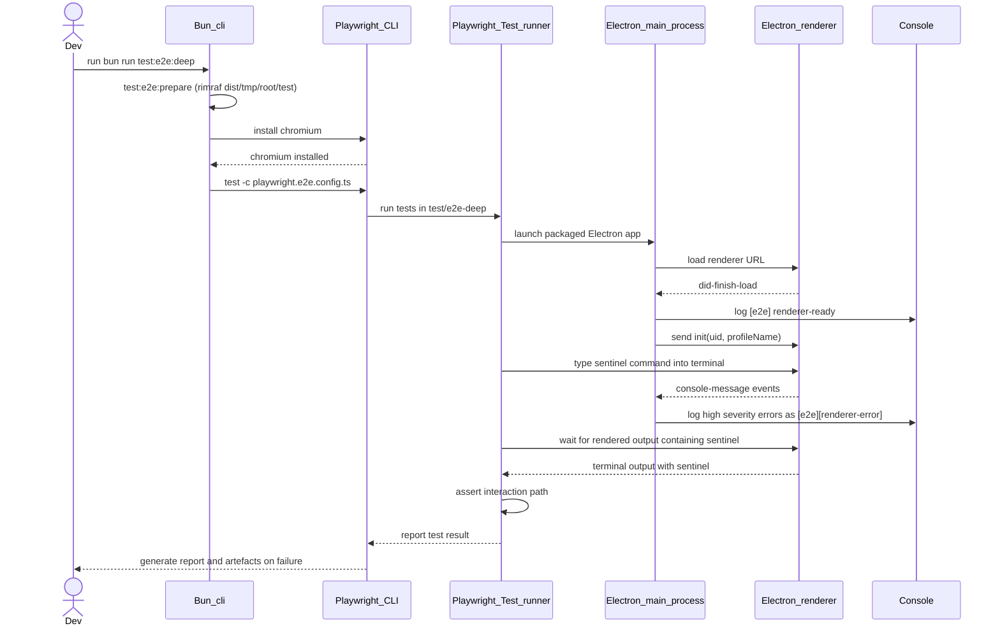

# Developers' guide

## Module header

- Purpose: Summarize local development practices and validation commands for
  the Velocetty repository.
- Invariants: Keep Makefile targets and validation steps aligned with
  Continuous Integration (CI) and tooling changes.
- Cross-links: [Testing with Bun](testing-with-bun.md),
  [ADR 001](adr-001-replace-ava-with-bun-test.md),
  [ADR 002](adr-002-replace-webpack-babel-with-esbuild.md), and
  [Roadmap](roadmap.md).

This guide captures the development practices specific to the Velocetty
repository. It is intentionally concise and focused on the steps developers
must follow locally.

## Tooling expectations

- Use Bun for JavaScript and TypeScript scripts.
- Prefer Makefile targets for validation commands.
- Use `tsgo` (`@typescript/native-preview`) for TypeScript compilation and
  type-checking tasks.
- Use `build/esbuild/build.ts` as the canonical JavaScript bundling entrypoint
  for renderer, CLI, and app copy artefacts.
- Keep documentation wrapped to 80 columns and code blocks to 120 columns.

## Package boundaries

Roadmap item `1.1.1` establishes explicit package boundaries for new
development:

- `frontend/`: frontend package boundary for renderer-facing code.
- `backend/`: backend package boundary for privileged main-process code.
- `shared/`: shared contracts (types, constants, and schemas).

This split is currently an architectural boundary with incremental migration.
Runtime modules still live primarily in `lib/` (frontend) and `app/` (backend).
Treat those folders as the active implementation roots until follow-on migration
work moves modules under `frontend/src` and `backend/src`.

Dependency direction must remain one-way:

- `frontend -> shared`
- `backend -> shared`

`frontend` must not import `backend`, and `backend` must not import
`frontend`.

Use shared imports via TypeScript path aliases:

- `@frontend/*`
- `@backend/*`
- `@shared/*`

Boundary validation is enforced by `bun run check:boundaries`, which runs as
part of `bun run lint` and therefore `make lint`.

Follow-up hardening tracked in `docs/tracking-issues.md`:

- `BOUNDARY-001`: include CommonJS `require(...)` imports in boundary checks.
- `CONTRACT-001`: make `shared/` schema generation independent of legacy
  `typings/` compatibility re-exports.

## Transport abstraction practice

- All internal Velocetty renderer code (command-layer modules **and**
  component-level UI modules) must use `lib/transport/` adapters instead
  of direct Electron inter-process communication (IPC) imports or
  `window.rpc` calls.
- `window.rpc` remains available as a global for backward-compatible
  plugin API access only; internal Velocetty modules must not depend on
  it.
- For command execution and renderer event streams, use
  `RendererCommandTransport` from `@shared/types/transport` and
  `transport` from `lib/transport` (barrel module). Do not import the
  Electron-specific adapter directly.
- Keep host-specific IPC details inside `lib/transport` adapters and
  keep command modules only concerned with transport contracts.
- IPC responses are validated at the transport boundary via zod schemas
  in `lib/transport/ipc-schemas.ts`. When adding a new `IpcCommands`
  entry, add a corresponding schema to the registry so responses are
  validated before reaching application code.
- Add or update transport adapter tests when changing invocation or
  subscription paths (for example,
  `test/unit/electron-ipc-transport.test.ts`). For component-level
  transport usage, mock `lib/transport/electron-ipc-transport` and
  verify `on`/`off`/`emit` calls to confirm correct wiring without
  coupling to internal component rendering behaviour.
- Track progress against `lib/TRANSPORT_MIGRATION_MAP.md` and keep all
  transport-facing command and bootstrap-path follow-ups visible before
  any PR.

Package-local build checks are available via:

- `bun run build:shared`
- `bun run build:frontend`
- `bun run build:backend`
- `bun run build:packages`

## Command registry practice

Roadmap item `1.2.1` introduces shared command contracts and deterministic
registry APIs. Follow these rules for command-system changes:

- Define command contracts in `shared/src/types/commands.ts` and import them via
  `@shared/types/commands` from runtime modules.
- Keep registry implementations deterministic by returning `list()` output in a
  stable order (`CommandId` lexical ordering).
- When a command includes `argsSchema`, validate arguments via registry helpers
  and return structured `CommandValidationError` objects with `code`,
  `commandId`, and schema `issues`.
- Preserve compatibility surfaces used by current runtime/plugin paths
  (`registerCommandHandlers`, `getCommandHandler`, and `getRegisteredKeys`)
  until dispatcher migration milestones replace those entry points.
- Add or update unit coverage in `test/unit/command-registry.test.ts` for
  create, read, update, and delete (CRUD) semantics, deterministic ordering,
  and validation error behaviour.

## Configuration format practice

Roadmap item `1.3.1` moves repository config handling to JSON5-only semantics
for active configuration files:

- Parse and write `hyper.json` as JSON5 (including comments and trailing
  commas).
- Do not rely on `.hyper.js` migration; legacy migration paths were removed.
- Persist runtime plugin settings under `config.plugins.<plugin-id>` in
  `hyper.json`.

## Tab decoration provider practice

Roadmap item `1.3.1` introduces the golden-path tab-decoration provider seam.
When adding or changing provider behaviour:

- Register providers through renderer plugin hooks
  (`getTabDecorationProviders`) rather than ad hoc tab polling logic.
- Keep provider ordering deterministic by sorting with this precedence:
  `priority` descending, then provider `id` lexicographically, then stable
  registration index.
- Keep list-slot output bounded and deterministic:
  `badges` max 3 entries and `widgets` max 2 entries after deduplication.
- Trigger tab-decoration refreshes from explicit events (`subscribe` callbacks
  or provider registration lifecycle), never from `setInterval` polling loops.
- Add or update focused coverage in
  `test/unit/tab-decoration-providers.test.ts` and
  `test/unit/tabs-decoration-updates.test.ts` whenever merge or update logic
  changes.

## Context key and `when` practice

Roadmap item `1.2.2` introduces shared context-key contracts and deterministic
`when` expression evaluation. Follow these rules when changing context-aware
command or keybinding behaviour:

- Define context-key and `when` AST contracts in
  `shared/src/types/context-keys.ts` and import those contracts through
  `@shared/types/context-keys`.
- Keep parser grammar constrained to the documented operators in
  `docs/velocetty-design.md` (`&&`, `||`, `!`, `==`, `!=`, `<`, `<=`, `>`,
  `>=`, and parentheses).
- Use `lib/context-key-service.ts` for runtime context-key management and
  expression evaluation, and reuse compiled expressions (`compile(...)`) when
  evaluating the same expression repeatedly.
- Treat context values as explicit primitives (`boolean`, `string`, `number`,
  or `null`) and avoid ad-hoc component booleans outside the context-key
  service.
- Add or update unit coverage in `test/unit/context-key-service.test.ts` for
  all operators, precedence/grouping, parse failure indices, and deterministic
  repeated evaluation.

## esbuild build pipeline and safeguards

The repository now bundles with esbuild by default:

- `bun run dev`: esbuild watch mode plus `tsgo --build --watch`
- `bun run build`: production esbuild bundles plus `tsgo --build`
- `bun run build:hyper-app`: copy-only app artefact pipeline via esbuild
  support scripts

ADR 002 still requires test-first discipline for any follow-on changes to
bundler scripts, bundler configuration, or custom esbuild plugin logic.
Contract suites must stay in place and green before changing default build
paths or plugin behaviour.

Required coverage categories before cut-over:

- Translation outcomes: verify `styled-jsx` scoped/global behaviour, externals
  mapping, source maps, and production minification output.
- Packaging outcomes: verify copied artefacts under `target/` and CLI artefact
  shape (including shebang integrity).
- Bespoke plugin validation: add deterministic unit tests for each custom
  esbuild plugin path (resolve/load/copy/ignore behaviour and diagnostics).

Follow `docs/execplans/replace-webpack-babel-with-esbuild.md` for migration
ordering and milestone gates.

## Electron runtime alignment

When upgrading Electron, keep runtime and native-module rebuild settings aligned
in the same change:

- Update `devDependencies.electron` in `package.json`.
- Align `@types/node` in `package.json` to the bundled Node.js major for the
  target Electron release.
- Bump the fallback target version in `bin/rebuild-node-pty.cjs`.
- Adjust `app/package.json` if runtime dependencies (for example, `node-pty`)
  need a compatibility bump for the new Electron Application Binary Interface
  (ABI).
- If CI rebuilds native modules, align `.github/workflows/nodejs.yml`
  `NODE_VERSION` and any architecture-specific Node bootstrap downloads to the
  same Node.js major family.
- Run `bun install` to validate snapshot generation, `install-app-deps`, and
  `node-pty` rebuilding before running the remaining gates.

Current repository runtime baseline after roadmap item `1.4.13`:

- `electron` and `electron-mksnapshot`: `^40.2.1`
- `@types/node`: `^24.10.12`
- CI workflow `NODE_VERSION`: `24.11.1`

CI Python/node-gyp baseline after roadmap item `1.4.15` macOS scope:

- In CI jobs that prepare native-module builds, create a per-job Python virtual
  environment for node-gyp bootstrap packages instead of running system-level
  `pip install`.
- Install `pip`, `packaging`, and `setuptools` inside that virtual environment,
  then set `PYTHON` and `npm_config_python` to the virtual-environment
  interpreter path for the install/rebuild steps that need node-gyp.
- Keep `npm_config_node_gyp` aligned to the workspace `node-gyp` entrypoint in
  the same job so Python and node-gyp resolution stay deterministic.
- Run this isolated Python bootstrap before `bun install`; this keeps hosted
  macOS lanes compliant with PEP 668 (`externally-managed-environment`) and
  avoids host-level Python mutation.

Linux runtime reliability baseline after roadmap item `1.4.15` Linux scope:

- Linux ARM CI coverage is Linux aarch64 only; do not reintroduce armv7
  (`armv7l`) lanes or release artefact targets.
- Prefer native ARM runners for Linux aarch64 CI lanes instead of emulated
  copy-to-image flows, which previously failed with disk-exhaustion errors.
- Keep Linux dependency installation shared via
  `.github/actions/install-linux-e2e-runtime-deps/action.yml` so fast-lane and
  deep-lane jobs stay in sync.
- Before running `bun install` on Linux aarch64 CI lanes, provision
  `qemu-x86_64-static`, add the `amd64` dpkg architecture, and install the required
  x86_64 runtime libraries (`libc6`, `libstdc++6`, `libgcc-s1`,
  `libglib2.0-0`, `libexpat1`, and `libpcre2-8-0`) so Electron's x64
  `mksnapshot` and `v8_context_snapshot_generator` binaries can run.
- On Ubuntu arm runners that default to `ports.ubuntu.com`, use explicit apt
  source entries (`ports` for `arm64` and `archive.ubuntu.com` plus
  `security.ubuntu.com` for `amd64`) before installing `:amd64` packages.
  Otherwise, apt tries to resolve `amd64` indexes from `ports` and fails with
  `404 Not Found`. Keep this source pinning for all later apt invocations in
  the same job after adding `amd64`; the Linux dependency installation action
  now applies it automatically when it detects an Ubuntu arm64 host with
  `amd64` multiarch enabled.
- The shared Linux dependency installation action resolves the
  Advanced Linux Sound Architecture (ALSA) runtime package by availability
  (`libasound2t64` on newer Ubuntu releases,
  `libasound2` on Ubuntu 22.04) so the same workflow configuration works across
  Jammy and Noble runners.
- After provisioning amd64 runtime packages on Linux aarch64 CI lanes, export
  `QEMU_LD_PREFIX=/` so Quick Emulator (QEMU) resolves x86_64 shared libraries
  from the host multiarch rootfs.
- For Linux aarch64 CI lanes, set `SKIP_V8_SNAPSHOT=1` during `bun install` so
  snapshot generation cannot stall install for hours under emulation.
- For Linux aarch64 CI lanes that run a dedicated `node-pty` rebuild step after
  install, set `SKIP_NODE_PTY_REBUILD=1` during `bun install` to avoid
  duplicate native rebuild work in postinstall.
- When Linux aarch64 CI lanes package artefacts after install-time snapshot
  skipping, run `SKIP_X64_V8_SNAPSHOT=1 bun run v8-snapshot` before
  `electron-builder` so `cache/arm64` contains the snapshot blobs required by
  `bin/cp-snapshot.js`.
- For local Linux aarch64 validation where snapshots are still required, set
  `SKIP_X64_V8_SNAPSHOT=1` to avoid generating the additional x64 snapshot pass
  under QEMU.
- For Linux aarch64 native-module rebuild reliability, run `bun install`
  before other gates and keep `npm_config_node_gyp` pointed at the workspace
  `node-gyp` entrypoint in CI jobs that rebuild native modules.

When preparing future Electron upgrades, update these anchors together and
avoid merging partial baseline updates.

## GPU fallback launch switch

Use the `VELOCETTY_DISABLE_GPU` environment variable when debugging renderer
issues caused by problematic GPU drivers:

```bash
VELOCETTY_DISABLE_GPU=1 bun run app
```

When this switch is enabled, the main process disables hardware acceleration
before Electron readiness and applies software-rendering Chromium flags.

## Chromium startup log noise suppression

Electron 40 on Linux can emit repetitive Chromium DBus startup alerts during
local runs, including transient `StartTransientUnit` scope collisions. The app
now sets Chromium `log-level=3` at startup by default to suppress this known
noise.

Use environment variables to adjust this behaviour:

- `VELOCETTY_SUPPRESS_CHROMIUM_ERROR_LOGS=0 bun run app`
  keeps Chromium error logs enabled.
- `VELOCETTY_CHROMIUM_LOG_LEVEL=2 bun run app`
  overrides the default Chromium log level used for suppression.
- `VELOCETTY_GPU_DIAGNOSTICS=1 bun run app`
  emits GPU launch diagnostics in stdout.

## React version alignment

The renderer runtime depends on React in both the root `package.json` and the
packaged app manifest in `app/package.json`. When upgrading React, update both
manifests in the same change and keep the app manifest on exact versions to
avoid duplicate React instances in plugins. React 19 requires aligning
`react-redux` 9.x with `redux` 5.x, plus matching `@types/react` and
`@types/react-dom` versions in `package.json`.

## Formatting and linting

Run the standard gates before opening a pull request:

- `make check-fmt`
- `make lint`

When changes affect command/transport runtime seams or dependency baselines, run
the full release gate set in this order:

- `bun install`
- `make build`
- `make check-fmt`
- `make lint`
- `make test`

When documentation changes, also run:

- `bunx markdownlint-cli2 "docs/**/*.md"`
- `nixie --no-sandbox`

## Vulnerability auditing practice

Supply-chain changes must include a vulnerability scan pass before merge:

- Run `bun install` first, so audit output reflects the current lockfile and
  postinstall build graph.
- Generate a human-readable advisory report with `bun audit`.
- Verify there are no `critical`, `high`, or `moderate` advisories with
  `bun audit --audit-level=moderate`.
- Produce machine-readable evidence with `bun audit --json
  --audit-level=moderate` when logs or follow-up automation require it.

Roadmap item `1.4.2` is satisfied only when the moderate-threshold audit run is
clean. If remediation requires dependency overrides, keep overrides in
`package.json` and re-run the full gate sequence before marking work complete.
For the current Electron 40 toolchain (`electron-builder@24.x`), keep `ajv`
aligned with `@develar/schema-utils` and `ajv-keywords@3` by pinning it to
`6.14.0`; moving back to Ajv 8 without upgrading that stack will break
`bun install` during postinstall.

## Type checking

Type checking runs via `tsgo` and the shared `tsconfig.typecheck.json` project:

- `make typecheck`
- `bun run check:types`

`tsgo` 7.0.0-dev.20260128.1 supports `--build`, `--watch`, `--pretty`,
`--preserveWatchOutput`, and `--project`; the `dev` and `build` scripts rely
on those flags.

## Tests

### Unit tests (Bun)

Unit tests run under Bun's built-in test runner. Use one of the following:

- `bun run test:unit`
- `bun test test/unit`
- `bun run test:unit:bootstrap-transport` (runs only the transport bootstrap
  integration assertion in an isolated process)
- `bun run test:coverage` (writes text output and an LCOV (line coverage)
  report under
  `coverage/`)
- `make coverage`

`make test` now executes two stages:

- `bun run test:unit:run` for the general suite.
- `bun run test:unit:bootstrap-transport` with
  `VELOCETTY_RUN_BOOTSTRAP_TRANSPORT_INTEGRATION=1` so file-scope module mocks
  in the bootstrap transport integration suite cannot leak into other test
  files.

### End-to-end (E2E) tests (layered strategy)

End-to-end tests are split into two lanes and require packaged binaries in
`dist/`.

Fast lane (required on pull requests):

- Run `bun run test:e2e:fast` (or `bun run test:e2e`).
- Executes Bun-driven smoke checks in `test/e2e/`.
- Asserts renderer readiness and fails on critical renderer console errors.
- Supports `E2E_DRIVER=playwright|spawn` overrides; CI uses spawn-mode markers
  emitted by the main process to gate renderer readiness and renderer errors.
- Supports `E2E_DEBUG=1` for verbose launch logs and `E2E_CAPTURE=1` for
  screenshot capture.

Deep lane (scheduled and release validation):

- Run `bun run test:e2e:deep`.
- Executes Playwright Test under Node.js using
  `playwright.e2e.config.ts` and `test/e2e-deep/`.
- Installs Playwright Chromium on demand before execution.
- Validates the first interaction-path scenario (terminal input and rendered
  output).
- Retains full diagnostics on failures:
  stdout/stderr logs, renderer console logs, screenshots, and traces.
- Runs in CI on Linux for scheduled checks, manual `workflow_dispatch`, and
  pushes to `master` and `canary`.
- Deep-lane failures on `master` and `canary` are release-blocking.

For screen readers: The following sequence diagram shows fast-lane execution,
including main-process readiness/error markers consumed by Bun E2E assertions.



Figure 1: Fast-lane E2E sequence from Bun invocation to readiness/error
assertions.

For screen readers: The following sequence diagram shows deep-lane execution
through Playwright CLI/Test, including interaction-path assertion and artefact
reporting.



Figure 2: Deep-lane E2E sequence from Bun command orchestration to Playwright
interaction and reporting.

Before either lane, build packaged artefacts with `bun run dist` if they do
not already exist.

## Default test gate

`make test` runs linting plus the unit test suite. It intentionally omits
E2E tests to keep the default loop fast.
