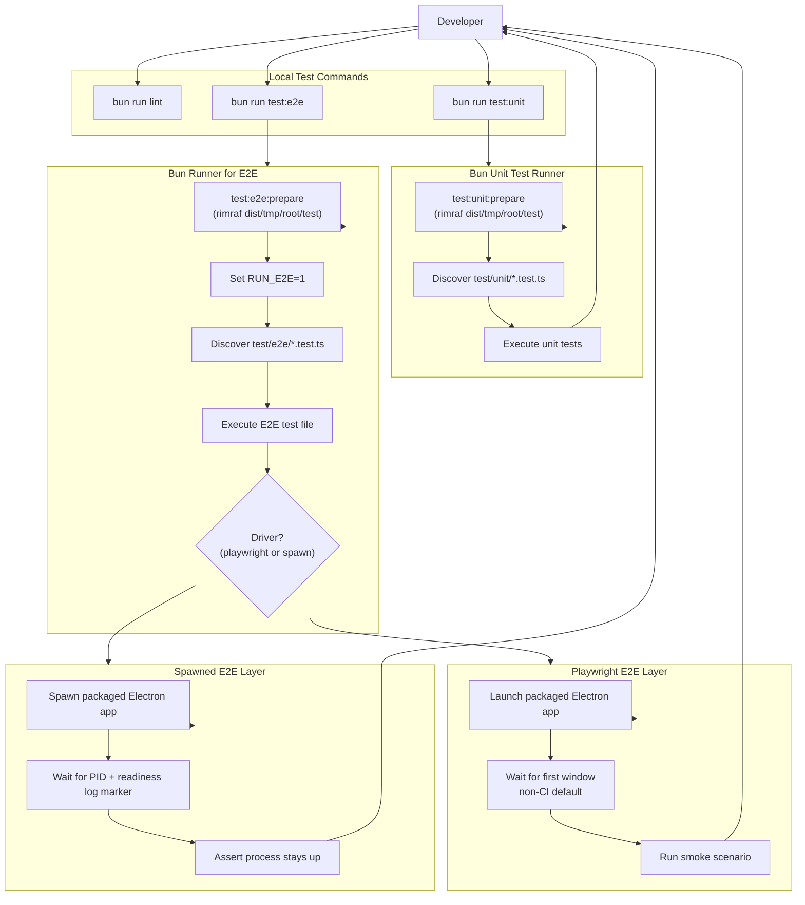

# Developers' guide

## Module header

- Purpose: Summarize local development practices and validation commands for
  the Velocetty repository.
- Invariants: Keep Makefile targets and validation steps aligned with CI and
  tooling changes.
- Cross-links: [Testing with Bun](testing-with-bun.md),
  [ADR 001](adr-001-replace-ava-with-bun-test.md), and
  [Roadmap](roadmap.md).

This guide captures the development practices specific to the Velocetty
repository. It is intentionally concise and focused on the steps developers
must follow locally.

## Tooling expectations

- Use Bun for JavaScript and TypeScript scripts.
- Prefer Makefile targets for validation commands.
- Use `tsgo` (`@typescript/native-preview`) for TypeScript compilation and
  type-checking tasks.
- Keep documentation wrapped to 80 columns and code blocks to 120 columns.

## React version alignment

The renderer runtime depends on React in both the root `package.json` and the
packaged app manifest in `app/package.json`. When upgrading React, update both
manifests in the same change and keep the app manifest on exact versions to
avoid duplicate React instances in plugins. React 19 requires aligning
`react-redux` 9.x with `redux` 5.x, plus matching `@types/react` and
`@types/react-dom` versions in `package.json`.

## Formatting and linting

Run the standard gates before opening a pull request:

- `make check-fmt`
- `make lint`

When documentation changes, also run:

- `bunx markdownlint-cli "docs/**/*.md"`
- `nixie --no-sandbox`

## Type checking

Type checking runs via `tsgo` and the shared `tsconfig.typecheck.json` project:

- `make typecheck`
- `bun run check:types`

`tsgo` 7.0.0-dev.20260128.1 supports `--build`, `--watch`, `--pretty`,
`--preserveWatchOutput`, and `--project`; the `dev` and `build` scripts rely
on those flags.

## Tests

### Unit tests (Bun)

Unit tests run under Bun's built-in test runner. Use one of the following:

- `bun run test:unit`
- `bun test test/unit`
- `bun run test:coverage` (writes text output and an LCOV coverage report under
  `coverage/`)
- `make coverage`

### End-to-end (E2E) tests (Playwright)

End-to-end tests are opt-in. They run Playwright against packaged binaries
and require the `dist/` output created by the packaging pipeline.

- Build the app (for example, `bun run dist`).
- Run E2E tests with `bun run test:e2e`.

The E2E tests are skipped unless `RUN_E2E=1` is set. The script
`bun run test:e2e` sets this automatically.

By default, E2E runs Playwright locally and a spawn-based smoke check in
CI. The driver can be overridden with `E2E_DRIVER=playwright` or
`E2E_DRIVER=spawn`. Debug logging is opt-in with `E2E_DEBUG=1`, and
`E2E_CAPTURE=1` captures a screenshot from the Electron app.

For screen readers: The following flowchart outlines the E2E test flow,
including the prepare step, driver selection, and the Playwright versus spawn
paths.

## Default test gate

`make test` runs linting plus the unit test suite. It intentionally omits
E2E tests to keep the default loop fast.
