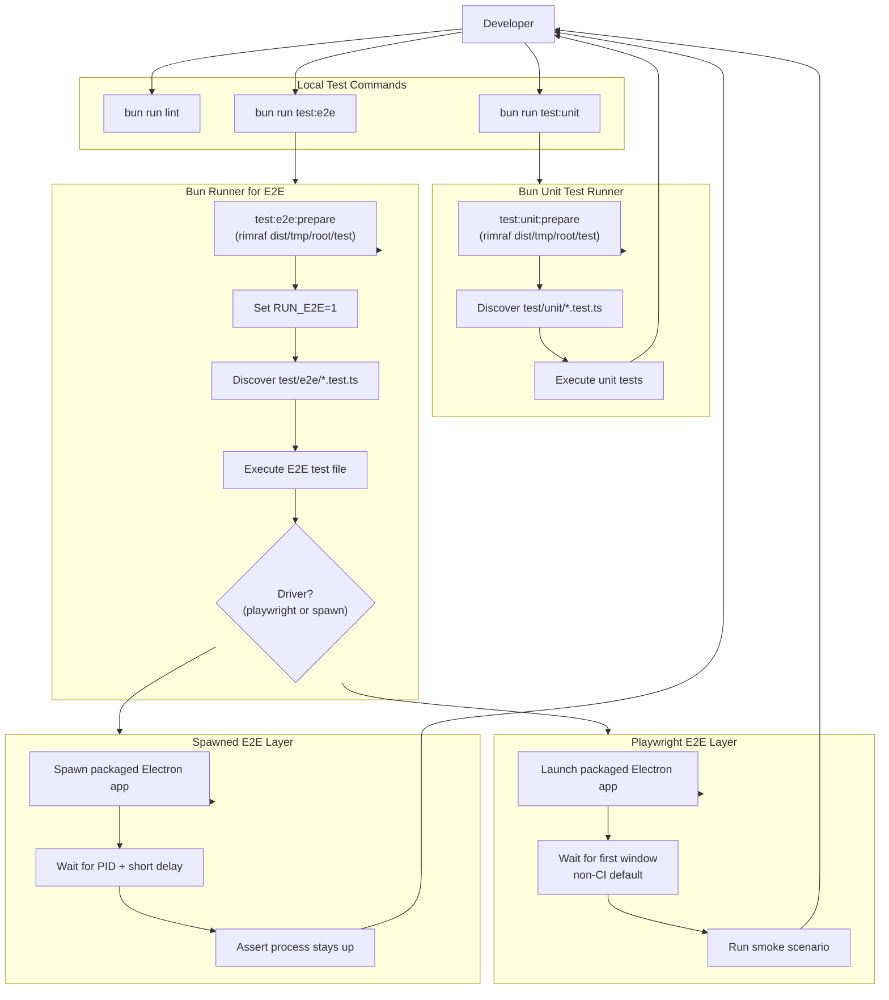

# Developers guide

This guide captures the development practices specific to the Velocetty
repository. It is intentionally concise and focused on the steps developers
must follow locally.

## Tooling expectations

- Use Bun for JavaScript and TypeScript scripts.
- Prefer Makefile targets for validation commands.
- Keep documentation wrapped to 80 columns and code blocks to 120 columns.

## Formatting and linting

Run the standard gates before opening a pull request:

- `make check-fmt`
- `make lint`

When you change documentation, also run:

- `bunx markdownlint-cli "docs/**/*.md"`
- `nixie --no-sandbox`

## Tests

### Unit tests (Bun)

Unit tests run under Bun's built-in test runner. Use one of the following:

- `bun run test:unit`
- `bun test test/unit`

### End-to-end tests (Playwright)

End-to-end tests are opt-in. They run Playwright against packaged binaries
and require the `dist/` output created by the packaging pipeline.

- Build the app (for example, `bun run dist`).
- Run E2E tests with `bun run test:e2e`.

The E2E tests are skipped unless `RUN_E2E=1` is set. The script
`bun run test:e2e` sets this for you.

By default, E2E runs Playwright locally and a spawn-based smoke check in
CI. Override the driver with `E2E_DRIVER=playwright` or
`E2E_DRIVER=spawn`. Debug logging is opt-in with `E2E_DEBUG=1`, and
`E2E_CAPTURE=1` captures a screenshot from the Electron app.

Diagram: end-to-end test flow showing the prepare step, driver selection,
and the Playwright versus spawn execution paths.

## Default test gate

`make test` runs linting plus the unit test suite. It intentionally omits
E2E tests to keep the default loop fast.
