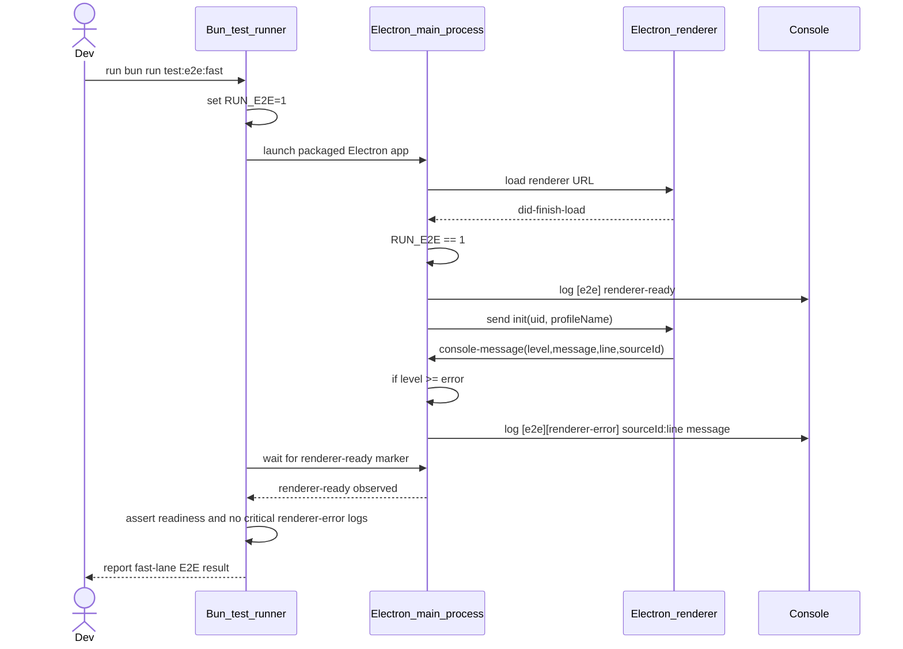
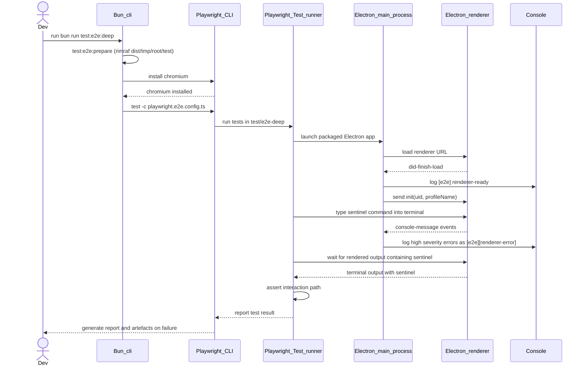

# Developers' guide

## Module header

- Purpose: Summarize local development practices and validation commands for
  the Velocetty repository.
- Invariants: Keep Makefile targets and validation steps aligned with CI and
  tooling changes.
- Cross-links: [Testing with Bun](testing-with-bun.md),
  [ADR 001](adr-001-replace-ava-with-bun-test.md), and
  [Roadmap](roadmap.md).

This guide captures the development practices specific to the Velocetty
repository. It is intentionally concise and focused on the steps developers
must follow locally.

## Tooling expectations

- Use Bun for JavaScript and TypeScript scripts.
- Prefer Makefile targets for validation commands.
- Use `tsgo` (`@typescript/native-preview`) for TypeScript compilation and
  type-checking tasks.
- Keep documentation wrapped to 80 columns and code blocks to 120 columns.

## Electron runtime alignment

When upgrading Electron, keep runtime and native-module rebuild settings aligned
in the same change:

- Update `devDependencies.electron` in `package.json`.
- Bump the fallback target version in `bin/rebuild-node-pty.cjs`.
- Adjust `app/package.json` if runtime dependencies (for example, `node-pty`)
  need a compatibility bump for the new Electron Application Binary Interface
  (ABI).
- Run `bun install` to validate snapshot generation, `install-app-deps`, and
  `node-pty` rebuilding before running the remaining gates.

## React version alignment

The renderer runtime depends on React in both the root `package.json` and the
packaged app manifest in `app/package.json`. When upgrading React, update both
manifests in the same change and keep the app manifest on exact versions to
avoid duplicate React instances in plugins. React 19 requires aligning
`react-redux` 9.x with `redux` 5.x, plus matching `@types/react` and
`@types/react-dom` versions in `package.json`.

## Formatting and linting

Run the standard gates before opening a pull request:

- `make check-fmt`
- `make lint`

When documentation changes, also run:

- `bunx markdownlint-cli "docs/**/*.md"`
- `nixie --no-sandbox`

## Type checking

Type checking runs via `tsgo` and the shared `tsconfig.typecheck.json` project:

- `make typecheck`
- `bun run check:types`

`tsgo` 7.0.0-dev.20260128.1 supports `--build`, `--watch`, `--pretty`,
`--preserveWatchOutput`, and `--project`; the `dev` and `build` scripts rely
on those flags.

## Tests

### Unit tests (Bun)

Unit tests run under Bun's built-in test runner. Use one of the following:

- `bun run test:unit`
- `bun test test/unit`
- `bun run test:coverage` (writes text output and an LCOV coverage report under
  `coverage/`)
- `make coverage`

### End-to-end (E2E) tests (layered strategy)

End-to-end tests are split into two lanes and require packaged binaries in
`dist/`.

Fast lane (required on pull requests):

- Run `bun run test:e2e:fast` (or `bun run test:e2e`).
- Executes Bun-driven smoke checks in `test/e2e/`.
- Asserts renderer readiness and fails on critical renderer console errors.
- Supports `E2E_DRIVER=playwright|spawn` overrides; CI uses spawn-mode markers
  emitted by the main process to gate renderer readiness and renderer errors.
- Supports `E2E_DEBUG=1` for verbose launch logs and `E2E_CAPTURE=1` for
  screenshot capture.

Deep lane (scheduled and release validation):

- Run `bun run test:e2e:deep`.
- Executes Playwright Test under Node.js using
  `playwright.e2e.config.ts` and `test/e2e-deep/`.
- Installs Playwright Chromium on demand before execution.
- Validates the first interaction-path scenario (terminal input and rendered
  output).
- Retains full diagnostics on failures:
  stdout/stderr logs, renderer console logs, screenshots, and traces.
- Runs in CI on Linux for scheduled checks, manual `workflow_dispatch`, and
  pushes to `master` and `canary`.
- Deep-lane failures on `master` and `canary` are release-blocking.

For screen readers: The following sequence diagram shows fast-lane execution,
including main-process readiness/error markers consumed by Bun E2E assertions.

Figure 1: Fast-lane E2E sequence from Bun invocation to readiness/error
assertions.

For screen readers: The following sequence diagram shows deep-lane execution
through Playwright CLI/Test, including interaction-path assertion and artefact
reporting.

Figure 2: Deep-lane E2E sequence from Bun command orchestration to Playwright
interaction and reporting.

Before either lane, build packaged artefacts with `bun run dist` if they do
not already exist.

## Default test gate

`make test` runs linting plus the unit test suite. It intentionally omits
E2E tests to keep the default loop fast.
