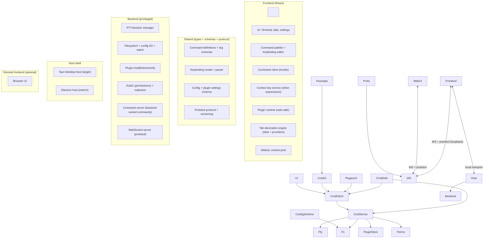
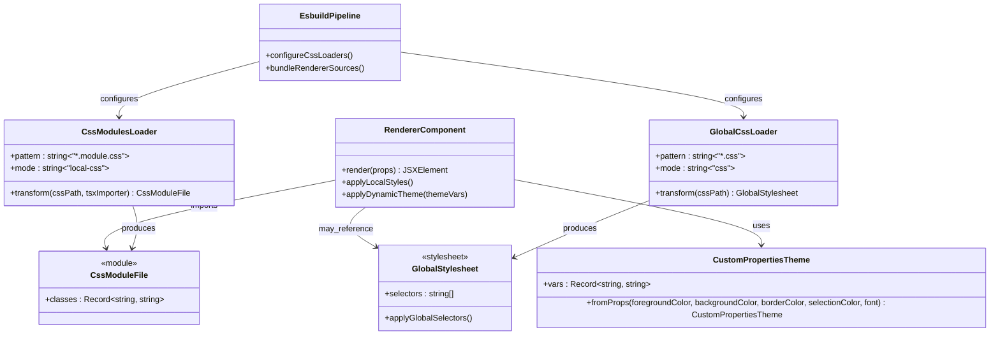

# Technical design: command system, settings, tabs, and architecture

<!-- markdownlint-disable MD012 MD013 -->
<!-- Legacy formatting retained; reflow once content is revised. -->

## Summary


This document proposes a set of architectural and implementation changes to

Velocetty to deliver the capabilities defined in the product requirements

document (PRD)[^prd], while grounding the plan in the current Hyper-derived

codebase structure and behaviour described in the technical specification

(TS)[^techspec]. It focuses on:


- A unified command system (“everything is a command”), including a command

&nbsp; palette, context-aware keybindings, and a keybinding editor UI.

- A JSON5-based configuration system spanning app configuration, keybindings,

&nbsp; and plugin-contributed settings.

- A settings tab with schema-driven plugin settings panels and an explicit

&nbsp; trust model for any custom UI contributions.

- Vertical tabs plus a slot-based tab decoration API for plugins (providers,

&nbsp; not overrides).

- Rendering changes to ensure WebGL is used only for visible panes, respecting

&nbsp; WebGL context limits.

- A host migration path from the current Electron split-brain architecture to a

&nbsp; Tauri host, with a longer-term target of a remote-capable backend protocol

&nbsp; using protobuf over WebSocket.


This design intentionally does not preserve backwards compatibility with Hyper

plugins or config semantics, but it does include a pragmatic import/migration

strategy for existing users where it is low-cost and reduces churn.


## Context


Velocetty currently inherits Hyper’s Electron architecture: a privileged main

process (Node.js) manages PTY (pseudo-terminal) sessions, configuration, and

plugins, and the renderer process (Chromium) runs the React + Redux UI and

xterm.js terminal instances, bridged via an RPC abstraction over Electron IPC

(inter-process communication).[^techspec]


The TS documents several constraints that directly influence this design:


- WebGL contexts are limited (the TS references a maximum of 16 simultaneous

&nbsp; contexts), and Velocetty should prioritize visible panes and fall back to a

&nbsp; Canvas renderer when needed.[^techspec]

- The current plugin system is full-trust and decorates UI and behaviour via

&nbsp; 40+ hooks, including keymap and tab decoration hooks; error handling relies

&nbsp; on try/catch isolation rather than sandboxing.[^techspec]

- Configuration is file-based, validated via a schema, and supports hot reload;

&nbsp; it is currently stored as JSON (`hyper.json`) with a migration path from

&nbsp; legacy `.hyper.js` configurations.[^techspec]


The PRD extends the product direction by making the command system, settings

UX, and plugin customization surfaces first-class, and by adding longer-term

goals around Tauri and a remote frontend with a versioned protocol.[^prd]


## Goals and non-goals


### Goals


- Provide a coherent command surface that unifies menus, shortcuts, UI buttons,

&nbsp; and programmatic/plugin invocation.[^prd]

- Implement a context-aware keybinding engine with deterministic precedence,

&nbsp; conflict detection, and a UI editor.[^prd]

- Migrate configuration to JSON5 for human-friendly editing, and use it as the

&nbsp; canonical source for app configuration, keybindings, and plugin settings.[^prd]

- Add a settings tab that supports:


&nbsp; \-Core settings with validation and reset-to-default.

&nbsp; \-Schema-driven plugin settings panels by default.

&nbsp; \-Optional custom plugin settings panels with an explicit trust model.[^prd]

- Implement vertical tabs with rich metadata and a stable tab decoration API

&nbsp; that uses slot providers rather than React component overrides.[^prd]

- Ensure WebGL rendering is allocated only to visible panes and gracefully

&nbsp; degrades when contexts are exhausted.[^prd]

- Define a migration path to Tauri and a remote-capable backend protocol that

&nbsp; uses protobuf over WebSocket.[^prd]


### Non-goals


- Backwards compatibility with existing Hyper plugin hooks and internal

&nbsp; decoration mechanisms.[^prd]

- Persisting terminal scrollback or full session state across restarts (the TS

&nbsp; explicitly avoids this for security and behavioural consistency).[^techspec]

- Designing a public plugin registry, payment model, or marketplace UX (out of

&nbsp; scope for this document unless required to support installation flows).

- Solving multi-user collaboration or shared terminals (not requested).


## Current architecture summary


The current system can be summarized as:


- Main process (`app/`): window lifecycle, config loading and watching, plugin

&nbsp; loading, session manager using node-pty, menus, and updates.[^techspec]

- Renderer (`lib/`): React UI components, Redux store/reducers/actions, xterm.js

&nbsp; terminal instances, and a command registry used by keymaps/menus.[^techspec]

- Transport: typed RPC over Electron IPC (`app/rpc.ts`, `lib/utils/rpc.ts`).[^techspec]

- Config: file-based JSON with schema validation and hot reload (`app/config/`).[^techspec]

- Plugins: full-trust, loaded from the config directory, supporting 40+ hooks,

&nbsp; including `decorateKeymaps`, `decorateTabs`, `decorateTab`, and Redux

&nbsp; middleware/reducer injection.[^techspec]


This design keeps the good parts (a clear separation between privileged and UI

code, schema validation, and a structured state model for sessions and split

panes), but replaces the ad-hoc “decoration everywhere” plugin model with

explicit extension points.


## Proposed target architecture


Screen reader description: The following diagram shows the target architecture

with a shared command system, a privileged backend, and a UI frontend. It also

shows an optional remote frontend connecting over WebSocket using a protobuf

protocol.





### Architectural principles


- A command is the only way to “do things” in the app, whether initiated by a

&nbsp; keyboard shortcut, a menu item, a button, or a plugin.[^prd]

- Privileged operations live behind a backend boundary. The UI requests intent,

&nbsp; the backend validates and executes where necessary.[^prd]

- Plugin integration uses explicit, stable extension points and data models.

&nbsp; Plugins contribute providers and schema, rather than overriding internal UI

&nbsp; components.[^prd]

- The protocol surface is versioned, typed, and testable. Electron IPC remains

&nbsp; an interim transport, but the system should converge on a protobuf-defined

&nbsp; protocol that can run locally and remotely.[^prd]


## Repository layout and module boundaries


The PRD calls out an explicit `frontend/`, `backend/`, and `shared/` split.[^prd]

This approach maps the existing code during migration.


Proposed structure:


- `frontend/`


&nbsp; \-React UI, state management, command palette, settings UI, vertical tabs,

&nbsp;   xterm.js integration, rendering scheduler, plugin runtime.

- `backend/`


&nbsp; \-Privileged services: PTY management, config I/O and watching, plugin store,

&nbsp;   auth/authz, update integration, and backend command handlers.

- `shared/`


&nbsp; \-Types, JSON Schemas, command definitions, keybinding parser/types, protobuf

&nbsp;   definitions, and cross-cutting constants.


Migration mapping from the current codebase (illustrative):


| Current location                 | Target location                          | Notes                                                                       |

| -------------------------------- | ---------------------------------------- | --------------------------------------------------------------------------- |

| `lib/`                           | `frontend/`                              | UI + Redux can be migrated incrementally.                                   |

| `app/session.ts`                 | `backend/pty/`                           | Re-implemented in Rust for Tauri, but keep semantics (batching).[^techspec] |

| `app/config/`                    | `backend/config/` + `shared/schemas/`    | JSON5 parsing, schema validation, layered config.                           |

| `app/plugins.ts`                 | `backend/plugins/` + `frontend/plugins/` | Backend manages installation; frontend runs providers.                      |

| `app/rpc.ts`, `lib/utils/rpc.ts` | `shared/proto/` + transport adapters     | Electron IPC adapter initially, WebSocket target.                           |


*Table 1: Migration mapping for major subsystems.\*


## Command system design


### Command model


A command definition is stable, namespaced, searchable, and optionally typed by

an argument schema.[^prd] Commands exist regardless of the invocation mechanism.


Command ID conventions:


- Lowercase, dot-separated namespaces.

- First segment indicates domain: `terminal.\*`, `tab.\*`, `window.\*`,

&nbsp; `workspace.\*`, `settings.\*`, `plugin.\*`.


Examples:


- `terminal.splitPane`

- `terminal.newTab`

- `tab.close`

- `settings.open`

- `settings.openKeybindings`

- `plugin.reload`


Command definition (TypeScript):


```ts

export type CommandId = string;


export interface CommandMetadata {

&nbsp; title: string;

&nbsp; category?: string;

&nbsp; description?: string;

&nbsp; keywords?: string\[];

&nbsp; icon?: string; // UI-specific identifier, not a file path.

}


export interface CommandDefinition<TArgs = unknown, TResult = unknown> {

&nbsp; id: CommandId;

&nbsp; metadata: CommandMetadata;

&nbsp; argsSchema?: object; // JSON Schema (draft version pinned in shared/).

&nbsp; resultSchema?: object;

&nbsp; defaultWhen?: string; // Context key expression.

&nbsp; // Where the command runs.

&nbsp; kind: "frontend" | "backend";

}

```text


### Command registry and dispatcher


Two cooperating registries are implemented:


- Frontend registry: source of truth for what the UI can present (palette,

&nbsp; menus, keybinding editor).

- Backend registry: source of truth for what the backend will execute (and

&nbsp; permission-check).


The dispatcher always follows the same path:


- Resolve command definition by ID.

- Validate arguments against schema (frontend-side for early feedback; backend

&nbsp; repeats validation for trustworthiness).

- Check enablement via `when` expression using the context key service (UI

&nbsp; affordance) and backend permission checks (security).

- Execute handler (frontend function or backend RPC invocation).

- Return a structured result (success/error/cancelled).


Command invocation API (frontend):


```ts

export interface CommandInvocation<TArgs = unknown> {

&nbsp; id: CommandId;

&nbsp; args?: TArgs;

&nbsp; source: "keybinding" | "palette" | "menu" | "ui" | "plugin" | "remote";

}


export interface CommandResult<TResult = unknown> {

&nbsp; ok: boolean;

&nbsp; result?: TResult;

&nbsp; error?: {

&nbsp;   code: string;

&nbsp;   message: string;

&nbsp;   details?: unknown;

&nbsp; };

&nbsp; cancelled?: boolean;

}


export interface CommandDispatcher {

&nbsp; invoke<TArgs, TResult>(

&nbsp;   invocation: CommandInvocation<TArgs>,

&nbsp;   options?: { signal?: AbortSignal },

&nbsp; ): Promise<CommandResult<TResult>>;

}

```


### Context keys and “when” expressions


The PRD highlights the “when” system as a core risk area.[^prd] The design uses

an explicit context key service modelled after editor-class applications:


- Context keys are named values (`boolean | string | number | null`).

- UI components set and clear keys as focus and state changes.

- Keybindings and commands can declare `when` expressions.

- The evaluator is deterministic, fast, and testable.


Examples of context keys:


- `terminalFocus: boolean`

- `settingsOpen: boolean`

- `findWidgetVisible: boolean`

- `paneCount: number`

- `tabType: "terminal" | "settings" | "about" | ...`

- `activeShell: string | null`

- `remoteAttached: boolean`


Expression grammar (minimum viable):


- Logical operators: `&&`, `||`, `!`

- Comparators: `==`, `!=`, `<`, `<=`, `>`, `>=`

- Parentheses for grouping


Example `when`:


- `terminalFocus && !settingsOpen`

- `paneCount > 1 && tabType == "terminal"`


Implementation approach:


- Parse expressions once into an Abstract Syntax Tree (AST).

- Evaluate against a simple map of context keys.

- Provide unit tests for parsing and evaluation.


### Command palette


The command palette is a UI surface over the registry.[^prd] Requirements:


- Fuzzy search by title, ID, keywords, and category.

- Display active keybinding(s) for each command.

- Support command arguments where schemas exist:


&nbsp; \-For simple schemas: auto-prompt (text input, quick pick).

&nbsp; \-For complex schemas: open a dedicated “command args” UI.


Performance:


- Pre-index command metadata for search.

- Maintain a small “recently used” list in local state (not persisted by

&nbsp; default; optionally persist in config if desired).


### Menu and button integration


All menus and UI buttons should dispatch via the command dispatcher, not call

actions directly. This removes duplication and ensures behaviour stays

consistent across UI surfaces.[^prd]


Interim Electron integration:


- Existing menu templates (`app/menus/`) currently use command acceleration and

&nbsp; the existing command registry.[^techspec]

- Replace the internal wiring so menu click handlers call `dispatch.invoke()`

&nbsp; for a command ID rather than directly emitting legacy RPC events.


### Cancellation semantics


- Frontend commands: use `AbortSignal` and cooperative cancellation.

- Backend commands: include a cancellation token in the protobuf invocation and

&nbsp; support cancellation for long-running operations (for example, plugin install

&nbsp; or filesystem search).


## Keybinding system design


### Keybinding model


Keybindings map key sequences to commands, optionally with arguments and a

`when` expression.[^prd]


```ts

export interface Keybinding {

&nbsp; command: CommandId;

&nbsp; keys: string; // e.g. "ctrl+k ctrl+s"

&nbsp; when?: string;

&nbsp; args?: unknown;

&nbsp; source: "default" | "user" | "plugin";

}

```


Key string format:


- Modifiers: `ctrl`, `shift`, `alt`, `meta` (mapped to Cmd on macOS).

- Key: use a canonical form based on `KeyboardEvent.code` where possible to

&nbsp; avoid layout issues, but support a human-friendly layer for display.

- Chords: space-separated sequences.


Examples:


- `meta+shift+p` (macOS)

- `ctrl+shift+p` (Windows/Linux)

- `ctrl+k ctrl+s` (chord)


### Resolution and precedence


Deterministic resolution rules:


- Filter keybindings by:


&nbsp; \-current chord state,

&nbsp; \-`when` expression truthiness.


- Choose the “winning” binding by precedence:


&nbsp; 1. User bindings

&nbsp; 2. Plugin-contributed default bindings

&nbsp; 3. Core defaults


- Within a precedence level:


&nbsp; \-Prefer more specific `when` expressions (heuristic: more AST nodes).

&nbsp; \-Break ties by stable ordering (lexicographic by `sourceId:command:keys`).


Conflict detection:


- During load, compute conflicts for each platform modifier mapping.

- Expose conflicts to the keybinding editor and (optionally) a warning panel.


### Keybinding editor UI


The editor provides:


- Search by command title/ID and key string.

- Record a new keybinding by capturing keyboard input.

- Show conflicts and allow resolution (remove, reassign).

- Reset a command binding to default.

- Export/import as JSON5.


The editor is itself driven by commands:


- `settings.openKeybindings`

- `keybindings.add`

- `keybindings.remove`

- `keybindings.resetToDefault`

- `keybindings.export`


## Configuration system: JSON5 and layering


### File format and locations


The PRD specifies JSON5 as canonical.[^prd] Storage includes:


- Main config: `config.json5`

- Keybindings: `keybindings.json5` (separate file for readability)

- Plugin state: stored under `plugins/` directory (bundles, manifests, cache)


Proposed paths (mirroring the TS platform approach but using the Velocetty

product name):


| Platform | Config directory                                      | Files                                           |

| -------- | ----------------------------------------------------- | ----------------------------------------------- |

| Linux    | `$XDG_CONFIG_HOME/Velocetty` or `~/.config/Velocetty` | `config.json5`, `keybindings.json5`, `plugins/` |

| macOS    | `~/.config/Velocetty`                                 | same                                            |

| Windows  | `%APPDATA%\\\\Velocetty`                                | same                                            |


*Table 2: Proposed config locations.\*


### Layering rules


Layering follows the PRD direction (defaults → user config → runtime overrides),

and extends it with optional workspace overrides:


1\. Built-in defaults (bundled with the app)

2\. User config (`config.json5`)

3\. Workspace config (optional; for example, `.velocetty/config.json5` in a

&nbsp;  project root)

4\. Runtime overrides (ephemeral, not persisted unless explicitly saved)


Keybindings follow:


1\. Built-in defaults

2\. Plugin defaults

3\. User overrides (`keybindings.json5`)

4\. Workspace overrides (optional)


Merge semantics:


- Objects: deep merge.

- Arrays: replace by default (explicit merge behaviour can be introduced later

&nbsp; via JSON merge-patch-like directives if needed).


### Validation and error reporting


- Use JSON5 parsing to accept comments and trailing commas.

- Validate the merged config against a pinned JSON Schema version shipped in

&nbsp; `shared/schemas/`.

- Provide structured diagnostics:


&nbsp; \-Parse errors: include line/column and a snippet.

&nbsp; \-Schema errors: include JSON Pointer paths and expected types.


Behaviour on error:


- Keep last-known-good config in memory.

- Notify the user via a non-blocking UI notification.

- Log full diagnostics for troubleshooting.


This preserves the spirit of the current hot-reload flow (watch file, reload,

validate, apply, and fall back on errors), but swaps JSON parsing for JSON5 and

extends schema validation to include plugin settings.[^techspec]


### Hot reload semantics


Not everything can reload live. Explicitly define:


Hot reload (no restart):


- Theme and UI appearance settings

- Font settings (may require xterm reconfigure but not restart)

- Keybindings

- Tab decoration preferences

- Plugin enable/disable (subject to safe unload)


Restart required:


- Backend transport settings (listening addresses)

- Update channel settings (depending on implementation)

- Any backend-owned setting that affects process-level configuration


The settings UI should surface which settings require restart.


## Settings tab and plugin settings panels


### Settings surface as a first-class tab


The PRD requires a settings tab integrated with the command system.[^prd]
Settings are implemented as a tab type (`tabType = "settings"`), not a modal, so it

can participate in navigation and state.


Core commands:


- `settings.open`

- `settings.search`

- `settings.resetSetting`

- `settings.exportConfig`

- `settings.openKeybindings`


### Schema-driven settings panels


Default plugin settings panels are generated from schema plus UI hints.[^prd]


Schema format:


- JSON Schema for validation.

- A companion “UI hints” schema (or extensions under `x-ui`) to declare:


&nbsp; \-grouping (sections),

&nbsp; \-control types (toggle, select, number, text),

&nbsp; \-descriptions and examples,

&nbsp; \-sensitivity flags (redaction in remote mode).


Example (JSON5):


```json5

{

&nbsp; id: "com.example.git-branch",

&nbsp; version: "1.2.0",

&nbsp; settings: {

&nbsp;   schema: {

&nbsp;     type: "object",

&nbsp;     properties: {

&nbsp;       enabled: { type: "boolean", default: true },

&nbsp;       showInSubtitle: { type: "boolean", default: true },

&nbsp;       maxBranchLength: { type: "number", minimum: 5, maximum: 80, default: 32 },

&nbsp;     },

&nbsp;     required: \["enabled"],

&nbsp;     additionalProperties: false,

&nbsp;   },

&nbsp;   ui: {

&nbsp;     title: "Git branch",

&nbsp;     sections: \[

&nbsp;       {

&nbsp;         title: "Display",

&nbsp;         fields: \["enabled", "showInSubtitle", "maxBranchLength"],

&nbsp;       },

&nbsp;     ],

&nbsp;   },

&nbsp; },

}

```


### Optional custom settings panels


The PRD allows optional arbitrary React panels with an explicit security

posture.[^prd] Given the longer-term remote frontend goal, the trust model must

be explicit:


- Default: schema-driven only.

- Custom panels: allowed only for plugins marked `trusted: true` and only in

&nbsp; desktop-local mode (not in a remote browser UI), unless explicitly enabled

&nbsp; per-connection.


This keeps the remote UI deterministic and avoids “plugins rendering arbitrary

UI in a browser attached to a host”.


Implementation detail:


- The plugin manifest declares `contributes.settings.customPanel: true`.

- The host checks trust and environment before mounting the panel.


## Plugin system redesign


### Plugin goals


- Stable, explicit APIs: commands, keybindings, settings schema, and tab

&nbsp; decorations.[^prd]

- Avoid fragile internal UI decoration hooks (`decorateTabs`, `decorateTerm`,

&nbsp; etc.) present in the current system.[^techspec]

- Support remote frontend without requiring the remote client to have filesystem

&nbsp; access.


### Plugin packaging and installation


Backend responsibilities:


- Install plugins (download bundle, verify, store).

- Maintain a plugin index (manifest metadata, enabled state).

- Expose plugin manifests and entrypoints to the frontend.


Storage location (under config directory):


```text

plugins/

├── index.json5

├── com.example.git-branch/

│   ├── manifest.json5

│   └── dist/plugin.js

└── ...

```


The TS currently stores plugins as npm packages in a `plugins/node_modules/`

directory.[^techspec] This design intentionally moves away from “arbitrary npm

module with Node access” and towards a web-safe bundle model, which aligns with

remote UI requirements.


### Plugin runtime


Frontend loads enabled plugins using dynamic import of their `dist/plugin.js`

entrypoint.


Plugin entrypoint contract:


```ts

export interface PluginContext {

&nbsp; commands: {

&nbsp;   registerCommand: <TArgs, TResult>(

&nbsp;     def: CommandDefinition<TArgs, TResult>,

&nbsp;     handler: (args: TArgs, api: PluginApi) => Promise<TResult> | TResult,

&nbsp;   ) => void;

&nbsp; };

&nbsp; keybindings: {

&nbsp;   registerKeybindings: (bindings: Omit<Keybinding, "source">\[]) => void;

&nbsp; };

&nbsp; tabs: {

&nbsp;   registerDecorationProvider: (provider: TabDecorationProvider) => void;

&nbsp; };

&nbsp; settings: {

&nbsp;   get: <T>(path: string) => T | undefined;

&nbsp;   set: (path: string, value: unknown) => Promise<void>;

&nbsp; };

&nbsp; // Narrow API for UI prompts, logging, etc.

&nbsp; ui: {

&nbsp;   showNotification: (n: { title: string; message?: string; level: "info" | "warn" | "error" }) => void;

&nbsp;   quickPick: (items: string\[], opts?: { placeholder?: string }) => Promise<string | undefined>;

&nbsp; };

}

```


### Plugin command security


Plugins can register commands, but any privileged operation must be performed

via backend commands. The command boundary becomes the choke-point for

permission checks, as required by the PRD.[^prd]


Example pattern:


- Plugin command `git.openRepo` (frontend) invokes backend command

&nbsp; `filesystem.openPath` with an explicit path argument.

- Backend checks permissions and redaction rules (especially for remote).


### Plugin settings persistence


Plugin settings persist into `config.json5` under a namespace, for example:


```json5

{

&nbsp; plugins: {

&nbsp;   "com.example.git-branch": {

&nbsp;     enabled: true,

&nbsp;     showInSubtitle: true,

&nbsp;     maxBranchLength: 32,

&nbsp;   },

&nbsp; },

}

```


This aligns with the PRD requirement for namespaced plugin settings in JSON5.[^prd]


## Vertical tabs and tab decoration API


### Tab model


The TS concept of sessions and term groups (split panes) is preserved as the

underlying data model, but evolve the UI to a vertical rail and introduce a

formal tab type system.


Core entities:


- `Session`: backend PTY session + metadata (pid, title, cwd, profile, etc.).

&nbsp; The TS already models session state in Redux with fields such as `uid`,

&nbsp; `title`, `pid`, and `cwd`.[^techspec]

- `Pane`: a leaf view bound to a session.

- `PaneGroup`: a tree node representing either a split container or leaf.

&nbsp; This maps closely to the existing “term group” tree in the TS.[^techspec]

- `Tab`: contains a root `PaneGroup`, plus tab-level metadata (pinned, group,

&nbsp; lastActiveAt, activity flags).

- `TabType`: `"terminal" | "settings" | ..."`


### Vertical tabs UI


Requirements (from PRD):


- Vertical tab rail

- Rich tab content: pinning, grouping, reorder, activity indicators.[^prd]


Implementation notes:


- Virtualize the tab list for large tab counts.

- Support drag-and-drop reorder and group moves.

- Provide keyboard navigation commands (`tab.next`, `tab.previous`,

&nbsp; `tab.moveUp`, etc.), integrated with keybindings.


### Tab decoration API: slots and providers


The PRD explicitly calls out “slots with well-defined data inputs and merge

rules” and “providers, not overrides”.[^prd]


#### Slot model


Decorations are composed of fixed slots:


- `icon` (single)

- `title` (single)

- `subtitle` (single, optional)

- `badges` (list, bounded)

- `widgets` (list, bounded, command-driven)


Types:


```ts

export interface TabDecoration {

&nbsp; icon?: { name: string; tooltip?: string };

&nbsp; title?: string;

&nbsp; subtitle?: string;

&nbsp; badges?: Array<{ text?: string; icon?: string; tooltip?: string; kind?: "info" | "warn" | "error" }>;

&nbsp; widgets?: Array<{ icon: string; command: CommandId; tooltip?: string }>;

}


export interface TabDecorationContext {

&nbsp; tabId: string;

&nbsp; tabIndex: number;

&nbsp; active: boolean;

&nbsp; pinned: boolean;

&nbsp; tabType: string;


&nbsp; // Active pane/session metadata (may be redacted in remote mode).

&nbsp; sessionId?: string;

&nbsp; title?: string;

&nbsp; cwd?: string;

&nbsp; pid?: number;

&nbsp; shell?: string;


&nbsp; // Activity and status.

&nbsp; bell?: boolean;

&nbsp; unreadOutput?: boolean;

&nbsp; exited?: boolean;

&nbsp; exitCode?: number | null;


&nbsp; // Capability flags.

&nbsp; remote: boolean;

&nbsp; redacted: boolean;

}


export interface TabDecorationProvider {

&nbsp; id: string;

&nbsp; priority: number; // Higher wins for singleton slots.

&nbsp; when?: string;

&nbsp; provideDecoration: (

&nbsp;   ctx: TabDecorationContext,

&nbsp;   options?: { signal?: AbortSignal },

&nbsp; ) => TabDecoration | Promise<TabDecoration>;

}

```


#### Merge rules


Define merge rules up-front (PRD “gotcha”).[^prd]


- Providers are evaluated in descending priority order.

- For singleton slots (`icon`, `title`, `subtitle`):


&nbsp; \-Highest priority provider that supplies a value wins.

&nbsp; \-Ties break deterministically by provider `id` (lexicographic).

- For list slots (`badges`, `widgets`):


&nbsp; \-Concatenate contributions in descending priority order.

&nbsp; \-Enforce bounds (for example, max 3 badges, max 2 widgets) to prevent UI

&nbsp;   chaos.

&nbsp; \-Deduplicate by `(icon,text,command)` key.


User overrides:


- Users can enable/disable providers and optionally adjust precedence via

&nbsp; config:


```json5

{

&nbsp; tabs: {

&nbsp;   decorationProviders: {

&nbsp;     order: \["core.default", "com.example.proc-icon", "com.example.git-branch"],

&nbsp;     disabled: \["com.example.experimental-badges"],

&nbsp;   },

&nbsp; },

}

```


#### Performance constraints


- Evaluate decorations event-driven, not polling (PRD requirement).[^prd]

- Cache provider outputs keyed by `(providerId, tabId, tabRevision)` where

&nbsp; `tabRevision` increments when any relevant context value changes.

- Timebox async providers (for example, 50 ms budget for initial render).

&nbsp; Providers may still resolve later, but they must not block tab paint.


## Rendering: WebGL only for visible panes


The TS already documents WebGL context limits and the need to prioritize visible

panes.[^techspec] The PRD turns this into an explicit deliverable.[^prd]


### Visibility model


A pane is “visible” if:


- Its tab is active, and

- It is not occluded by a modal overlay that prevents rendering, and

- It has non-zero layout bounds (after split calculations).


### WebGL context pool


Implement a renderer service in the frontend:


- `WebGLContextPool`


&nbsp; \-Tracks active WebGL addons and contexts.

&nbsp; \-Enforces a maximum context count (default 16; configurable for safety).

&nbsp; \-Allocates contexts to visible panes using LRU (least recently used) for

&nbsp;   eviction if necessary.

&nbsp; \-Detaches WebGL addon when pane becomes hidden, falling back to Canvas.


Context loss recovery:


- On context loss events, immediately detach WebGL addon and attach Canvas.

- Retry WebGL attach later when resources become available.


### Render scheduling


- Use `requestAnimationFrame` for UI-driven updates.

- For PTY output bursts, continue using batching semantics akin to the TS data

&nbsp; batcher (16 ms / 200 KB thresholds) to avoid overwhelming the UI thread.[^techspec]

- Ensure pane resize operations coalesce via `ResizeObserver`.


### Renderer styling migration model


The renderer styling migration away from `styled-jsx` follows a model where

components import local CSS Modules, use CSS custom properties for dynamic

theme values, and reference explicit global styles only where required.


For screen readers: The following class diagram shows how renderer components,

CSS Modules, global stylesheets, theme custom properties, and the esbuild

pipeline loaders interact during the migration path.





## Host migration: Electron to Tauri


### Interim (Electron) approach


Phases 1–5 from the PRD can be delivered on the existing Electron foundation

while the new architecture layers (commands, keybindings, settings,

tabs, plugin API).[^prd]


Key constraint: avoid locking new systems to Electron-specific APIs. Treat

Electron IPC as a transport adapter.


### Target (Tauri) approach


Phase 6 introduces a Tauri host.[^prd] The Tauri backend owns:


- PTY/session management (Rust implementation replacing node-pty).

- Filesystem and configuration I/O and watchers.

- Plugin installation and storage.

- A local WebSocket server (loopback) that exposes the protobuf protocol.


The frontend (React) runs in the Tauri webview and connects to the backend over

loopback WebSocket using the same protocol used for remote connections. This

reduces duplication: the UI always speaks one protocol.

### Required preparation before the host swap

The protocol definition and loopback transport are necessary, but they are not
sufficient to make the Tauri/Rust cut-over low-risk.

Before replacing the Electron/Node host, the implementation should add an
intermediate backend-service step on the current runtime:

- Freeze a protocol-facing backend service contract that defines session
  lifecycle, event taxonomy, teardown semantics, structured error codes, and
  capability/redaction metadata without host-specific types.
- Implement a headless/local backend service shell on the existing runtime that
  serves the protobuf/WebSocket protocol over loopback and adapts current
  command, PTY, config, and plugin/storage services behind that contract.
- Add parity coverage for bootstrap and PTY behaviour through the protocol path
  before the Rust PTY rewrite starts, so the host migration becomes an
  implementation swap rather than a simultaneous protocol and backend rewrite.

### Migration follow-up concerns

Current Electron transport work provides a functional command/event
façade, but the architecture is not yet fully host-agnostic:

- `window.rpc` remains available for legacy renderer consumers
  outside the command layer, so the migration map should treat
  those consumers as follow-up work.
- Renderer bootstrap still uses the Electron transport directly;
  a host selection seam should be introduced once transport
  composition is stabilized.
- Continue to harden bootstrap event-path assertions (for
  example: `ready`, `session add`, and `update available`) to
  defend transport-swap regressions.
- Keep bootstrap transport integration assertions focused on
  injected bootstrap seams so transport event wiring can be
  exercised without process-isolated module-mock quarantine.


## Remote frontend: protobuf/WebSocket protocol


The PRD calls for protobuf-defined protocol and a WebSocket transport with

multiplexing, authentication, and capability negotiation.[^prd]


### Protocol goals


- Versioned messages with backwards-compatible evolution.

- Binary framing for PTY data streams.

- Multiplexing for multiple sessions/tabs/windows over one connection.

- Explicit auth and capability exchange at connection start.


### Protobuf message sketch


```proto

syntax = "proto3";


package velocetty.v1;


message ClientHello {

&nbsp; string client_version = 1;

&nbsp; bool wants_admin_capabilities = 2;

}


message ServerHello {

&nbsp; string server_version = 1;

&nbsp; repeated string capabilities = 2; // e.g. "pty", "fs.read", "plugins"

&nbsp; bool redaction_enabled = 3;

}


message CommandInvoke {

&nbsp; string request_id = 1;

&nbsp; string command_id = 2;

&nbsp; bytes args_json = 3; // JSON-encoded args for flexibility; schema validated.

}


message CommandResult {

&nbsp; string request_id = 1;

&nbsp; bool ok = 2;

&nbsp; bytes result_json = 3;

&nbsp; string error_code = 4;

&nbsp; string error_message = 5;

}


message PtyOpen {

&nbsp; string session_id = 1;

&nbsp; bytes options_json = 2;

}


message PtyData {

&nbsp; string session_id = 1;

&nbsp; bytes data = 2;

}


message PtyResize {

&nbsp; string session_id = 1;

&nbsp; uint32 cols = 2;

&nbsp; uint32 rows = 3;

}


message Envelope {

&nbsp; oneof msg {

&nbsp;   ClientHello client_hello = 1;

&nbsp;   ServerHello server_hello = 2;

&nbsp;   CommandInvoke command_invoke = 3;

&nbsp;   CommandResult command_result = 4;

&nbsp;   PtyOpen pty_open = 5;

&nbsp;   PtyData pty_data = 6;

&nbsp;   PtyResize pty_resize = 7;

&nbsp; }

}

```


Notes:


- Use JSON for args/results within protobuf initially to reduce churn while the

&nbsp; command system evolves, but still validate against schemas on both sides.

- PTY data remains raw bytes.


### Authentication and authorization


- Local loopback connection: token stored in a host-managed secure store.

- Remote connection:


&nbsp; \-Authenticate before accepting command invocations.

&nbsp; \-Bind a capability set to the session.

&nbsp; \-Enforce per-command permissions (backend is the final authority).


### Redaction and sensitive metadata


The PRD calls out that tab decorations can leak sensitive information (paths,

hostnames) once remote exists.[^prd]


Design:


- Backend marks fields as redacted when the remote session lacks permission.

- Frontend and plugins see redacted values (for example, `cwd = undefined` and

&nbsp; `redacted = true`), so they cannot accidentally display sensitive data.


## Testing, observability, and performance


### Testing


- Unit tests:


&nbsp; \-`when` expression parser/evaluator.

&nbsp; \-Keybinding parser and resolution rules.

&nbsp; \-Tab decoration merge rules and caching behaviour.

&nbsp; \-JSON5 parsing and schema validation diagnostics.

- Integration tests:


&nbsp; \-Command invocation end-to-end (palette → dispatcher → backend command).

&nbsp; \-Keybinding capture integration with xterm focus.

&nbsp; \-Plugin contribution loading and enable/disable flows.
&nbsp; - Transport bootstrap event-path assertions should run in the shared unit
&nbsp;   suite through dependency-injected bootstrap seams.

- Performance tests:


&nbsp; \-WebGL context allocation under many panes/tabs.

&nbsp; \-PTY data throughput and UI responsiveness under load.


### Observability


The PRD calls out instrumentation early.[^prd] Minimum:


- Input latency (keydown to terminal write).

- Frame timing (long frames).

- WebGL context usage (current, peak, fallback events).

- Command execution timings (frontend and backend).

- Plugin provider timings (decoration providers, command handlers).


## Implementation plan


This follows the PRD sequencing, expressed as roadmap-style tasks.[^prd]


### 1. Core scaffolding


- \[ ] 1.1. Repository split into `frontend/`, `backend/`, `shared/`.


&nbsp; \-\[ ] Move shared types and schemas into `shared/`.

&nbsp; \-\[ ] Establish build and test pipelines per package.

- \[ ] 1.2. Define the command system primitives in `shared/`.


&nbsp; \-\[ ] Command definition format and registry interfaces.

&nbsp; \-\[ ] Context key expression grammar and evaluator.

- \[ ] 1.3. Golden path example plugin.


&nbsp; \-\[ ] Registers one command, one keybinding, one settings schema section, and

&nbsp;   one tab decoration provider.


### 2. Rendering overhaul


- \[ ] 2.1. Implement `WebGLContextPool` and pane visibility detection.

- \[ ] 2.2. Attach WebGL only to visible panes; fall back to Canvas when needed.

- \[ ] 2.3. Add instrumentation for WebGL context usage and fallback rates.


### 3. JSON5 + command system + keybindings


- \[ ] 3.1. JSON5 config loader, schema validation, and diagnostics.

- \[ ] 3.2. Keybindings stored and loaded from `keybindings.json5`.

- \[ ] 3.3. Command palette UI.

- \[ ] 3.4. Keybinding engine with chords and `when` support.

- \[ ] 3.5. Ensure menus and buttons route through command dispatcher.


### 4. Settings tab + schema-driven plugin settings


- \[ ] 4.1. Settings tab shell with search, categories, and reset-to-default.

- \[ ] 4.2. Schema-driven plugin settings panels with namespaced persistence.

- \[ ] 4.3. Settings-driven commands (export config, open keybindings, etc.).


### 5. Vertical tabs + tab decoration API


- \[ ] 5.1. Vertical tab rail with pinning, grouping, reorder, and indicators.

- \[ ] 5.2. Tab decoration engine (slots + provider merge rules).

- \[ ] 5.3. UI for enabling/disabling providers and adjusting precedence.


### 6. Tauri host integration


- \[ ] 6.1. Define protobuf messages and a loopback WebSocket server in the
  backend.

- \[ ] 6.2. Freeze the protocol-facing backend service contract and implement a
  headless/local backend service shell on the current runtime.

- \[ ] 6.3. Add protocol-path parity coverage for bootstrap and PTY lifecycle
  before swapping hosts.

- \[ ] 6.4. Introduce host adapters that map Electron and Tauri to the backend
  service contract.

- \[ ] 6.5. Prototype PTY manager in Rust and integrate with frontend.

- \[ ] 6.6. Package desktop app with Tauri, including update strategy.


### 7. Remote frontend + protocol


- \[ ] 7.1. Auth + capability negotiation.

- \[ ] 7.2. Redaction of sensitive metadata for remote surfaces.

- \[ ] 7.3. Remote browser UI that can attach and drive command invocations.


## Risks and mitigations


- Command “when” complexity: keep the grammar small, test heavily, and provide

&nbsp; explicit context keys rather than ad-hoc state checks.[^prd]

- Tab decoration chaos: enforce slot bounds and deterministic merge rules, and

&nbsp; provide user-facing precedence control.[^prd]

- Plugin trust and remote: default to schema-driven settings panels, restrict

&nbsp; custom panels by trust and environment, and implement backend redaction for

&nbsp; sensitive metadata.[^prd]

- Migration cost: maintain an interim Electron transport adapter, and avoid

&nbsp; shipping Electron-specific assumptions into the command and config layers.


## Outstanding decisions


- Final naming and location conventions for config and plugin directories (the

&nbsp; TS uses `Hyper` paths today; this design proposes `Velocetty`).[^techspec]

- Whether to support workspace-level overrides in the initial release, or defer

&nbsp; until after the command/keybinding systems stabilize.

- Exact UX and storage for provider precedence (ordered list vs numeric

&nbsp; priorities plus overrides).

- Whether to require plugin bundles to be fully web-safe from day one, or allow

&nbsp; a “desktop-only trusted plugin” tier.


- --


[^prd]: “Velocetty product requirements document”, attached.


[^techspec]: “Technical specification”, attached.


Sources:
