# Technical Specification

# 1. Introduction

## 1.1 EXECUTIVE SUMMARY

### 1.1.1 Project Overview

Velocetty is a fork of **Hyper** (version 4.0.0-canary.5), a terminal emulator originally built and maintained by Vercel (formerly ZEIT) and the open-source community. Licensed under the MIT License, Velocetty inherits Hyper's mission to create "a beautiful and extensible experience for command-line interface users, built on open web standards."

The project represents a strategic evolution of a mature, feature-rich terminal application that leverages web technologies to deliver a modern, customizable command-line experience across all major desktop platforms.

| Attribute | Value |
|-----------|-------|
| **Current Version** | 4.0.0-canary.5 |
| **License** | MIT (Vercel, Inc., 2018) |
| **Primary Language** | TypeScript |
| **Platform Support** | macOS, Windows, Linux |

### 1.1.2 Core Business Problem

Velocetty addresses critical gaps in the terminal emulator market:

1. **Fragmented User Experience**: Traditional terminal emulators offer limited customization and inconsistent experiences across operating systems. Velocetty provides a unified, beautiful interface built on open web standards.

2. **Limited Extensibility**: Most terminal applications offer minimal plugin capabilities. Velocetty inherits a powerful extension system with 40+ hooks, enabling deep customization of behavior, appearance, and functionality.

3. **Modern Development Workflows**: Developers require terminals that integrate seamlessly with contemporary tooling. Velocetty supports modern shell integrations, profile-based configurations, and hardware-accelerated rendering.

4. **Cross-Platform Consistency**: Development teams working across macOS, Windows, and Linux need consistent terminal experiences. Velocetty's Electron-based architecture ensures uniform behavior and appearance.

### 1.1.3 Key Stakeholders and Users

| Stakeholder Category | Description | Primary Needs |
|---------------------|-------------|---------------|
| **CLI Power Users** | Developers and system administrators who spend significant time in terminals | Speed, stability, customization, keyboard efficiency |
| **Extension Developers** | Community members creating plugins and themes | Comprehensive APIs, documentation, stable extension points |
| **Enterprise DevOps Teams** | Organizations standardizing development environments | Cross-platform consistency, configuration management, security |
| **Design-Conscious Developers** | Users valuing aesthetics alongside functionality | Theming, visual customization, modern UI patterns |

### 1.1.4 Expected Business Impact and Value Proposition

**Value Proposition Matrix**

| Dimension | Current State (Hyper) | Velocetty Enhancement |
|-----------|----------------------|----------------------|
| **Performance** | WebGL rendering with 16-terminal limit | Intelligent WebGL allocation for visible panes |
| **Configuration** | JSON format (v4) | JSON5 with comments and improved tooling |
| **Architecture** | IPC-dependent Electron model | Cleaner frontend/backend separation |
| **Tab UI** | Basic decoration hooks | Normalized, stable tab handle API |
| **Plugin Security** | Full trust, in-process | Exploration of sandboxing options |

---

## 1.2 SYSTEM OVERVIEW

### 1.2.1 Project Context

#### Business Context and Market Positioning

Velocetty operates in the terminal emulator segment, competing with native applications (iTerm2, Windows Terminal, GNOME Terminal) and web-technology-based alternatives (Hyper, Tabby, Warp). The project differentiates through:

- **Web Standards Foundation**: Rendering via Chromium enables rich UI capabilities impossible in traditional terminal emulators
- **Extension Ecosystem**: Deep React/Redux integration allows community-driven innovation
- **Cross-Platform Parity**: Single codebase delivers consistent experience across operating systems

#### Current System Architecture

Velocetty inherits Hyper's well-documented Electron split-brain architecture:

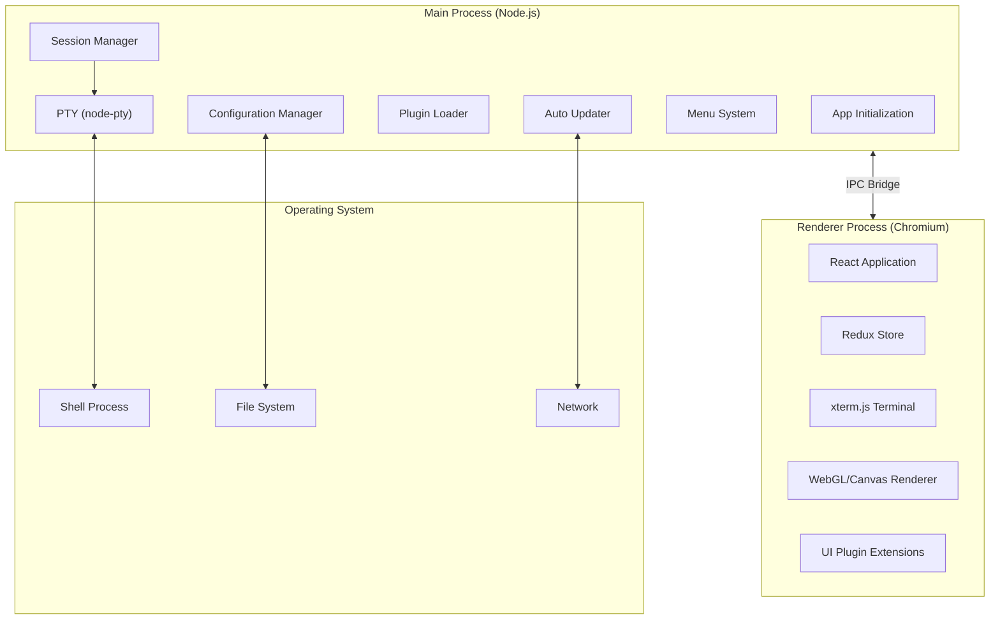

#### Integration with Existing Enterprise Landscape

Velocetty integrates with development environments through:

| Integration Point | Mechanism | Evidence |
|------------------|-----------|----------|
| Shell Environments | PTY session spawning via node-pty | `app/session.ts` |
| SSH Connections | Default client for `ssh://` protocol handler | `app/index.ts` |
| Configuration | JSON file with XDG compliance | `app/config/paths.ts` |
| Plugin Ecosystem | NPM-based plugin distribution | `cli/` tooling |

### 1.2.2 High-Level Description

#### Primary System Capabilities

1. **Terminal Emulation Core**
   - PTY session management with intelligent data batching (16ms/200KB thresholds)
   - Full terminal emulation via xterm.js v5.3.0
   - Hardware-accelerated WebGL rendering with canvas/DOM fallbacks
   - Support for terminal images via xterm-addon-image

2. **Multi-Window and Multi-Tab Architecture**
   - Multiple independent windows with isolated state
   - Tabbed interface within each window
   - Horizontal and vertical split pane support
   - Per-profile configuration with shell customization

3. **Extension System**
   - 40+ extension hooks spanning lifecycle, UI, state, and configuration
   - React component decoration for UI customization
   - Redux middleware integration for behavior modification
   - Configuration and environment decoration capabilities

4. **Cross-Platform Distribution**
   - macOS: DMG and ZIP (x64 and arm64)
   - Windows: NSIS installer (x64 and arm64)
   - Linux: deb, rpm, AppImage, snap, and pacman packages

#### Major System Components

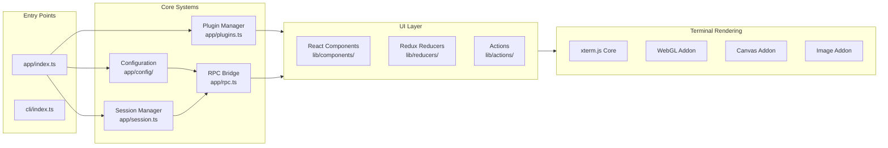

**Component Inventory**

| Component | Location | Responsibility |
|-----------|----------|----------------|
| Main Process Entry | `app/index.ts` | Electron initialization, window management, auto-updates |
| Configuration System | `app/config/` | JSON config loading, validation, migration, defaults |
| Plugin Manager | `app/plugins.ts`, `lib/utils/plugins.ts` | Extension loading, decoration, lifecycle hooks |
| Session Manager | `app/session.ts` | PTY creation, data batching, session lifecycle |
| RPC Bridge | `app/rpc.ts`, `lib/utils/rpc.ts` | IPC abstraction between processes |
| UI Components | `lib/components/` | React terminal UI (Header, Tabs, Term, SplitPane) |
| State Management | `lib/reducers/`, `lib/actions/` | Redux store with UI, sessions, term-groups slices |
| CLI Tool | `cli/` | Plugin installation, configuration, app launching |
| Menu System | `app/menus/` | Application menus with platform-specific variants |
| Keymaps | `app/keymaps/` | Platform-specific keyboard shortcut definitions |

#### Core Technical Approach

**Technology Stack**

| Layer | Technology | Version | Purpose |
|-------|------------|---------|---------|
| Runtime Shell | Electron | 22.3.25 | Desktop application framework |
| Main Process | Node.js/TypeScript | 5.4.5 | OS integration, PTY management |
| Renderer Framework | React | 18.2.0 | UI component architecture |
| State Management | Redux | 4.2.1 | Centralized state with middleware |
| Terminal Core | xterm.js | 5.3.0 | Terminal emulation and rendering |
| GPU Rendering | xterm-addon-webgl | 0.16.0 | Hardware-accelerated display |
| Build System | Webpack | 5.91.0 | Module bundling and optimization |
| Packaging | electron-builder | 24.13.3 | Cross-platform distribution |

**Architectural Patterns**

1. **IPC Communication Model**: Terminal data crosses the process boundary via IPC with optimized batching to mitigate JSON encoding/decoding overhead. The `app/session.ts` implements 16ms time-based and 200KB size-based batching thresholds.

2. **Plugin Decoration Pattern**: Extensions compose with core functionality through decoration rather than replacement, preserving base behavior while enabling customization.

3. **Write-Middleware Bypass**: Performance-critical `SESSION_PTY_DATA` actions bypass Redux middleware entirely to minimize latency for high-volume terminal output.

4. **Lazy PTY Creation**: First PTY session is created as early as possible during startup to minimize perceived launch time.

### 1.2.3 Success Criteria

#### Measurable Objectives

| Objective | Metric | Target |
|-----------|--------|--------|
| Application Startup | Cold start time | < 2 seconds |
| Terminal Responsiveness | Keystroke-to-echo latency | < 50ms |
| Memory Efficiency | Idle memory consumption | < 300 MB |
| Rendering Performance | Frame rate during scrolling | 60 fps (WebGL) |
| Plugin Load Time | Extension initialization | < 500ms total |

#### Critical Success Factors

1. **Performance Parity with Native Terminals**: WebGL rendering must deliver frame rates comparable to native terminal applications, especially during rapid output (e.g., `find ~`, `cat largefile.log`).

2. **Extension Ecosystem Vitality**: The plugin system must support the existing Hyper plugin ecosystem while enabling development of Velocetty-specific enhancements.

3. **Cross-Platform Reliability**: Identical functionality and appearance across macOS, Windows, and Linux with platform-appropriate integrations.

4. **Configuration Migration**: Smooth transition path for users migrating from Hyper v3 JavaScript configs to Velocetty JSON/JSON5 format.

#### Key Performance Indicators (KPIs)

| KPI Category | Indicator | Measurement Method |
|--------------|-----------|-------------------|
| **Reliability** | Crash-free session rate | Telemetry/crash reports |
| **Performance** | P95 render frame time | Internal instrumentation |
| **Adoption** | Active installations | Update check analytics |
| **Ecosystem** | Published extensions | Plugin registry count |
| **Quality** | Open bug count | GitHub issue tracking |

---

## 1.3 SCOPE

### 1.3.1 In-Scope

#### Core Features and Functionalities

**Must-Have Capabilities**

| Category | Feature | Implementation Evidence |
|----------|---------|------------------------|
| **Terminal Emulation** | Full PTY session management | `app/session.ts` - node-pty integration |
| **Rendering** | WebGL/Canvas/DOM rendering pipeline | xterm-addon-webgl, xterm-addon-canvas |
| **Multi-Session** | Tabs, windows, and split panes | `lib/components/tabs.tsx`, `lib/components/split-pane.tsx` |
| **Search** | In-terminal search with regex support | xterm-addon-search integration |
| **Configuration** | JSON-based settings with profiles | `app/config/`, `typings/config.d.ts` |
| **Extensions** | Full plugin lifecycle management | `app/plugins.ts`, `lib/utils/plugins.ts` |
| **Updates** | Auto-update with stable/canary channels | `app/auto-updater.ts` |

**Primary User Workflows**

1. **Terminal Session Management**
   - Create new terminals (tabs, windows, splits)
   - Navigate between sessions via keyboard/mouse
   - Close sessions with confirmation for active processes
   - Profile-based session creation with custom shells

2. **Configuration and Customization**
   - Edit JSON configuration file
   - Apply themes and color schemes
   - Configure fonts, cursor, and rendering options
   - Manage multiple shell profiles

3. **Extension Management**
   - Install plugins via CLI (`hyper install <plugin>`)
   - Configure plugins through settings
   - Hot-reload plugins for development
   - Uninstall and update extensions

4. **Search and Navigation**
   - Search within terminal buffer
   - Case-sensitive and regex search modes
   - Navigate search results

**Essential Integrations**

| Integration | Type | Scope |
|-------------|------|-------|
| SSH Protocol Handler | System | Default client for `ssh://` URLs |
| Shell Detection | Runtime | Auto-detect user's default shell |
| Environment Variables | Configuration | Pass custom env to shell sessions |
| Working Directory | Session | Preserve CWD for new tabs/splits |

**Key Technical Requirements**

1. **Performance Requirements**
   - Data batching for IPC optimization
   - V8 snapshot for faster startup
   - WebGL renderer for hardware acceleration
   - Efficient memory management across multiple sessions

2. **Platform Requirements**
   - Native menu integration per platform
   - Platform-specific keymaps (darwin/linux/win32)
   - Dark mode support (macOS)
   - High-DPI display support

3. **Security Requirements**
   - Secure IPC communication
   - Configuration file validation
   - Update signature verification

#### Implementation Boundaries

**System Boundaries**

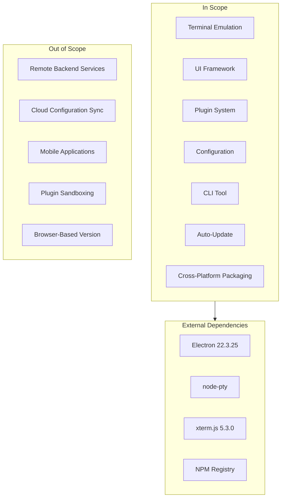

**User Groups Covered**

| User Group | Support Level | Notes |
|------------|--------------|-------|
| Individual Developers | Full | Primary target audience |
| Development Teams | Full | Shared configuration support |
| System Administrators | Full | SSH and remote access workflows |
| Extension Developers | Full | Comprehensive API documentation |
| Enterprise IT | Partial | Basic deployment, no central management |

**Geographic/Market Coverage**

- Global distribution via direct download
- No region-specific restrictions
- Localization limited to system language detection
- Update infrastructure with CDN distribution

**Data Domains Included**

| Data Domain | Scope | Storage Location |
|-------------|-------|-----------------|
| Configuration | User preferences, profiles | `~/.config/Hyper/hyper.json` |
| Plugins | Installed extensions | `~/.config/Hyper/plugins/` |
| Session State | Window/tab layout | In-memory (per session) |
| Terminal History | Scrollback buffer | In-memory (configurable limit) |

### 1.3.2 Out-of-Scope

#### Explicitly Excluded Features

| Feature | Rationale | Future Consideration |
|---------|-----------|---------------------|
| **Remote Frontend Architecture** | Requires significant architectural changes to IPC model | Planned for Velocetty roadmap |
| **Protobuf/WebSocket Communications** | Dependent on remote frontend work | Post-MVP consideration |
| **Tauri Migration** | Major platform shift requiring ecosystem adaptation | Under evaluation |
| **Plugin Sandboxing** | Conflicts with current full-trust execution model | Design challenge to address |
| **Mobile Applications** | Electron-based architecture not suitable for mobile | Not planned |
| **Cloud Configuration Sync** | Requires backend infrastructure | Out of initial scope |
| **Integrated SSH Key Management** | Security complexity, existing tools sufficient | Not planned |
| **Built-in Multiplexer (tmux-like)** | Scope creep, users have existing solutions | Not planned |

#### Future Phase Considerations

**Phase 2 Candidates**

1. **Remote Frontend Separation**
   - Decouple renderer from main process more explicitly
   - Enable cleaner IPC boundary for potential alternative transports
   - Foundation for future Tauri migration

2. **JSON5 Configuration Format**
   - Comments support for documented configurations
   - Trailing commas for easier diff management
   - Backward-compatible migration from JSON

3. **Customizable Tab Handles API**
   - Normalized surface for tab UI customization
   - Stable API replacing ad-hoc decoration hooks
   - Support for process icons, CWD display, custom widgets

4. **Preferences UI**
   - Visual configuration editor
   - Profile management interface
   - Theme preview and selection

**Phase 3 Candidates**

1. **Tauri Migration Evaluation**
   - Assess feasibility of moving host framework
   - Address node-pty dependency challenges
   - Evaluate plugin ecosystem compatibility

2. **Plugin Security Model**
   - Capability-based permission system
   - Sandboxed plugin execution
   - Plugin signing and verification

#### Integration Points Not Covered

| Integration | Status | Alternative |
|-------------|--------|-------------|
| IDE Integration APIs | Out of scope | Plugins can provide basic integration |
| CI/CD Pipeline Integration | Out of scope | Standard terminal access |
| Container Runtime Integration | Out of scope | Users manage via shell |
| Centralized Enterprise Deployment | Out of scope | Manual installation/configuration |

#### Unsupported Use Cases

1. **Headless/Server Operation**: Velocetty requires a graphical environment; headless terminal needs should use standard terminal emulators.

2. **Embedded Terminal Widget**: The application is designed as a standalone terminal, not an embeddable component for other applications.

3. **Real-Time Collaboration**: No built-in support for shared terminal sessions or collaborative editing.

4. **Secure/Air-Gapped Environments**: Auto-update and plugin installation require network access; offline deployment not explicitly supported.

5. **Accessibility Compliance**: While screen reader mode exists (`screenReaderMode` config), full WCAG compliance is not guaranteed.

---

## 1.4 DOCUMENT CONVENTIONS

### 1.4.1 Terminology

| Term | Definition |
|------|------------|
| **PTY** | Pseudo-terminal; OS facility enabling terminal emulation |
| **Main Process** | Electron's Node.js-based process handling OS integration |
| **Renderer Process** | Chromium-based process rendering the UI per window |
| **IPC** | Inter-Process Communication between main and renderer |
| **Extension/Plugin** | Third-party module extending Velocetty functionality |
| **Profile** | Named configuration preset for shell and terminal settings |
| **Term Group** | Logical grouping of split terminal panes within a tab |

### 1.4.2 Version Information

| Component | Version | Notes |
|-----------|---------|-------|
| Velocetty (base) | 4.0.0-canary.5 | Fork of Hyper canary |
| Electron | 22.3.25 | Runtime framework |
| xterm.js | 5.3.0 | Terminal emulation |
| React | 18.2.0 | UI framework |
| TypeScript | 5.4.5 | Development language |

---

## 1.5 REFERENCES

### 1.5.1 Repository Files Examined

| File Path | Relevance |
|-----------|-----------|
| `README.md` | Project overview, installation, contribution guidelines |
| `package.json` | Dependencies, scripts, project metadata |
| `PLUGINS.md` | Plugin development workflow and API documentation |
| `app/index.ts` | Main process entry point and window management |
| `app/session.ts` | PTY session implementation with data batching |
| `app/plugins.ts` | Main process plugin loading and management |
| `app/config/config-default.json` | Default configuration values |
| `app/config/paths.ts` | Configuration file path resolution |
| `typings/config.d.ts` | Configuration schema TypeScript definitions |
| `electron-builder.json` | Cross-platform packaging configuration |
| `lib/utils/plugins.ts` | Renderer process plugin utilities |
| `lib/components/` | React UI component implementations |
| `lib/reducers/` | Redux state management |

### 1.5.2 Repository Folders Explored

| Folder Path | Contents |
|-------------|----------|
| `app/` | Main process implementation |
| `app/config/` | Configuration subsystem (defaults, paths, migration) |
| `app/plugins/` | Extension hooks and installer |
| `app/menus/` | Application menu definitions |
| `app/keymaps/` | Platform-specific keyboard shortcuts |
| `lib/` | Renderer process implementation |
| `lib/components/` | React UI components |
| `lib/reducers/` | Redux reducers |
| `lib/actions/` | Redux action creators |
| `lib/store/` | Redux store configuration |
| `lib/utils/` | Renderer utilities |
| `cli/` | CLI tool implementation |
| `typings/` | TypeScript type definitions |
| `test/` | Testing infrastructure |

### 1.5.3 External References

| Source | Topic | Date |
|--------|-------|------|
| npm: xterm-addon-webgl | WebGL addon deprecation notice, recommending @xterm/* scoped packages | 2025 |
| DoltHub Blog | Electron vs Tauri architectural comparison | November 2025 |
| RaftLabs | Tauri 2.0 adoption metrics (35% YoY growth) and performance benchmarks | September 2025 |
| GitHub: xterm.js | WebGL renderer limitations and texture atlas management | Various |

# 2. Product Requirements

## 2.1 FEATURE CATALOG

This section provides a comprehensive catalog of Velocetty's discrete, testable features. Each feature is documented with metadata, descriptions, dependencies, and implementation context derived from the inherited Hyper codebase.

### 2.1.1 Terminal Emulation Core

| Attribute | Value |
|-----------|-------|
| **Feature ID** | F-001 |
| **Feature Name** | Terminal Emulation Core |
| **Category** | Core Functionality |
| **Priority Level** | Critical |
| **Status** | Completed |

#### Description

| Aspect | Details |
|--------|---------|
| **Overview** | Full-featured terminal emulation powered by PTY (pseudo-terminal) sessions via node-pty and rendered through xterm.js with WebGL/Canvas acceleration |
| **Business Value** | Provides the foundational terminal capability that all other features depend upon, enabling command-line workflows across all supported platforms |
| **User Benefits** | Fast, responsive terminal experience with hardware-accelerated rendering, configurable fonts, colors, and cursor styles |
| **Technical Context** | Implements PTY management in `app/session.ts` with intelligent data batching (16ms time-based, 200KB size-based thresholds) to optimize IPC communication between main and renderer processes |

#### Dependencies

| Dependency Type | Details |
|-----------------|---------|
| **Prerequisite Features** | None (foundational feature) |
| **System Dependencies** | node-pty native module, operating system PTY support |
| **External Dependencies** | xterm.js 5.3.0, xterm-addon-webgl 0.16.0, xterm-addon-canvas 0.5.0 |
| **Integration Requirements** | Electron IPC bridge (`app/rpc.ts`), Redux store for session state |

---

### 2.1.2 Multi-Session Architecture

| Attribute | Value |
|-----------|-------|
| **Feature ID** | F-002 |
| **Feature Name** | Multi-Session Architecture |
| **Category** | Core Functionality |
| **Priority Level** | Critical |
| **Status** | Completed |

#### Description

| Aspect | Details |
|--------|---------|
| **Overview** | Support for multiple windows, tabs within windows, and horizontal/vertical split panes within tabs |
| **Business Value** | Enables power users to manage multiple concurrent terminal sessions efficiently, supporting complex development workflows |
| **User Benefits** | Organize work across windows/tabs, view multiple terminals side-by-side, quickly navigate between sessions |
| **Technical Context** | Term groups organized as tree structure in `lib/reducers/term-groups.ts` with parent/child relationships; split pane minimum size constraint of 5% |

#### Dependencies

| Dependency Type | Details |
|-----------------|---------|
| **Prerequisite Features** | F-001 (Terminal Emulation Core) |
| **System Dependencies** | Electron BrowserWindow management |
| **External Dependencies** | electron-store for window state persistence |
| **Integration Requirements** | Redux state slices for sessions, term-groups, and UI |

---

### 2.1.3 In-Terminal Search

| Attribute | Value |
|-----------|-------|
| **Feature ID** | F-003 |
| **Feature Name** | In-Terminal Search |
| **Category** | User Productivity |
| **Priority Level** | High |
| **Status** | Completed |

#### Description

| Aspect | Details |
|--------|---------|
| **Overview** | Search functionality within terminal scrollback buffer with support for case sensitivity, whole word matching, and regular expressions |
| **Business Value** | Improves developer productivity by enabling quick location of command output, error messages, and log entries |
| **User Benefits** | Find text in terminal history, navigate search results, filter with regex patterns |
| **Technical Context** | Implemented via `xterm-addon-search` 0.13.0 with overlay component in `lib/components/searchBox.tsx` |

#### Dependencies

| Dependency Type | Details |
|-----------------|---------|
| **Prerequisite Features** | F-001 (Terminal Emulation Core) |
| **System Dependencies** | None |
| **External Dependencies** | xterm-addon-search 0.13.0 |
| **Integration Requirements** | Redux actions in `lib/actions/sessions.ts` for search state management |

---

### 2.1.4 Configuration System

| Attribute | Value |
|-----------|-------|
| **Feature ID** | F-004 |
| **Feature Name** | Configuration System |
| **Category** | System Management |
| **Priority Level** | Critical |
| **Status** | Completed |

#### Description

| Aspect | Details |
|--------|---------|
| **Overview** | JSON-based configuration with schema validation, profile support, hot-reload capability, and XDG-compliant file paths |
| **Business Value** | Enables customization and personalization while supporting programmatic configuration management and future preferences UI |
| **User Benefits** | Customize appearance, behavior, and shell settings; create multiple profiles for different workflows |
| **Technical Context** | Configuration subsystem in `app/config/` with schema validation via `app/config/schema.json`, hot-reload via chokidar file watching |

#### Dependencies

| Dependency Type | Details |
|-----------------|---------|
| **Prerequisite Features** | None (foundational feature) |
| **System Dependencies** | File system access, XDG directory resolution |
| **External Dependencies** | chokidar for file watching, electron-store for persistence |
| **Integration Requirements** | IPC bridge for renderer config access, plugin decoration hooks |

---

### 2.1.5 Plugin/Extension System

| Attribute | Value |
|-----------|-------|
| **Feature ID** | F-005 |
| **Feature Name** | Plugin/Extension System |
| **Category** | Extensibility |
| **Priority Level** | Critical |
| **Status** | Completed |

#### Description

| Aspect | Details |
|--------|---------|
| **Overview** | Comprehensive extension system with 40+ hooks spanning lifecycle, UI decoration, state management, and configuration |
| **Business Value** | Enables community-driven innovation and deep customization, differentiating Velocetty from traditional terminal emulators |
| **User Benefits** | Install themes, add features, customize UI, integrate with external tools |
| **Technical Context** | Extension hooks defined in `app/plugins/extensions.ts`; plugins are universal Node.js modules loaded by both Electron main and renderer processes |

#### Dependencies

| Dependency Type | Details |
|-----------------|---------|
| **Prerequisite Features** | F-004 (Configuration System) |
| **System Dependencies** | Node.js module resolution, npm/yarn package management |
| **External Dependencies** | npm registry for plugin distribution |
| **Integration Requirements** | React component decoration, Redux middleware/reducer integration |

---

### 2.1.6 Keyboard Shortcuts System

| Attribute | Value |
|-----------|-------|
| **Feature ID** | F-006 |
| **Feature Name** | Keyboard Shortcuts System |
| **Category** | User Productivity |
| **Priority Level** | High |
| **Status** | Completed |

#### Description

| Aspect | Details |
|--------|---------|
| **Overview** | Platform-specific keyboard shortcut definitions with command registry for consistent action dispatch |
| **Business Value** | Provides keyboard-driven efficiency expected by power users and ensures platform-appropriate modifier keys |
| **User Benefits** | Efficient navigation, session management, and editing without mouse interaction |
| **Technical Context** | Platform keymaps in `app/keymaps/` (darwin.json, linux.json, win32.json); command registry in `lib/command-registry.ts` |

#### Dependencies

| Dependency Type | Details |
|-----------------|---------|
| **Prerequisite Features** | None |
| **System Dependencies** | Electron keyboard event handling |
| **External Dependencies** | None |
| **Integration Requirements** | Menu system acceleration, Redux action dispatch |

---

### 2.1.7 Application Menu System

| Attribute | Value |
|-----------|-------|
| **Feature ID** | F-007 |
| **Feature Name** | Application Menu System |
| **Category** | User Interface |
| **Priority Level** | High |
| **Status** | Completed |

#### Description

| Aspect | Details |
|--------|---------|
| **Overview** | Platform-native application menus with dynamic profile submenus and command acceleration |
| **Business Value** | Provides discoverable access to functionality and aligns with platform UI conventions |
| **User Benefits** | Access all features through familiar menu structure, learn keyboard shortcuts via menu hints |
| **Technical Context** | Menu templates in `app/menus/menus/` with platform variants; dynamic profile menu generation from configuration |

#### Dependencies

| Dependency Type | Details |
|-----------------|---------|
| **Prerequisite Features** | F-004 (Configuration System), F-006 (Keyboard Shortcuts) |
| **System Dependencies** | Electron Menu API |
| **External Dependencies** | None |
| **Integration Requirements** | Configuration system for profile menus, plugin decoration hooks |

---

### 2.1.8 Auto-Update System

| Attribute | Value |
|-----------|-------|
| **Feature ID** | F-008 |
| **Feature Name** | Auto-Update System |
| **Category** | System Management |
| **Priority Level** | High |
| **Status** | Completed |

#### Description

| Aspect | Details |
|--------|---------|
| **Overview** | Automatic application updates with stable and canary channel support, platform-specific update mechanisms |
| **Business Value** | Ensures users receive security patches and new features without manual intervention |
| **User Benefits** | Automatic notifications of updates, easy update installation, channel selection for early access |
| **Technical Context** | Implemented in `app/updater.ts` with Linux-specific handler in `app/auto-updater-linux.ts`; polling at 10s initial, then 30-minute intervals |

#### Dependencies

| Dependency Type | Details |
|-----------------|---------|
| **Prerequisite Features** | F-011 (Notification System) |
| **System Dependencies** | Network access, platform update frameworks |
| **External Dependencies** | Update manifest servers (releases.hyper.is) |
| **Integration Requirements** | Configuration for channel selection, notification system for prompts |

---

### 2.1.9 Command-Line Interface (CLI)

| Attribute | Value |
|-----------|-------|
| **Feature ID** | F-009 |
| **Feature Name** | Command-Line Interface |
| **Category** | User Productivity |
| **Priority Level** | Medium |
| **Status** | Completed |

#### Description

| Aspect | Details |
|--------|---------|
| **Overview** | CLI tool for plugin management, application launching, and configuration tasks |
| **Business Value** | Enables scripted plugin management and integration with development workflows |
| **User Benefits** | Install/remove plugins from terminal, search plugin registry, launch application |
| **Technical Context** | Implemented in `cli/` directory with API operations in `cli/api.ts` |

#### Dependencies

| Dependency Type | Details |
|-----------------|---------|
| **Prerequisite Features** | F-005 (Plugin System), F-004 (Configuration System) |
| **System Dependencies** | Node.js runtime, npm/yarn |
| **External Dependencies** | npm registry API |
| **Integration Requirements** | Configuration file access, plugin directory management |

---

### 2.1.10 Cross-Platform Support

| Attribute | Value |
|-----------|-------|
| **Feature ID** | F-010 |
| **Feature Name** | Cross-Platform Support |
| **Category** | Platform Support |
| **Priority Level** | Critical |
| **Status** | Completed |

#### Description

| Aspect | Details |
|--------|---------|
| **Overview** | Consistent functionality across macOS, Windows, and Linux with platform-appropriate integrations |
| **Business Value** | Enables teams with mixed development environments to standardize on a single terminal solution |
| **User Benefits** | Same features and appearance regardless of OS, platform-native behaviors where appropriate |
| **Technical Context** | Build configuration in `electron-builder.json`; platform utilities in `app/utils/` |

#### Dependencies

| Dependency Type | Details |
|-----------------|---------|
| **Prerequisite Features** | All core features |
| **System Dependencies** | Platform-specific native modules (node-pty variants) |
| **External Dependencies** | electron-builder 24.13.3 |
| **Integration Requirements** | Platform-specific keymaps, menus, update mechanisms |

---

### 2.1.11 Notification System

| Attribute | Value |
|-----------|-------|
| **Feature ID** | F-011 |
| **Feature Name** | Notification System |
| **Category** | User Interface |
| **Priority Level** | Medium |
| **Status** | Completed |

#### Description

| Aspect | Details |
|--------|---------|
| **Overview** | In-application and native system notifications for events, updates, and plugin messages |
| **Business Value** | Keeps users informed of important events without interrupting workflow |
| **User Benefits** | Receive update notifications, resize confirmations, plugin messages |
| **Technical Context** | Implemented in `app/notifications.ts` and `lib/components/notifications.tsx` |

#### Dependencies

| Dependency Type | Details |
|-----------------|---------|
| **Prerequisite Features** | None |
| **System Dependencies** | Native notification APIs |
| **External Dependencies** | None |
| **Integration Requirements** | Redux state for notification management |

---

### 2.1.12 Performance Optimization

| Attribute | Value |
|-----------|-------|
| **Feature ID** | F-012 |
| **Feature Name** | Performance Optimization |
| **Category** | Core Functionality |
| **Priority Level** | High |
| **Status** | Completed |

#### Description

| Aspect | Details |
|--------|---------|
| **Overview** | Suite of performance optimizations including data batching, V8 snapshots, WebGL rendering, and middleware bypass |
| **Business Value** | Ensures Velocetty remains competitive with native terminal emulators despite web technology overhead |
| **User Benefits** | Fast application startup, responsive terminal output, smooth scrolling |
| **Technical Context** | Data batching in `app/session.ts`, write middleware bypass in `lib/store/write-middleware.ts`, V8 snapshot utilities in `lib/v8-snapshot-util.ts` |

#### Dependencies

| Dependency Type | Details |
|-----------------|---------|
| **Prerequisite Features** | F-001 (Terminal Emulation Core) |
| **System Dependencies** | GPU for WebGL acceleration |
| **External Dependencies** | xterm-addon-webgl 0.16.0 |
| **Integration Requirements** | Custom Redux middleware configuration |

---

## 2.2 FUNCTIONAL REQUIREMENTS TABLES

### 2.2.1 Terminal Emulation Core (F-001)

#### Requirements Table

| Requirement ID | Description | Priority |
|----------------|-------------|----------|
| F-001-RQ-001 | Create PTY session with specified shell | Must-Have |
| F-001-RQ-002 | Render terminal output via xterm.js | Must-Have |
| F-001-RQ-003 | Support configurable font size and family | Must-Have |
| F-001-RQ-004 | Implement data batching for IPC optimization | Must-Have |
| F-001-RQ-005 | Support WebGL hardware-accelerated rendering | Should-Have |
| F-001-RQ-006 | Provide canvas fallback when WebGL unavailable | Must-Have |
| F-001-RQ-007 | Support configurable scrollback buffer | Should-Have |
| F-001-RQ-008 | Handle terminal resize events | Must-Have |

#### F-001-RQ-001: PTY Session Creation

| Attribute | Specification |
|-----------|---------------|
| **Acceptance Criteria** | System creates PTY session within 500ms of request; session connects to configured shell; session receives and transmits data |
| **Complexity** | High |
| **Input Parameters** | Shell path, shell arguments, environment variables, initial working directory, rows, columns |
| **Output/Response** | Session UID, PTY PID, session metadata object |
| **Performance Criteria** | Session ready within 500ms; first PTY created during app startup |
| **Data Requirements** | Session stored in Redux state with uid, title, shell, pid, cols, rows, profile, cwd |

| Validation Category | Rules |
|---------------------|-------|
| **Business Rules** | Default shell determined by OS if not configured; CWD preserved from parent session if `preserveCWD` enabled |
| **Data Validation** | Shell path must exist and be executable; rows/cols must be positive integers |
| **Security Requirements** | Environment variables sanitized; shell execution respects OS permissions |

#### F-001-RQ-002: Terminal Output Rendering

| Attribute | Specification |
|-----------|---------------|
| **Acceptance Criteria** | All terminal output rendered correctly; ANSI escape sequences interpreted; 60fps during rapid output with WebGL |
| **Complexity** | High |
| **Input Parameters** | PTY data buffer, terminal dimensions |
| **Output/Response** | Rendered terminal display in canvas element |
| **Performance Criteria** | Frame time < 16.67ms for 60fps; data batching at 16ms/200KB thresholds |
| **Data Requirements** | Terminal buffer stored in xterm.js instance |

| Validation Category | Rules |
|---------------------|-------|
| **Business Rules** | Batch data before IPC transmission; bypass Redux for `SESSION_PTY_DATA` actions |
| **Data Validation** | Buffer data UTF-8 encoded |
| **Security Requirements** | Terminal escape sequences cannot access local resources |

#### F-001-RQ-005: WebGL Rendering

| Attribute | Specification |
|-----------|---------------|
| **Acceptance Criteria** | WebGL renderer activates when enabled; falls back gracefully; maximum 16 simultaneous WebGL contexts |
| **Complexity** | Medium |
| **Input Parameters** | `webGLRenderer` configuration boolean |
| **Output/Response** | Hardware-accelerated terminal rendering |
| **Performance Criteria** | 60fps scrolling; reduced CPU usage compared to canvas |
| **Data Requirements** | WebGL context per visible terminal |

| Validation Category | Rules |
|---------------------|-------|
| **Business Rules** | WebGL disabled by default; limit of 16 visible terminals with WebGL; allocation priority for visible panes |
| **Data Validation** | GPU capabilities detected at runtime |
| **Security Requirements** | WebGL context isolation per terminal |

---

### 2.2.2 Multi-Session Architecture (F-002)

#### Requirements Table

| Requirement ID | Description | Priority |
|----------------|-------------|----------|
| F-002-RQ-001 | Create new terminal tabs | Must-Have |
| F-002-RQ-002 | Create new windows | Must-Have |
| F-002-RQ-003 | Split panes horizontally | Must-Have |
| F-002-RQ-004 | Split panes vertically | Must-Have |
| F-002-RQ-005 | Navigate between tabs | Must-Have |
| F-002-RQ-006 | Navigate between panes | Must-Have |
| F-002-RQ-007 | Resize split panes | Should-Have |
| F-002-RQ-008 | Close sessions with confirmation | Must-Have |

#### F-002-RQ-001: Tab Creation

| Attribute | Specification |
|-----------|---------------|
| **Acceptance Criteria** | New tab created with active session; tab appears in tab bar; tab becomes active |
| **Complexity** | Medium |
| **Input Parameters** | Optional profile name, optional working directory |
| **Output/Response** | New tab UI element, new session instance |
| **Performance Criteria** | Tab visible within 200ms of request |
| **Data Requirements** | Term group entry in Redux state |

| Validation Category | Rules |
|---------------------|-------|
| **Business Rules** | Use default profile if none specified; inherit CWD from active session if `preserveCWD` enabled |
| **Data Validation** | Profile name must exist in configuration |
| **Security Requirements** | Session inherits configured environment only |

#### F-002-RQ-003: Horizontal Split

| Attribute | Specification |
|-----------|---------------|
| **Acceptance Criteria** | Active pane splits into two side-by-side panes; both panes have active sessions; minimum pane width enforced |
| **Complexity** | Medium |
| **Input Parameters** | Active term group UID, optional profile |
| **Output/Response** | Two term groups with horizontal relationship |
| **Performance Criteria** | Split operation completes within 300ms |
| **Data Requirements** | Parent term group with children array; split ratio stored |

| Validation Category | Rules |
|---------------------|-------|
| **Business Rules** | Minimum pane size is 5% of container; split creates 50/50 division by default |
| **Data Validation** | Term group must exist and be active |
| **Security Requirements** | New session follows security model of parent |

---

### 2.2.3 In-Terminal Search (F-003)

#### Requirements Table

| Requirement ID | Description | Priority |
|----------------|-------------|----------|
| F-003-RQ-001 | Open search overlay | Must-Have |
| F-003-RQ-002 | Search terminal buffer for text | Must-Have |
| F-003-RQ-003 | Navigate to next/previous result | Must-Have |
| F-003-RQ-004 | Toggle case sensitivity | Should-Have |
| F-003-RQ-005 | Toggle whole word matching | Should-Have |
| F-003-RQ-006 | Support regular expressions | Should-Have |
| F-003-RQ-007 | Close search overlay | Must-Have |

#### F-003-RQ-002: Buffer Search

| Attribute | Specification |
|-----------|---------------|
| **Acceptance Criteria** | Search term found in scrollback buffer; results highlighted; result count displayed |
| **Complexity** | Medium |
| **Input Parameters** | Search query string, search options (case, whole word, regex) |
| **Output/Response** | Highlighted matches in terminal, result count |
| **Performance Criteria** | Search completes within 100ms for default scrollback (1000 lines) |
| **Data Requirements** | Search state stored in session Redux slice |

| Validation Category | Rules |
|---------------------|-------|
| **Business Rules** | Search operates on visible and scrollback buffer; empty query clears highlights |
| **Data Validation** | Regex patterns validated before execution |
| **Security Requirements** | Search limited to local terminal buffer |

---

### 2.2.4 Configuration System (F-004)

#### Requirements Table

| Requirement ID | Description | Priority |
|----------------|-------------|----------|
| F-004-RQ-001 | Load JSON configuration file | Must-Have |
| F-004-RQ-002 | Validate configuration against schema | Must-Have |
| F-004-RQ-003 | Apply default values for missing options | Must-Have |
| F-004-RQ-004 | Hot-reload configuration changes | Should-Have |
| F-004-RQ-005 | Support multiple profiles | Should-Have |
| F-004-RQ-006 | Migrate legacy v3 configurations | Should-Have |
| F-004-RQ-007 | Store configuration in XDG-compliant paths | Must-Have |

#### F-004-RQ-001: Configuration Loading

| Attribute | Specification |
|-----------|---------------|
| **Acceptance Criteria** | Configuration loaded on startup; values accessible to main and renderer processes; errors reported clearly |
| **Complexity** | Medium |
| **Input Parameters** | Configuration file path |
| **Output/Response** | Parsed configuration object |
| **Performance Criteria** | Configuration loaded within 50ms |
| **Data Requirements** | Configuration schema in `app/config/schema.json` |

| Validation Category | Rules |
|---------------------|-------|
| **Business Rules** | Use default config if file missing; merge user config with defaults |
| **Data Validation** | JSON syntax validation; schema validation for all fields |
| **Security Requirements** | Configuration file permissions checked on startup |

#### F-004-RQ-004: Hot Reload

| Attribute | Specification |
|-----------|---------------|
| **Acceptance Criteria** | Configuration changes detected automatically; new settings applied without restart; invalid changes rejected gracefully |
| **Complexity** | Medium |
| **Input Parameters** | File system change event |
| **Output/Response** | Updated configuration state, notification to user |
| **Performance Criteria** | Changes applied within 1 second of file save |
| **Data Requirements** | File watcher instance via chokidar |

| Validation Category | Rules |
|---------------------|-------|
| **Business Rules** | Validate new config before applying; notify user of successful reload |
| **Data Validation** | Full schema validation on reload |
| **Security Requirements** | Reject configurations with potentially malicious values |

---

### 2.2.5 Plugin/Extension System (F-005)

#### Requirements Table

| Requirement ID | Description | Priority |
|----------------|-------------|----------|
| F-005-RQ-001 | Load plugins from configuration | Must-Have |
| F-005-RQ-002 | Install plugins via CLI | Must-Have |
| F-005-RQ-003 | Provide lifecycle hooks | Must-Have |
| F-005-RQ-004 | Support UI decoration hooks | Must-Have |
| F-005-RQ-005 | Support Redux middleware integration | Should-Have |
| F-005-RQ-006 | Support configuration decoration | Should-Have |
| F-005-RQ-007 | Hot-reload plugins | Should-Have |
| F-005-RQ-008 | Support local plugin development | Should-Have |

#### F-005-RQ-001: Plugin Loading

| Attribute | Specification |
|-----------|---------------|
| **Acceptance Criteria** | Plugins loaded from `plugins` and `localPlugins` arrays; main and renderer hooks invoked; load errors reported |
| **Complexity** | High |
| **Input Parameters** | Plugin names from configuration |
| **Output/Response** | Loaded plugin modules with registered hooks |
| **Performance Criteria** | Total plugin load time < 500ms |
| **Data Requirements** | Plugin modules in `~/.config/Hyper/plugins/` |

| Validation Category | Rules |
|---------------------|-------|
| **Business Rules** | Local plugins take precedence; plugins loaded in order specified |
| **Data Validation** | Plugin must export valid hook functions |
| **Security Requirements** | Full-trust execution model (no sandboxing) |

#### F-005-RQ-004: UI Decoration Hooks

| Attribute | Specification |
|-----------|---------------|
| **Acceptance Criteria** | Plugins can decorate React components; decoration composes with base component; decorated components render correctly |
| **Complexity** | High |
| **Input Parameters** | Base React component, component props |
| **Output/Response** | Decorated React component |
| **Performance Criteria** | Decoration adds < 5ms per component render |
| **Data Requirements** | Decoration hooks for: Term, Header, Tabs, Tab, Notifications, TermGroup, SplitPane, Hyper |

| Validation Category | Rules |
|---------------------|-------|
| **Business Rules** | Decorations compose in plugin order; base component always receives original props |
| **Data Validation** | Decorated component must be valid React component |
| **Security Requirements** | UI decorations cannot access privileged APIs directly |

---

### 2.2.6 Keyboard Shortcuts System (F-006)

#### Requirements Table

| Requirement ID | Description | Priority |
|----------------|-------------|----------|
| F-006-RQ-001 | Load platform-specific keymaps | Must-Have |
| F-006-RQ-002 | Register keyboard shortcuts | Must-Have |
| F-006-RQ-003 | Dispatch commands on shortcut activation | Must-Have |
| F-006-RQ-004 | Support customizable keymaps via plugins | Should-Have |
| F-006-RQ-005 | Support prefix commands with numbered variants | Should-Have |

#### F-006-RQ-001: Platform Keymaps

| Attribute | Specification |
|-----------|---------------|
| **Acceptance Criteria** | Correct keymap loaded per platform; Command modifier on macOS, Ctrl on Windows/Linux; shortcuts function correctly |
| **Complexity** | Medium |
| **Input Parameters** | Platform identifier (darwin/linux/win32) |
| **Output/Response** | Loaded keymap configuration |
| **Performance Criteria** | Keymap loaded during startup |
| **Data Requirements** | Keymap files in `app/keymaps/` |

| Validation Category | Rules |
|---------------------|-------|
| **Business Rules** | Platform detection via `process.platform`; fallback to linux keymap if unknown |
| **Data Validation** | Keymap JSON schema validation |
| **Security Requirements** | Shortcuts cannot execute arbitrary code |

---

### 2.2.7 Auto-Update System (F-008)

#### Requirements Table

| Requirement ID | Description | Priority |
|----------------|-------------|----------|
| F-008-RQ-001 | Check for updates on startup | Must-Have |
| F-008-RQ-002 | Check for updates periodically | Must-Have |
| F-008-RQ-003 | Support stable and canary channels | Must-Have |
| F-008-RQ-004 | Notify user of available updates | Must-Have |
| F-008-RQ-005 | Download and install updates | Must-Have |
| F-008-RQ-006 | Support architecture-aware updates | Should-Have |
| F-008-RQ-007 | Allow disabling auto-updates | Should-Have |

#### F-008-RQ-002: Periodic Update Checks

| Attribute | Specification |
|-----------|---------------|
| **Acceptance Criteria** | Update check at startup; subsequent checks every 30 minutes; network errors handled gracefully |
| **Complexity** | Medium |
| **Input Parameters** | Update channel from configuration |
| **Output/Response** | Update availability status, version information |
| **Performance Criteria** | Check completes within 5 seconds |
| **Data Requirements** | Update manifest from releases server |

| Validation Category | Rules |
|---------------------|-------|
| **Business Rules** | Initial check at 10 seconds after startup; 30-minute interval thereafter |
| **Data Validation** | Version comparison validation |
| **Security Requirements** | Update signatures verified before installation |

---

### 2.2.8 CLI Tool (F-009)

#### Requirements Table

| Requirement ID | Description | Priority |
|----------------|-------------|----------|
| F-009-RQ-001 | Install plugins by name | Must-Have |
| F-009-RQ-002 | Uninstall plugins | Must-Have |
| F-009-RQ-003 | List installed plugins | Must-Have |
| F-009-RQ-004 | Search npm registry for plugins | Should-Have |
| F-009-RQ-005 | Open plugin documentation | Should-Have |
| F-009-RQ-006 | Launch Hyper application | Should-Have |

#### F-009-RQ-001: Plugin Installation

| Attribute | Specification |
|-----------|---------------|
| **Acceptance Criteria** | Plugin installed to correct directory; configuration updated; installation confirmed |
| **Complexity** | Medium |
| **Input Parameters** | Plugin name or npm package identifier |
| **Output/Response** | Installation success/failure status |
| **Performance Criteria** | Installation completes within 5-minute timeout |
| **Data Requirements** | Plugin installed to `~/.config/Hyper/plugins/node_modules/` |

| Validation Category | Rules |
|---------------------|-------|
| **Business Rules** | Use yarn for package installation; 5-minute timeout |
| **Data Validation** | Plugin name validated against npm registry |
| **Security Requirements** | npm package integrity verification |

---

## 2.3 FEATURE RELATIONSHIPS

### 2.3.1 Feature Dependencies Map

The following diagram illustrates the dependency relationships between Velocetty features:

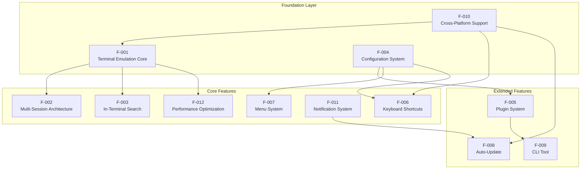

### 2.3.2 Integration Points

| Source Feature | Target Feature | Integration Type |
|----------------|----------------|------------------|
| F-001 Terminal Core | F-002 Multi-Session | Session embedding in term groups |
| F-001 Terminal Core | F-003 Search | Search addon attachment to xterm instance |
| F-001 Terminal Core | F-012 Performance | Data batching, WebGL rendering |
| F-004 Configuration | F-005 Plugins | Plugin list, decoration hooks |
| F-004 Configuration | F-006 Keymaps | Keymap decoration hook |
| F-004 Configuration | F-007 Menus | Menu decoration, profile menus |
| F-005 Plugins | F-002 Multi-Session | Term group decoration |
| F-005 Plugins | F-006 Keymaps | `decorateKeymaps` hook |
| F-006 Keymaps | F-007 Menus | Accelerator keys in menu items |
| F-008 Auto-Update | F-011 Notifications | Update availability notifications |
| F-009 CLI | F-004 Configuration | Configuration file modification |
| F-009 CLI | F-005 Plugins | Plugin installation/removal |

### 2.3.3 Shared Components

| Component | Location | Used By Features |
|-----------|----------|------------------|
| Redux Store | `lib/store/` | F-001, F-002, F-003, F-004, F-005, F-011 |
| IPC Bridge | `app/rpc.ts`, `lib/utils/rpc.ts` | F-001, F-004, F-005, F-008 |
| React Component Library | `lib/components/` | F-002, F-003, F-005, F-007, F-011 |
| Command Registry | `lib/command-registry.ts` | F-006, F-007 |
| Notification Manager | `app/notifications.ts` | F-008, F-011, F-012 |

### 2.3.4 Common Services

| Service | Location | Consuming Features |
|---------|----------|-------------------|
| Configuration Service | `app/config/` | All features |
| Plugin Loader | `app/plugins.ts` | F-005, F-007, F-006 |
| Session Manager | `app/session.ts` | F-001, F-002 |
| File Watcher | via chokidar | F-004 |
| Package Manager | via yarn | F-005, F-009 |

---

## 2.4 IMPLEMENTATION CONSIDERATIONS

### 2.4.1 Terminal Emulation Core (F-001)

| Consideration | Details |
|---------------|---------|
| **Technical Constraints** | xterm.js canvas rendering means plugins cannot access DOM representation of terminal rows; terminal view is not a rich DOM surface for extensions |
| **Performance Requirements** | Data batching at 16ms/200KB thresholds essential for IPC optimization; `SESSION_PTY_DATA` must bypass Redux middleware; WebGL limited to 16 simultaneous contexts |
| **Scalability Considerations** | Memory grows with scrollback buffer size and session count; each session maintains separate PTY process |
| **Security Implications** | PTY sessions execute with user privileges; environment variable passing must be controlled |
| **Maintenance Requirements** | node-pty requires native module rebuilding for Electron version changes; xterm.js updates may require addon compatibility testing |

### 2.4.2 Multi-Session Architecture (F-002)

| Consideration | Details |
|---------------|---------|
| **Technical Constraints** | Term group tree structure limits certain layout configurations; minimum 5% pane size enforced |
| **Performance Requirements** | Window state persistence should not block UI; session state stored in memory, not persisted across restarts |
| **Scalability Considerations** | Multiple windows create multiple renderer processes with associated memory overhead |
| **Security Implications** | Per-window session isolation; sessions cannot access other session data |
| **Maintenance Requirements** | Term group reducer logic complex; split/resize operations must maintain tree consistency |

### 2.4.3 Configuration System (F-004)

| Consideration | Details |
|---------------|---------|
| **Technical Constraints** | JSON format limits to structured data; custom code migration required from v3 JavaScript configs |
| **Performance Requirements** | Hot-reload must validate without blocking UI; schema validation at startup |
| **Scalability Considerations** | Profile count may grow; consider configuration file size limits |
| **Security Implications** | Configuration file should be user-writable only; plugin names validated before installation |
| **Maintenance Requirements** | Schema must be updated with new configuration options; migration paths for version changes |

### 2.4.4 Plugin/Extension System (F-005)

| Consideration | Details |
|---------------|---------|
| **Technical Constraints** | Full-trust execution model means plugins can access all process capabilities; no sandboxing available; plugins are Node.js modules loaded in-process |
| **Performance Requirements** | Total plugin load time < 500ms; decoration functions should not block render |
| **Scalability Considerations** | Plugin count impacts startup time; plugin compatibility across Electron versions |
| **Security Implications** | Plugins have full access to file system, network, and process; users must trust plugin authors; no capability-based permissions |
| **Maintenance Requirements** | 40+ hooks must remain stable for ecosystem compatibility; breaking changes require major version |

### 2.4.5 Performance Optimization (F-012)

| Consideration | Details |
|---------------|---------|
| **Technical Constraints** | WebGL renderer limited to 16 visible terminals simultaneously; IPC JSON encoding/decoding overhead unavoidable |
| **Performance Requirements** | V8 snapshot must be regenerated for dependency changes; write middleware must handle high-volume data |
| **Scalability Considerations** | WebGL allocation should prioritize visible panes rather than first-come-first-served |
| **Security Implications** | WebGL context isolation per terminal |
| **Maintenance Requirements** | Batching thresholds may require tuning; WebGL compatibility testing across GPU vendors |

### 2.4.6 Cross-Platform Support (F-010)

| Consideration | Details |
|---------------|---------|
| **Technical Constraints** | node-pty behavior varies by platform (ConPTY vs WinPTY on Windows); platform-specific build requirements |
| **Performance Requirements** | Native module rebuilding for each platform/architecture combination |
| **Scalability Considerations** | x64 and arm64 builds for macOS and Windows; multiple Linux package formats |
| **Security Implications** | Platform-specific security models (Gatekeeper on macOS, SmartScreen on Windows) |
| **Maintenance Requirements** | electron-builder configuration for all targets; platform-specific testing required |

---

## 2.5 TRACEABILITY MATRIX

### 2.5.1 Feature to Source File Mapping

| Feature ID | Primary Source Files |
|------------|---------------------|
| F-001 | `app/session.ts`, `lib/components/term.tsx` |
| F-002 | `lib/reducers/term-groups.ts`, `lib/components/tabs.tsx`, `lib/components/split-pane.tsx` |
| F-003 | `lib/components/searchBox.tsx`, `lib/actions/sessions.ts` |
| F-004 | `app/config/`, `typings/config.d.ts`, `app/config/config-default.json` |
| F-005 | `app/plugins.ts`, `app/plugins/extensions.ts`, `lib/utils/plugins.ts` |
| F-006 | `app/keymaps/`, `lib/command-registry.ts`, `app/commands.ts` |
| F-007 | `app/menus/`, `app/menus/menus/` |
| F-008 | `app/updater.ts`, `app/auto-updater-linux.ts` |
| F-009 | `cli/api.ts`, `cli/index.ts` |
| F-010 | `electron-builder.json`, `app/utils/` |
| F-011 | `app/notifications.ts`, `lib/components/notifications.tsx` |
| F-012 | `app/session.ts`, `lib/store/write-middleware.ts`, `lib/v8-snapshot-util.ts` |

### 2.5.2 Requirement to Component Mapping

| Requirement ID | Components | Dependencies |
|----------------|------------|--------------|
| F-001-RQ-001 | Session Manager, node-pty | Electron IPC |
| F-001-RQ-002 | xterm.js, Term Component | React, Redux |
| F-001-RQ-005 | xterm-addon-webgl | GPU driver |
| F-002-RQ-001 | Tabs Component, Term Groups Reducer | Redux |
| F-002-RQ-003 | SplitPane Component, Term Groups Actions | React |
| F-003-RQ-002 | xterm-addon-search, SearchBox Component | xterm.js |
| F-004-RQ-001 | Config Module, JSON Schema | File system |
| F-004-RQ-004 | Chokidar, Config Module | File system |
| F-005-RQ-001 | Plugin Loader, Extensions Registry | Node.js modules |
| F-005-RQ-004 | React HOCs, Plugin Connectors | React |
| F-006-RQ-001 | Keymap Loader, Command Registry | Electron |
| F-008-RQ-002 | Updater Module, Auto-Updater | Network, Electron |
| F-009-RQ-001 | CLI API, Yarn | npm registry |

---

## 2.6 REFERENCES

#### Files Examined

- `app/session.ts` - PTY session management, data batching implementation
- `lib/components/term.tsx` - Terminal React component
- `lib/reducers/term-groups.ts` - Term group tree structure and state management
- `lib/components/tabs.tsx` - Tab UI component
- `lib/components/split-pane.tsx` - Split pane container component
- `lib/components/searchBox.tsx` - Search overlay component
- `lib/actions/sessions.ts` - Session-related Redux actions
- `typings/config.d.ts` - Complete configuration schema definitions
- `app/config/config-default.json` - Default configuration values
- `app/config/schema.json` - JSON schema for configuration validation
- `app/plugins.ts` - Plugin loading and management
- `app/plugins/extensions.ts` - 40+ extension hooks list
- `lib/utils/plugins.ts` - Renderer-side plugin utilities
- `PLUGINS.md` - Plugin development documentation
- `app/keymaps/darwin.json` - macOS keyboard shortcuts
- `app/keymaps/linux.json` - Linux keyboard shortcuts
- `app/keymaps/win32.json` - Windows keyboard shortcuts
- `lib/command-registry.ts` - Command registry system
- `app/commands.ts` - Command definitions
- `app/menus/` - Menu system templates
- `app/updater.ts` - Auto-update implementation
- `app/auto-updater-linux.ts` - Linux-specific updater
- `cli/api.ts` - CLI API operations
- `cli/index.ts` - CLI entry point
- `electron-builder.json` - Build configuration
- `app/utils/` - Platform utilities
- `app/notifications.ts` - Notification management
- `lib/components/notifications.tsx` - Notification UI component
- `lib/store/write-middleware.ts` - Performance optimization middleware
- `lib/v8-snapshot-util.ts` - V8 snapshot utilities
- `package.json` - Project dependencies and metadata

#### External Dependencies Referenced

- Electron 22.3.25
- React 18.2.0
- Redux 4.2.1
- xterm.js 5.3.0
- xterm-addon-webgl 0.16.0
- xterm-addon-canvas 0.5.0
- xterm-addon-search 0.13.0
- node-pty (native PTY module)
- electron-builder 24.13.3
- chokidar (file watching)
- electron-store (state persistence)

# 3. Technology Stack

This section provides a comprehensive reference of the technologies, frameworks, libraries, and tools that comprise Velocetty's technical foundation. As a fork of the Hyper terminal emulator originally developed by Vercel, Velocetty inherits a mature, web-standards-based technology stack optimized for terminal emulation across desktop platforms.

## 3.1 PROGRAMMING LANGUAGES

### 3.1.1 Primary Language: TypeScript

| Attribute | Value |
|-----------|-------|
| **Version** | 5.4.5 |
| **Target** | ES2022 |
| **Module System** | CommonJS |
| **Configuration** | `tsconfig.base.json` with strict mode enabled |

#### Language Selection Justification

TypeScript serves as Velocetty's primary development language, chosen for the following architectural reasons:

1. **Type Safety Across Process Boundaries**: Electron applications require communication between the main process (Node.js) and renderer process (Chromium). TypeScript's static typing provides compile-time verification of IPC message structures, reducing runtime errors in the critical `app/rpc.ts` and `lib/utils/rpc.ts` bridge layer.

2. **React Component Type Safety**: The extensive React component tree in `lib/components/` benefits from TypeScript's JSX support and prop type inference, ensuring correct data flow through the decoration-based plugin system.

3. **Redux State Management**: Type definitions for Redux actions, reducers, and selectors in `lib/reducers/` and `lib/actions/` provide documentation and error prevention for the complex state management layer.

4. **Plugin API Contracts**: The 40+ extension hooks documented in `typings/` establish clear API contracts for third-party plugin developers.

#### TypeScript Configuration

```
Base Configuration (tsconfig.base.json):
├── Target: ES2022 (modern JavaScript features)
├── Module: CommonJS (Node.js compatibility)
├── Strict Mode: Enabled (maximum type safety)
├── JSX: React (component compilation)
└── Declaration: Enabled (type definition generation)
```

### 3.1.2 Secondary Languages

| Language | Usage | Locations |
|----------|-------|-----------|
| **JavaScript** | Configuration files, legacy interop | `release.js`, AVA test configs |
| **JSON** | Configuration, schemas, package manifests | `package.json`, `schema.json`, `*.json` keymaps |
| **CSS** | Styling within styled-jsx templates | Embedded in React components |

### 3.1.3 Language Constraints and Dependencies

| Constraint | Description |
|------------|-------------|
| **Node.js Runtime** | TypeScript executes within Node.js 18.x (bundled with Electron 22) |
| **Chromium V8** | Renderer process JavaScript executed by Chromium's V8 engine |
| **Native Module Compatibility** | `node-pty` requires matching Node.js ABI version for native bindings |
| **ES Module Limitations** | CommonJS required for Electron main process compatibility |

## 3.2 FRAMEWORKS & LIBRARIES

### 3.2.1 Application Shell Framework

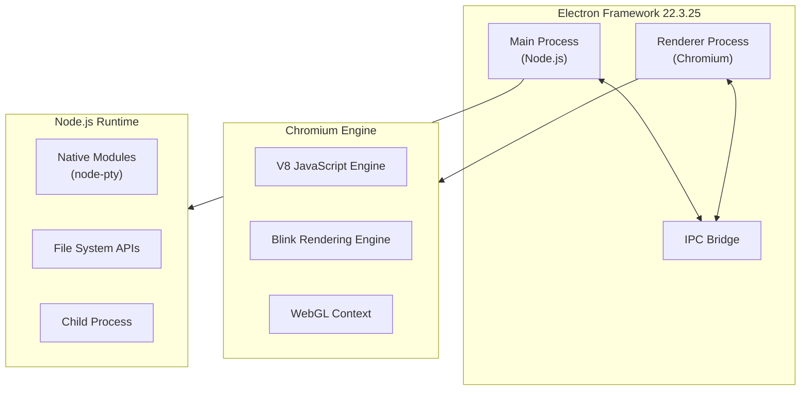

#### Core Framework: Electron

| Attribute | Value |
|-----------|-------|
| **Package** | `electron` |
| **Version** | 22.3.25 |
| **Chromium Version** | 108.0.5359.179 |
| **Node.js Version** | 16.17.1 (bundled) |
| **Support Status** | End-of-life (October 10, 2023) |

**Selection Justification**: Electron provides the cross-platform desktop application framework enabling Velocetty to deliver consistent terminal experiences across macOS, Windows, and Linux using web technologies. The inherited Hyper codebase has deep Electron integration that would require significant refactoring to migrate.

**Technical Debt Note**: Electron 22 reached end-of-life on October 10, 2023. While extended support was provided for Windows 7/8/8.1 compatibility, this version no longer receives security updates. Upgrading to a supported Electron version is a critical future consideration.

#### IPC Communication Layer

| Package | Version | Purpose |
|---------|---------|---------|
| `@electron/remote` | 2.1.2 | Enables renderer process access to main process modules |

**Architectural Note**: The `@electron/remote` package facilitates the communication pattern between processes, though its use is being deprecated in favor of explicit IPC messaging for security reasons.

### 3.2.2 UI Framework Stack

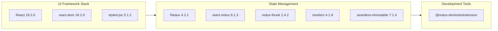

#### React Ecosystem

| Package | Version | Purpose | Justification |
|---------|---------|---------|---------------|
| `react` | 18.2.0 | Component-based UI architecture | Industry-standard for complex UIs; enables plugin decoration pattern |
| `react-dom` | 18.2.0 | DOM rendering bindings | Required for React browser rendering |
| `styled-jsx` | 5.1.2 | Scoped CSS-in-JS styling | Provides component-local styles without global CSS conflicts |
| `stylis` | 3.5.4 | CSS preprocessing | Runtime CSS processing for styled-jsx |

**Selection Justification**: React was chosen for its composability model, which directly enables Velocetty's powerful plugin decoration system. Plugins can wrap and extend React components (tabs, header, terminal view, split panes) through the `decorate*` hooks defined in the extension API.

#### Redux State Management

| Package | Version | Purpose | Justification |
|---------|---------|---------|---------------|
| `redux` | 4.2.1 | Centralized state container | Predictable state for complex multi-session UI |
| `react-redux` | 8.1.3 | React-Redux bindings | Connect React components to Redux store |
| `redux-thunk` | 2.4.2 | Async action middleware | Handle asynchronous operations (PTY data, plugin loading) |
| `reselect` | 4.1.8 | Memoized selector library | Performance optimization for derived state |
| `seamless-immutable` | 7.1.4 | Immutable data structures | Prevent accidental state mutations |

**Architectural Pattern**: The Redux store manages three primary state slices:
- **UI State** (`lib/reducers/ui.ts`): Window chrome, notifications, modals
- **Sessions State** (`lib/reducers/sessions.ts`): Active terminal sessions, profiles
- **Term Groups State** (`lib/reducers/term-groups.ts`): Tab/split pane tree structure

**Performance Optimization**: The `SESSION_PTY_DATA` action bypasses Redux middleware entirely via the write middleware pattern (`lib/store/write-middleware.ts`) to minimize latency for high-volume terminal output.

### 3.2.3 Terminal Emulation Stack

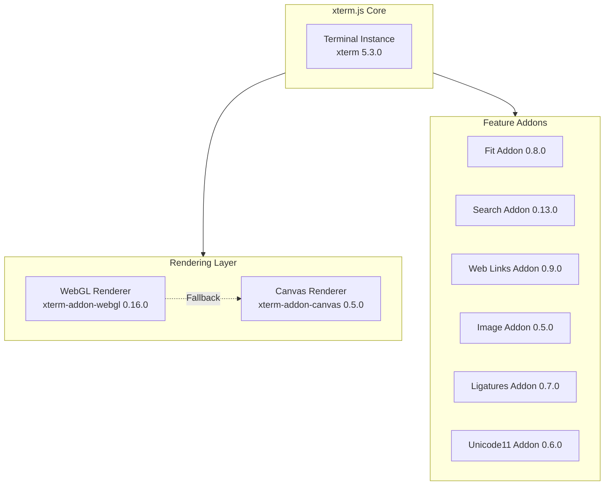

## xterm.js Core

| Package | Version | Purpose |
|---------|---------|---------|
| `xterm` | 5.3.0 | Full terminal emulation (VT100/xterm) |

**Selection Justification**: xterm.js is the industry-standard terminal emulation library for web applications, powering VS Code, Hyper, Tabby, and numerous other terminal interfaces. It provides:
- Complete VT100/xterm escape sequence support
- Full curses-based application compatibility
- Mouse event handling
- ANSI color support
- Accessibility features (screen reader mode)

#### Rendering Addons

| Package | Version | Purpose | Constraint |
|---------|---------|---------|------------|
| `xterm-addon-webgl` | 0.16.0 | Hardware-accelerated GPU rendering | **Maximum 16 simultaneous WebGL contexts** |
| `xterm-addon-canvas` | 0.5.0 | Canvas-based fallback renderer | Used when WebGL unavailable or contexts exhausted |

**Critical Constraint**: The WebGL renderer is limited to 16 simultaneous terminal contexts. This browser-level limitation means that when viewing more than 16 terminals simultaneously, some terminals must fall back to the canvas renderer. Velocetty should prioritize WebGL allocation to visible panes rather than using first-come-first-served allocation.

#### Feature Addons

| Package | Version | Purpose |
|---------|---------|---------|
| `xterm-addon-fit` | 0.8.0 | Automatic terminal sizing to container |
| `xterm-addon-search` | 0.13.0 | In-terminal text search with regex support |
| `xterm-addon-web-links` | 0.9.0 | Clickable URL detection and handling |
| `xterm-addon-image` | 0.5.0 | Terminal image protocol support |
| `xterm-addon-ligatures` | 0.7.0 | Programming font ligature rendering |
| `xterm-addon-unicode11` | 0.6.0 | Unicode 11 character width support |

**Rendering Architecture Note**: xterm.js renders terminal output to a canvas element, not a DOM structure. This means plugins cannot directly manipulate terminal row/glyph elements—metadata display (such as tab icons or CWD indicators) must use explicit APIs rather than DOM inspection.

### 3.2.4 PTY and Shell Integration

| Package | Version | Purpose |
|---------|---------|---------|
| `node-pty` | 1.0.0 | Native pseudo-terminal spawning |
| `default-shell` | 1.0.1 | System default shell detection |
| `shell-env` | 3.0.1 | Shell environment extraction |
| `os-locale` | 5.0.0 | System locale detection |
| `sudo-prompt` | 9.2.1 | Elevated privilege execution (macOS/Linux) |
| `native-reg` | 1.1.1 | Windows registry access (optional dependency) |

**Selection Justification**: `node-pty` provides the native binding layer between Node.js and operating system pseudo-terminal facilities. It supports:
- POSIX PTY on macOS and Linux
- ConPTY on Windows 10+ (with WinPTY fallback for older versions)

**Native Module Constraint**: `node-pty` is a native Node.js addon requiring compilation for each platform/architecture/Electron version combination. The rebuild process is documented in the development workflow and CI/CD configuration.

### 3.2.5 Utility Libraries

| Category | Package | Version | Purpose |
|----------|---------|---------|---------|
| **File Operations** | `fs-extra` | 11.2.0 | Enhanced file system operations |
| **File Watching** | `chokidar` | 3.6.0 | Configuration hot-reload |
| **HTTP Client** | `got` | 12.4.1 | Plugin registry requests |
| **Electron HTTP** | `electron-fetch` | 1.9.1 | Main process HTTP requests |
| **Retry Logic** | `async-retry` | 1.3.3 | Retryable network operations |
| **Storage** | `electron-store` | 8.2.0 | Window state persistence |
| **Utility Functions** | `lodash` | 4.17.21 | General utilities |
| **UUID Generation** | `uuid` | 9.0.1 | Unique identifier generation |
| **Version Parsing** | `semver` | 7.6.0 | Semantic version comparison |
| **Time Parsing** | `ms` | 2.1.3 | Human-readable time strings |
| **URL Parsing** | `parse-url` | 8.1.0 | SSH URL handling |
| **Color Utilities** | `color` | 4.2.3 | Color manipulation |
| **Class Names** | `clsx` | 2.1.0 | Conditional className composition |
| **Plist Parsing** | `plist` | 3.1.0 | macOS plist file support |
| **Keyboard Shortcuts** | `mousetrap` | Fork: `chabou/mousetrap#useCapture` | Keyboard shortcut handling |

## 3.3 OPEN SOURCE DEPENDENCIES

### 3.3.1 Package Registry Configuration

| Registry | Purpose |
|----------|---------|
| **npm** | Primary package registry for all JavaScript/TypeScript dependencies |
| **registry-url** | Dynamic registry resolution for plugin installation |

### 3.3.2 Root Package Dependencies

The root `package.json` defines development-time dependencies and build tools:

```
Root Dependencies (package.json):
├── @electron/remote: 2.1.2
├── @react-icons/all-files: 4.1.0
├── @redux-devtools/extension: ^3.3.0
├── react: 18.2.0
├── react-dom: 18.2.0
├── react-redux: 8.1.3
├── redux: 4.2.1
├── redux-thunk: 2.4.2
├── xterm: 5.3.0
├── xterm-addon-canvas: 0.5.0
├── xterm-addon-fit: 0.8.0
├── xterm-addon-image: 0.5.0
├── xterm-addon-ligatures: 0.7.0
├── xterm-addon-search: 0.13.0
├── xterm-addon-unicode11: 0.6.0
├── xterm-addon-web-links: 0.9.0
└── xterm-addon-webgl: 0.16.0
```

### 3.3.3 Runtime Package Dependencies

The `app/package.json` defines runtime dependencies bundled with the application:

```
Runtime Dependencies (app/package.json):
├── @babel/parser: 7.24.4
├── @electron/remote: 2.1.2
├── ast-types: ^0.16.1
├── async-retry: 1.3.3
├── chokidar: ^3.6.0
├── default-shell: 1.0.1
├── electron-devtools-installer: 3.2.0
├── electron-fetch: 1.9.1
├── electron-is-dev: 2.0.0
├── electron-store: 8.2.0
├── fs-extra: 11.2.0
├── node-pty: 1.0.0
└── recast: 0.23.6

Optional Dependencies:
└── native-reg: 1.1.1 (Windows registry access)
```

### 3.3.4 Dependency Version Policy

| Policy | Description |
|--------|-------------|
| **Exact Versions** | Critical dependencies (Electron, React, xterm.js) use exact versions to ensure reproducible builds |
| **Caret Ranges** | Utility libraries use caret (`^`) ranges for automatic patch updates |
| **Lock File** | `yarn.lock` ensures consistent dependency resolution across environments |

### 3.3.5 Security Considerations

| Consideration | Mitigation |
|---------------|------------|
| **Supply Chain Risk** | Dependency audit via `yarn audit` in CI pipeline |
| **Native Module Security** | `node-pty` executes with user privileges; no elevation by default |
| **Plugin Trust Model** | Plugins are full-trust Node.js modules with unrestricted access |

## 3.4 THIRD-PARTY SERVICES

### 3.4.1 External Service Architecture

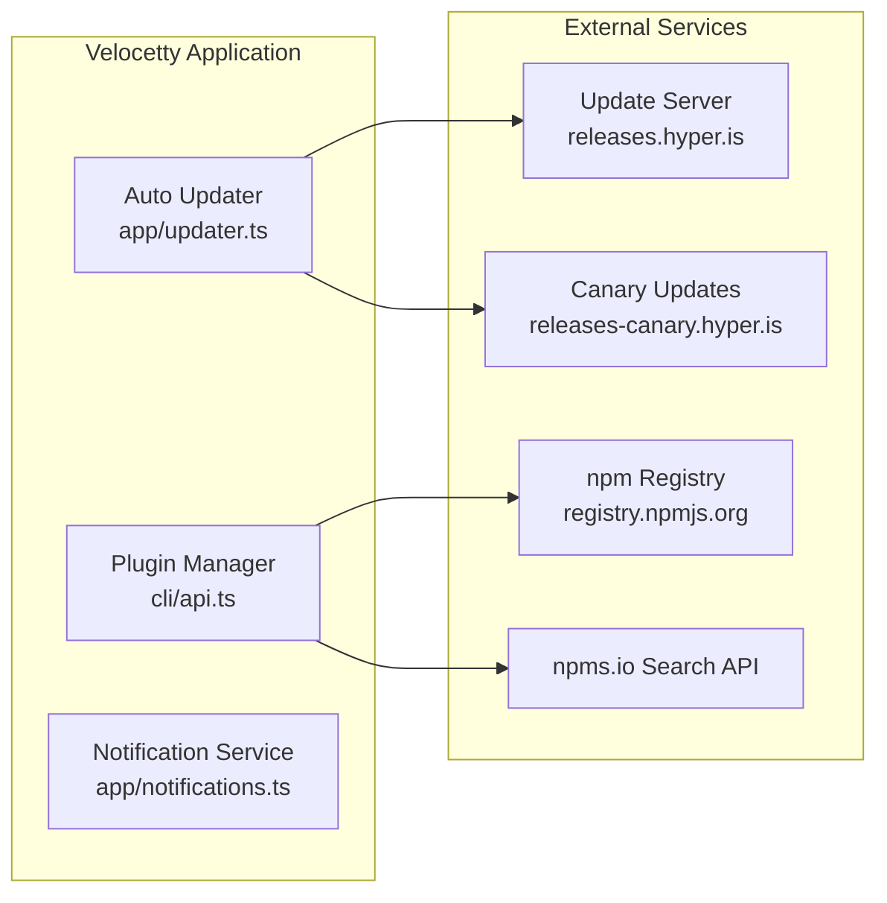

### 3.4.2 Auto-Update Service

| Attribute | Value |
|-----------|-------|
| **Stable Channel URL** | `https://releases.hyper.is/update/{platform}/{version}` |
| **Canary Channel URL** | `https://releases-canary.hyper.is/update/{platform}_arm64/{version}` |
| **Protocol** | HTTPS (TLS 1.2+) |
| **Polling Interval** | 10 seconds initial, then 30 minutes |
| **Implementation** | `app/updater.ts`, `app/auto-updater-linux.ts` |

**Service Dependencies**:
- Platform-specific update mechanisms (Squirrel for macOS/Windows)
- Custom Linux update handler for non-Squirrel platforms

### 3.4.3 Plugin Discovery and Distribution

| Service | Endpoint | Purpose |
|---------|----------|---------|
| **npm Registry** | `registry.npmjs.org` | Plugin package installation and updates |
| **npms.io Search** | `api.npms.io/v2/search` | Plugin discovery via `hyper search` CLI |

**Plugin Tags**:
- `hyper-plugin`: Functional extensions
- `hyper-theme`: Visual themes

### 3.4.4 Notification Service

| Attribute | Value |
|-----------|-------|
| **Endpoint** | `NEWS_URL` constant (configurable) |
| **Headers** | `X-Hyper-Version`, `X-Hyper-Platform` |
| **Purpose** | Fetch product announcements and notifications |
| **Implementation** | `app/notifications.ts` |

### 3.4.5 Protocol Handlers

| Protocol | Handler | Registration |
|----------|---------|--------------|
| `ssh://` | Default SSH client | `electron-builder.json` protocol registration |

## 3.5 DATABASES & STORAGE

### 3.5.1 Storage Architecture

Velocetty operates as a desktop application without network database dependencies. All persistence is file-based and local to the user's system.

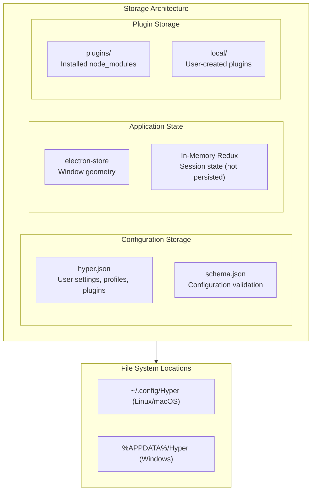

### 3.5.2 Configuration Storage

| Storage Type | Technology | Location | Purpose |
|--------------|------------|----------|---------|
| **User Configuration** | JSON File | `~/.config/Hyper/hyper.json` | User settings, profiles, plugin list |
| **Configuration Schema** | JSON Schema | `app/config/schema.json` | Configuration validation |
| **Legacy Migration** | JavaScript → JSON | Auto-converted from `.hyper.js` | Backward compatibility |

#### Platform-Specific Paths

| Platform | Configuration Directory |
|----------|------------------------|
| **Linux** | `$XDG_CONFIG_HOME/Hyper` or `~/.config/Hyper` |
| **macOS** | `~/.config/Hyper` |
| **Windows** | `%APPDATA%/Hyper` |

#### Configuration File Structure

```
Configuration Directory:
├── hyper.json           # Primary configuration file
├── plugins/             # Plugin node_modules
│   ├── node_modules/    # Installed plugin packages
│   └── local/           # User-created local plugins
└── .migration-marker    # Migration tracking
```

### 3.5.3 Application State Storage

| Storage Type | Technology | Persistence | Purpose |
|--------------|------------|-------------|---------|
| **Window State** | `electron-store` | Persisted across restarts | Window position, size, maximized state |
| **Session State** | Redux (in-memory) | Lost on restart | Active sessions, terminal content, tab state |

**Design Decision**: Session state (including terminal scrollback) is intentionally not persisted across application restarts. This aligns with traditional terminal emulator behavior and avoids potential security concerns with persisting command history.

### 3.5.4 Plugin Storage

| Location | Purpose |
|----------|---------|
| `~/.config/Hyper/plugins/node_modules/` | Installed plugin packages from npm |
| `~/.config/Hyper/plugins/local/` | User-created or migrated local plugins |
| `~/.config/Hyper/plugins/package.json` | Plugin dependency manifest |

### 3.5.5 Data Persistence Strategy

| Data Type | Strategy | Rationale |
|-----------|----------|-----------|
| **Configuration** | File-based JSON with hot-reload | Enables programmatic editing and preferences UI |
| **Window Geometry** | electron-store (encrypted JSON) | Persist user's window arrangement preferences |
| **Terminal Content** | In-memory only | Security and privacy (no command history logging) |
| **Plugin State** | File system + npm manifest | Standard npm package management model |

### 3.5.6 Caching Strategy

| Cache Type | Implementation | Purpose |
|------------|----------------|---------|
| **Configuration Cache** | In-memory after file load | Avoid repeated file I/O |
| **Hot-Reload** | chokidar file watching | Detect configuration changes without restart |
| **V8 Snapshot** | Precompiled JavaScript snapshot | Faster application startup |

## 3.6 DEVELOPMENT & DEPLOYMENT

### 3.6.1 Build System Architecture

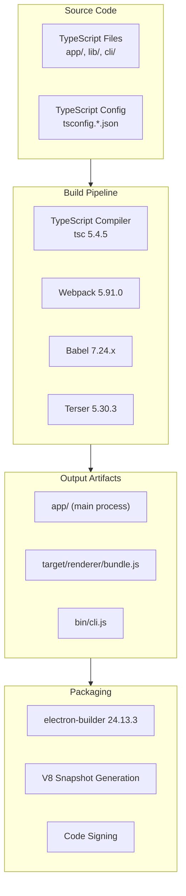

### 3.6.2 Core Build Tools

| Tool | Version | Purpose |
|------|---------|---------|
| **TypeScript** | 5.4.5 | Type checking and transpilation |
| **Webpack** | 5.91.0 | Module bundling with three named configurations |
| **Babel** | 7.24.x | JavaScript transpilation and JSX transformation |
| **Terser** | 5.30.3 | Production JavaScript minification |

### 3.6.3 Webpack Configuration

Velocetty uses three Webpack configurations defined in `webpack.config.ts`:

| Configuration | Target | Entry | Output |
|---------------|--------|-------|--------|
| **hyper-app** | `electron-main` | Static assets | `target/` directory |
| **hyper** | `electron-renderer` | `lib/index.tsx` | `target/renderer/bundle.js` |
| **hyper-cli** | Node.js | `cli/index.ts` | `bin/cli.js` |

### 3.6.4 Development Workflow

```bash
# Install dependencies

yarn

#### Development mode (requires two terminal windows)

yarn run dev        # Webpack watch + TypeScript incremental build
yarn run app        # Run Electron with electronmon (hot-reload)

#### Development server

#### Accessible at http://localhost:9080

#### Production build

yarn run build      # Full Webpack production + TypeScript + Babel minification

#### Package for distribution

yarn run dist       # Build + electron-builder packaging
```

### 3.6.5 Testing Framework

| Tool | Version | Purpose |
|------|---------|---------|
| **AVA** | 6.1.2 | Unit test runner (parallel execution) |
| **Playwright** | 1.43.1 | End-to-end testing for packaged application |
| **ts-node** | 10.9.2 | TypeScript execution for test files |
| **proxyquire** | 2.1.3 | Module mocking for unit tests |

#### Test Configurations

| Configuration | Location | Timeout | Purpose |
|---------------|----------|---------|---------|
| `ava.config.js` | `test/unit/` | Default | Unit tests |
| `ava-e2e.config.js` | `test/e2e/` | 30 seconds | End-to-end tests |

### 3.6.6 Code Quality Tools

| Tool | Version | Purpose |
|------|---------|---------|
| **ESLint** | 8.57.0 | Linting with TypeScript, React, Import plugins |
| **Prettier** | 3.2.5 | Code formatting (120 cols, 2 spaces, single quotes) |
| **Husky** | 9.0.11 | Git hooks for pre-commit linting |

### 3.6.7 CI/CD Pipeline

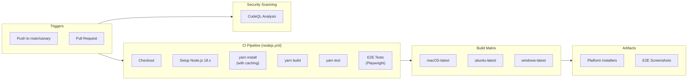

#### GitHub Actions Workflows

| Workflow | Purpose |
|----------|---------|
| `nodejs.yml` | Multi-platform CI build and test |
| `codeql-analysis.yml` | Security vulnerability scanning |
| `e2e_comment.yml` | Post E2E results to pull requests |

#### CI Pipeline Features

| Feature | Implementation |
|---------|----------------|
| **Node.js Version** | 18.x |
| **Caching** | Yarn cache for faster installs |
| **Matrix Strategy** | `[macos-latest, ubuntu-latest, windows-latest]` |
| **Native Modules** | Automatic node-pty rebuilding per platform |
| **Artifacts** | Installer uploads for each platform |
| **E2E Reporting** | Screenshot capture with Imgur upload |

### 3.6.8 Packaging and Distribution

#### electron-builder Configuration

| Platform | Formats | Architectures |
|----------|---------|---------------|
| **macOS** | DMG, ZIP | x64, arm64 (Apple Silicon) |
| **Windows** | NSIS installer | x64, arm64 |
| **Linux** | deb, rpm, AppImage, snap, pacman | x64 (arm64 via separate job) |

#### Code Signing

| Platform | Mechanism |
|----------|-----------|
| **macOS** | Notarization via `bin/notarize.js`, entitlements in `build/mac/entitlements.plist` |
| **Windows** | RFC3161 timestamping via Comodo |
| **Linux** | No code signing (user trust model) |

### 3.6.9 V8 Snapshot Optimization

| Tool | Purpose |
|------|---------|
| `electron-mksnapshot` | Generate V8 snapshots for faster startup |
| `electron-link` | Module linking for snapshot generation |

**Scripts**: `v8-snapshot`, `mk-snapshot`, `cp-snapshot` in `package.json`

**Performance Impact**: V8 snapshots reduce cold start time by pre-compiling JavaScript to bytecode, avoiding runtime parsing overhead.

## 3.7 INTEGRATION REQUIREMENTS

### 3.7.1 Component Integration Matrix

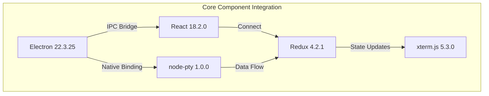

### 3.7.2 Version Compatibility Requirements

| Integration | Requirement | Constraint |
|-------------|-------------|------------|
| **Electron ↔ Node.js** | Bundled Node.js 16.17.1 | Native modules must target this ABI |
| **Electron ↔ Chromium** | Chromium 108 bundled | WebGL/Canvas rendering APIs |
| **React ↔ Redux** | react-redux 8.x | Requires React 18+ hooks API |
| **xterm.js ↔ Addons** | xterm 5.x series | Addons must match major version |
| **node-pty ↔ Electron** | Rebuild required per version | `electron-rebuild` in post-install |

### 3.7.3 Plugin Integration Requirements

| Requirement | Description |
|-------------|-------------|
| **Module Format** | CommonJS (required for Electron main process) |
| **React Version** | Must be compatible with React 18 |
| **Redux Middleware** | Must follow Redux middleware signature |
| **Decoration Pattern** | Must compose with existing components, not replace |

### 3.7.4 Security Considerations

| Consideration | Current State | Mitigation |
|---------------|---------------|------------|
| **Electron End-of-Life** | Version 22 unsupported since October 2023 | Plan upgrade to supported version |
| **Plugin Trust Model** | Full-trust execution (no sandboxing) | User education; future sandbox consideration |
| **IPC Security** | `@electron/remote` enables cross-process access | Migrate to explicit IPC messaging |
| **Native Module Access** | `node-pty` has full system access | Runs with user privileges only |

## 3.8 TECHNOLOGY STACK SUMMARY

### 3.8.1 Layer Overview

| Layer | Primary Technologies | Purpose |
|-------|---------------------|---------|
| **Application Shell** | Electron 22.3.25 | Cross-platform desktop framework |
| **Main Process** | Node.js/TypeScript, node-pty | OS integration, PTY management |
| **Renderer Process** | React 18.2.0, Redux 4.2.1 | UI components, state management |
| **Terminal Rendering** | xterm.js 5.3.0 + WebGL addon | Terminal emulation and display |
| **Build System** | Webpack 5.91.0, TypeScript 5.4.5 | Module bundling, type safety |
| **Distribution** | electron-builder 24.13.3 | Cross-platform packaging |

### 3.8.2 Technology Selection Criteria

| Criterion | Approach |
|-----------|----------|
| **Cross-Platform** | Electron enables single codebase for macOS, Windows, Linux |
| **Performance** | WebGL rendering, V8 snapshots, data batching |
| **Extensibility** | React/Redux enable deep plugin integration |
| **Developer Experience** | TypeScript provides type safety and tooling |
| **Community** | All major technologies have active ecosystems |

### 3.8.3 Technical Debt and Future Considerations

| Item | Priority | Description |
|------|----------|-------------|
| **Electron Upgrade** | Critical | Electron 22 is end-of-life; upgrade to supported version |
| **xterm.js Package Migration** | Medium | Migrate from `xterm` to scoped `@xterm/*` packages |
| **IPC Modernization** | Medium | Replace `@electron/remote` with explicit IPC |
| **Plugin Sandboxing** | Low | Investigate capability-based plugin permissions |

---

## 3.9 REFERENCES

### 3.9.1 Repository Files Examined

| File | Relevance |
|------|-----------|
| `package.json` | Root dependencies, scripts, development configuration |
| `app/package.json` | Runtime dependencies bundled with application |
| `webpack.config.ts` | Build configuration for three bundle targets |
| `babel.config.json` | Babel transpilation settings |
| `tsconfig.base.json` | TypeScript compiler configuration |
| `electron-builder.json` | Cross-platform packaging configuration |
| `lib/components/term.tsx` | Terminal component with xterm.js addon integration |
| `app/session.ts` | PTY session management with data batching |
| `app/updater.ts` | Auto-update service integration |
| `app/config/paths.ts` | Configuration file path resolution |
| `app/config/schema.json` | Configuration schema validation |
| `README.md` | Development workflow documentation |
| `PLUGINS.md` | Plugin API and development guide |

### 3.9.2 Repository Folders Examined

| Folder | Contents |
|--------|----------|
| `app/` | Main process implementation (Electron main) |
| `app/config/` | Configuration subsystem |
| `lib/` | Renderer process implementation (React UI) |
| `lib/components/` | React component hierarchy |
| `lib/store/` | Redux store configuration |
| `lib/reducers/` | Redux state reducers |
| `lib/actions/` | Redux action creators |
| `cli/` | Command-line interface tool |
| `test/` | Unit and E2E test suites |
| `typings/` | TypeScript type definitions |
| `.github/workflows/` | CI/CD pipeline definitions |

### 3.9.3 External Sources Referenced

| Source | Information Retrieved |
|--------|----------------------|
| Electron Documentation | Electron 22 end-of-life date (October 10, 2023), support policy |
| npm Registry | xterm.js 5.3.0 current status, package deprecation notices |
| xterm.js GitHub | Package migration to @xterm/* scoped packages |

# 4. Process Flowchart

This section provides comprehensive process flowcharts documenting Velocetty's core business processes, integration workflows, and technical implementation flows. Each flowchart illustrates the system's end-to-end user journeys, decision points, error handling paths, and state transitions.

## 4.1 SYSTEM WORKFLOWS

### 4.1.1 Application Startup Flow

The application startup flow represents the critical path from user launch to the first interactive terminal session. This flow involves coordination between the Electron main process, renderer process, and operating system.

#### High-Level Startup Sequence

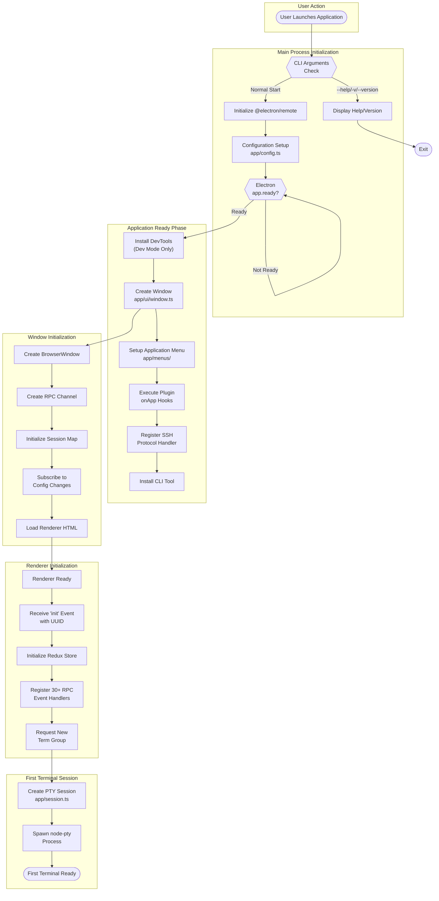

#### Startup Timing Constraints

| Phase | Target Duration | Critical Path |
|-------|----------------|---------------|
| CLI Argument Processing | < 50ms | Sequential |
| Configuration Loading | < 50ms | Sequential |
| Window Creation | < 200ms | Parallel with menu setup |
| Renderer Initialization | < 500ms | Sequential after window load |
| First PTY Spawn | < 500ms | Final step |
| **Total Cold Start** | **< 2 seconds** | End-to-end |

### 4.1.2 Session Lifecycle Flow

The session lifecycle manages PTY creation, data flow, and termination for each terminal instance.

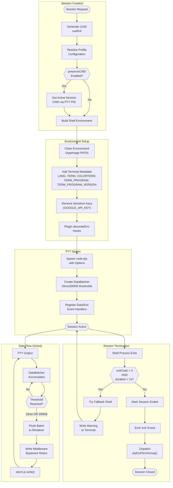

#### Data Batching Specification

| Parameter | Value | Purpose |
|-----------|-------|---------|
| `BATCH_DURATION_MS` | 16ms | Time-based flush threshold (60fps aligned) |
| `BATCH_MAX_SIZE` | 200KB | Size-based flush threshold for rapid output |
| String Decoder | UTF-8 | Character encoding handling |
| Batch Prefix | 36-char UUID | Session identification for routing |

### 4.1.3 Terminal Rendering Flow

This flowchart illustrates the decision process for selecting the appropriate rendering backend and the addon initialization sequence.

```mermaid
flowchart TB
    subgraph TermMount["Terminal Mount"]
        ComponentMount([componentDidMount])
        BuildOptions["Build Terminal Options<br/>from Props"]
        CreateXterm["Create xterm.js<br/>Terminal Instance"]
        CreateContainer["Create DOM Container"]
        RegisterKeyHandler["Register Custom<br/>Keyboard Handler"]
    end
    
    subgraph AddonSequence["Addon Loading Sequence"]
        LoadFit["Load FitAddon"]
        LoadSearch["Load SearchAddon"]
        LoadWebLinks["Load WebLinksAddon"]
        OpenTerminal["Open Terminal<br/>in Container"]
        CheckWebGL{{"WebGL<br/>Enabled?"}}
    end
    
    subgraph WebGLPath["WebGL Renderer Path"]
        CheckTransparency{{"Background<br/>Transparency?"}}
        CheckSupported{{"WebGL2<br/>Supported?"}}
        LoadWebGLAddon["Load WebglAddon"]
        RegisterContextLoss["Register onContextLoss<br/>Fallback Handler"]
    end
    
    subgraph CanvasPath["Canvas Renderer Path"]
        LoadCanvasAddon["Load CanvasAddon"]
    end
    
    subgraph OptionalAddons["Optional Addons"]
        CheckLigatures{{"Ligatures<br/>Enabled?"}}
        CheckNotWebGL{{"NOT WebGL?"}}
        LoadLigatures["Load LigaturesAddon"]
        LoadUnicode["Load Unicode11Addon"]
        CheckImage{{"imageSupport<br/>Enabled?"}}
        LoadImage["Load ImageAddon"]
    end
    
    subgraph Finalize["Finalization"]
        ApplyPadding["Apply Terminal Padding"]
        FitToContainer["Fit Terminal to Container"]
        RegisterEvents["Register Event Listeners<br/>title, focus, data, resize,<br/>cursor, search results"]
        RegisterTermsRegistry["Register in terms Registry<br/>terms[uid] = this"]
        TerminalReady([Terminal Ready])
    end
    
    ComponentMount --> BuildOptions
    BuildOptions --> CreateXterm
    CreateXterm --> CreateContainer
    CreateContainer --> RegisterKeyHandler
    RegisterKeyHandler --> LoadFit
    LoadFit --> LoadSearch
    LoadSearch --> LoadWebLinks
    LoadWebLinks --> OpenTerminal
    OpenTerminal --> CheckWebGL
    
    CheckWebGL -->|"Enabled"| CheckTransparency
    CheckTransparency -->|"Yes"| LoadCanvasAddon
    CheckTransparency -->|"No"| CheckSupported
    CheckSupported -->|"No"| LoadCanvasAddon
    CheckSupported -->|"Yes"| LoadWebGLAddon
    LoadWebGLAddon --> RegisterContextLoss
    RegisterContextLoss --> CheckLigatures
    
    CheckWebGL -->|"Disabled"| LoadCanvasAddon
    LoadCanvasAddon --> CheckLigatures
    
    CheckLigatures -->|"Yes"| CheckNotWebGL
    CheckNotWebGL -->|"Yes"| LoadLigatures
    CheckNotWebGL -->|"No"| LoadUnicode
    LoadLigatures --> LoadUnicode
    CheckLigatures -->|"No"| LoadUnicode
    LoadUnicode --> CheckImage
    CheckImage -->|"Yes"| LoadImage
    CheckImage -->|"No"| ApplyPadding
    LoadImage --> ApplyPadding
    ApplyPadding --> FitToContainer
    FitToContainer --> RegisterEvents
    RegisterEvents --> RegisterTermsRegistry
    RegisterTermsRegistry --> TerminalReady
```

#### WebGL Context Management

| Constraint | Value | Mitigation |
|------------|-------|------------|
| Max WebGL Contexts | 16 simultaneous | Prioritize visible panes |
| Transparency Support | Not supported | Fallback to CanvasAddon |
| Context Loss | GPU resource exhaustion | Automatic CanvasAddon fallback |

## 4.2 INTEGRATION WORKFLOWS

### 4.2.1 IPC/RPC Communication Flow

The IPC bridge facilitates all communication between the Electron main process and renderer processes using a typed RPC abstraction.

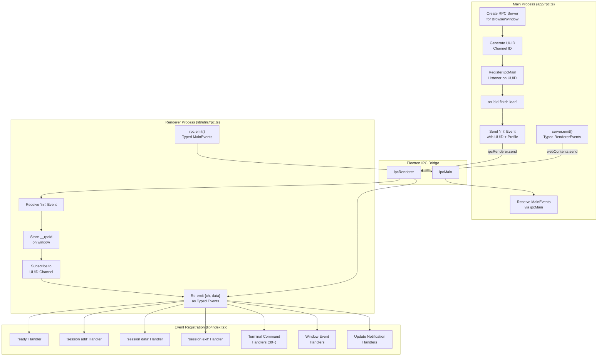

#### Key RPC Events

| Event Category | Direction | Examples |
|----------------|-----------|----------|
| Session Events | Main → Renderer | `session add`, `session data`, `session exit` |
| Terminal Commands | Main → Renderer | `split horizontal`, `split vertical`, `search`, `navigate` |
| Window Events | Main → Renderer | `fullscreen`, `geometry change`, `move` |
| Update Events | Main → Renderer | `update available` |
| User Actions | Renderer → Main | `new`, `close`, `resize`, `data` |

### 4.2.2 Configuration Hot-Reload Flow

The configuration system monitors file changes and propagates updates to all system components without requiring application restart.

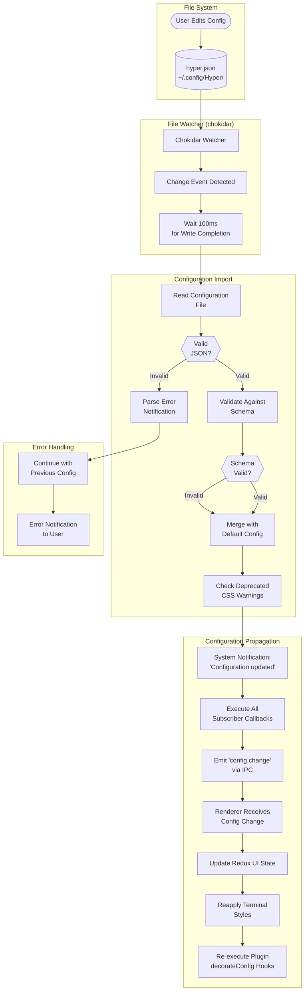

#### Configuration Processing Rules

| Rule | Behavior |
|------|----------|
| Missing Fields | Merged with defaults from `config-default.json` |
| Invalid JSON | User notified, previous config retained |
| Schema Violations | Normalized with defaults, user warned |
| Deprecated CSS | Warning notification shown |
| Profile Override | Deep merge profile over base config |

### 4.2.3 Plugin Loading and Decoration Flow

The plugin system loads extensions at startup and provides hooks throughout the application lifecycle.

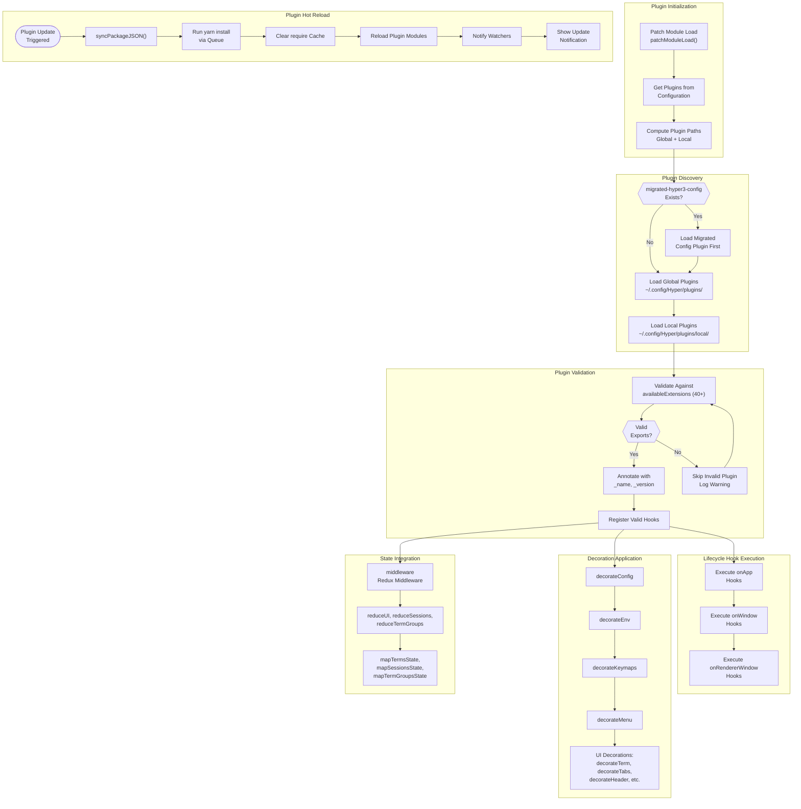

#### Available Extension Hooks (40+)

| Category | Hooks |
|----------|-------|
| **Lifecycle** | `onApp`, `onWindowClass`, `onWindow`, `onRendererWindow`, `onUnload` |
| **Configuration** | `decorateConfig`, `decorateKeymaps`, `decorateEnv`, `decorateMenu` |
| **UI Decoration** | `decorateTerm`, `decorateHeader`, `decorateTabs`, `decorateTab`, `decorateTerms`, `decorateTermGroup`, `decorateSplitPane`, `decorateNotification`, `decorateNotifications`, `decorateHyper` |
| **State Mapping** | `getTermProps`, `getTabProps`, `getTabsProps`, `getTermGroupProps` |
| **Redux Integration** | `middleware`, `reduceUI`, `reduceSessions`, `reduceTermGroups` |
| **Session** | `decorateSessionClass`, `decorateSessionOptions`, `decorateBrowserOptions`, `decorateWindowClass` |

## 4.3 CORE FEATURE FLOWS

### 4.3.1 Tab and Pane Split Flow

The term group system manages the hierarchical structure of tabs and split panes, maintaining a tree representation in Redux state.

```mermaid
flowchart TB
    subgraph UserTrigger["User Trigger"]
        SplitRequest([Split Request<br/>Horizontal/Vertical])
        KeyboardShortcut["Keyboard Shortcut<br/>Cmd+D / Cmd+Shift+D"]
        MenuAction["Menu Action<br/>Shell > Split"]
    end
    
    subgraph ActionDispatch["Action Dispatch"]
        DispatchSplit["Dispatch requestTermGroup<br/>with splitDirection"]
        MainReceive["Main Process<br/>Receives Request"]
        CreateSession["Create New Session"]
        EmitSessionAdd["Emit 'session add'<br/>with splitDirection"]
    end
    
    subgraph ReducerLogic["Term Group Reducer Logic"]
        ReceiveAction["Receive SESSION_ADD<br/>Action"]
        FindActiveGroup["Find Active Group<br/>from Session"]
        DetermineParent["Determine Parent<br/>Based on Direction"]
        CreateNewGroup["Create New TermGroup<br/>for Session"]
        CheckParentSession{{"Parent Has<br/>Session?"}}
    end
    
    subgraph TreeRestructure["Tree Restructure - Parent Has Session"]
        CreateChild1["Create Child Group 1<br/>for Original Session"]
        CreateChild2["Create Child Group 2<br/>for New Session"]
        ConvertParent["Convert Parent to<br/>Split Container"]
        SetDirection["Set splitDirection<br/>on Parent"]
    end
    
    subgraph TreeAppend["Tree Append - Parent is Container"]
        AddToChildren["Add to Parent's<br/>Children Array"]
        RebalanceSizes["Rebalance Sizes<br/>insertRebalance()"]
    end
    
    subgraph Finalize["Finalize Split"]
        SetActiveGroup["Set Active Group<br/>to New Session"]
        UpdateActiveRoot["Update activeRootGroup"]
        UpdateActiveSessions["Update activeSessions<br/>Map"]
        RenderUpdate["React Re-renders<br/>Split Panes"]
        SplitComplete([Split Complete])
    end
    
    SplitRequest --> KeyboardShortcut
    SplitRequest --> MenuAction
    KeyboardShortcut --> DispatchSplit
    MenuAction --> DispatchSplit
    DispatchSplit --> MainReceive
    MainReceive --> CreateSession
    CreateSession --> EmitSessionAdd
    EmitSessionAdd --> ReceiveAction
    ReceiveAction --> FindActiveGroup
    FindActiveGroup --> DetermineParent
    DetermineParent --> CreateNewGroup
    CreateNewGroup --> CheckParentSession
    
    CheckParentSession -->|"Yes"| CreateChild1
    CreateChild1 --> CreateChild2
    CreateChild2 --> ConvertParent
    ConvertParent --> SetDirection
    SetDirection --> SetActiveGroup
    
    CheckParentSession -->|"No"| AddToChildren
    AddToChildren --> RebalanceSizes
    RebalanceSizes --> SetActiveGroup
    
    SetActiveGroup --> UpdateActiveRoot
    UpdateActiveRoot --> UpdateActiveSessions
    UpdateActiveSessions --> RenderUpdate
    RenderUpdate --> SplitComplete
```

#### Pane Size Management

| Operation | Algorithm | Constraint |
|-----------|-----------|------------|
| `insertRebalance` | Proportionally reduce existing sizes | New pane gets fair share |
| `removalRebalance` | Distribute removed size to siblings | Sizes normalize to 100% |
| Minimum Size | 5% (`MIN_SIZE = 0.05`) | Prevents invisible panes |
| Default Split | 50/50 division | Equal distribution |

### 4.3.2 In-Terminal Search Flow

The search feature integrates xterm-addon-search with a React overlay component for text search within the terminal scrollback buffer.

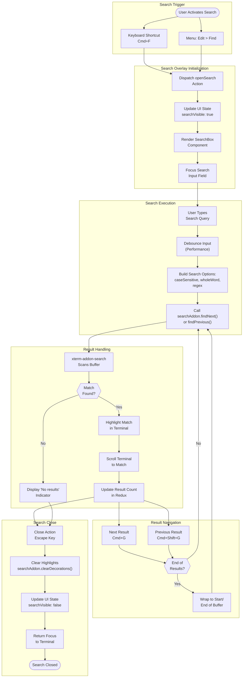

#### Search Options

| Option | Description | Default |
|--------|-------------|---------|
| Case Sensitive | Match exact case | false |
| Whole Word | Match complete words only | false |
| Regex | Use regular expression patterns | false |
| Incremental | Search as user types | true |

### 4.3.3 Auto-Update Flow

The auto-update system periodically checks for new versions and facilitates user-initiated update installation.

```mermaid
flowchart TB
    subgraph UpdateInit["Update Initialization"]
        AppReady([App Ready])
        RegisterErrorHandler["Register Error Handler<br/>on autoUpdater"]
        GetConfig["Get Decorated Config"]
        DetermineChannel["Determine Update Channel<br/>stable/canary"]
        BuildFeedURL["Build Feed URL with<br/>Platform + Architecture"]
        SetFeedURL["Set Feed URL<br/>on autoUpdater"]
    end
    
    subgraph Scheduling["Update Check Scheduling"]
        ScheduleFirst["Schedule First Check<br/>at 10 seconds"]
        ScheduleRecurring["Schedule Recurring<br/>Every 30 minutes"]
        CheckTime([Check Time Reached])
    end
    
    subgraph UpdateCheck["Update Check Process"]
        CallCheckForUpdates["autoUpdater.<br/>checkForUpdates()"]
        NetworkRequest["Network Request<br/>to Feed Server"]
        NetworkError{{"Network<br/>Error?"}}
        HandleNetworkError["Log Error<br/>Retry Next Interval"]
        ParseManifest["Parse Update<br/>Manifest"]
        CompareVersions{{"New Version<br/>Available?"}}
        NoUpdate["No Update<br/>Available"]
    end
    
    subgraph PlatformHandler["Platform-Specific Handling"]
        IsLinux{{"Linux<br/>Platform?"}}
        LinuxHandler["Custom Linux Handler<br/>app/auto-updater-linux.ts"]
        EmitUpdateAvailable["Emit 'update-available'<br/>with JSON Metadata"]
        MacWinHandler["macOS/Windows<br/>Native Handler"]
        DownloadUpdate["Download Update<br/>in Background"]
        EmitDownloaded["Emit 'update-downloaded'"]
    end
    
    subgraph UserNotification["User Notification"]
        EmitToRenderer["Emit 'update available'<br/>to Renderer via RPC"]
        ShowNotification["Show Notification<br/>with releaseName,<br/>releaseNotes, releaseUrl"]
        UserDecision{{"User<br/>Clicks?"}}
        DismissUpdate["Dismiss<br/>Notification"]
        ClickRestart["Click 'Restart'<br/>Button"]
    end
    
    subgraph Installation["Update Installation"]
        EmitQuitInstall["RPC 'quit and install'"]
        QuitAndInstall["autoUpdater.<br/>quitAndInstall()"]
        AppRestarts([App Restarts<br/>with Update])
    end
    
    AppReady --> RegisterErrorHandler
    RegisterErrorHandler --> GetConfig
    GetConfig --> DetermineChannel
    DetermineChannel --> BuildFeedURL
    BuildFeedURL --> SetFeedURL
    SetFeedURL --> ScheduleFirst
    ScheduleFirst --> ScheduleRecurring
    ScheduleRecurring --> CheckTime
    ScheduleFirst --> CheckTime
    CheckTime --> CallCheckForUpdates
    CallCheckForUpdates --> NetworkRequest
    NetworkRequest --> NetworkError
    NetworkError -->|"Yes"| HandleNetworkError
    HandleNetworkError --> ScheduleRecurring
    NetworkError -->|"No"| ParseManifest
    ParseManifest --> CompareVersions
    CompareVersions -->|"No"| NoUpdate
    NoUpdate --> ScheduleRecurring
    CompareVersions -->|"Yes"| IsLinux
    IsLinux -->|"Yes"| LinuxHandler
    LinuxHandler --> EmitUpdateAvailable
    EmitUpdateAvailable --> EmitToRenderer
    IsLinux -->|"No"| MacWinHandler
    MacWinHandler --> DownloadUpdate
    DownloadUpdate --> EmitDownloaded
    EmitDownloaded --> EmitToRenderer
    EmitToRenderer --> ShowNotification
    ShowNotification --> UserDecision
    UserDecision -->|"Dismiss"| DismissUpdate
    DismissUpdate --> ScheduleRecurring
    UserDecision -->|"Restart"| ClickRestart
    ClickRestart --> EmitQuitInstall
    EmitQuitInstall --> QuitAndInstall
    QuitAndInstall --> AppRestarts
```

#### Update Schedule Parameters

| Parameter | Value | Purpose |
|-----------|-------|---------|
| Initial Delay | 10 seconds | Allow app to fully initialize |
| Check Interval | 30 minutes | Balance freshness vs. network overhead |
| Timeout | 5 seconds | Prevent hanging on slow networks |
| Channels | stable, canary | Release track selection |

## 4.4 STATE MANAGEMENT FLOWS

### 4.4.1 Redux State Flow

The Redux store manages application state with a specialized middleware pipeline optimized for terminal data throughput.

```mermaid
flowchart TB
    subgraph ActionOrigin["Action Origins"]
        UserInput["User Input<br/>(UI Events)"]
        RPCEvent["RPC Event<br/>(Main Process)"]
        PluginAction["Plugin<br/>Middleware"]
    end
    
    subgraph StoreDispatch["Store.dispatch()"]
        ActionReceived["Action Received"]
    end
    
    subgraph MiddlewarePipeline["Middleware Pipeline (Ordered)"]
        Thunk1["1. thunk<br/>(First Pass)"]
        PluginMiddleware["2. plugins.middleware<br/>(Plugin-Provided)"]
        Thunk2["3. thunk<br/>(Second Pass)"]
        WriteMiddleware["4. writeMiddleware<br/>(Terminal Data)"]
        Effects["5. effects<br/>(Action Callbacks)"]
    end
    
    subgraph WriteBypass["Write Middleware Bypass"]
        CheckAction{{"Action Type =<br/>SESSION_PTY_DATA?"}}
        LookupTerm["Lookup term by<br/>action.uid in registry"]
        TermFound{{"Term<br/>Found?"}}
        DirectWrite["term.term.write()<br/>Direct xterm write"]
        ForwardAction["Forward to<br/>next(action)"]
    end
    
    subgraph Reducers["Reducer Slices"]
        UIReducer["ui Reducer<br/>Config, Window, Notifications"]
        SessionsReducer["sessions Reducer<br/>Session Records, Search"]
        TermGroupsReducer["termGroups Reducer<br/>Tree, Active States"]
        PluginReducers["Plugin Reducers<br/>reduceUI, reduceSessions,<br/>reduceTermGroups"]
    end
    
    subgraph StateUpdate["State Update"]
        CombineState["Combine Reducer<br/>Outputs"]
        NewState["New State Object"]
        NotifySubscribers["Notify Redux<br/>Subscribers"]
    end
    
    subgraph ReactUpdate["React Update Cycle"]
        UseSelector["useSelector<br/>Detects Changes"]
        ComponentRerender["Component<br/>Re-render"]
        UIUpdated([UI Updated])
    end
    
    UserInput --> ActionReceived
    RPCEvent --> ActionReceived
    PluginAction --> ActionReceived
    ActionReceived --> Thunk1
    Thunk1 --> PluginMiddleware
    PluginMiddleware --> Thunk2
    Thunk2 --> WriteMiddleware
    WriteMiddleware --> CheckAction
    CheckAction -->|"Yes"| LookupTerm
    LookupTerm --> TermFound
    TermFound -->|"Yes"| DirectWrite
    DirectWrite --> ForwardAction
    TermFound -->|"No"| ForwardAction
    CheckAction -->|"No"| ForwardAction
    ForwardAction --> Effects
    Effects --> UIReducer
    Effects --> SessionsReducer
    Effects --> TermGroupsReducer
    Effects --> PluginReducers
    UIReducer --> CombineState
    SessionsReducer --> CombineState
    TermGroupsReducer --> CombineState
    PluginReducers --> CombineState
    CombineState --> NewState
    NewState --> NotifySubscribers
    NotifySubscribers --> UseSelector
    UseSelector --> ComponentRerender
    ComponentRerender --> UIUpdated
```

#### State Slices

| Slice | Location | Responsibility |
|-------|----------|----------------|
| `ui` | `lib/reducers/ui.ts` | Configuration, window state, notifications, activity markers |
| `sessions` | `lib/reducers/sessions.ts` | Session records, activeUid, search state |
| `termGroups` | `lib/reducers/term-groups.ts` | Term group tree, activeSessions map, activeRootGroup |

#### Write Middleware Performance Optimization

The write middleware is critical for maintaining terminal responsiveness during high-volume output scenarios (e.g., `find ~`, `cat largefile.log`):

```mermaid
flowchart LR
    subgraph StandardPath["Standard Redux Path"]
        Action1["Action"] --> Reducer1["Reducer"]
        Reducer1 --> State1["State Update"]
        State1 --> React1["React Render"]
        React1 --> DOM1["DOM Update"]
    end
    
    subgraph OptimizedPath["Write Middleware Bypass"]
        Action2["SESSION_PTY_DATA"] --> Registry["Term Registry<br/>Lookup"]
        Registry --> DirectXterm["Direct xterm.write()"]
        DirectXterm --> CanvasUpdate["Canvas Update"]
    end
    
    Action2 -.->|"Still forwarded"| Reducer1
```

### 4.4.2 Term Group State Transitions

The term group reducer manages complex state transitions for tab and pane operations.

```mermaid
stateDiagram-v2
    [*] --> Empty: Application Start
    
    Empty --> SingleSession: SESSION_ADD<br/>(First Session)
    
    SingleSession --> SplitContainer: SESSION_ADD<br/>(with splitDirection)
    SingleSession --> Empty: SESSION_EXIT<br/>(Last Session)
    
    SplitContainer --> SplitContainer: SESSION_ADD<br/>(Add to existing split)
    SplitContainer --> SingleSession: SESSION_EXIT<br/>(One child remains)
    SplitContainer --> Empty: SESSION_EXIT<br/>(All sessions closed)
    
    state SplitContainer {
        [*] --> Horizontal
        [*] --> Vertical
        
        Horizontal --> Nested: Nested Split
        Vertical --> Nested: Nested Split
        Nested --> Horizontal: Child Split Direction
        Nested --> Vertical: Child Split Direction
    }
    
    state SingleSession {
        Active: Active Session
        Inactive: Inactive Session
        
        Active --> Inactive: Focus Changed
        Inactive --> Active: Focus Received
    }
```

#### Term Group Actions

| Action | State Transition |
|--------|------------------|
| `SESSION_ADD` | Create or split term group |
| `SESSION_ACTIVE_CHANGED` | Update active session tracking |
| `SESSION_PTY_EXIT` | Mark session for exit behavior handling |
| `TERM_GROUP_EXIT` | Remove term group, rebalance siblings |
| `TERM_GROUP_RESIZE` | Update size ratios in parent |

## 4.5 ERROR HANDLING FLOWS

### 4.5.1 PTY Session Error Recovery

```mermaid
flowchart TB
    subgraph ShellExitDetection["Shell Exit Detection"]
        ShellExits([Shell Process Exits])
        CaptureExitCode["Capture Exit Code<br/>and Duration"]
        EvaluateExit{{"exitCode > 0<br/>AND<br/>duration < 1s?"}}
    end
    
    subgraph QuickFailure["Quick Failure Handling"]
        CheckFallbackShell{{"Fallback Shell<br/>Configured?"}}
        TryFallbackShell["Try Fallback Shell<br/>Configuration"]
        SpawnFallback["Spawn New PTY<br/>with Fallback"]
        WriteWarning["Write Warning Message<br/>to Terminal Buffer"]
        FallbackSuccess{{"Fallback<br/>Succeeded?"}}
    end
    
    subgraph NoRecovery["No Recovery Path"]
        DisplayError["Display Error Message<br/>in Terminal"]
        MarkSessionFailed["Mark Session<br/>as Failed"]
        NotifyUser["Optional: Notify User<br/>via Notification"]
    end
    
    subgraph NormalExit["Normal Exit Handling"]
        MarkEnded["Mark Session<br/>as Ended"]
        EmitExitEvent["Emit 'session exit'<br/>Event"]
        TermGroupExit["Dispatch<br/>ptyExitTermGroup()"]
        CheckExitBehavior{{"Exit<br/>Behavior?"}}
        ClosePane["Close Pane<br/>Automatically"]
        KeepOpen["Keep Pane Open<br/>with Cursor"]
    end
    
    subgraph SessionClosed["Session Cleanup"]
        RemoveFromMap["Remove from<br/>Sessions Map"]
        CleanupPTY["Cleanup PTY<br/>Resources"]
        SessionComplete([Session Complete])
    end
    
    ShellExits --> CaptureExitCode
    CaptureExitCode --> EvaluateExit
    EvaluateExit -->|"Yes (Quick Failure)"| CheckFallbackShell
    CheckFallbackShell -->|"Yes"| TryFallbackShell
    TryFallbackShell --> SpawnFallback
    SpawnFallback --> WriteWarning
    WriteWarning --> FallbackSuccess
    FallbackSuccess -->|"Yes"| ShellExits
    FallbackSuccess -->|"No"| DisplayError
    CheckFallbackShell -->|"No"| DisplayError
    DisplayError --> MarkSessionFailed
    MarkSessionFailed --> NotifyUser
    NotifyUser --> RemoveFromMap
    
    EvaluateExit -->|"No (Normal)"| MarkEnded
    MarkEnded --> EmitExitEvent
    EmitExitEvent --> TermGroupExit
    TermGroupExit --> CheckExitBehavior
    CheckExitBehavior -->|"Auto-close"| ClosePane
    CheckExitBehavior -->|"Keep Open"| KeepOpen
    ClosePane --> RemoveFromMap
    KeepOpen --> RemoveFromMap
    RemoveFromMap --> CleanupPTY
    CleanupPTY --> SessionComplete
```

### 4.5.2 WebGL Context Loss Recovery

```mermaid
flowchart TB
    subgraph ContextLossDetection["Context Loss Detection"]
        WebGLActive([WebGL Addon Active])
        GPUEvent["GPU Resource<br/>Exhaustion Event"]
        ContextLost["WebGL Context Lost<br/>Event Fired"]
    end
    
    subgraph RecoveryProcess["Recovery Process"]
        LogWarning["Log Warning:<br/>'WebGL context lost'"]
        DisposeWebGL["Dispose WebGL Addon<br/>webglAddon.dispose()"]
        LoadCanvas["Load CanvasAddon<br/>as Fallback"]
        AttachCanvas["Attach Canvas Renderer<br/>to Terminal"]
        VerifyRendering{{"Rendering<br/>Functional?"}}
    end
    
    subgraph SuccessPath["Recovery Success"]
        ContinueOperation["Continue Terminal<br/>Operation"]
        ReducedPerformance["Note: Reduced<br/>Performance Mode"]
        TerminalReady([Terminal Ready<br/>with Canvas])
    end
    
    subgraph FailurePath["Recovery Failure"]
        CriticalError["Critical Rendering<br/>Error"]
        NotifyUser["Notify User of<br/>Rendering Issue"]
        SuggestRestart["Suggest Application<br/>Restart"]
    end
    
    WebGLActive --> GPUEvent
    GPUEvent --> ContextLost
    ContextLost --> LogWarning
    LogWarning --> DisposeWebGL
    DisposeWebGL --> LoadCanvas
    LoadCanvas --> AttachCanvas
    AttachCanvas --> VerifyRendering
    VerifyRendering -->|"Yes"| ContinueOperation
    ContinueOperation --> ReducedPerformance
    ReducedPerformance --> TerminalReady
    VerifyRendering -->|"No"| CriticalError
    CriticalError --> NotifyUser
    NotifyUser --> SuggestRestart
```

### 4.5.3 Plugin Error Isolation

```mermaid
flowchart TB
    subgraph PluginExecution["Plugin Hook Execution"]
        HookCall([Hook Invocation])
        WrapExecution["Wrap in Try-Catch"]
        ExecuteHook["Execute Plugin<br/>Hook Function"]
        CheckError{{"Error<br/>Thrown?"}}
    end
    
    subgraph ErrorHandling["Error Handling"]
        CatchError["Catch Error"]
        LogError["Log Error with<br/>Plugin Name"]
        IdentifyHook["Identify Failed<br/>Hook Type"]
    end
    
    subgraph RecoveryStrategy["Recovery Strategy"]
        IsDecoration{{"Decoration<br/>Hook?"}}
        ReturnOriginal["Return Original<br/>Component/Config"]
        IsMiddleware{{"Middleware<br/>Hook?"}}
        SkipMiddleware["Skip Middleware<br/>Forward Action"]
        IsLifecycle{{"Lifecycle<br/>Hook?"}}
        ContinueStartup["Continue Startup<br/>Without Plugin"]
        NotifyUser["Notify User:<br/>'Plugin Error'"]
    end
    
    subgraph ContinueOperation["Continue Operation"]
        OtherPlugins["Continue with<br/>Other Plugins"]
        AppFunctional([App Remains<br/>Functional])
    end
    
    HookCall --> WrapExecution
    WrapExecution --> ExecuteHook
    ExecuteHook --> CheckError
    CheckError -->|"No"| OtherPlugins
    CheckError -->|"Yes"| CatchError
    CatchError --> LogError
    LogError --> IdentifyHook
    IdentifyHook --> IsDecoration
    IsDecoration -->|"Yes"| ReturnOriginal
    ReturnOriginal --> NotifyUser
    IsDecoration -->|"No"| IsMiddleware
    IsMiddleware -->|"Yes"| SkipMiddleware
    SkipMiddleware --> NotifyUser
    IsMiddleware -->|"No"| IsLifecycle
    IsLifecycle -->|"Yes"| ContinueStartup
    ContinueStartup --> NotifyUser
    NotifyUser --> OtherPlugins
    OtherPlugins --> AppFunctional
```

## 4.6 CLI WORKFLOW

### 4.6.1 CLI Command Processing Flow

```mermaid
flowchart TB
    subgraph Entry["CLI Entry Point"]
        CLIInvoke([hyper command])
        ParseArgs["Parse Arguments<br/>using 'args' library"]
        IdentifyCommand{{"Subcommand<br/>Specified?"}}
    end
    
    subgraph Subcommands["Subcommand Routing"]
        InstallCmd["install <plugin>"]
        UninstallCmd["uninstall <plugin>"]
        ListCmd["list"]
        SearchCmd["search <query>"]
        ListRemoteCmd["list-remote"]
        DocsCmd["docs <plugin>"]
        VersionCmd["version"]
    end
    
    subgraph InstallFlow["Plugin Installation Flow"]
        NormalizeName["Normalize Package Name<br/>(scopes, versions)"]
        QueryNPM["Query npm Registry<br/>for Validation"]
        PackageExists{{"Package<br/>Exists?"}}
        UpdateConfig["Update plugins Array<br/>in hyper.json"]
        WriteConfig["Write Updated<br/>Config File"]
        InstallSuccess["Installation<br/>Complete"]
        PackageNotFound["Error: Package<br/>Not Found"]
    end
    
    subgraph LaunchFlow["Application Launch Flow"]
        SetEnvVars["Set Environment:<br/>HYPER_CLI=1<br/>ELECTRON_NO_ATTACH_CONSOLE=1"]
        RemoveRunAsNode["Remove<br/>ELECTRON_RUN_AS_NODE"]
        ResolvePaths["Resolve Positional Args<br/>to Absolute Paths"]
        CheckPlatform{{"macOS<br/>Non-Verbose?"}}
        SpawnOpen["spawn via<br/>'open -b co.zeit.hyper'"]
        SpawnElectron["spawn Electron<br/>Process Directly"]
        AppLaunched([App Launched])
    end
    
    CLIInvoke --> ParseArgs
    ParseArgs --> IdentifyCommand
    IdentifyCommand -->|"install"| InstallCmd
    IdentifyCommand -->|"uninstall"| UninstallCmd
    IdentifyCommand -->|"list"| ListCmd
    IdentifyCommand -->|"search"| SearchCmd
    IdentifyCommand -->|"list-remote"| ListRemoteCmd
    IdentifyCommand -->|"docs"| DocsCmd
    IdentifyCommand -->|"version"| VersionCmd
    IdentifyCommand -->|"None (Default)"| SetEnvVars
    
    InstallCmd --> NormalizeName
    NormalizeName --> QueryNPM
    QueryNPM --> PackageExists
    PackageExists -->|"Yes"| UpdateConfig
    UpdateConfig --> WriteConfig
    WriteConfig --> InstallSuccess
    PackageExists -->|"No"| PackageNotFound
    
    SetEnvVars --> RemoveRunAsNode
    RemoveRunAsNode --> ResolvePaths
    ResolvePaths --> CheckPlatform
    CheckPlatform -->|"Yes"| SpawnOpen
    CheckPlatform -->|"No"| SpawnElectron
    SpawnOpen --> AppLaunched
    SpawnElectron --> AppLaunched
```

#### CLI Commands Summary

| Command | Purpose | Implementation |
|---------|---------|----------------|
| `hyper install <plugin>` | Install plugin from npm | `cli/api.ts` - Updates config, triggers yarn install |
| `hyper uninstall <plugin>` | Remove installed plugin | `cli/api.ts` - Removes from config |
| `hyper list` | List installed plugins | Reads from config file |
| `hyper search <query>` | Search npm for plugins | Queries npm registry |
| `hyper docs <plugin>` | Open plugin documentation | Opens npm package page |
| `hyper` (no args) | Launch Velocetty application | Spawns Electron process |

## 4.7 SEQUENCE DIAGRAMS

### 4.7.1 Terminal Data Flow Sequence

```mermaid
sequenceDiagram
    participant User
    participant Shell as Shell Process
    participant PTY as node-pty
    participant Batcher as DataBatcher
    participant Main as Main Process
    participant IPC as IPC Bridge
    participant Renderer as Renderer Process
    participant Middleware as Write Middleware
    participant Xterm as xterm.js
    participant Canvas as WebGL/Canvas

    User->>Shell: Type Command
    Shell->>PTY: Process Output
    PTY->>Batcher: Raw Data
    
    loop Batching (16ms/200KB)
        Batcher->>Batcher: Accumulate Data
    end
    
    Batcher->>Main: Flush with UID Prefix
    Main->>IPC: session data Event
    IPC->>Renderer: Receive via ipcRenderer
    Renderer->>Middleware: SESSION_PTY_DATA Action
    
    Note over Middleware: Bypass Redux for Performance
    
    Middleware->>Xterm: Direct write(data)
    Xterm->>Canvas: Render to Canvas
    Canvas->>User: Display Output
    
    Note over Middleware: Action still forwarded to reducers
    Middleware->>Renderer: Forward to Reducers
```

### 4.7.2 Window Creation Sequence

```mermaid
sequenceDiagram
    participant User
    participant Main as Main Process
    participant Plugins as Plugin System
    participant BW as BrowserWindow
    participant RPC as RPC Server
    participant Renderer as Renderer Process
    participant Redux as Redux Store
    participant Term as Terminal Component

    User->>Main: New Window Request
    Main->>Plugins: decorateBrowserOptions()
    Plugins-->>Main: Decorated Options
    Main->>BW: Create BrowserWindow
    BW-->>Main: Window Instance
    Main->>RPC: Create RPC Channel (UUID)
    Main->>BW: Enable @electron/remote
    Main->>BW: Load index.html
    
    BW->>Renderer: did-finish-load
    Renderer->>RPC: Subscribe to UUID Channel
    Main->>Renderer: Send 'init' Event
    
    Renderer->>Redux: Initialize Store
    Renderer->>Renderer: Register RPC Handlers (30+)
    Renderer->>Main: Request New Term Group
    Main->>Main: Create PTY Session
    Main->>Renderer: session add Event
    Renderer->>Redux: Dispatch SESSION_ADD
    Redux->>Term: State Update
    Term->>Term: Mount xterm.js
    Term-->>User: Terminal Ready
```

### 4.7.3 Plugin Decoration Sequence

```mermaid
sequenceDiagram
    participant Core as Core Component
    participant Loader as Plugin Loader
    participant P1 as Plugin 1
    participant P2 as Plugin 2
    participant P3 as Plugin 3
    participant Final as Decorated Component

    Core->>Loader: Original Component
    
    Loader->>P1: decorateTerm(Component)
    P1-->>Loader: Decorated Component 1
    
    Loader->>P2: decorateTerm(Decorated 1)
    P2-->>Loader: Decorated Component 2
    
    Loader->>P3: decorateTerm(Decorated 2)
    P3-->>Loader: Decorated Component 3
    
    Loader->>Final: Final Decorated Component
    
    Note over Core,Final: Each decorator receives previous result
    Note over Core,Final: Original props always passed through
    Note over Core,Final: Composition preserves base behavior
```

## 4.8 VALIDATION RULES AND CHECKPOINTS

### 4.8.1 Business Rules by Process Step

| Process | Step | Business Rule |
|---------|------|---------------|
| **Session Creation** | Shell Selection | Use default shell from OS if not configured |
| **Session Creation** | CWD | Inherit from parent session if `preserveCWD` enabled |
| **Session Creation** | Environment | Sanitize sensitive variables before passing to shell |
| **Data Batching** | Threshold | Flush at 16ms OR 200KB, whichever first |
| **Data Batching** | Encoding | UTF-8 via StringDecoder |
| **Pane Split** | Minimum Size | 5% minimum pane dimension |
| **Pane Split** | Default Ratio | 50/50 division on new split |
| **Configuration** | Validation | JSON syntax + schema validation required |
| **Configuration** | Defaults | Missing fields merged from default config |
| **Plugin Loading** | Order | Local plugins take precedence over global |
| **Plugin Loading** | Validation | Must export valid extension hooks |
| **WebGL Allocation** | Limit | Maximum 16 simultaneous WebGL contexts |
| **Update Checks** | Schedule | 10s initial, then every 30 minutes |

### 4.8.2 Authorization Checkpoints

| Checkpoint | Verification | Implementation |
|------------|--------------|----------------|
| PTY Spawn | User process privileges | OS-level via node-pty |
| File System Access | User read/write permissions | Node.js fs module |
| Plugin Installation | npm registry validation | CLI api.ts validation |
| Configuration Write | User home directory access | XDG path resolution |
| Auto-Update | Signature verification | Electron autoUpdater |

### 4.8.3 Data Validation Requirements

| Data | Validation Rule | Error Handling |
|------|-----------------|----------------|
| Config JSON | Valid JSON syntax | Retain previous config, notify user |
| Config Schema | Match schema.json | Merge with defaults |
| Plugin Name | Valid npm package identifier | Reject with error message |
| Session UID | 36-character UUID v4 | Generated internally |
| Rows/Cols | Positive integers | Clamp to valid range |
| Search Regex | Valid regular expression | Display regex error |

## 4.9 REFERENCES

#### Files Examined

- `app/index.ts` - Main process entry point, application initialization
- `app/session.ts` - PTY session management, DataBatcher implementation
- `app/rpc.ts` - Main process RPC server implementation
- `app/plugins.ts` - Plugin loading and management system
- `app/config.ts` - Configuration hub and hot-reload
- `app/config/import.ts` - Configuration import and validation
- `app/updater.ts` - Auto-update system implementation
- `app/auto-updater-linux.ts` - Linux-specific update handler
- `app/ui/window.ts` - Window creation and session lifecycle
- `lib/index.tsx` - Renderer entry and RPC event handlers
- `lib/store/configure-store.ts` - Redux store configuration
- `lib/store/write-middleware.ts` - Performance optimization middleware
- `lib/components/term.tsx` - Terminal component and addon loading
- `lib/components/searchBox.tsx` - Search overlay component
- `lib/reducers/term-groups.ts` - Term group tree management
- `lib/reducers/ui.ts` - UI state reducer
- `lib/reducers/sessions.ts` - Session state reducer
- `lib/actions/sessions.ts` - Session action creators
- `lib/utils/rpc.ts` - Renderer RPC client
- `app/plugins/extensions.ts` - Available plugin hooks definition
- `cli/index.ts` - CLI entry point
- `cli/api.ts` - CLI API operations

#### Folders Explored

- `app/` - Main process implementation
- `app/config/` - Configuration subsystem
- `app/plugins/` - Plugin infrastructure
- `app/keymaps/` - Platform keyboard shortcuts
- `app/menus/` - Application menu system
- `app/ui/` - Window management
- `lib/` - Renderer process implementation
- `lib/actions/` - Redux action creators
- `lib/components/` - React UI components
- `lib/reducers/` - Redux reducers
- `lib/store/` - Store configuration
- `lib/utils/` - Renderer utilities
- `cli/` - CLI tool implementation

#### Technical Specification Sections Referenced

- 1.2 SYSTEM OVERVIEW - Architecture diagrams and component descriptions
- 2.1 FEATURE CATALOG - Feature definitions and dependencies
- 2.2 FUNCTIONAL REQUIREMENTS TABLES - Detailed requirements
- 2.3 FEATURE RELATIONSHIPS - Integration points
- 2.4 IMPLEMENTATION CONSIDERATIONS - Technical constraints
- 3.7 INTEGRATION REQUIREMENTS - Component integration matrix
- xterm.js Core - Terminal rendering specifications

# 5. System Architecture

## 5.1 HIGH-LEVEL ARCHITECTURE

### 5.1.1 System Overview

#### Architectural Style and Rationale

Velocetty implements an **Electron Split-Brain Architecture** with **Event-Driven IPC Communication**, inheriting and refining the well-documented architectural patterns from the Hyper terminal emulator. This architecture comprises two distinct execution contexts that communicate through a bidirectional IPC bridge:

- **Main Process (Node.js Runtime)**: Handles operating system integration, PTY session management, native menu systems, auto-updates, and plugin orchestration. This process has full access to Node.js APIs and native modules, enabling direct interaction with the host operating system.

- **Renderer Process (Chromium Engine)**: Executes the React/Redux UI application, hosts xterm.js terminal rendering, and manages plugin UI extensions. Each window spawns an isolated renderer process with access to web platform APIs and WebGL acceleration.

- **IPC Bridge**: A UUID-keyed RPC channel with typed event emitters facilitates bidirectional communication between processes, with specialized optimizations for high-throughput terminal data.

**Rationale for Architecture Selection**:

| Design Goal | Architectural Response |
|-------------|----------------------|
| Cross-platform consistency | Electron provides unified API across macOS, Windows, and Linux |
| Rich UI capabilities | Chromium rendering enables CSS styling, WebGL, and React component architecture |
| Native OS integration | Main process Node.js runtime accesses PTY, file system, and system menus |
| Extensibility substrate | React/Redux composition model enables deep plugin decoration |
| Performance optimization | Process isolation enables targeted optimizations (batching, middleware bypass) |

The architecture explicitly acknowledges the IPC overhead inherent in Electron applications. As documented in Hyper's performance engineering work, terminal data must cross the process boundary via IPC, and JSON encoding/decoding overhead requires careful optimization through data batching strategies.

#### Key Architectural Principles

1. **Process Isolation**: Security and stability through separation of concerns between main and renderer processes
2. **Composition over Replacement**: Plugin decoration pattern preserves base behavior while enabling customization
3. **Performance-Critical Path Optimization**: Write middleware bypass and data batching minimize latency for terminal output
4. **Platform Abstraction**: Platform-specific implementations (menus, keymaps, paths) encapsulated behind consistent interfaces
5. **Hot-Reloadable Configuration**: File-watching enables live configuration updates without application restart

#### System Boundaries and Major Interfaces

```mermaid
flowchart TB
    subgraph ExternalSystems["External Systems"]
        OS["Operating System"]
        Shell["Shell Process"]
        NPM["npm Registry"]
        UpdateServer["Update Server"]
        FileSystem["File System"]
    end
    
    subgraph VelocettyBoundary["Velocetty Application Boundary"]
        subgraph MainProcess["Main Process"]
            AppInit["App Initialization"]
            ConfigMgr["Config Manager"]
            SessionMgr["Session Manager"]
            PluginMgr["Plugin Manager"]
            RPCServer["RPC Server"]
        end
        
        subgraph RendererProcess["Renderer Process"]
            ReactApp["React Application"]
            ReduxStore["Redux Store"]
            XtermRenderer["xterm.js Renderer"]
            RPCClient["RPC Client"]
        end
        
        RPCServer <-->|"IPC Bridge"| RPCClient
    end
    
    SessionMgr <-->|"node-pty"| Shell
    Shell <--> OS
    ConfigMgr <-->|"JSON I/O"| FileSystem
    PluginMgr <-->|"npm API"| NPM
    AppInit <-->|"HTTP Polling"| UpdateServer
```

### 5.1.2 Core Components Table

| Component Name | Primary Responsibility | Key Dependencies | Integration Points |
|----------------|----------------------|------------------|-------------------|
| Main Process Entry (`app/index.ts`) | Electron initialization, window lifecycle, event routing | `@electron/remote`, config module, plugins module | IPC bridge, OS event handlers |
| Configuration System (`app/config/`) | JSON config loading, schema validation, hot-reload | chokidar, electron-store, fs-extra | Plugin decoration, renderer bridge |
| Session Manager (`app/session.ts`) | PTY lifecycle, data batching, shell spawning | node-pty 1.0.0, DataBatcher class | RPC to renderer, plugin env hooks |
| RPC Bridge (`app/rpc.ts`, `lib/utils/rpc.ts`) | Typed bidirectional IPC communication | Electron ipcMain/ipcRenderer, uuid | All cross-process communication |
| Plugin Manager (`app/plugins.ts`, `lib/utils/plugins.ts`) | Extension loading, decoration, lifecycle hooks | electron-store, Module._load patching | Both processes, all extensible components |
| Redux Store (`lib/store/`) | Centralized renderer state management | Redux 4.2.1, redux-thunk, seamless-immutable | React containers, plugin middleware |
| Terminal Component (`lib/components/term.tsx`) | xterm.js hosting, addon management, WebGL/Canvas rendering | xterm.js 5.3.0, WebGL/Canvas addons | Redux state, session data stream |
| UI Components (`lib/components/`) | React component tree for terminal UI | React 18.2.0, styled-jsx | Redux containers, plugin decoration |
| CLI Tool (`cli/`) | Plugin management, application launching | args, got, npm registry | Config file, npm ecosystem |
| Menu System (`app/menus/`) | Application and context menus | Electron Menu API, keymaps | Command dispatcher, config system |

### 5.1.3 Data Flow Description

#### Terminal Output Flow (Main → Renderer)

The primary data flow for terminal output follows a carefully optimized path designed to minimize latency while managing IPC overhead:

1. **PTY Output Capture**: Shell process writes to PTY via `node-pty`, triggering `Session.pty.onData()` callback
2. **Data Batching**: `DataBatcher` accumulates output with UUID prefix, implementing 16ms time-based OR 200KB size-based flush thresholds
3. **IPC Transmission**: Batched data transmitted via `rpc.emit('session data', data)` to renderer process
4. **Redux Dispatch**: `lib/index.tsx` receives data and dispatches `SESSION_PTY_DATA` action
5. **Middleware Bypass**: `writeMiddleware` intercepts action, bypasses Redux reducer chain, directly invokes `term.term.write()`
6. **Terminal Rendering**: xterm.js renders output via WebGL (preferred) or Canvas fallback

This flow explicitly bypasses Redux state management for terminal data to eliminate serialization overhead, achieving the < 50ms keystroke-to-echo latency target.

#### User Input Flow (Renderer → Main)

User keyboard input follows the reverse path:

1. **Input Capture**: xterm.js captures keyboard input via `term.onData()` callback
2. **Action Dispatch**: Component dispatches `sendSessionData(uid, data)` Redux action
3. **Effect Execution**: Action's `effect` property emits RPC `'data'` event
4. **Main Process Receipt**: `rpc.on('data', ...)` handler receives input in main process
5. **PTY Write**: `Session.write()` forwards data to `pty.write()`, reaching shell process

#### Configuration Flow

Configuration changes propagate through the system via file-watching:

1. **File Modification**: User edits `hyper.json` or application writes config changes
2. **Change Detection**: chokidar file watcher detects modification
3. **Validation**: Schema validation ensures configuration integrity
4. **Main Process Update**: Config module updates internal state, notifies subscribers
5. **Renderer Broadcast**: `rpc.emit('config change')` notifies renderer process
6. **Redux Update**: Renderer dispatches `reloadConfig()` action, UI reducer updates state
7. **Component Re-render**: React components receive updated props, re-render as needed

#### Plugin Decoration Flow

Plugin extensions compose with core functionality through decoration:

1. **Plugin Discovery**: Plugins loaded from `~/.config/Hyper/plugins/` directory
2. **Module Patching**: `Module._load` patched to share React/ReactDOM instances
3. **Hook Validation**: Extension functions validated against `availableExtensions` Set
4. **Decoration Composition**: `decorate(Component, 'Name')` wraps components with plugin decorators
5. **Error Isolation**: Try-catch boundaries isolate plugin failures, return original on error

### 5.1.4 External Integration Points

| System Name | Integration Type | Data Exchange Pattern | Protocol/Format |
|-------------|------------------|----------------------|-----------------|
| Shell Process | Terminal I/O | Bidirectional stream | PTY binary/UTF-8 via node-pty |
| npm Registry | Plugin discovery | HTTP REST request | JSON response via npms.io API |
| File System | Configuration persistence | Synchronous/async file I/O | JSON with schema validation |
| Update Server | Auto-update polling | HTTP GET with version check | JSON manifest response |
| GitHub | Issue reporting | URL redirect | Browser launch with prefilled template |

---

## 5.2 COMPONENT DETAILS

### 5.2.1 Main Process Components

#### Application Entry (`app/index.ts`)

**Purpose and Responsibilities**:
- Bootstrap Electron application lifecycle
- Process CLI arguments (`--help`, `-v`, `--version`)
- Initialize `@electron/remote` module before window creation
- Create and manage BrowserWindow instances
- Coordinate subsystem initialization (config, plugins, sessions)
- Register SSH protocol handler (`ssh://`)
- Install CLI tool in production builds

**Technologies and Frameworks**:
- Electron 22.3.25 (Chromium 108, Node.js 16.17.1)
- `@electron/remote` 2.1.2 for cross-process module access
- TypeScript 5.4.5 with strict mode

**Key Interfaces and APIs**:

| Interface | Signature | Purpose |
|-----------|-----------|---------|
| `app.createWindow` | `(fn?, options?, profileName?) => BrowserWindow` | Window factory exposed to plugins |
| `app.getWindows` | `() => Set<BrowserWindow>` | Retrieve all managed windows |
| `app.getLastFocusedWindow` | `() => BrowserWindow \| null` | Focus tracking for commands |
| `app.config` | `ConfigModule` | Configuration subsystem reference |
| `app.plugins` | `PluginsModule` | Plugin subsystem reference |

**Scaling Considerations**:
- Each window spawns isolated renderer process with dedicated memory
- Window geometry persisted via `electron-store` for restoration
- Plugin `onWindow` hooks execute per-window creation

#### Session Manager (`app/session.ts`)

**Purpose and Responsibilities**:
- Manage PTY session lifecycle (creation, data flow, termination)
- Implement data batching for IPC optimization
- Handle shell fallback for quick failures
- Maintain session-to-window mapping

**Technologies and Frameworks**:
- node-pty 1.0.0 (native PTY binding)
- Custom DataBatcher class for IPC optimization
- Node.js StringDecoder for UTF-8 handling

**Key Interfaces and APIs**:

| Interface | Purpose |
|-----------|---------|
| `Session.init(options)` | Initialize PTY with shell configuration |
| `Session.write(data)` | Forward user input to PTY |
| `Session.resize({cols, rows})` | Update terminal dimensions |
| `Session.destroy()` | Terminate PTY and cleanup resources |
| `DataBatcher.write(chunk)` | Accumulate data for batching |
| `DataBatcher.flush()` | Force immediate batch transmission |

**Data Batching Configuration**:

| Parameter | Value | Rationale |
|-----------|-------|-----------|
| `BATCH_DURATION_MS` | 16ms | Aligned with 60fps frame timing |
| `BATCH_MAX_SIZE` | 200KB | Prevents memory accumulation during rapid output |
| Batch Prefix | 36-character UUID | Session routing identifier |

**Error Handling**:
- Quick failure detection: `exitCode > 0` AND `duration < 1 second`
- Fallback shell mechanism with warning message display
- Graceful degradation when fallback unavailable

#### RPC Bridge (`app/rpc.ts`)

**Purpose and Responsibilities**:
- Provide typed bidirectional IPC abstraction
- Manage UUID-keyed channels per window
- Handle window destruction edge cases
- Emit initialization event on renderer ready

**Key Interfaces and APIs**:

| Method | Signature | Purpose |
|--------|-----------|---------|
| `Server.on` | `<E extends keyof MainEvents>(ev, fn) => this` | Register typed event handler |
| `Server.emit` | `<E extends keyof RendererEvents>(ch, data?) => boolean` | Send typed event to renderer |
| `Server.destroy` | `() => void` | Cleanup channel resources |

**Implementation Pattern**:
- UUID generated per window for channel isolation
- Window destruction guard prevents emit to destroyed windows
- Automatic `init` event emission on `did-finish-load`

```mermaid
sequenceDiagram
    participant Main as Main Process
    participant IPC as IPC Channel
    participant Renderer as Renderer Process
    
    Main->>IPC: Create UUID Channel
    Main->>Renderer: Load HTML
    Renderer->>IPC: did-finish-load
    IPC->>Renderer: emit('init', {uid})
    
    loop Terminal Data Flow
        Main->>IPC: emit('session data', batch)
        IPC->>Renderer: Forward batch
        Renderer->>IPC: emit('data', input)
        IPC->>Main: Forward input
    end
    
    Renderer->>IPC: Window Close
    Main->>IPC: destroy()
```

### 5.2.2 Renderer Process Components

#### Renderer Entry (`lib/index.tsx`)

**Purpose and Responsibilities**:
- Bootstrap React 18 application with Redux store
- Register 30+ RPC event handlers for main process communication
- Configure V8 snapshot integration when available
- Apply platform-specific adjustments (Linux zoom factor 1.2)
- Initialize window globals (`window.store`, `window.rpc`, `window.config`)

**Technologies and Frameworks**:
- React 18.2.0 with createRoot API
- Redux 4.2.1 with thunk middleware
- Electron IPC renderer bindings

**RPC Event Handlers (Key Categories)**:

| Category | Events | Purpose |
|----------|--------|---------|
| Session | `session add`, `session data`, `session exit` | Terminal session lifecycle |
| Navigation | `move left req`, `move right req`, `move jump req` | Tab/pane navigation |
| Terminal Groups | `split request horizontal/vertical`, `termgroup add req` | Split pane management |
| Window State | `enter full screen`, `leave full screen`, `windowGeometry change` | Window chrome state |
| Configuration | `config change` | Hot-reload support |

#### Redux Store (`lib/store/`)

**Purpose and Responsibilities**:
- Centralized state management for renderer process
- Plugin middleware integration point
- Performance optimization via write middleware bypass
- State slice organization (ui, sessions, termGroups)

**Technologies and Frameworks**:
- Redux 4.2.1 with `createStore`
- redux-thunk 2.4.2 for async actions
- seamless-immutable 7.1.4 for state immutability
- reselect 4.1.8 for memoized selectors

**Middleware Pipeline Configuration**:

```mermaid
flowchart LR
    subgraph MiddlewarePipeline["Middleware Pipeline (Order Matters)"]
        T1["1. thunk"]
        PM["2. plugins.middleware"]
        T2["3. thunk"]
        WM["4. writeMiddleware"]
        EF["5. effects"]
    end
    
    T1 --> PM
    PM --> T2
    T2 --> WM
    WM --> EF
```

**State Slices**:

| Slice | Location | Key State Properties |
|-------|----------|---------------------|
| `ui` | `lib/reducers/ui.ts` | Config values, window state, notifications, activity markers |
| `sessions` | `lib/reducers/sessions.ts` | Session records, activeUid, search state |
| `termGroups` | `lib/reducers/term-groups.ts` | Term group tree, activeSessions map, activeRootGroup |

**Write Middleware Performance Bypass**:

The `writeMiddleware` (`lib/store/write-middleware.ts`) implements a critical performance optimization by bypassing Redux entirely for terminal output:

```mermaid
flowchart TB
    Action["Action Dispatched"]
    Check{{"Type =<br/>SESSION_PTY_DATA?"}}
    Lookup["Lookup term by uid<br/>in terms registry"]
    Found{{"Term<br/>Found?"}}
    DirectWrite["term.term.write(data)<br/>Direct xterm call"]
    Forward["next(action)<br/>Continue pipeline"]
    
    Action --> Check
    Check -->|"Yes"| Lookup
    Lookup --> Found
    Found -->|"Yes"| DirectWrite
    DirectWrite --> Forward
    Found -->|"No"| Forward
    Check -->|"No"| Forward
```

#### Terminal Component (`lib/components/term.tsx`)

**Purpose and Responsibilities**:
- Host xterm.js terminal instance
- Manage addon loading sequence
- Handle WebGL/Canvas renderer selection
- Implement context loss recovery
- Register in global terms registry for write middleware

**Technologies and Frameworks**:
- xterm.js 5.3.0 (core terminal emulation)
- xterm-addon-webgl 0.16.0 (GPU-accelerated rendering)
- xterm-addon-canvas 0.5.0 (fallback renderer)
- xterm-addon-fit 0.8.0 (automatic sizing)
- xterm-addon-search 0.13.0 (in-terminal search)
- xterm-addon-web-links 0.9.0 (clickable URLs)
- xterm-addon-image 0.5.0 (image display support)
- xterm-addon-ligatures 0.7.0 (font ligature support)
- xterm-addon-unicode11 0.6.0 (Unicode support)

**Addon Loading Sequence**:

```mermaid
flowchart TB
    Mount(["componentDidMount"])
    Fit["1. FitAddon"]
    Search["2. SearchAddon"]
    WebLinks["3. WebLinksAddon"]
    Open["4. Open Terminal"]
    
    WebGLCheck{{"WebGL<br/>Enabled?"}}
    TransCheck{{"Transparency<br/>Enabled?"}}
    SupportCheck{{"WebGL2<br/>Supported?"}}
    
    WebGL["5a. WebglAddon<br/>+ onContextLoss"]
    Canvas["5b. CanvasAddon"]
    
    LigCheck{{"Ligatures<br/>Enabled?"}}
    NotWebGL{{"NOT<br/>WebGL?"}}
    Ligatures["6. LigaturesAddon"]
    Unicode["7. Unicode11Addon"]
    
    ImageCheck{{"imageSupport<br/>Enabled?"}}
    Image["8. ImageAddon"]
    Ready(["Terminal Ready"])
    
    Mount --> Fit
    Fit --> Search
    Search --> WebLinks
    WebLinks --> Open
    Open --> WebGLCheck
    
    WebGLCheck -->|"Yes"| TransCheck
    TransCheck -->|"Yes"| Canvas
    TransCheck -->|"No"| SupportCheck
    SupportCheck -->|"Yes"| WebGL
    SupportCheck -->|"No"| Canvas
    WebGLCheck -->|"No"| Canvas
    
    WebGL --> LigCheck
    Canvas --> LigCheck
    
    LigCheck -->|"Yes"| NotWebGL
    NotWebGL -->|"Yes"| Ligatures
    NotWebGL -->|"No"| Unicode
    Ligatures --> Unicode
    LigCheck -->|"No"| Unicode
    
    Unicode --> ImageCheck
    ImageCheck -->|"Yes"| Image
    ImageCheck -->|"No"| Ready
    Image --> Ready
```

**WebGL Constraints**:

| Constraint | Value | Mitigation |
|------------|-------|------------|
| Max simultaneous contexts | 16 | Prioritize visible panes |
| Transparency support | Not supported | Automatic Canvas fallback |
| Context loss | GPU resource exhaustion | `onContextLoss` handler with Canvas fallback |

### 5.2.3 Configuration System (`app/config/`)

**Purpose and Responsibilities**:
- Load and validate JSON configuration at startup
- Provide hot-reload capability via file watching
- Support migration from Hyper v3 JavaScript config
- Enforce XDG-compliant configuration paths

**Technologies and Frameworks**:
- chokidar for file system watching
- electron-store for persistence
- JSON Schema Draft-07 for validation

**Key Files**:

| File | Purpose |
|------|---------|
| `config-default.json` | Baseline configuration with schema reference |
| `schema.json` | JSON Schema for validation |
| `paths.ts` | XDG-compliant path resolution |
| `import.ts` | Synchronous boot-time loading |
| `init.ts` | Config normalization and merge |
| `migrate.ts` | Hyper 3 → Hyper 4 migration |

**Platform-Specific Paths**:

| Platform | Configuration Directory |
|----------|------------------------|
| Linux | `$XDG_CONFIG_HOME/Hyper` or `~/.config/Hyper` |
| macOS | `~/.config/Hyper` |
| Windows | `%APPDATA%/Hyper` |

### 5.2.4 Plugin Manager (`app/plugins.ts`, `lib/utils/plugins.ts`)

**Purpose and Responsibilities**:
- Load and validate plugin extensions
- Manage plugin lifecycle hooks
- Implement Module._load patching for shared dependencies
- Provide yarn-based plugin installation with timeout handling

**Extension Hooks (40+ Total)**:

| Category | Hooks |
|----------|-------|
| Lifecycle | `onApp`, `onWindowClass`, `onWindow`, `onRendererWindow`, `onUnload` |
| Decoration | `decorateWindowClass`, `decorateSessionClass`, `decorateSessionOptions`, `decorateBrowserOptions`, `decorateMenu`, `decorateConfig`, `decorateKeymaps`, `decorateEnv`, `decorateTerm`, `decorateHyper`, `decorateHeader`, `decorateTabs`, `decorateTab`, `decorateTerms`, `decorateTermGroup`, `decorateSplitPane`, `decorateNotification`, `decorateNotifications` |
| State Management | `middleware`, `reduceUI`, `reduceSessions`, `reduceTermGroups` |
| Props Injection | `getTermProps`, `getTabProps`, `getTabsProps`, `getTermGroupProps` |
| State Mapping | `mapHyperTermState`, `mapTermsState`, `mapHeaderState`, `mapNotificationsState`, `mapHyperTermDispatch`, `mapTermsDispatch`, `mapHeaderDispatch`, `mapNotificationsDispatch` |

**Plugin Installation Flow**:

```mermaid
flowchart TB
    Install(["hyper install plugin"])
    Normalize["Normalize Package Name"]
    Query["Query npm Registry"]
    Exists{{"Package<br/>Exists?"}}
    UpdateConfig["Add to plugins array"]
    WriteConfig["Write hyper.json"]
    YarnInstall["Trigger yarn install<br/>(5-minute timeout)"]
    ClearCache["Clear require cache"]
    ReloadPlugins["Reload plugin modules"]
    Success(["Installation Complete"])
    NotFound(["Error: Not Found"])
    
    Install --> Normalize
    Normalize --> Query
    Query --> Exists
    Exists -->|"Yes"| UpdateConfig
    UpdateConfig --> WriteConfig
    WriteConfig --> YarnInstall
    YarnInstall --> ClearCache
    ClearCache --> ReloadPlugins
    ReloadPlugins --> Success
    Exists -->|"No"| NotFound
```

### 5.2.5 CLI Tool (`cli/`)

**Purpose and Responsibilities**:
- Provide command-line interface for plugin management
- Enable scripted plugin installation/removal
- Launch application with environment configuration

**Command Summary**:

| Command | Implementation | Purpose |
|---------|---------------|---------|
| `hyper install <plugin>` | `cli/api.ts` | Add plugin to config, trigger yarn install |
| `hyper uninstall <plugin>` | `cli/api.ts` | Remove plugin from config |
| `hyper list` | `cli/api.ts` | List installed plugins |
| `hyper search <query>` | npms.io API | Search npm registry for plugins |
| `hyper docs <plugin>` | Browser launch | Open plugin documentation |
| `hyper` (default) | Electron spawn | Launch Velocetty application |

---

## 5.3 TECHNICAL DECISIONS

### 5.3.1 Architecture Style Decisions

| Decision | Choice | Rationale | Tradeoffs |
|----------|--------|-----------|-----------|
| Application Shell | Electron 22.3.25 | Cross-platform desktop with web tech UI; deep codebase integration | Larger binary (~100MB), Chromium memory overhead, EOL version |
| Process Model | Main/Renderer split | Security isolation, native access in main, web UI in renderer | IPC overhead, state synchronization complexity |
| UI Framework | React 18.2.0 | Component composition model enables plugin decoration pattern | Bundle size, rendering overhead vs. native UI |
| State Management | Redux 4.2.1 | Predictable state, plugin middleware integration, time-travel debugging | Boilerplate, performance overhead for high-frequency updates |
| Terminal Engine | xterm.js 5.3.0 | Mature ecosystem, WebGL support, addon architecture | Browser-based limitations, no native text rendering |
| IPC Optimization | Custom data batching | Reduce serialization overhead, align with frame timing | Added complexity, latency tradeoff |
| Plugin Model | Full trust execution | Maximum extensibility, React/Redux composition | Security risk, no sandboxing |

### 5.3.2 Communication Pattern Decisions

```mermaid
flowchart TB
    subgraph Decision["IPC Communication Strategy"]
        Problem["Problem: Terminal output<br/>crosses process boundary"]
        
        subgraph Options["Options Considered"]
            O1["1. Raw IPC per byte"]
            O2["2. Fixed-interval batching"]
            O3["3. Hybrid time/size batching"]
        end
        
        subgraph Selected["Selected: Option 3"]
            S1["16ms time threshold<br/>(60fps aligned)"]
            S2["200KB size threshold<br/>(memory bound)"]
            S3["UUID prefix routing<br/>(session identification)"]
        end
        
        subgraph Rationale["Rationale"]
            R1["Reduces IPC calls 60-90%"]
            R2["Prevents memory accumulation"]
            R3["Maintains responsive feel"]
        end
    end
    
    Problem --> Options
    Options --> Selected
    Selected --> Rationale
```

### 5.3.3 Data Storage Solution Rationale

| Data Type | Solution | Rationale |
|-----------|----------|-----------|
| User Configuration | JSON file with schema | Programmatic editing, future preferences UI, validation |
| Window Geometry | electron-store | Encrypted persistence, automatic serialization |
| Terminal Content | In-memory only | Security (no command history logging), privacy |
| Plugin Packages | npm/yarn in plugins directory | Standard package management, familiar workflow |
| Session State | Redux (not persisted) | Traditional terminal behavior, no startup delay |

### 5.3.4 Caching Strategy Justification

| Cache Type | Implementation | Justification |
|------------|----------------|---------------|
| Configuration Cache | In-memory after load | Avoid repeated file I/O on hot paths |
| Hot-Reload | chokidar file watching | Enable live updates without restart |
| V8 Snapshot | Precompiled JavaScript | Reduce cold start time by ~200ms |
| Module._load Patch | Shared React/ReactDOM | Prevent duplicate React instances in plugins |

### 5.3.5 Security Mechanism Analysis

| Concern | Current State | Risk Level | Mitigation Path |
|---------|--------------|------------|-----------------|
| Electron Version | 22.3.25 (EOL October 2023) | **High** | Upgrade to supported version required |
| Plugin Trust Model | Full trust execution | **High** | User education; future sandbox consideration |
| `@electron/remote` | Enabled for cross-process access | **Medium** | Migrate to explicit IPC messaging |
| Node Integration | Enabled in renderer | **Medium** | Required for plugin system architecture |
| PTY Access | Full system access | **Low** | Runs with user privileges only |

---

## 5.4 CROSS-CUTTING CONCERNS

### 5.4.1 Monitoring and Observability Approach

Velocetty implements a lightweight observability model appropriate for desktop applications:

| Observability Aspect | Implementation | Location |
|---------------------|----------------|----------|
| Crash Reporting | Electron crash handler | Main process |
| Performance Metrics | Internal timing instrumentation | Session manager, renderer |
| Update Analytics | Update check telemetry | `app/updater.ts` |
| User Feedback | GitHub issue templates | Browser redirect |

**Performance Monitoring Points**:
- Cold start time measurement
- PTY data batch flush frequency
- Frame render timing (WebGL/Canvas)
- Plugin load time aggregation

### 5.4.2 Logging and Tracing Strategy

| Process | Logging Mechanism | Output Destination |
|---------|-------------------|-------------------|
| Main Process | Console logging | stdout/stderr, developer tools |
| Renderer Process | Console logging | Chrome DevTools console |
| Plugin Errors | Toast notifications | In-app notification tray |
| Development Mode | Redux DevTools | Chrome extension |

**Log Categories**:
- Startup diagnostics (config loading, plugin initialization)
- Session lifecycle events (create, data, exit)
- Error stack traces with context
- Plugin warning notifications

### 5.4.3 Error Handling Patterns

#### PTY Session Error Recovery Flow

```mermaid
flowchart TB
    ShellExit(["Shell Process Exits"])
    Capture["Capture exitCode<br/>and duration"]
    QuickFail{{"exitCode > 0<br/>AND<br/>duration < 1s?"}}
    
    subgraph QuickFailureRecovery["Quick Failure Recovery"]
        CheckFallback{{"Fallback Shell<br/>Configured?"}}
        TryFallback["Spawn Fallback Shell"]
        WriteWarning["Display Warning<br/>in Terminal"]
        FallbackOK{{"Fallback<br/>Succeeded?"}}
    end
    
    subgraph NormalExit["Normal Exit Handling"]
        MarkEnded["Mark Session Ended"]
        EmitExit["Emit exit Event"]
        CheckBehavior{{"Exit<br/>Behavior?"}}
        ClosePane["Auto-close Pane"]
        KeepOpen["Keep Pane Open"]
    end
    
    Cleanup["Cleanup PTY Resources"]
    Complete(["Session Complete"])
    
    ShellExit --> Capture
    Capture --> QuickFail
    QuickFail -->|"Yes"| CheckFallback
    CheckFallback -->|"Yes"| TryFallback
    TryFallback --> WriteWarning
    WriteWarning --> FallbackOK
    FallbackOK -->|"Yes"| ShellExit
    FallbackOK -->|"No"| NormalExit
    CheckFallback -->|"No"| NormalExit
    QuickFail -->|"No"| NormalExit
    NormalExit --> MarkEnded
    MarkEnded --> EmitExit
    EmitExit --> CheckBehavior
    CheckBehavior -->|"Auto-close"| ClosePane
    CheckBehavior -->|"Keep Open"| KeepOpen
    ClosePane --> Cleanup
    KeepOpen --> Cleanup
    Cleanup --> Complete
```

#### WebGL Context Loss Recovery

```mermaid
flowchart TB
    WebGLActive(["WebGL Renderer Active"])
    GPUEvent["GPU Resource Exhaustion"]
    ContextLost["Context Lost Event"]
    
    LogWarning["Log: WebGL context lost"]
    DisposeWebGL["Dispose WebGL Addon"]
    LoadCanvas["Load CanvasAddon"]
    AttachCanvas["Attach to Terminal"]
    Verify{{"Rendering<br/>Functional?"}}
    
    Continue["Continue Operation<br/>(Reduced Performance)"]
    Ready(["Terminal Ready"])
    
    CriticalError["Critical Rendering Error"]
    NotifyUser["Notify User"]
    SuggestRestart["Suggest Restart"]
    
    WebGLActive --> GPUEvent
    GPUEvent --> ContextLost
    ContextLost --> LogWarning
    LogWarning --> DisposeWebGL
    DisposeWebGL --> LoadCanvas
    LoadCanvas --> AttachCanvas
    AttachCanvas --> Verify
    Verify -->|"Yes"| Continue
    Continue --> Ready
    Verify -->|"No"| CriticalError
    CriticalError --> NotifyUser
    NotifyUser --> SuggestRestart
```

#### Plugin Error Isolation

```mermaid
flowchart TB
    HookCall(["Plugin Hook Invocation"])
    Wrap["Wrap in Try-Catch"]
    Execute["Execute Hook Function"]
    Error{{"Error<br/>Thrown?"}}
    
    Catch["Catch Error"]
    LogError["Log with Plugin Name"]
    IdentifyType["Identify Hook Type"]
    
    IsDecoration{{"Decoration<br/>Hook?"}}
    ReturnOriginal["Return Original<br/>Component/Config"]
    
    IsMiddleware{{"Middleware<br/>Hook?"}}
    SkipMiddleware["Skip Middleware<br/>Forward Action"]
    
    IsLifecycle{{"Lifecycle<br/>Hook?"}}
    ContinueStartup["Continue Without<br/>Plugin"]
    
    NotifyUser["Toast: Plugin Error"]
    Continue["Continue with<br/>Other Plugins"]
    Functional(["App Remains<br/>Functional"])
    
    HookCall --> Wrap
    Wrap --> Execute
    Execute --> Error
    Error -->|"No"| Continue
    Error -->|"Yes"| Catch
    Catch --> LogError
    LogError --> IdentifyType
    IdentifyType --> IsDecoration
    IsDecoration -->|"Yes"| ReturnOriginal
    ReturnOriginal --> NotifyUser
    IsDecoration -->|"No"| IsMiddleware
    IsMiddleware -->|"Yes"| SkipMiddleware
    SkipMiddleware --> NotifyUser
    IsMiddleware -->|"No"| IsLifecycle
    IsLifecycle -->|"Yes"| ContinueStartup
    ContinueStartup --> NotifyUser
    NotifyUser --> Continue
    Continue --> Functional
```

### 5.4.4 Performance Requirements and SLAs

| Metric | Target | Measurement Point |
|--------|--------|-------------------|
| Cold start time | < 2 seconds | Application launch to first terminal ready |
| Keystroke-to-echo latency | < 50ms | Input event to visible character |
| Idle memory consumption | < 300 MB | Single window, single tab |
| Frame rate (WebGL scrolling) | 60 fps | Continuous output rendering |
| Plugin load time | < 500ms total | All extensions initialized |
| Configuration hot-reload | < 100ms | File change to UI update |
| IPC batch efficiency | 60-90% reduction | Calls vs. unbatched baseline |

### 5.4.5 Disaster Recovery Procedures

| Failure Scenario | Detection | Recovery Procedure |
|-----------------|-----------|-------------------|
| Configuration corruption | Schema validation failure | Restore from defaults, notify user |
| Plugin crash | Error boundary catch | Disable plugin, continue with core functionality |
| WebGL context loss | `onContextLoss` event | Automatic fallback to Canvas renderer |
| PTY spawn failure | Quick exit detection | Fallback shell, display warning |
| Main process crash | Electron crash handler | Restart application, restore window geometry |
| Renderer crash | Renderer process exit | Recreate window, restore session if possible |

---

## 5.5 REFERENCES

### 5.5.1 Source Files Examined

**Main Process Core**:
- `app/index.ts` - Main entry point, window management, event routing
- `app/rpc.ts` - RPC server implementation with typed events
- `app/session.ts` - PTY session management with data batching
- `app/plugins.ts` - Main process plugin manager
- `app/config.ts` - Configuration hub
- `app/updater.ts` - Auto-update orchestrator
- `app/package.json` - Runtime dependencies

**Configuration System**:
- `app/config/config-default.json` - Default configuration
- `app/config/schema.json` - JSON Schema validation
- `app/config/paths.ts` - Platform path resolution
- `app/config/import.ts` - Boot-time config loading
- `app/config/init.ts` - Config normalization
- `app/config/migrate.ts` - Migration utilities

**Renderer Process Core**:
- `lib/index.tsx` - Renderer entry point with RPC handlers
- `lib/terms.ts` - Terminal registry
- `lib/rpc.ts` - Renderer RPC client
- `lib/selectors.ts` - Redux selectors

**State Management**:
- `lib/store/configure-store.ts` - Store configuration
- `lib/store/write-middleware.ts` - Performance-critical middleware
- `lib/reducers/ui.ts` - UI state reducer
- `lib/reducers/sessions.ts` - Sessions state reducer
- `lib/reducers/term-groups.ts` - Term groups state reducer

**Components**:
- `lib/components/term.tsx` - xterm.js terminal component
- `lib/components/header.tsx` - Tab bar component
- `lib/components/tabs.tsx` - Tab components
- `lib/components/term-group.tsx` - Split pane container
- `lib/components/split-pane.tsx` - Split pane divider
- `lib/components/searchBox.tsx` - In-terminal search overlay
- `lib/components/notifications.tsx` - Notification tray

**Utilities**:
- `lib/utils/plugins.ts` - Renderer plugin system
- `lib/utils/rpc.ts` - RPC client utilities
- `lib/utils/config.ts` - Config utilities
- `lib/utils/effects.ts` - Action effect handling

**Type Definitions**:
- `typings/common.d.ts` - IPC event typing
- `typings/config.d.ts` - Configuration types
- `typings/hyper.d.ts` - Core type definitions

**Plugin System**:
- `app/plugins/extensions.ts` - Extension hooks allowlist
- `app/plugins/install.ts` - Plugin installation

**CLI**:
- `cli/index.ts` - CLI entry point
- `cli/api.ts` - Plugin management API

### 5.5.2 Technical Specification Sections Referenced

- Section 1.2 SYSTEM OVERVIEW - Architectural context and success criteria
- Section 2.1 FEATURE CATALOG - Feature dependencies and implementation context
- Section 3.2 FRAMEWORKS & LIBRARIES - Technology stack details
- Section 3.5 DATABASES & STORAGE - Persistence architecture
- Section 3.7 INTEGRATION REQUIREMENTS - Component integration matrix
- Section 4.1 SYSTEM WORKFLOWS - Application and session lifecycle flows
- Section 4.4 STATE MANAGEMENT FLOWS - Redux state flow and middleware pipeline
- Section 4.5 ERROR HANDLING FLOWS - Recovery procedures
- Section 4.6 CLI WORKFLOW - Command-line interface processing

# 6. SYSTEM COMPONENTS DESIGN

## 6.1 Core Services Architecture

#### SERVICES ARCHITECTURE

## 6.1 Core Services Architecture

### 6.1.1 Architecture Applicability Assessment

#### Traditional Microservices Architecture: Not Applicable

Velocetty is a **desktop terminal emulator application** built on Electron, inheriting the well-documented architectural patterns from Hyper. As such, traditional microservices architecture concepts—including service discovery, load balancing, auto-scaling, and circuit breakers—are **not applicable** to this system.

| Architectural Characteristic | Velocetty Reality | Traditional Microservices |
|------------------------------|-------------------|---------------------------|
| **Deployment Model** | Single desktop application per user | Distributed network services |
| **Process Communication** | Electron IPC (in-application) | HTTP/gRPC/Message Queues |
| **Scaling Model** | Window/tab level (single-user) | Pod/instance replication |
| **Service Discovery** | Not needed (local processes) | Consul/Kubernetes/DNS-based |
| **Data Storage** | Local filesystem + memory | Distributed databases |
| **Load Distribution** | N/A | Round-robin, weighted, etc. |

#### Rationale for Non-Applicability

The fundamental reasons why traditional microservices patterns do not apply:

1. **Single-User Context**: Velocetty runs as a desktop application on individual workstations, serving a single user rather than handling distributed requests from multiple clients.

2. **Process Isolation Model**: The Electron framework already provides process isolation between main and renderer processes, but these run on the same machine within a single application context.

3. **No Network Service Dependencies**: Core functionality operates entirely locally—PTY sessions communicate with local shell processes, not remote services.

4. **Stateful Desktop Paradigm**: Terminal sessions maintain local state (command history, scrollback buffer, working directory) that is inherently tied to the user's machine.

### 6.1.2 Internal Component Architecture

While Velocetty does not implement microservices, it employs a well-defined **internal component architecture** with distinct "service-like" modules organized across two Electron processes that communicate via Inter-Process Communication (IPC).

#### Process Architecture Overview

```mermaid
flowchart TB
    subgraph DesktopApplication["Velocetty Desktop Application"]
        subgraph MainProcess["Main Process (Node.js Runtime)"]
            AppInit["App Initialization<br/>app/index.ts"]
            ConfigMgr["Configuration Manager<br/>app/config/"]
            SessionMgr["Session Manager<br/>app/session.ts"]
            PluginMgr["Plugin Manager<br/>app/plugins.ts"]
            RPCServer["RPC Server<br/>app/rpc.ts"]
            MenuSystem["Menu System<br/>app/menus/"]
            Updater["Auto Updater<br/>app/updater.ts"]
            Notifier["Notification Service<br/>app/notifications.ts"]
        end
        
        subgraph RendererProcess["Renderer Process (Chromium)"]
            ReactApp["React Application<br/>lib/index.tsx"]
            ReduxStore["Redux Store<br/>lib/store/"]
            TermRenderer["Terminal Renderer<br/>lib/components/term.tsx"]
            RPCClient["RPC Client<br/>lib/utils/rpc.ts"]
            UIComponents["UI Components<br/>lib/components/"]
            CmdRegistry["Command Registry<br/>lib/command-registry.ts"]
        end
        
        RPCServer <-->|"UUID-Keyed<br/>IPC Channel"| RPCClient
    end
    
    subgraph ExternalInterfaces["External Interfaces"]
        Shell["Shell Process"]
        FileSystem["File System"]
        NPMRegistry["npm Registry"]
        UpdateServer["Update Server"]
    end
    
    SessionMgr <-->|"node-pty"| Shell
    ConfigMgr <-->|"JSON I/O"| FileSystem
    PluginMgr <-->|"npm API"| NPMRegistry
    Updater <-->|"HTTP Polling"| UpdateServer
```

#### Main Process Components

The Main Process runs in the Node.js environment and handles operating system integration, native APIs, and privileged operations.

| Component | File Location | Responsibilities |
|-----------|---------------|------------------|
| **Application Entry** | `app/index.ts` | Electron initialization, CLI argument processing, window lifecycle, SSH protocol handler registration |
| **Session Manager** | `app/session.ts` | PTY lifecycle management, data batching (16ms/200KB thresholds), shell spawning with fallback |
| **Configuration System** | `app/config/` | JSON config loading, schema validation, hot-reload via chokidar, XDG path compliance |
| **Plugin Manager** | `app/plugins.ts` | Extension loading, decoration orchestration, lifecycle hooks (`onApp`, `onWindow`, `onUnload`) |
| **RPC Bridge (Server)** | `app/rpc.ts` | UUID-keyed IPC channel management, typed event routing to renderer |
| **Menu System** | `app/menus/` | Application and context menus, platform-specific variants, command dispatch |
| **Auto Updater** | `app/updater.ts` | Update channel polling, version checking, manifest retrieval |
| **Notification Service** | `app/notifications.ts` | News polling, notification dispatch to renderer |

#### Renderer Process Components

The Renderer Process executes within Chromium and manages the visual interface, user interactions, and terminal rendering.

| Component | File Location | Responsibilities |
|-----------|---------------|------------------|
| **Renderer Entry** | `lib/index.tsx` | React 18 bootstrap, 30+ RPC event handler registration, Redux store initialization |
| **Redux Store** | `lib/store/` | Centralized state management, plugin middleware integration, write middleware bypass |
| **Terminal Component** | `lib/components/term.tsx` | xterm.js hosting, WebGL/Canvas addon management, context loss recovery |
| **RPC Client** | `lib/utils/rpc.ts` | IPC communication with main process, typed event emission |
| **UI Components** | `lib/components/` | React component tree (Header, Tabs, Terms, SplitPane, Notifications) |
| **Command Registry** | `lib/command-registry.ts` | Keyboard shortcut registration, command dispatch |
| **Plugin Utilities** | `lib/utils/plugins.ts` | Renderer-side plugin orchestration, decoration composition |

### 6.1.3 Inter-Process Communication Patterns

#### IPC Bridge Architecture

Velocetty implements a custom bidirectional IPC bridge using Electron's `ipcMain` and `ipcRenderer` modules, with UUID-keyed channels for window isolation.

```mermaid
sequenceDiagram
    participant Main as Main Process<br/>(app/rpc.ts)
    participant IPC as IPC Channel<br/>(UUID-Keyed)
    participant Renderer as Renderer Process<br/>(lib/utils/rpc.ts)
    
    Note over Main,Renderer: Window Initialization
    Main->>Main: Generate UUID for window
    Main->>IPC: Create channel with UUID
    Main->>Renderer: Load renderer HTML
    Renderer-->>IPC: did-finish-load
    IPC->>Renderer: emit('init', {uid, config})
    Renderer->>Renderer: Store UUID for communication
    
    Note over Main,Renderer: Terminal Data Flow (High Volume)
    Main->>Main: PTY outputs data
    Main->>Main: DataBatcher accumulates
    Main->>IPC: emit('session data', batch)
    IPC->>Renderer: Forward batched data
    Renderer->>Renderer: Write middleware bypass
    Renderer->>Renderer: xterm.write() directly
    
    Note over Main,Renderer: User Input Flow
    Renderer->>Renderer: Keyboard input captured
    Renderer->>IPC: emit('data', {uid, input})
    IPC->>Main: Forward input
    Main->>Main: pty.write(input)
    
    Note over Main,Renderer: Window Destruction
    Renderer-->>IPC: Window close event
    Main->>IPC: destroy()
    Main->>Main: Cleanup session map
```

#### Typed Event Definitions

The IPC bridge uses strongly-typed event definitions to ensure communication integrity between processes.

| Event Direction | Event Type | Payload | Purpose |
|----------------|------------|---------|---------|
| **Renderer → Main** | `data` | `{uid, data, escaped?}` | User keyboard input |
| **Renderer → Main** | `resize` | `{uid, cols, rows}` | Terminal dimension change |
| **Renderer → Main** | `new` | `{profile?, splitDirection?, cwd?}` | New session request |
| **Renderer → Main** | `exit` | `{uid}` | Session termination request |
| **Renderer → Main** | `close` | `{}` | Window close request |
| **Main → Renderer** | `session add` | `{uid, shell, pid, cols, rows, profile}` | Session creation notification |
| **Main → Renderer** | `session data` | `string` (UUID-prefixed batch) | Terminal output data |
| **Main → Renderer** | `session exit` | `{uid}` | Session termination notification |
| **Main → Renderer** | `config change` | `{}` | Configuration hot-reload trigger |
| **Main → Renderer** | `move left req` | `{}` | Tab navigation command |

#### Data Batching Strategy

To mitigate IPC overhead for high-volume terminal output, the Session Manager implements intelligent data batching:

```mermaid
flowchart TB
    subgraph DataBatcher["DataBatcher (app/session.ts)"]
        PTYOutput["PTY Output<br/>Received"]
        Accumulate["Accumulate in<br/>Buffer"]
        TimeCheck{{"16ms<br/>Elapsed?"}}
        SizeCheck{{"200KB<br/>Threshold?"}}
        AddPrefix["Prepend 36-char<br/>UUID Prefix"]
        Flush["Flush Batch<br/>via IPC"]
        Reset["Reset Timer<br/>and Buffer"]
    end
    
    PTYOutput --> Accumulate
    Accumulate --> TimeCheck
    TimeCheck -->|"Yes"| AddPrefix
    TimeCheck -->|"No"| SizeCheck
    SizeCheck -->|"Yes"| AddPrefix
    SizeCheck -->|"No"| Accumulate
    AddPrefix --> Flush
    Flush --> Reset
    Reset --> PTYOutput
```

| Batching Parameter | Value | Rationale |
|-------------------|-------|-----------|
| **Time Threshold** | 16ms | Aligned with 60fps frame timing for smooth rendering |
| **Size Threshold** | 200KB | Prevents memory accumulation during rapid output (e.g., `find ~`) |
| **Batch Prefix** | 36-character UUID | Session identification for multi-session routing |
| **IPC Call Reduction** | 60-90% | Empirical reduction vs. unbatched transmission |

### 6.1.4 Desktop-Appropriate Scalability Design

#### Scalability Scope for Desktop Applications

Traditional horizontal and vertical scaling concepts do not apply to Velocetty as a desktop application. However, the architecture supports **window-level and tab-level scaling** within the single-user context.

| Scaling Dimension | Implementation | Constraints |
|-------------------|----------------|-------------|
| **Window Instances** | Multiple BrowserWindow instances | Each window spawns isolated renderer process |
| **Terminal Tabs** | Redux state-managed tab collection | Limited by available memory and PTY handles |
| **Split Panes** | Term group hierarchy in Redux state | WebGL context limit of 16 simultaneous contexts |
| **PTY Sessions** | Session map with UUID keys | OS limit on pseudo-terminal file descriptors |

#### Resource Allocation Strategy

```mermaid
flowchart LR
    subgraph MemoryAllocation["Memory Allocation"]
        MainMem["Main Process<br/>~50-100 MB"]
        RendererMem["Per-Window Renderer<br/>~150-200 MB"]
        PTYMem["Per-Session PTY<br/>~5-10 MB"]
    end
    
    subgraph GPUResources["GPU Resources"]
        WebGLContexts["WebGL Contexts<br/>Max 16 Active"]
        CanvasFallback["Canvas Fallback<br/>Unlimited"]
    end
    
    subgraph ProcessIsolation["Process Isolation"]
        MainProc["1 Main Process<br/>(Singleton)"]
        RendererProcs["N Renderer Processes<br/>(Per Window)"]
    end
```

| Resource | Allocation Strategy | Target Metric |
|----------|--------------------|--------------| 
| **Memory (Idle)** | Single window, single tab baseline | < 300 MB |
| **WebGL Contexts** | Prioritize visible panes, Canvas fallback for overflow | Max 16 active |
| **PTY Handles** | On-demand creation, cleanup on session exit | OS-dependent limit |
| **CPU** | Event-driven, batch processing to reduce overhead | < 5% idle CPU |

#### Performance Optimization Techniques

The architecture implements several performance optimizations appropriate for desktop terminal applications:

| Technique | Implementation | Impact |
|-----------|----------------|--------|
| **Write Middleware Bypass** | `SESSION_PTY_DATA` actions skip Redux, write directly to xterm.js | Eliminates serialization overhead for terminal output |
| **Data Batching** | 16ms/200KB threshold batching in Session Manager | 60-90% reduction in IPC calls |
| **V8 Snapshots** | Precompiled JavaScript for renderer initialization | ~200ms cold start reduction |
| **Lazy Addon Loading** | Terminal addons loaded on-demand based on configuration | Reduced initial memory footprint |
| **WebGL Prioritization** | GPU-accelerated rendering for visible terminals | 60fps scrolling performance |

### 6.1.5 Desktop-Appropriate Resilience Patterns

#### Fault Tolerance Mechanisms

Velocetty implements resilience patterns appropriate for desktop applications, focusing on graceful degradation and recovery rather than distributed system patterns like circuit breakers.

```mermaid
flowchart TB
    subgraph ResilienceLayer["Resilience Patterns"]
        subgraph PTYResilience["PTY Session Resilience"]
            QuickFail["Quick Failure<br/>Detection"]
            FallbackShell["Fallback Shell<br/>Spawning"]
            WarningDisplay["Warning Message<br/>Display"]
        end
        
        subgraph RenderingResilience["Rendering Resilience"]
            WebGLContext["WebGL Context<br/>Monitoring"]
            CanvasFallback["Canvas Addon<br/>Fallback"]
            ContextRecovery["Automatic<br/>Recovery"]
        end
        
        subgraph PluginResilience["Plugin Error Isolation"]
            TryCatchWrap["Try-Catch<br/>Boundaries"]
            GracefulDegrade["Return Original<br/>on Error"]
            ToastNotify["User<br/>Notification"]
        end
        
        subgraph ConfigResilience["Configuration Resilience"]
            SchemaValidate["Schema<br/>Validation"]
            DefaultRestore["Restore<br/>Defaults"]
            HotReload["Hot-Reload<br/>Recovery"]
        end
    end
```

#### PTY Session Error Recovery

The Session Manager implements intelligent failure detection and recovery for shell processes:

| Failure Condition | Detection Criteria | Recovery Action |
|-------------------|-------------------|-----------------|
| **Quick Shell Failure** | `exitCode > 0` AND `duration < 1 second` | Attempt fallback shell, display warning |
| **Fallback Failure** | Secondary shell also fails | Display error message, keep pane open |
| **Normal Exit** | Exit code 0 or duration ≥ 1 second | Mark session ended, apply exit behavior |
| **PTY Spawn Failure** | node-pty throws exception | Log error, notify user, no session created |

#### WebGL Context Loss Recovery

The Terminal component handles GPU resource exhaustion through automatic fallback:

```mermaid
flowchart TB
    WebGLActive(["WebGL Renderer Active"])
    GPUExhaustion["GPU Resource<br/>Exhaustion Event"]
    ContextLost["Context Lost<br/>Event Fired"]
    LogWarning["Log: 'WebGL<br/>context lost'"]
    DisposeWebGL["Dispose WebGL<br/>Addon"]
    LoadCanvas["Load Canvas<br/>Addon"]
    VerifyRender{{"Rendering<br/>Functional?"}}
    ContinueOp["Continue with<br/>Reduced Performance"]
    CriticalError["Critical Error<br/>Notify User"]
    
    WebGLActive --> GPUExhaustion
    GPUExhaustion --> ContextLost
    ContextLost --> LogWarning
    LogWarning --> DisposeWebGL
    DisposeWebGL --> LoadCanvas
    LoadCanvas --> VerifyRender
    VerifyRender -->|"Yes"| ContinueOp
    VerifyRender -->|"No"| CriticalError
```

#### Plugin Error Isolation

The plugin system implements defensive error handling to prevent extension failures from crashing the application:

| Hook Category | Error Handling Strategy | Fallback Behavior |
|---------------|------------------------|-------------------|
| **Decoration Hooks** | Try-catch wrapper around hook execution | Return original component/config |
| **Middleware Hooks** | Forward action unchanged on error | Skip middleware, continue pipeline |
| **Lifecycle Hooks** | Log error and continue startup | Application starts without plugin |
| **Reducer Hooks** | Return previous state on error | State unchanged by failed plugin |

#### Disaster Recovery Procedures

| Failure Scenario | Detection Method | Recovery Procedure |
|-----------------|------------------|-------------------|
| **Configuration Corruption** | JSON schema validation failure | Restore from `config-default.json`, notify user |
| **Plugin Crash** | Error boundary catch in decoration | Disable specific plugin, continue with core |
| **WebGL Context Loss** | `onContextLoss` callback | Automatic fallback to Canvas renderer |
| **Main Process Crash** | Electron crash handler | Restart application, restore window geometry |
| **Renderer Crash** | Renderer process exit event | Recreate window, restore session if possible |
| **PTY Spawn Failure** | Quick exit detection (< 1 second) | Fallback shell with warning message |

### 6.1.6 Service Degradation Policies

#### Graceful Degradation Hierarchy

Velocetty implements a graduated degradation approach when resources become constrained:

```mermaid
flowchart TB
    subgraph DegradationLevels["Degradation Levels"]
        Level0["Level 0: Full Capability<br/>WebGL rendering, all addons"]
        Level1["Level 1: Rendering Fallback<br/>Canvas renderer active"]
        Level2["Level 2: Addon Reduction<br/>Ligatures/images disabled"]
        Level3["Level 3: Plugin Isolation<br/>Failing plugins disabled"]
        Level4["Level 4: Shell Fallback<br/>Using fallback shell"]
    end
    
    Level0 -->|"WebGL context exhausted"| Level1
    Level1 -->|"Memory pressure"| Level2
    Level2 -->|"Plugin errors"| Level3
    Level3 -->|"Shell failure"| Level4
```

| Degradation Level | Trigger Condition | User Impact | Recovery Path |
|-------------------|-------------------|-------------|---------------|
| **Level 0** | Normal operation | Full performance | N/A |
| **Level 1** | WebGL context limit (16) or transparency enabled | Reduced scroll performance | Close terminals to free WebGL contexts |
| **Level 2** | Memory pressure detection | No ligatures or inline images | Reduce terminal count |
| **Level 3** | Plugin throws unrecoverable error | Specific plugin features unavailable | Uninstall/fix plugin |
| **Level 4** | Primary shell fails to spawn | Using system default shell | Fix shell configuration |

### 6.1.7 Performance Requirements and SLAs

#### Desktop Application Performance Targets

| Metric | Target | Measurement Point |
|--------|--------|-------------------|
| **Cold Start Time** | < 2 seconds | Application launch to first terminal ready |
| **Keystroke-to-Echo Latency** | < 50ms | Input event to visible character |
| **Idle Memory Consumption** | < 300 MB | Single window, single tab |
| **Frame Rate (WebGL)** | 60 fps | Continuous output rendering during scroll |
| **Plugin Load Time** | < 500ms total | All extensions initialized |
| **Configuration Hot-Reload** | < 100ms | File change to UI update |
| **IPC Batch Efficiency** | 60-90% reduction | Calls vs. unbatched baseline |

#### Performance Monitoring Points

The application includes internal instrumentation for performance tracking:

| Monitoring Point | Implementation | Location |
|-----------------|----------------|----------|
| **Cold Start Timing** | Application ready timestamp | Main process initialization |
| **Batch Flush Frequency** | DataBatcher flush count | `app/session.ts` |
| **Frame Render Timing** | RequestAnimationFrame instrumentation | Terminal component |
| **Plugin Load Aggregation** | Per-plugin load time collection | Plugin manager |

### 6.1.8 Summary: Why Traditional Service Patterns Don't Apply

| Traditional Service Pattern | Applicability | Rationale |
|----------------------------|---------------|-----------|
| **Service Discovery** | ❌ Not Applicable | Single desktop application, no network service registration |
| **Load Balancing** | ❌ Not Applicable | No distributed workload to balance |
| **Auto-Scaling** | ❌ Not Applicable | Single-user desktop application context |
| **Circuit Breakers** | ❌ Not Applicable | No network service dependencies for core functionality |
| **Horizontal Scaling** | ❌ Not Applicable | Window/tab level is the only "scaling" dimension |
| **Vertical Scaling** | ⚠️ Limited | User machine resources dictate limits |
| **Disaster Recovery** | ⚠️ Desktop-Adapted | Local config backup, window geometry restoration |
| **Service Mesh** | ❌ Not Applicable | No inter-service network communication |

Velocetty's architecture instead focuses on:
- **Process isolation** between main and renderer for stability
- **IPC optimization** for high-throughput terminal data
- **Graceful degradation** when resources are constrained
- **Plugin error isolation** to prevent extension failures from crashing the application
- **Configuration resilience** with validation and restoration capabilities

#### References

The following sources were examined to compile this architectural documentation:

- `app/index.ts` - Main process entry point, Electron initialization, window management
- `app/session.ts` - PTY session management, DataBatcher implementation
- `app/rpc.ts` - Main process IPC server implementation
- `app/plugins.ts` - Main process plugin manager
- `app/config/` - Configuration system components (paths.ts, import.ts, init.ts, migrate.ts)
- `app/updater.ts` - Auto-update mechanism
- `app/menus/` - Application menu system
- `lib/index.tsx` - Renderer process entry point, RPC event handlers
- `lib/utils/rpc.ts` - Renderer IPC client implementation
- `lib/store/` - Redux store configuration, write-middleware.ts
- `lib/components/term.tsx` - Terminal component, WebGL/Canvas addon management
- `lib/utils/plugins.ts` - Renderer-side plugin utilities
- `typings/common.d.ts` - IPC event type definitions
- Technical Specification Sections: 1.2, 4.1, 4.5, 5.1, 5.2, 5.3, 5.4, 3.8

## 6.2 Database Design

### 6.2.1 Applicability Assessment

#### 6.2.1.1 Traditional Database Design: Not Applicable

Velocetty is a **desktop terminal emulator application** built on Electron. As such, traditional database design concepts—including relational schemas, entity-relationship modeling, distributed replication, and network-accessible database servers—are **not applicable** to this system.

| Traditional Database Concept | Velocetty Reality |
|------------------------------|-------------------|
| **Relational Database** | No SQL database; uses JSON files |
| **Entity-Relationship Model** | Flat JSON configuration structure |
| **Network Database Server** | No database server; local filesystem only |
| **Distributed Replication** | Single-user desktop application |
| **ACID Transactions** | File-based atomic writes |
| **Query Language** | Direct file I/O with JavaScript parsing |
| **Connection Pooling** | Not applicable; no database connections |
| **Database Migrations** | Configuration file migrations (v3 → v4) |

#### 6.2.1.2 Rationale for Non-Applicability

The fundamental architecture of Velocetty precludes traditional database requirements:

1. **Single-User Context**: Velocetty runs as a desktop application on individual workstations, serving a single user rather than handling concurrent requests from multiple clients.

2. **No Network Service Dependencies**: Core functionality operates entirely locally—PTY sessions communicate with local shell processes, configuration is read from local files, and application state exists in memory.

3. **Stateful Desktop Paradigm**: Terminal sessions maintain local state (scrollback buffer, working directory, process context) that is inherently tied to the user's machine and session lifetime.

4. **Privacy-First Design**: Session content (including terminal scrollback and command history) is intentionally NOT persisted to avoid security concerns with storing potentially sensitive command output.

---

### 6.2.2 File-Based Storage Architecture

Although Velocetty does not employ traditional databases, it implements a well-defined **file-based storage architecture** organized into three distinct storage layers that serve the data persistence needs of a desktop application.

#### 6.2.2.1 Storage Layer Overview

```mermaid
flowchart TB
    subgraph StorageArchitecture["Storage Architecture"]
        subgraph ConfigStorage["Configuration Storage Layer"]
            HyperJSON["hyper.json<br/>User settings, profiles,<br/>plugin list"]
            SchemaJSON["schema.json<br/>JSON Schema validation"]
            KeymapsJSON["keymaps/*.json<br/>Platform-specific shortcuts"]
            ConfigDefault["config-default.json<br/>Baseline defaults"]
        end
        
        subgraph StateStorage["Application State Layer"]
            ElectronStore["electron-store<br/>Window geometry persistence"]
            ReduxStore["Redux Store<br/>In-memory session state"]
            TermRegistry["Terms Registry<br/>In-memory terminal refs"]
        end
        
        subgraph PluginStorage["Plugin Storage Layer"]
            PluginModules["plugins/node_modules/<br/>Installed npm packages"]
            LocalPlugins["plugins/local/<br/>User-created plugins"]
            PluginCache["plugins/cache/<br/>Installation cache"]
            PackageJSON["plugins/package.json<br/>Dependency manifest"]
        end
    end
    
    subgraph FileSystemPaths["File System Locations"]
        XDGLinux["Linux: $XDG_CONFIG_HOME/Hyper<br/>or ~/.config/Hyper"]
        MacOSPath["macOS: ~/.config/Hyper"]
        WindowsPath["Windows: %APPDATA%/Hyper"]
    end
    
    ConfigStorage --> FileSystemPaths
    PluginStorage --> FileSystemPaths
    StateStorage -.->|"electron-store only"| FileSystemPaths
```

#### 6.2.2.2 Storage Layer Classification

| Storage Layer | Technology | Persistence Model | Data Lifetime |
|---------------|------------|-------------------|---------------|
| **Configuration Storage** | JSON files with schema validation | Persistent across restarts | User-managed, survives application updates |
| **Application State** | electron-store + Redux in-memory | Partial persistence | Window geometry persisted; session state volatile |
| **Plugin Storage** | npm/yarn filesystem structure | Persistent across restarts | Managed via CLI commands |

---

### 6.2.3 Schema Design

#### 6.2.3.1 Configuration File Structure

The primary configuration file (`hyper.json`) follows a structured JSON schema with three main sections:

```mermaid
flowchart TB
    subgraph HyperJSON["hyper.json Structure"]
        Root["Root Object"]
        
        subgraph ConfigSection["config (configOptions)"]
            AppSettings["Application Settings<br/>updateChannel, fontSize,<br/>fontFamily, shell"]
            RenderingSettings["Rendering Settings<br/>cursorColor, cursorShape,<br/>webGLRenderer, colors"]
            ProfileSystem["Profile System<br/>defaultProfile, profiles[]"]
            BehaviorSettings["Behavior Settings<br/>scrollback, copyOnSelect,<br/>bell, env"]
        end
        
        subgraph PluginsSection["plugins (string[])"]
            PluginList["npm package names<br/>for remote plugins"]
        end
        
        subgraph LocalPluginsSection["localPlugins (string[])"]
            LocalList["Directory names<br/>for local plugins"]
        end
        
        subgraph KeymapsSection["keymaps (Record)"]
            CustomKeymaps["Custom key bindings<br/>command → key mapping"]
        end
    end
    
    Root --> ConfigSection
    Root --> PluginsSection
    Root --> LocalPluginsSection
    Root --> KeymapsSection
```

#### 6.2.3.2 JSON Schema Validation

Configuration validation is enforced through JSON Schema Draft-07, defined in `app/config/schema.json`:

| Schema Definition | Type | Purpose |
|-------------------|------|---------|
| **FontWeight** | Enum (100-900, normal, bold) | Font weight validation |
| **ColorMap** | Object (16 required properties) | ANSI color palette validation |
| **profileConfigOptions** | Object (subset of configOptions) | Per-profile overridable settings |
| **configOptions** | Object (40+ properties) | Complete configuration structure |

#### Color Palette Schema Requirements

The ColorMap type requires exactly 16 ANSI color definitions:

| Color Category | Properties |
|----------------|------------|
| **Standard Colors** | black, red, green, yellow, blue, magenta, cyan, white |
| **Bright Colors** | lightBlack, lightRed, lightGreen, lightYellow, lightBlue, lightMagenta, lightCyan, lightWhite |

#### 6.2.3.3 Platform-Specific Path Resolution

Configuration file locations follow XDG Base Directory Specification on Unix-like systems:

| Platform | Configuration Directory | Resolution Logic |
|----------|------------------------|------------------|
| **Linux** | `$XDG_CONFIG_HOME/Hyper` | Falls back to `~/.config/Hyper` if unset |
| **macOS** | `~/.config/Hyper` | Consistent with Linux for cross-platform tools |
| **Windows** | `%APPDATA%/Hyper` | Uses Electron's `app.getPath('userData')` |

#### Directory Structure

```
Configuration Directory:
├── hyper.json              # Primary user configuration
├── plugins/                # Plugin ecosystem
│   ├── node_modules/       # Installed npm packages
│   ├── local/              # User-created/migrated plugins
│   ├── cache/              # Installation cache
│   └── package.json        # Plugin dependency manifest
└── .migration-marker       # Migration state tracking
```

---

### 6.2.4 Data Models and Structures

#### 6.2.4.1 Configuration Data Model

The configuration system implements a layered merge model where user settings override platform-specific defaults:

```mermaid
flowchart TB
    subgraph ConfigMergeProcess["Configuration Merge Process"]
        ConfigDefault["config-default.json<br/>Baseline defaults"]
        PlatformKeymaps["keymaps/{platform}.json<br/>Platform shortcuts"]
        UserConfig["hyper.json<br/>User settings"]
        
        MergeStep1["Merge: defaults + keymaps"]
        MergeStep2["Merge: result + user config"]
        Normalize["Normalize and validate"]
        FinalConfig["Final Configuration<br/>Object"]
    end
    
    ConfigDefault --> MergeStep1
    PlatformKeymaps --> MergeStep1
    MergeStep1 --> MergeStep2
    UserConfig --> MergeStep2
    MergeStep2 --> Normalize
    Normalize --> FinalConfig
```

#### 6.2.4.2 Redux State Model (In-Memory)

Session and UI state is managed entirely in memory via Redux, intentionally not persisted:

| State Slice | Key Properties | Persistence |
|-------------|----------------|-------------|
| **ui** | fontSize, fontFamily, colors, cursorColor, cursorShape, bell, notifications, fullScreen, maximized | **Not persisted** (reloaded from config) |
| **sessions** | sessions (Record<uid, session>), activeUid, search state | **Not persisted** (volatile) |
| **termGroups** | termGroups (tree structure), activeSessions, activeRootGroup | **Not persisted** (volatile) |

#### Session Record Structure

```mermaid
flowchart LR
    subgraph SessionRecord["Session Record (In-Memory)"]
        UID["uid: string<br/>Unique identifier"]
        Shell["shell: string<br/>Shell path"]
        PID["pid: number<br/>Process ID"]
        Cols["cols: number<br/>Terminal width"]
        Rows["rows: number<br/>Terminal height"]
        Profile["profile: string<br/>Profile name"]
        Title["title: string<br/>Window title"]
        CWD["cwd: string<br/>Working directory"]
        Ended["ended: boolean<br/>Termination flag"]
    end
```

#### 6.2.4.3 Window State Model (Persisted)

Window geometry is persisted using `electron-store` for restoration across application restarts:

| Property | Type | Default Value | Purpose |
|----------|------|---------------|---------|
| **windowPosition** | `[number, number]` | `[50, 50]` | Window X, Y coordinates |
| **windowSize** | `[number, number]` | `[540, 380]` | Window width, height |

---

### 6.2.5 Data Flow Diagrams

#### 6.2.5.1 Configuration Data Flow

```mermaid
sequenceDiagram
    participant FS as File System
    participant Config as Configuration System<br/>(app/config/)
    participant Main as Main Process
    participant IPC as IPC Bridge
    participant Renderer as Renderer Process
    participant Redux as Redux Store
    
    Note over FS,Redux: Application Startup
    Main->>Config: _import()
    Config->>FS: Read config-default.json
    Config->>FS: Read keymaps/{platform}.json
    Config->>FS: Read hyper.json
    Config->>Config: Merge configurations
    Config->>Config: Validate via schema
    Config-->>Main: parsedConfig
    Main->>IPC: emit('init', {config})
    IPC->>Renderer: Forward config
    Renderer->>Redux: CONFIG_LOAD action
    
    Note over FS,Redux: Hot-Reload Trigger
    FS->>Config: File change event<br/>(via chokidar)
    Config->>Config: 100ms debounce
    Config->>FS: Re-read hyper.json
    Config->>Config: Re-merge and validate
    Config->>Main: Notify subscribers
    Main->>IPC: emit('config change')
    IPC->>Renderer: Forward notification
    Renderer->>Redux: Refresh config state
```

#### 6.2.5.2 State Persistence Flow

```mermaid
flowchart TB
    subgraph StateClassification["State Classification by Persistence"]
        subgraph Persisted["Persisted State"]
            WindowGeom["Window Geometry<br/>(electron-store)"]
            UserConfig["User Configuration<br/>(hyper.json)"]
            PluginList["Plugin List<br/>(hyper.json)"]
            InstalledPlugins["Installed Plugins<br/>(node_modules/)"]
        end
        
        subgraph Volatile["Volatile State (Lost on Restart)"]
            Sessions["Terminal Sessions<br/>(Redux)"]
            Scrollback["Scrollback Buffer<br/>(xterm.js memory)"]
            TabState["Tab/Pane Layout<br/>(Redux termGroups)"]
            CommandHistory["Command History<br/>(shell-managed)"]
        end
    end
    
    subgraph WriteEvents["State Write Events"]
        WindowClose["Window Close<br/>→ Save geometry"]
        ConfigEdit["External Config Edit<br/>→ Hot-reload"]
        PluginInstall["Plugin Install<br/>→ Update package.json"]
    end
    
    WindowClose --> WindowGeom
    ConfigEdit --> UserConfig
    PluginInstall --> InstalledPlugins
```

---

### 6.2.6 Data Management

#### 6.2.6.1 Migration Procedures

Velocetty implements migration support for transitioning from Hyper v3 (JavaScript configuration) to v4 (JSON configuration):

```mermaid
flowchart TB
    subgraph MigrationProcess["Hyper 3 → Hyper 4 Migration"]
        CheckLegacy{{"Legacy .hyper.js<br/>exists?"}}
        CheckMigrated{{"Already<br/>migrated?"}}
        CopyPlugins["Copy local plugins<br/>to plugins/local/"]
        ExtractConfig["Extract serializable<br/>config values"]
        GeneratePlugin["Generate local plugin<br/>for non-serializable code"]
        WriteJSON["Write hyper.json"]
        CreateMarker["Create .migration-marker"]
        Complete["Migration Complete"]
        Skip["Skip Migration"]
    end
    
    CheckLegacy -->|"Yes"| CheckMigrated
    CheckLegacy -->|"No"| Skip
    CheckMigrated -->|"No"| CopyPlugins
    CheckMigrated -->|"Yes"| Skip
    CopyPlugins --> ExtractConfig
    ExtractConfig --> GeneratePlugin
    GeneratePlugin --> WriteJSON
    WriteJSON --> CreateMarker
    CreateMarker --> Complete
```

#### Migration Artifacts

| Artifact | Location | Purpose |
|----------|----------|---------|
| **migrated-hyper3-config.js** | `plugins/local/` | Contains non-serializable JavaScript code from legacy config |
| **.migration-marker** | Configuration directory | Prevents duplicate migration attempts |
| **hyper.json** | Configuration directory | New JSON configuration file |

#### 6.2.6.2 Versioning Strategy

Configuration versioning is implicit through schema evolution:

| Version Indicator | Implementation | Purpose |
|-------------------|----------------|---------|
| **$schema Reference** | `"$schema": "./schema.json"` | Identifies schema version for validation |
| **Migration Marker** | `.migration-marker` file | Tracks migration state from v3 to v4 |
| **Plugin Manifest** | `plugins/package.json` | Tracks plugin versions via npm semver |

#### 6.2.6.3 Archival Policies

| Data Category | Archival Policy | Rationale |
|---------------|-----------------|-----------|
| **User Configuration** | User-managed backup | User responsibility; no automatic archival |
| **Terminal Content** | No archival | Privacy by design; content is volatile |
| **Plugin Packages** | npm registry serves as archive | Reinstallable from registry |
| **Window Geometry** | Auto-restored on launch | Persisted in electron-store |

---

### 6.2.7 Caching Strategy

#### 6.2.7.1 Cache Implementation

```mermaid
flowchart TB
    subgraph CacheLayers["Cache Implementation"]
        subgraph ConfigCache["Configuration Cache"]
            FileLoad["File I/O<br/>(startup only)"]
            InMemory["In-Memory Cache<br/>(cfg variable)"]
            HotReload["Hot-Reload<br/>(chokidar watch)"]
        end
        
        subgraph ModuleCache["Module Cache"]
            V8Snapshot["V8 Snapshot<br/>(precompiled JS)"]
            RequireCache["Node.js require.cache<br/>(plugin modules)"]
            SharedModules["Module._load Patch<br/>(shared React/ReactDOM)"]
        end
        
        subgraph PluginCache["Plugin Installation Cache"]
            YarnCache["Yarn Cache<br/>(~/.cache/yarn)"]
            PluginCacheDir["plugins/cache/<br/>(local cache)"]
        end
    end
```

#### 6.2.7.2 Cache Policies

| Cache Type | Implementation | Invalidation Trigger | Purpose |
|------------|----------------|---------------------|---------|
| **Configuration Cache** | In-memory variable (`cfg`) | File change detected by chokidar | Avoid repeated file I/O on hot paths |
| **Hot-Reload Debounce** | 100ms setTimeout | New file change restarts timer | Ensure write completion before reload |
| **V8 Snapshot** | Precompiled JavaScript blob | Application rebuild | Reduce cold start time (~200ms improvement) |
| **Module._load Patch** | Shared React/ReactDOM instances | Application restart | Prevent duplicate React instances in plugins |

---

### 6.2.8 Compliance Considerations

#### 6.2.8.1 Privacy Controls

Velocetty implements privacy-first data handling as a core design principle:

| Data Category | Privacy Treatment | Implementation |
|---------------|-------------------|----------------|
| **Terminal Content** | Not persisted | Scrollback buffer exists only in xterm.js memory |
| **Command History** | Shell-managed | Delegated to underlying shell (bash_history, etc.) |
| **Session State** | Volatile | Redux state lost on application restart |
| **User Configuration** | Local only | No telemetry; no cloud sync |

**Design Decision**: Session state (including terminal scrollback) is intentionally not persisted across application restarts. This aligns with traditional terminal emulator behavior and avoids potential security concerns with persisting command history.

#### 6.2.8.2 Data Retention Rules

| Data Type | Retention Period | Cleanup Mechanism |
|-----------|------------------|-------------------|
| **Configuration File** | Indefinite (user-managed) | Manual deletion by user |
| **Window Geometry** | Indefinite | electron-store automatic management |
| **Plugin Packages** | Until uninstalled | CLI `hyper uninstall` command |
| **Terminal Sessions** | Application lifetime | Automatic on window close |
| **Scrollback Buffer** | Session lifetime | Automatic on session exit |

#### 6.2.8.3 Access Controls

| Resource | Access Control | Implementation |
|----------|----------------|----------------|
| **Configuration Files** | OS filesystem permissions | Standard Unix/Windows file permissions |
| **Plugin Execution** | Full trust model | Plugins run with application privileges |
| **PTY Sessions** | User privileges | Shells spawn with current user context |
| **electron-store** | Encrypted storage | Built-in electron-store encryption |

---

### 6.2.9 Backup and Fault Tolerance

#### 6.2.9.1 Fault Tolerance Architecture

```mermaid
flowchart TB
    subgraph FaultTolerance["Fault Tolerance Mechanisms"]
        subgraph ConfigResilience["Configuration Resilience"]
            SchemaValidation["JSON Schema<br/>Validation"]
            DefaultFallback["Restore from<br/>config-default.json"]
            HotReloadRecovery["Hot-Reload<br/>Error Recovery"]
        end
        
        subgraph StateResilience["State Resilience"]
            WindowRestore["Window Geometry<br/>Restoration"]
            SessionIsolation["Session Process<br/>Isolation"]
            PluginIsolation["Plugin Error<br/>Boundaries"]
        end
        
        subgraph RenderResilience["Rendering Resilience"]
            WebGLFallback["WebGL → Canvas<br/>Automatic Fallback"]
            ContextRecovery["Context Loss<br/>Recovery"]
        end
    end
```

#### 6.2.9.2 Configuration Corruption Recovery

| Failure Scenario | Detection Method | Recovery Action |
|------------------|------------------|-----------------|
| **Invalid JSON Syntax** | JSON.parse() exception | Log error, restore defaults, notify user |
| **Schema Validation Failure** | JSON Schema validation | Merge with defaults, use valid values only |
| **Missing Configuration File** | File existence check | Generate from config-default.json |
| **Permission Denied** | File read exception | Use in-memory defaults, notify user |

#### 6.2.9.3 Backup Recommendations

Since Velocetty does not implement automatic backup, users are responsible for preserving their configuration:

| Backup Target | Recommended Approach |
|---------------|---------------------|
| **hyper.json** | Version control or manual backup |
| **plugins/local/** | Include in dotfiles repository |
| **Window Geometry** | Automatically restored; no backup needed |

---

### 6.2.10 Performance Optimization

#### 6.2.10.1 Write Middleware Bypass

The most critical performance optimization bypasses Redux entirely for high-volume terminal output:

```mermaid
flowchart LR
    subgraph StandardPath["Standard Redux Path"]
        Action1["Action"] --> Reducer1["Reducer"]
        Reducer1 --> State1["State Update"]
        State1 --> React1["React Render"]
        React1 --> DOM1["DOM Update"]
    end
    
    subgraph OptimizedPath["Write Middleware Bypass"]
        Action2["SESSION_PTY_DATA"] --> Registry["Term Registry<br/>Lookup"]
        Registry --> DirectWrite["Direct xterm.write()"]
        DirectWrite --> Canvas["Canvas Update"]
    end
    
    Action2 -.->|"Still forwarded<br/>(no state update)"| Reducer1
```

#### 6.2.10.2 IPC Data Batching

Terminal output data is batched before crossing the IPC boundary:

| Parameter | Value | Rationale |
|-----------|-------|-----------|
| **Time Threshold** | 16ms | Aligned with 60fps frame timing |
| **Size Threshold** | 200KB | Prevents memory accumulation during rapid output |
| **Batch Prefix** | 36-character UUID | Session routing identifier |
| **IPC Call Reduction** | 60-90% | Empirical reduction vs. unbatched transmission |

#### 6.2.10.3 Configuration Access Optimization

| Optimization | Implementation | Impact |
|--------------|----------------|--------|
| **Single File Load** | Configuration loaded once at startup | No repeated disk I/O |
| **In-Memory Cache** | Parsed config stored in module-level variable | O(1) access time |
| **Lazy Plugin Loading** | Addons loaded based on configuration flags | Reduced initial memory |
| **Subscriber Pattern** | Interested parties register for config changes | Efficient update propagation |

---

### 6.2.11 Data Flow Summary

#### 6.2.11.1 Complete Storage Architecture Diagram

```mermaid
flowchart TB
    subgraph UserActions["User Actions"]
        EditConfig["Edit hyper.json"]
        InstallPlugin["Install Plugin"]
        UseTerminal["Terminal Input/Output"]
        MoveWindow["Move/Resize Window"]
    end
    
    subgraph MainProcess["Main Process"]
        ConfigManager["Configuration Manager<br/>(app/config/)"]
        PluginManager["Plugin Manager<br/>(app/plugins.ts)"]
        SessionManager["Session Manager<br/>(app/session.ts)"]
        WindowManager["Window Manager<br/>(electron-store)"]
    end
    
    subgraph StorageTargets["Storage Targets"]
        HyperJSON["hyper.json<br/>(Persistent)"]
        PluginFiles["plugins/<br/>(Persistent)"]
        MemoryState["Redux Store<br/>(Volatile)"]
        GeometryStore["electron-store<br/>(Persistent)"]
    end
    
    EditConfig --> ConfigManager
    ConfigManager --> HyperJSON
    
    InstallPlugin --> PluginManager
    PluginManager --> HyperJSON
    PluginManager --> PluginFiles
    
    UseTerminal --> SessionManager
    SessionManager --> MemoryState
    
    MoveWindow --> WindowManager
    WindowManager --> GeometryStore
```

#### 6.2.11.2 Storage Technology Summary

| Storage Need | Technology Choice | Rationale |
|--------------|-------------------|-----------|
| **User Configuration** | JSON file with JSON Schema | Programmatic editing, editor IntelliSense, validation |
| **Window Geometry** | electron-store | Encrypted persistence, automatic serialization |
| **Terminal Content** | In-memory only | Security (no command history logging), privacy |
| **Plugin Packages** | npm/yarn in plugins directory | Standard package management, familiar workflow |
| **Session State** | Redux (not persisted) | Traditional terminal behavior, no startup delay |

---

### 6.2.12 Why Traditional Database Patterns Do Not Apply

#### 6.2.12.1 Pattern Applicability Matrix

| Traditional Database Pattern | Applicability | Rationale |
|------------------------------|---------------|-----------|
| **Relational Schema** | ❌ Not Applicable | No entity relationships requiring normalization |
| **Entity-Relationship Modeling** | ❌ Not Applicable | Flat configuration structure, no foreign keys |
| **Indexing Strategy** | ❌ Not Applicable | No query patterns requiring index optimization |
| **Partitioning** | ❌ Not Applicable | Single-user, single-machine data scope |
| **Replication** | ❌ Not Applicable | No distributed data requirements |
| **Connection Pooling** | ❌ Not Applicable | No database connections to pool |
| **Query Optimization** | ❌ Not Applicable | Direct file I/O, no query language |
| **Read/Write Splitting** | ❌ Not Applicable | Single-process file access |
| **ACID Transactions** | ⚠️ Partially Applicable | Atomic file writes via fs-extra |

#### 6.2.12.2 Desktop Application Data Architecture Summary

Velocetty's architecture instead focuses on:

- **File-based persistence** with JSON Schema validation for configuration
- **In-memory state management** via Redux for session and UI state
- **Intentional volatility** for terminal content (privacy by design)
- **electron-store** for minimal, encrypted persistence (window geometry)
- **npm ecosystem** for plugin package management

This approach aligns with the desktop terminal emulator paradigm where user data is inherently local, session-specific, and privacy-sensitive.

---

### 6.2.13 References

#### Files Examined

- `app/config/paths.ts` - XDG-compliant path resolution, plugin paths, configuration file locations
- `app/config/windows.ts` - electron-store usage for window geometry persistence
- `app/config/config-default.json` - Default configuration values and structure
- `app/config/schema.json` - JSON Schema Draft-07 for configuration validation
- `app/config/migrate.ts` - Migration from Hyper 3 (.hyper.js) to Hyper 4 (hyper.json)
- `app/config/import.ts` - Configuration loading at application startup
- `app/config.ts` - Configuration hub, hot-reload via chokidar, subscriber pattern
- `app/plugins.ts` - Plugin storage, caching, and installation mechanisms
- `app/session.ts` - PTY session management, DataBatcher implementation
- `app/package.json` - Storage-related dependencies (electron-store, chokidar, fs-extra)
- `lib/store/write-middleware.ts` - Redux bypass for terminal output performance
- `lib/reducers/ui.ts` - UI state slice definition
- `lib/reducers/sessions.ts` - Session state slice definition
- `lib/reducers/term-groups.ts` - Term group tree state definition
- `typings/config.d.ts` - TypeScript definitions for configuration types
- `typings/hyper.d.ts` - Redux state type definitions

#### Folders Explored

- `app/config/` - Configuration subsystem implementation
- `lib/store/` - Redux store configuration and middleware
- `lib/reducers/` - Redux reducer implementations
- `typings/` - TypeScript type definitions

#### Technical Specification Sections Referenced

- Section 3.5 DATABASES & STORAGE - Primary storage architecture documentation
- Section 5.2 COMPONENT DETAILS - Configuration system and plugin manager details
- Section 5.3 TECHNICAL DECISIONS - Data storage solution rationale
- Section 6.1 Core Services Architecture - Desktop application context confirmation
- Section 4.4 STATE MANAGEMENT FLOWS - Redux state flow documentation
- Section 4.5 ERROR HANDLING FLOWS - Fault tolerance and recovery patterns

## 6.3 Integration Architecture

### 6.3.1 Integration Architecture Overview

Velocetty implements a **desktop-appropriate integration architecture** that differs fundamentally from traditional web service API patterns. As an Electron-based terminal emulator, the system's integration architecture centers on three primary integration domains:

1. **Internal Process Integration**: Bidirectional IPC bridge between Electron main and renderer processes
2. **External Service Integration**: Limited HTTP-based connections to npm registry, update server, and search APIs
3. **Plugin Integration**: Composable extension system with 40+ hooks for deep application customization

| Integration Domain | Protocol | Purpose |
|--------------------|----------|---------|
| Internal IPC | Electron IPC (UUID-keyed) | Cross-process communication |
| External Services | HTTPS REST | Update checks, plugin discovery |
| Plugin System | CommonJS Module Loading | Extensibility substrate |

#### 6.3.1.1 Traditional API Patterns: Limited Applicability

Unlike web services that expose REST/GraphQL endpoints, Velocetty operates as a single-user desktop application. Traditional API design concepts require reinterpretation:

| Traditional Concept | Velocetty Implementation |
|--------------------|--------------------------|
| REST Endpoints | Typed IPC events between processes |
| Authentication | N/A (single-user local context) |
| Authorization | Full-trust model within application boundary |
| Rate Limiting | Time-based polling intervals for external services |
| API Versioning | Typed event contracts with backward compatibility |
| API Documentation | TypeScript type definitions (`typings/common.d.ts`) |

```mermaid
flowchart TB
    subgraph IntegrationBoundary["Velocetty Integration Architecture"]
        subgraph InternalIntegration["Internal Integration Layer"]
            MainProcess["Main Process<br/>(Node.js Runtime)"]
            RendererProcess["Renderer Process<br/>(Chromium Engine)"]
            IPCBridge["IPC Bridge<br/>(UUID-Keyed Channels)"]
        end
        
        subgraph ExternalIntegration["External Integration Layer"]
            HTTPClient["HTTP Client"]
            PollingScheduler["Polling Scheduler"]
        end
        
        subgraph PluginIntegration["Plugin Integration Layer"]
            PluginLoader["Plugin Loader"]
            HookRegistry["Hook Registry<br/>(40+ Hooks)"]
            DecorationComposer["Decoration Composer"]
        end
        
        MainProcess <-->|"Typed Events"| IPCBridge
        IPCBridge <-->|"Typed Events"| RendererProcess
        MainProcess --> HTTPClient
        HTTPClient --> PollingScheduler
        MainProcess --> PluginLoader
        PluginLoader --> HookRegistry
        HookRegistry --> DecorationComposer
    end
    
    subgraph ExternalSystems["External Systems"]
        UpdateServer["Update Server<br/>releases.hyper.is"]
        NPMRegistry["npm Registry<br/>registry.npmjs.org"]
        NPMSSearch["npms.io Search API"]
        ShellProcess["Shell Process<br/>(PTY)"]
        FileSystem["File System<br/>(Config/Plugins)"]
    end
    
    HTTPClient --> UpdateServer
    HTTPClient --> NPMRegistry
    HTTPClient --> NPMSSearch
    MainProcess <-->|"node-pty"| ShellProcess
    MainProcess <-->|"JSON I/O"| FileSystem
```

---

### 6.3.2 IPC Bridge Architecture (Internal API Layer)

The IPC bridge serves as Velocetty's primary internal API, facilitating all communication between the Electron main process and renderer processes.

#### 6.3.2.1 Protocol Specification

| Attribute | Specification |
|-----------|---------------|
| **Transport Layer** | Electron IPC (`ipcMain`/`ipcRenderer`) |
| **Channel Isolation** | 36-character UUID per BrowserWindow |
| **Message Format** | JSON with TypeScript-typed events |
| **Communication Pattern** | Bidirectional event-driven |
| **Error Handling** | Destruction guards, null-safe emission |

#### Channel Initialization Sequence

```mermaid
sequenceDiagram
    participant Main as Main Process<br/>(app/rpc.ts)
    participant IPC as IPC Channel
    participant Renderer as Renderer Process<br/>(lib/utils/rpc.ts)
    
    Note over Main,Renderer: Window Creation Phase
    Main->>Main: Generate UUID for window
    Main->>IPC: Register ipcMain listener<br/>on UUID channel
    Main->>Renderer: Load renderer HTML
    
    Note over Main,Renderer: Initialization Handshake
    Renderer-->>IPC: did-finish-load event
    IPC->>Main: Notify window ready
    Main->>IPC: emit('init', {uid, config, profile})
    IPC->>Renderer: Forward init event
    Renderer->>Renderer: Store __rpcId on window object
    Renderer->>IPC: Subscribe to UUID channel
    
    Note over Main,Renderer: Operational Phase
    loop Bidirectional Communication
        Main->>IPC: emit(RendererEvent, data)
        IPC->>Renderer: Forward event
        Renderer->>IPC: emit(MainEvent, data)
        IPC->>Main: Forward event
    end
    
    Note over Main,Renderer: Cleanup Phase
    Renderer-->>IPC: Window close event
    Main->>Main: server.destroy()
    Main->>Main: Remove from session map
```

#### 6.3.2.2 Typed Event Contracts

The IPC bridge enforces type safety through strongly-typed event definitions in `typings/common.d.ts`.

#### MainEvents (Renderer → Main)

| Event | Payload | Purpose |
|-------|---------|---------|
| `data` | `{uid: string, data: string, escaped?: boolean}` | User keyboard input |
| `resize` | `{uid: string, cols: number, rows: number}` | Terminal dimension change |
| `new` | `{profile?: string, splitDirection?: string, cwd?: string}` | New session request |
| `exit` | `{uid: string}` | Session termination request |
| `close` | `{}` | Window close request |
| `command` | `string` | Command dispatch (menu/shortcut) |
| `maximize` / `minimize` / `unmaximize` | `{}` | Window state controls |

#### RendererEvents (Main → Renderer)

| Event | Payload | Purpose |
|-------|---------|---------|
| `session add` | `{uid, shell, pid, cols, rows, profile}` | Session creation notification |
| `session data` | `string` (UUID-prefixed batch) | Terminal output data |
| `session exit` | `{uid: string}` | Session termination notification |
| `config change` | `{}` | Configuration hot-reload trigger |
| `update available` | `{version, notes, canInstall}` | Update notification |
| `split request horizontal` | `{}` | Split pane command |
| `move left req` / `move right req` | `{}` | Tab navigation |

#### 6.3.2.3 IPC Command Interface (Request-Response Pattern)

For operations requiring responses, Velocetty implements a typed command interface:

```mermaid
flowchart LR
    subgraph Renderer["Renderer Process"]
        RPCClient["RPC Client"]
        InvokeCmd["rpc.invoke(command, ...args)"]
    end
    
    subgraph IPC["IPC Channel"]
        Handle["ipcMain.handle()"]
    end
    
    subgraph Main["Main Process"]
        Handler["Command Handler"]
        Response["Return Value"]
    end
    
    RPCClient --> InvokeCmd
    InvokeCmd -->|"Request"| Handle
    Handle --> Handler
    Handler --> Response
    Response -->|"Response"| InvokeCmd
```

| Command | Signature | Response |
|---------|-----------|----------|
| `child_process.exec` | `(command, options)` | `{stdout: string, stderr: string}` |
| `child_process.execFile` | `(file, args, options)` | `{stdout: string, stderr: string}` |
| `getLoadedPluginVersions` | `()` | `{name: string, version: string}[]` |
| `getPaths` | `()` | `{plugins: string[], localPlugins: string[]}` |
| `getBasePaths` | `()` | `{path: string, localPath: string}` |
| `getDecoratedConfig` | `(profile?: string)` | `configOptions` |
| `getDecoratedKeymaps` | `()` | `Record<string, string[]>` |

---

### 6.3.3 Message Processing Architecture

#### 6.3.3.1 Data Batching Strategy

The Session Manager implements intelligent data batching to mitigate IPC overhead for high-volume terminal output.

```mermaid
flowchart TB
    subgraph PTYLayer["PTY Layer"]
        PTYOutput["PTY Output<br/>Received"]
    end
    
    subgraph DataBatcher["DataBatcher (app/session.ts)"]
        Accumulate["Accumulate in<br/>StringDecoder Buffer"]
        TimeCheck{{"16ms<br/>Elapsed?"}}
        SizeCheck{{"200KB<br/>Threshold?"}}
        AddPrefix["Prepend 36-char<br/>UUID Session Prefix"]
        Flush["Flush Batch<br/>via IPC"]
        Reset["Reset Timer<br/>and Buffer"]
    end
    
    subgraph IPCTransmit["IPC Transmission"]
        Emit["rpc.emit('session data', batch)"]
        Forward["Forward to Renderer"]
    end
    
    PTYOutput --> Accumulate
    Accumulate --> TimeCheck
    TimeCheck -->|"Yes"| AddPrefix
    TimeCheck -->|"No"| SizeCheck
    SizeCheck -->|"Yes"| AddPrefix
    SizeCheck -->|"No"| Accumulate
    AddPrefix --> Flush
    Flush --> Emit
    Emit --> Forward
    Forward --> Reset
    Reset -.->|"Next Output"| PTYOutput
```

#### Batching Parameters

| Parameter | Value | Rationale |
|-----------|-------|-----------|
| **Time Threshold** | 16ms | Aligned with 60fps frame timing for smooth rendering |
| **Size Threshold** | 200KB | Prevents memory accumulation during rapid output (e.g., `find ~`) |
| **Batch Prefix** | 36-character UUID | Session identification for multi-session routing |
| **IPC Call Reduction** | 60-90% | Empirical reduction vs. unbatched transmission |

#### 6.3.3.2 Redux Middleware Pipeline

The renderer process employs a carefully ordered middleware pipeline for message processing:

```mermaid
flowchart LR
    subgraph Pipeline["Middleware Pipeline (Order Critical)"]
        T1["1. thunk<br/>(async dispatch)"]
        PM["2. plugins.middleware<br/>(plugin hooks)"]
        T2["3. thunk<br/>(second pass)"]
        WM["4. writeMiddleware<br/>(performance bypass)"]
        EF["5. effects<br/>(side effects)"]
    end
    
    Action["Dispatched<br/>Action"] --> T1
    T1 --> PM
    PM --> T2
    T2 --> WM
    WM --> EF
    EF --> Reducer["Reducers"]
```

| Middleware | Position | Purpose |
|------------|----------|---------|
| `thunk` | 1st | Enable async action creators |
| `plugins.middleware` | 2nd | Plugin middleware hook integration |
| `thunk` | 3rd | Handle plugin-created thunks |
| `writeMiddleware` | 4th | Performance bypass for terminal data |
| `effects` | 5th | Execute action side effects |

#### 6.3.3.3 Write Middleware Performance Bypass

The `writeMiddleware` implements a critical optimization by bypassing Redux state management for terminal output:

```mermaid
flowchart TB
    Action["Action Dispatched"]
    TypeCheck{{"action.type ===<br/>'SESSION_PTY_DATA'?"}}
    
    subgraph PerformanceBypass["Performance Bypass Path"]
        Lookup["Lookup term by uid<br/>in global terms registry"]
        Found{{"Term<br/>Found?"}}
        DirectWrite["term.term.write(data)<br/>Direct xterm.js call"]
    end
    
    Forward["next(action)<br/>Continue to reducers"]
    
    Action --> TypeCheck
    TypeCheck -->|"Yes"| Lookup
    Lookup --> Found
    Found -->|"Yes"| DirectWrite
    DirectWrite --> Forward
    Found -->|"No"| Forward
    TypeCheck -->|"No"| Forward
```

**Performance Impact**: This bypass eliminates Redux state serialization, achieving the < 50ms keystroke-to-echo latency target.

#### 6.3.3.4 Event Processing Flow (Complete Data Path)

```mermaid
sequenceDiagram
    participant User
    participant Shell as Shell Process
    participant PTY as node-pty
    participant Batcher as DataBatcher
    participant Main as Main Process
    participant IPC as IPC Bridge
    participant Renderer as Renderer Process
    participant Middleware as Write Middleware
    participant Xterm as xterm.js
    participant WebGL as WebGL/Canvas

    User->>Shell: Execute Command
    Shell->>PTY: Generate Output
    PTY->>Batcher: Raw Data Chunks
    
    loop Batching Window (16ms/200KB)
        Batcher->>Batcher: Accumulate Data
    end
    
    Batcher->>Main: Flush with UUID Prefix
    Main->>IPC: emit('session data', batch)
    IPC->>Renderer: Forward via ipcRenderer
    Renderer->>Middleware: Dispatch SESSION_PTY_DATA
    
    Note over Middleware: Performance Bypass Active
    
    Middleware->>Xterm: Direct write(data)
    Xterm->>WebGL: Render to GPU
    WebGL->>User: Display Output
    
    Middleware->>Renderer: Forward to Reducers (metadata only)
```

---

### 6.3.4 External Service Integration

Velocetty integrates with a limited set of external HTTP services for updates, plugin discovery, and notifications.

#### 6.3.4.1 External Service Architecture

```mermaid
flowchart TB
    subgraph Velocetty["Velocetty Application"]
        AutoUpdater["Auto Updater<br/>app/updater.ts"]
        PluginManager["Plugin Manager<br/>cli/api.ts"]
        Notifications["Notification Service<br/>app/notifications.ts"]
    end
    
    subgraph ExternalServices["External Services"]
        UpdateServer["Update Server<br/>releases.hyper.is"]
        CanaryServer["Canary Updates<br/>releases-canary.hyper.is"]
        NPMRegistry["npm Registry<br/>registry.npmjs.org"]
        NPMSSearch["npms.io Search API<br/>api.npms.io"]
    end
    
    AutoUpdater -->|"HTTPS Polling"| UpdateServer
    AutoUpdater -->|"HTTPS Polling"| CanaryServer
    PluginManager -->|"HTTPS GET"| NPMRegistry
    PluginManager -->|"HTTPS GET"| NPMSSearch
    Notifications -->|"HTTPS Polling"| ExternalServices
```

#### 6.3.4.2 Service Contract Specifications

#### Auto-Update Service

| Attribute | Specification |
|-----------|---------------|
| **Stable Channel URL** | `https://releases.hyper.is/update/{platform}/{version}` |
| **Canary Channel URL** | `https://releases-canary.hyper.is/update/{platform}_arm64/{version}` |
| **Protocol** | HTTPS (TLS 1.2+) |
| **Initial Poll Delay** | 10 seconds after startup |
| **Polling Interval** | 30 minutes |
| **Platform Values** | `darwin`, `darwin_arm64`, `win32`, `linux` |
| **Response Format** | JSON update manifest |
| **Authentication** | None (public endpoints) |

#### npm Registry Integration

| Attribute | Specification |
|-----------|---------------|
| **Registry URL** | User-configured via `registry-url` package |
| **Default Registry** | `https://registry.npmjs.org/` |
| **Request Timeout** | 10 seconds |
| **Response Format** | JSON with `versions` metadata |
| **Purpose** | Plugin installation validation |

## npms.io Search API

| Attribute | Specification |
|-----------|---------------|
| **Endpoint** | `https://api.npms.io/v2/search` |
| **Query Format** | `q={pattern}+keywords:hyper-plugin,hyper-theme&size=250` |
| **Response Format** | JSON array of package metadata |
| **Purpose** | Plugin discovery (`hyper search` CLI) |

#### Notification Service

| Attribute | Specification |
|-----------|---------------|
| **Endpoint** | `NEWS_URL` constant |
| **Request Headers** | `X-Hyper-Version`, `X-Hyper-Platform` |
| **Polling Interval** | 30 minutes |
| **Purpose** | Product announcements and notifications |

#### 6.3.4.3 External Integration Error Handling

| Service | Error Type | Handling Strategy |
|---------|------------|-------------------|
| npm Registry | 404 Response | `"Plugin not found on npm"` error message |
| npm Registry | Network Timeout | Timeout error after 10 seconds |
| Update Server | Fetch Failure | Log error, continue normal operation |
| Notification Service | Fetch Failure | Silent failure, retry on next interval |
| npms.io Search | Any Error | Return empty results, display error |

---

### 6.3.5 Plugin Integration Architecture

The plugin system provides the primary extensibility API for Velocetty, implementing a composition-based decoration pattern with 40+ extension hooks.

#### 6.3.5.1 Plugin Loading Architecture

```mermaid
flowchart TB
    subgraph Initialization["Plugin Initialization (app/plugins.ts)"]
        PatchModule["Patch Module._load<br/>Share React/ReactDOM"]
        GetConfig["Read plugins from<br/>hyper.json"]
        ComputePaths["Compute Plugin Paths<br/>~/.config/Hyper/plugins/"]
    end
    
    subgraph Discovery["Plugin Discovery"]
        CheckMigrated{{"migrated-hyper3-config<br/>Exists?"}}
        LoadMigrated["Load Migration Plugin<br/>First"]
        LoadGlobal["Load Global Plugins<br/>node_modules/"]
        LoadLocal["Load Local Plugins<br/>plugins/local/"]
    end
    
    subgraph Validation["Plugin Validation"]
        ValidateExports["Validate Against<br/>availableExtensions Set"]
        ValidExport{{"Valid<br/>Exports?"}}
        SkipInvalid["Skip Invalid Plugin<br/>Log Warning"]
        AnnotatePlugin["Annotate with<br/>_name, _version"]
        RegisterHooks["Register Valid Hooks"]
    end
    
    subgraph Execution["Hook Execution"]
        LifecycleHooks["Execute Lifecycle Hooks<br/>onApp, onWindow, onRendererWindow"]
        DecorationHooks["Apply Decoration Hooks<br/>decorateConfig, decorateTerm, etc."]
        StateHooks["Register State Hooks<br/>middleware, reducers, mappers"]
    end
    
    PatchModule --> GetConfig
    GetConfig --> ComputePaths
    ComputePaths --> CheckMigrated
    CheckMigrated -->|"Yes"| LoadMigrated
    CheckMigrated -->|"No"| LoadGlobal
    LoadMigrated --> LoadGlobal
    LoadGlobal --> LoadLocal
    LoadLocal --> ValidateExports
    ValidateExports --> ValidExport
    ValidExport -->|"No"| SkipInvalid
    SkipInvalid --> ValidateExports
    ValidExport -->|"Yes"| AnnotatePlugin
    AnnotatePlugin --> RegisterHooks
    RegisterHooks --> LifecycleHooks
    LifecycleHooks --> DecorationHooks
    DecorationHooks --> StateHooks
```

#### 6.3.5.2 Extension Hook Categories

| Category | Hooks | Process |
|----------|-------|---------|
| **Lifecycle** | `onApp`, `onWindowClass`, `onWindow`, `onRendererWindow`, `onUnload` | Both |
| **Configuration** | `decorateConfig`, `decorateKeymaps`, `decorateEnv`, `decorateMenu` | Main |
| **UI Decoration** | `decorateTerm`, `decorateHeader`, `decorateTabs`, `decorateTab`, `decorateTerms`, `decorateTermGroup`, `decorateSplitPane`, `decorateNotification`, `decorateNotifications`, `decorateHyper` | Renderer |
| **State Mapping** | `getTermProps`, `getTabProps`, `getTabsProps`, `getTermGroupProps` | Renderer |
| **Redux Integration** | `middleware`, `reduceUI`, `reduceSessions`, `reduceTermGroups` | Renderer |
| **State Dispatchers** | `mapHyperTermState`, `mapTermsState`, `mapHeaderState`, `mapNotificationsState`, `mapHyperTermDispatch`, `mapTermsDispatch` | Renderer |

#### 6.3.5.3 Decoration Composition Pattern

```mermaid
sequenceDiagram
    participant Core as Core Component
    participant Loader as Plugin Loader
    participant P1 as Plugin 1
    participant P2 as Plugin 2
    participant P3 as Plugin 3
    participant Final as Decorated Component

    Core->>Loader: Original Component
    
    Loader->>P1: decorateTerm(Component)
    P1-->>Loader: Decorated Component 1
    
    Loader->>P2: decorateTerm(Decorated 1)
    P2-->>Loader: Decorated Component 2
    
    Loader->>P3: decorateTerm(Decorated 2)
    P3-->>Loader: Decorated Component 3
    
    Loader->>Final: Final Decorated Component
    
    Note over Core,Final: Each decorator receives previous result
    Note over Core,Final: Original props always passed through
    Note over Core,Final: Composition preserves base behavior
```

#### 6.3.5.4 Plugin Installation Integration Flow

```mermaid
sequenceDiagram
    participant CLI as CLI Tool
    participant API as cli/api.ts
    participant NPM as npm Registry
    participant Config as hyper.json
    participant Yarn as Yarn Package Manager
    participant Plugins as Plugin Manager
    participant RPC as RPC Bridge
    participant Renderer as Renderer Process

    CLI->>API: hyper install <plugin>
    API->>API: Normalize package name
    API->>NPM: HTTP GET package metadata
    
    alt Package Not Found
        NPM-->>API: 404 Response
        API-->>CLI: "Plugin not found on npm"
    else Package Found
        NPM-->>API: Package metadata
        API->>Config: Add to plugins array
        API->>Config: Write updated config
        Config->>API: Generate package.json
        API->>Yarn: yarn install (5-min timeout)
        Yarn-->>API: Installation complete
        API->>Plugins: Clear require cache
        Plugins->>Plugins: Reload plugin modules
        Plugins->>RPC: Notify watchers
        RPC->>Renderer: Plugin update notification
        API-->>CLI: "Installation complete"
    end
```

---

### 6.3.6 Error Handling Strategy

#### 6.3.6.1 Plugin Error Isolation

The plugin system implements defensive error handling to prevent extension failures from crashing the application:

```mermaid
flowchart TB
    HookCall["Plugin Hook Invocation"]
    Wrap["Wrap in Try-Catch<br/>Boundary"]
    Execute["Execute Hook<br/>Function"]
    Error{{"Error<br/>Thrown?"}}
    
    subgraph ErrorRecovery["Error Recovery Path"]
        Catch["Catch Error"]
        LogError["Log with Plugin Name<br/>and Stack Trace"]
        IdentifyType["Identify Hook Type"]
        
        IsDecoration{{"Decoration<br/>Hook?"}}
        ReturnOriginal["Return Original<br/>Component/Config"]
        
        IsMiddleware{{"Middleware<br/>Hook?"}}
        SkipMiddleware["Forward Action<br/>Unchanged"]
        
        IsLifecycle{{"Lifecycle<br/>Hook?"}}
        ContinueStartup["Continue Without<br/>Plugin Feature"]
        
        IsReducer{{"Reducer<br/>Hook?"}}
        ReturnState["Return Previous<br/>State"]
    end
    
    NotifyUser["Toast Notification:<br/>Plugin Error"]
    Continue["Continue with<br/>Other Plugins"]
    Functional["App Remains<br/>Functional"]
    
    HookCall --> Wrap
    Wrap --> Execute
    Execute --> Error
    Error -->|"No"| Continue
    Error -->|"Yes"| Catch
    Catch --> LogError
    LogError --> IdentifyType
    IdentifyType --> IsDecoration
    IsDecoration -->|"Yes"| ReturnOriginal
    ReturnOriginal --> NotifyUser
    IsDecoration -->|"No"| IsMiddleware
    IsMiddleware -->|"Yes"| SkipMiddleware
    SkipMiddleware --> NotifyUser
    IsMiddleware -->|"No"| IsLifecycle
    IsLifecycle -->|"Yes"| ContinueStartup
    ContinueStartup --> NotifyUser
    IsLifecycle -->|"No"| IsReducer
    IsReducer -->|"Yes"| ReturnState
    ReturnState --> NotifyUser
    NotifyUser --> Continue
    Continue --> Functional
```

#### Error Handling by Hook Category

| Hook Category | Error Strategy | Fallback Behavior |
|---------------|----------------|-------------------|
| **Decoration Hooks** | Try-catch wrapper | Return original component/config |
| **Middleware Hooks** | Forward unchanged | Skip middleware, continue pipeline |
| **Lifecycle Hooks** | Log and continue | Application starts without plugin |
| **Reducer Hooks** | Return previous state | State unchanged by failed plugin |
| **Props Injection** | Merge failure isolation | Original props preserved |

#### 6.3.6.2 IPC Error Handling

| Error Condition | Detection | Recovery Action |
|-----------------|-----------|-----------------|
| **Window Destroyed** | `win.isDestroyed()` check | Guard emission, return false |
| **Channel Not Found** | UUID lookup failure | Log warning, no-op |
| **Malformed Event** | JSON parse failure | Log error, discard event |
| **Renderer Crash** | Process exit event | Recreate window, restore state |

---

### 6.3.7 Protocol Handler Integration

#### 6.3.7.1 SSH Protocol Handler

Velocetty registers as the handler for `ssh://` protocol URLs:

| Attribute | Specification |
|-----------|---------------|
| **Protocol** | `ssh://` |
| **Registration** | `electron-builder.json` |
| **Handler** | Main process routes to renderer via `rpc.emit('open ssh', parsed)` |
| **Fallback** | Default system SSH client if parsing fails |

---

### 6.3.8 Integration Security Considerations

#### 6.3.8.1 Security Model

| Aspect | Current Implementation | Risk Level |
|--------|------------------------|------------|
| **Plugin Trust** | Full-trust execution (no sandboxing) | High |
| **IPC Security** | `@electron/remote` enabled | Medium |
| **External APIs** | Public endpoints, no authentication | Low |
| **Native Module Access** | node-pty has full system access | Medium |

#### 6.3.8.2 Security Mitigations

| Risk | Mitigation Strategy |
|------|---------------------|
| **Malicious Plugins** | User education; npm package vetting |
| **IPC Injection** | Typed event contracts; validation |
| **Man-in-the-Middle** | HTTPS-only external connections |
| **PTY Escape** | Runs with user privileges only |

---

### 6.3.9 Integration Performance Metrics

#### 6.3.9.1 Performance Targets

| Metric | Target | Measurement Point |
|--------|--------|-------------------|
| **IPC Batch Efficiency** | 60-90% reduction | Calls vs. unbatched baseline |
| **Keystroke-to-Echo** | < 50ms | Input event to visible character |
| **Plugin Load Time** | < 500ms total | All extensions initialized |
| **Config Hot-Reload** | < 100ms | File change to UI update |
| **External API Timeout** | 10 seconds | npm registry, update server |

#### 6.3.9.2 Integration Monitoring Points

| Monitoring Point | Implementation | Location |
|------------------|----------------|----------|
| **Batch Flush Frequency** | DataBatcher flush count | `app/session.ts` |
| **IPC Event Throughput** | Event count per second | RPC bridge |
| **Plugin Load Timing** | Per-plugin load time | Plugin manager |
| **External API Latency** | Request duration | HTTP client |

---

### 6.3.10 References

#### Source Files Examined

- `app/rpc.ts` - Main process IPC server implementation, UUID-keyed channel management
- `app/session.ts` - PTY session management, DataBatcher implementation with 16ms/200KB thresholds
- `app/plugins.ts` - Main process plugin manager, Module._load patching, lifecycle hooks
- `app/updater.ts` - Auto-update service integration, polling intervals
- `app/notifications.ts` - News polling service implementation
- `lib/utils/rpc.ts` - Renderer IPC client implementation, typed event emission
- `lib/store/write-middleware.ts` - Performance bypass middleware for terminal data
- `lib/index.tsx` - Renderer entry point, 30+ RPC event handler registration
- `cli/api.ts` - npm registry integration for plugin validation
- `cli/index.ts` - npms.io search API integration, CLI command handlers
- `typings/common.d.ts` - Typed IPC event definitions, MainEvents/RendererEvents

#### Technical Specification Sections Referenced

- Section 3.4 THIRD-PARTY SERVICES - External service specifications
- Section 3.7 INTEGRATION REQUIREMENTS - Component integration matrix
- Section 4.2 INTEGRATION WORKFLOWS - IPC and plugin loading flows
- Section 5.1 HIGH-LEVEL ARCHITECTURE - System boundaries and data flow
- Section 5.2 COMPONENT DETAILS - Component responsibilities and interfaces
- Section 5.4 CROSS-CUTTING CONCERNS - Error handling patterns
- Section 6.1 Core Services Architecture - IPC patterns and resilience

## 6.4 Security Architecture

### 6.4.1 Security Model Overview

Velocetty implements a **desktop application security model** that differs fundamentally from traditional web service patterns. As an Electron-based terminal emulator operating in a single-user local context, the system does not implement server-side authentication or authorization mechanisms. Instead, security focuses on:

1. **Process Isolation**: Separation between Electron main and renderer processes
2. **Code Signing**: Platform-specific signing and notarization for distribution integrity
3. **Plugin Trust Model**: Explicit full-trust extension architecture
4. **Data Privacy**: Privacy-by-design principles for terminal content
5. **Supply Chain Security**: Automated vulnerability scanning and dependency management

#### 6.4.1.1 Security Architecture Diagram

```mermaid
flowchart TB
    subgraph TrustBoundary["Velocetty Application Trust Boundary"]
        subgraph MainProcess["Main Process (Node.js Runtime)"]
            SessionMgr["Session Manager<br/>(PTY Access)"]
            PluginMain["Plugin Loader<br/>(Full Trust)"]
            ConfigMgr["Config Manager<br/>(File I/O)"]
            IPCServer["IPC Server<br/>(UUID-Keyed)"]
        end
        
        subgraph RendererProcess["Renderer Process (Chromium)"]
            ReactApp["React/Redux App"]
            XtermJS["xterm.js Terminal"]
            PluginRenderer["Plugin Extensions<br/>(Full Trust)"]
            IPCClient["IPC Client"]
        end
        
        IPCServer <-->|"Typed Events<br/>JSON Serialization"| IPCClient
    end
    
    subgraph ExternalSystems["External Systems"]
        Shell["Shell Process<br/>(User Privileges)"]
        FileSystem["File System<br/>(User Home)"]
        UpdateServer["Update Server<br/>(HTTPS)"]
        NPMRegistry["npm Registry<br/>(HTTPS)"]
    end
    
    SessionMgr <-->|"node-pty<br/>PTY I/O"| Shell
    ConfigMgr <-->|"JSON I/O"| FileSystem
    MainProcess -->|"Signed Updates"| UpdateServer
    PluginMain -->|"Package Fetch"| NPMRegistry
```

#### 6.4.1.2 Traditional Security Concepts Reinterpretation

| Traditional Concept | Velocetty Implementation | Rationale |
|--------------------|--------------------------|-----------|
| Authentication | N/A (single-user local context) | Desktop app inherits OS user identity |
| Authorization | Full-trust model | Application runs with user privileges |
| Session Management | Process-level via OS | Electron manages window lifecycle |
| API Security | Typed IPC contracts | TypeScript-enforced event schemas |
| Rate Limiting | Polling intervals | External service access only |

---

### 6.4.2 Electron Security Configuration

#### 6.4.2.1 BrowserWindow Security Settings

Velocetty's `BrowserWindow` configuration in `app/ui/window.ts` implements the following security-relevant settings:

| Setting | Value | Security Implication | Justification |
|---------|-------|---------------------|---------------|
| `nodeIntegration` | `true` | **HIGH RISK** - Full Node.js API in renderer | Required for plugin decoration architecture |
| `contextIsolation` | `false` | **MEDIUM RISK** - No web/Node context separation | Enables plugin React/Redux composition |
| `navigateOnDragDrop` | `true` | LOW RISK - Local file handling | Terminal emulator usability |

**Configuration Evidence** (`app/ui/window.ts`, lines 50-54):
The `webPreferences` object explicitly enables `nodeIntegration` and disables `contextIsolation`, which contradicts Electron's recommended security defaults but is architecturally required for Velocetty's plugin system.

#### 6.4.2.2 Content Security Policy

Velocetty implements a Content Security Policy via HTML meta tag in `app/index.html`:

| Directive | Value | Purpose |
|-----------|-------|---------|
| `script-src` | `'self' 'unsafe-inline'` | Restrict script sources to application origin |
| `'unsafe-inline'` | Enabled | Required for styled-jsx CSS-in-JS |

**Security Analysis**: The CSP provides limited protection against external script injection but allows inline scripts necessary for the React/styled-jsx architecture. This policy prevents loading scripts from external URLs while permitting the application's bundled code to execute.

#### 6.4.2.3 Security Configuration Flow

```mermaid
flowchart TB
    subgraph WindowCreation["BrowserWindow Creation"]
        Create["new BrowserWindow()"]
        WebPrefs["webPreferences Configuration"]
        RemoteInit["@electron/remote Initialize"]
    end
    
    subgraph SecuritySettings["Security Settings Applied"]
        NodeInteg["nodeIntegration: true"]
        CtxIso["contextIsolation: false"]
        Remote["enableRemoteModule: true"]
    end
    
    subgraph SecurityImpact["Security Impact"]
        FullAccess["Full Node.js Access<br/>in Renderer"]
        SharedContext["Shared JavaScript<br/>Context"]
        CrossProcess["Cross-Process<br/>Module Access"]
    end
    
    subgraph Mitigation["Mitigating Controls"]
        LocalOnly["Local Content Only<br/>(file:// protocol)"]
        CSP["Content Security Policy"]
        NoRemote["No Remote URLs<br/>in Main Window"]
    end
    
    Create --> WebPrefs
    WebPrefs --> RemoteInit
    NodeInteg --> FullAccess
    CtxIso --> SharedContext
    Remote --> CrossProcess
    FullAccess --> LocalOnly
    SharedContext --> CSP
    CrossProcess --> NoRemote
```

#### 6.4.2.4 @electron/remote Module

The `@electron/remote` module (version 2.1.2) is enabled to facilitate cross-process communication for the plugin architecture:

**Initialization Points**:
- Main process: `app/index.ts` (lines 16-17) - `initialize()`
- Per-window: `app/ui/window.ts` (line 62) - `require('@electron/remote/main').enable(win.webContents)`

| Aspect | Detail |
|--------|--------|
| **Purpose** | Enables renderer access to main process modules |
| **Security Status** | Deprecated by Electron for security reasons |
| **Migration Path** | Explicit IPC messaging (future consideration) |
| **Current Risk** | Medium - Widens attack surface if renderer compromised |

---

### 6.4.3 Plugin Security Model

#### 6.4.3.1 Full Trust Architecture

Velocetty inherits Hyper's **full-trust plugin model**, where extensions execute with complete application privileges. This design decision prioritizes extensibility over isolation:

```mermaid
flowchart TB
    subgraph PluginLoading["Plugin Loading Process"]
        Discovery["Plugin Discovery<br/>(~/.config/Hyper/plugins/)"]
        ModulePatch["Module._load Patching<br/>(Shared React/ReactDOM)"]
        LoadMain["Load in Main Process"]
        LoadRenderer["Load in Renderer Process"]
    end
    
    subgraph PluginCapabilities["Plugin Capabilities (Full Trust)"]
        NodeAPI["Full Node.js API Access"]
        ReduxMiddleware["Redux Middleware<br/>Injection"]
        ComponentDecoration["React Component<br/>Decoration (40+ hooks)"]
        LifecycleHooks["Lifecycle Hooks<br/>(onApp, onWindow, etc.)"]
        ConfigDecoration["Configuration<br/>Decoration"]
        StateAccess["Redux State<br/>Read/Write"]
    end
    
    subgraph SecurityBoundary["Security Boundary"]
        TryCatch["Try-Catch<br/>Error Isolation"]
        ToastNotify["Error Notification<br/>(Toast)"]
        Fallback["Return Original<br/>on Failure"]
    end
    
    Discovery --> ModulePatch
    ModulePatch --> LoadMain
    ModulePatch --> LoadRenderer
    LoadMain --> NodeAPI
    LoadRenderer --> ReduxMiddleware
    LoadRenderer --> ComponentDecoration
    LoadMain --> LifecycleHooks
    LoadMain --> ConfigDecoration
    ReduxMiddleware --> StateAccess
    
    NodeAPI --> TryCatch
    ComponentDecoration --> TryCatch
    TryCatch -->|"Error"| ToastNotify
    TryCatch -->|"Graceful"| Fallback
```

#### 6.4.3.2 Available Extension Hooks

Plugins can access 40+ extension hooks defined in `app/plugins/extensions.ts`:

| Hook Category | Examples | Security Impact |
|---------------|----------|-----------------|
| **Lifecycle** | `onApp`, `onWindow`, `onUnload` | Full main process access |
| **Decorators** | `decorateConfig`, `decorateMenu`, `decorateEnv` | Configuration manipulation |
| **State Management** | `middleware`, `reduce*` | Redux state interception |
| **UI Components** | `decorateTab`, `decorateTerm`, `decorateHeader` | UI injection |
| **Props Mappers** | `mapTermsState`, `mapSessionsDispatch` | Data flow interception |

#### 6.4.3.3 Plugin Error Isolation

While plugins have full trust access, Velocetty implements error isolation to prevent plugin failures from crashing the application:

| Error Scenario | Isolation Mechanism | Recovery Behavior |
|----------------|--------------------|--------------------|
| Decoration failure | Try-catch boundary | Return original component |
| Middleware exception | Error catch in pipeline | Skip middleware, forward action |
| Lifecycle hook failure | Try-catch wrapper | Continue startup without plugin |
| Renderer crash | Electron process isolation | Recreate window |

**Evidence** (`lib/utils/plugins.ts`): The `decorate()` function wraps plugin decorators in try-catch blocks, logging errors and returning the original component/value on failure.

#### 6.4.3.4 Plugin Security Policy Matrix

| Security Aspect | Current State | Risk Level | Mitigation |
|-----------------|---------------|------------|------------|
| Code Execution | Full trust | **High** | User education, trusted sources |
| File System Access | Unrestricted | **High** | Runs with user privileges |
| Network Access | Unrestricted | **High** | No outbound filtering |
| State Manipulation | Full Redux access | **Medium** | Error isolation |
| UI Injection | All components | **Medium** | Decoration pattern preserves base |
| Sandboxing | None | **High** | Future consideration |

---

### 6.4.4 IPC Security

#### 6.4.4.1 Channel Isolation

Velocetty's IPC bridge (`app/rpc.ts`, `lib/utils/rpc.ts`) implements channel isolation using unique identifiers:

| Attribute | Specification | Security Benefit |
|-----------|---------------|------------------|
| Channel Identifier | 36-character UUID per BrowserWindow | Prevents cross-window message leakage |
| Message Format | JSON with TypeScript-typed events | Type safety, reduced injection risk |
| Destruction Guards | Null-safe emission checks | Prevents messages to destroyed windows |
| Handler Registration | Per-window listener lifecycle | Automatic cleanup on window close |

#### 6.4.4.2 IPC Authentication Flow

```mermaid
sequenceDiagram
    participant Main as Main Process
    participant Channel as IPC Channel
    participant Renderer as Renderer Process
    
    Note over Main: Window Creation
    Main->>Main: Generate UUID for window
    Main->>Channel: Register listener on UUID
    
    Note over Main,Renderer: Initialization
    Main->>Renderer: did-finish-load event
    Main->>Channel: emit('init', {uid, config})
    Channel->>Renderer: Forward init with credentials
    Renderer->>Renderer: Store __rpcId on window
    
    Note over Main,Renderer: Operational Communication
    loop Authenticated Messages
        Renderer->>Channel: Send with window.__rpcId
        Channel->>Main: Verify channel, forward event
        Main->>Channel: Respond on UUID channel
        Channel->>Renderer: Deliver to matching window
    end
    
    Note over Main,Renderer: Cleanup
    Renderer->>Main: Window close event
    Main->>Main: server.destroy()
    Main->>Main: Remove from sessions map
```

#### 6.4.4.3 Typed Event Contracts

The IPC bridge enforces type safety through strongly-typed event definitions in `typings/common.d.ts`:

**MainEvents (Renderer → Main)**:

| Event | Payload Type | Authorization |
|-------|--------------|---------------|
| `data` | `{uid: string, data: string}` | Session ownership (UUID) |
| `resize` | `{uid: string, cols: number, rows: number}` | Session ownership |
| `new` | `{profile?: string, cwd?: string}` | Implicit (any window) |
| `exit` | `{uid: string}` | Session ownership |
| `command` | `string` | Implicit (dispatch only) |

**RendererEvents (Main → Renderer)**:

| Event | Payload Type | Routing |
|-------|--------------|---------|
| `session add` | `{uid, shell, pid, cols, rows}` | Window UUID |
| `session data` | `string` (UUID-prefixed batch) | Session UUID prefix |
| `config change` | `{}` | Broadcast to all |
| `update available` | `{version, notes}` | Broadcast to all |

---

### 6.4.5 Data Protection

#### 6.4.5.1 Data Classification and Protection

| Data Type | Classification | Storage | Protection Method |
|-----------|---------------|---------|-------------------|
| Terminal Content | Sensitive | In-memory only | No persistence (privacy by design) |
| Command History | Sensitive | Not logged | Never captured |
| Configuration | Low | JSON file | File system permissions |
| Window Geometry | Low | electron-store | Encrypted by default |
| Environment Variables | Medium | Process memory | Sanitization on spawn |

#### 6.4.5.2 Environment Variable Sanitization

Velocetty sanitizes environment variables before spawning shell processes to prevent sensitive data leakage:

**Evidence** (`app/session.ts`, lines 143-145):
```
// Don't leak Electron's GOOGLE_API_KEY to the shell
if (baseEnv.GOOGLE_API_KEY && process.env.GOOGLE_API_KEY === baseEnv.GOOGLE_API_KEY) {
  delete baseEnv.GOOGLE_API_KEY;
}
```

| Variable | Action | Rationale |
|----------|--------|-----------|
| `GOOGLE_API_KEY` | Removed from shell env | Prevent Electron API key leakage |
| `TERM` | Set to `xterm-256color` | Proper terminal identification |
| `COLORTERM` | Set to `truecolor` | Enable 24-bit color |
| `TERM_PROGRAM` | Set to `Hyper` | Application identification |

#### 6.4.5.3 Configuration File Security

**Configuration Paths** (XDG-compliant from `app/config/paths.ts`):

| Platform | Path | Permissions |
|----------|------|-------------|
| Linux | `$XDG_CONFIG_HOME/Hyper` or `~/.config/Hyper` | User-only (0700) |
| macOS | `~/.config/Hyper` | User-only |
| Windows | `%APPDATA%\Hyper` | User ACL |

**Legacy Config Migration Security**:
Legacy `.hyper.js` JavaScript configurations are evaluated using Node.js `vm.Script` in `app/config/init.ts`:

| Aspect | Implementation |
|--------|----------------|
| Sandbox Type | `vm.Script.runInNewContext()` |
| Security Level | Basic isolation (not a security boundary) |
| Purpose | Legacy config value extraction only |
| Scope | Read-only config migration |

#### 6.4.5.4 Data Flow Security Diagram

```mermaid
flowchart TB
    subgraph UserInput["User Input (Sensitive)"]
        Keyboard["Keyboard Input"]
        Clipboard["Clipboard Paste"]
    end
    
    subgraph RendererProcess["Renderer Process"]
        XtermCapture["xterm.js Input Capture"]
        ReduxDispatch["Redux Dispatch<br/>(SESSION_PTY_DATA)"]
    end
    
    subgraph IPC["IPC Bridge"]
        JSONSerialize["JSON Serialization"]
        UUIDRoute["UUID-Based Routing"]
    end
    
    subgraph MainProcess["Main Process"]
        SessionWrite["Session.write()"]
        PTYWrite["pty.write()"]
    end
    
    subgraph Shell["Shell Process"]
        ShellReceive["Shell Receives Input"]
        ShellOutput["Shell Output"]
    end
    
    subgraph DataProtection["Data Protection"]
        NoLogging["No Command Logging"]
        InMemory["In-Memory Only"]
        NoHistory["No History Persistence"]
    end
    
    Keyboard --> XtermCapture
    Clipboard --> XtermCapture
    XtermCapture --> ReduxDispatch
    ReduxDispatch --> JSONSerialize
    JSONSerialize --> UUIDRoute
    UUIDRoute --> SessionWrite
    SessionWrite --> PTYWrite
    PTYWrite --> ShellReceive
    ShellReceive --> ShellOutput
    
    XtermCapture -.->|"Privacy"| NoLogging
    ReduxDispatch -.->|"Privacy"| InMemory
    SessionWrite -.->|"Privacy"| NoHistory
```

---

### 6.4.6 Code Signing and Distribution Security

#### 6.4.6.1 macOS Code Signing

Velocetty implements comprehensive macOS code signing and notarization:

**Entitlements** (`build/mac/entitlements.plist`):

| Entitlement | Purpose | Security Impact |
|-------------|---------|-----------------|
| `com.apple.security.cs.allow-jit` | Just-in-time compilation | Required for V8 engine |
| `com.apple.security.cs.allow-unsigned-executable-memory` | Runtime code generation | WebGL/JavaScript execution |
| `com.apple.security.cs.disable-library-validation` | Plugin dynamic loading | Enables third-party plugins |
| `com.apple.security.automation.apple-events` | AppleScript automation | Terminal workflow integration |
| `com.apple.security.device.audio-input` | Microphone access | Terminal accessibility |
| `com.apple.security.device.camera` | Camera access | Terminal accessibility |

**Notarization** (`bin/notarize.js`):
- Uses `@electron/notarize` package
- Apple ID credentials from environment variables
- Automated via `electron-builder` afterSign hook

#### 6.4.6.2 Windows Code Signing

| Attribute | Value |
|-----------|-------|
| Timestamp Server | `http://timestamp.comodoca.com` (RFC 3161) |
| Configuration | `electron-builder.json` (line 39) |
| Certificate | Environment-provided during CI/CD |

#### 6.4.6.3 Auto-Update Security

```mermaid
flowchart TB
    subgraph UpdateProcess["Auto-Update Process"]
        Poll["Polling Check<br/>(30-minute interval)"]
        Request["HTTPS Request"]
        Manifest["JSON Manifest<br/>Download"]
        Verify["Signature<br/>Verification"]
        Download["Download<br/>Update Package"]
        Apply["Apply Update"]
    end
    
    subgraph SecurityControls["Security Controls"]
        HTTPS["HTTPS Transport<br/>(TLS 1.2+)"]
        CodeSign["Code Signing<br/>Validation"]
        NotaryStamp["Apple Notary<br/>Verification"]
    end
    
    subgraph UpdateServers["Update Servers"]
        Stable["releases.hyper.is<br/>(Stable Channel)"]
        Canary["releases-canary.hyper.is<br/>(Canary Channel)"]
    end
    
    Poll --> Request
    Request --> HTTPS
    HTTPS --> Stable
    HTTPS --> Canary
    Stable --> Manifest
    Canary --> Manifest
    Manifest --> Verify
    Verify --> CodeSign
    CodeSign --> NotaryStamp
    NotaryStamp --> Download
    Download --> Apply
```

| Update Attribute | Specification |
|------------------|---------------|
| Initial Poll Delay | 10 seconds after startup |
| Polling Interval | 30 minutes |
| Protocol | HTTPS (TLS 1.2+) |
| Authentication | None (public endpoints) |
| Verification | Platform code signing |

---

### 6.4.7 Security Scanning and Compliance

#### 6.4.7.1 Automated Security Scanning

| Mechanism | Schedule | Scope | Configuration |
|-----------|----------|-------|---------------|
| CodeQL Analysis | Weekly (Fridays) + PR/Push | JavaScript vulnerabilities | `.github/workflows/codeql-analysis.yml` |
| Dependabot | Weekly (Sundays) | npm + GitHub Actions | `.github/dependabot.yml` |
| Target Branch | `canary` | Pre-release validation | GitHub workflow configuration |

#### 6.4.7.2 Dependency Security

**Dependabot Configuration** (`.github/dependabot.yml`):

| Ecosystem | Update Frequency | Target Directory |
|-----------|------------------|------------------|
| npm | Weekly | `/` (root) |
| npm | Weekly | `/app` |
| GitHub Actions | Weekly | `.github/workflows/` |

#### 6.4.7.3 Security Scanning Flow

```mermaid
flowchart LR
    subgraph Triggers["Scan Triggers"]
        PR["Pull Request"]
        Push["Push to canary"]
        Schedule["Weekly Schedule"]
    end
    
    subgraph CodeQL["CodeQL Analysis"]
        Init["Initialize CodeQL"]
        Build["Autobuild"]
        Analyze["Analyze JavaScript"]
        Report["Generate Report"]
    end
    
    subgraph Dependabot["Dependabot"]
        Scan["Scan Dependencies"]
        Compare["Compare Versions"]
        CreatePR["Create Update PRs"]
    end
    
    subgraph Actions["Security Actions"]
        Review["Security Review"]
        Merge["Merge Updates"]
        Release["Release"]
    end
    
    PR --> Init
    Push --> Init
    Schedule --> Init
    Schedule --> Scan
    
    Init --> Build
    Build --> Analyze
    Analyze --> Report
    Report --> Review
    
    Scan --> Compare
    Compare --> CreatePR
    CreatePR --> Review
    
    Review --> Merge
    Merge --> Release
```

---

### 6.4.8 Known Security Concerns and Technical Debt

#### 6.4.8.1 Critical Security Issues

| Concern | Current State | Risk Level | Evidence |
|---------|--------------|------------|----------|
| Electron Version | 22.3.25 (EOL October 2023) | **Critical** | `app/package.json` |
| Chromium Version | 108.0.5359.179 | **Critical** | Bundled with Electron 22 |
| Node.js Version | 16.17.1 (EOL) | **High** | Bundled with Electron 22 |
| Plugin Trust Model | Full trust, no sandboxing | **High** | Architectural decision |
| `@electron/remote` | Enabled (deprecated) | **Medium** | `app/index.ts`, `app/ui/window.ts` |
| Node Integration | Enabled in renderer | **Medium** | `app/ui/window.ts` |
| Context Isolation | Disabled | **Medium** | `app/ui/window.ts` |

#### 6.4.8.2 Electron 22 Known Vulnerabilities

Based on CVE database research:

| CVE | Description | Affected Versions | Status in 22.3.25 |
|-----|-------------|-------------------|-------------------|
| CSP Bypass | `eval()` allowed despite CSP when `sandbox: false` | 22.0.0-22.0.0 | Fixed in 22.0.1+ |
| Context Isolation Bypass | Exploitable via non-serializable objects | < 22.3.6 | Fixed in 22.3.6+ |
| Chromium vulnerabilities | Multiple CVEs in Chromium 108 | All 22.x | **Unpatched** |

#### 6.4.8.3 Security Configuration Compliance

| Electron Best Practice | Velocetty Status | Compliance | Justification |
|-----------------------|------------------|------------|---------------|
| Disable `nodeIntegration` | Enabled | **Non-compliant** | Plugin architecture |
| Enable `contextIsolation` | Disabled | **Non-compliant** | Plugin architecture |
| Disable `@electron/remote` | Enabled | **Non-compliant** | Cross-process access |
| Enable `sandbox` | Disabled | **Non-compliant** | Plugin Node.js access |
| Define CSP | Partial (`'unsafe-inline'`) | **Partial** | styled-jsx requirement |
| Use current Electron | 22.3.25 (EOL) | **Non-compliant** | Upgrade required |

---

### 6.4.9 Security Recommendations and Mitigation Strategies

#### 6.4.9.1 Short-Term Mitigations

| Risk | Mitigation | Implementation |
|------|------------|----------------|
| Electron EOL | Upgrade to supported version | Priority upgrade path |
| Plugin trust | User education | Documentation, trusted sources |
| `@electron/remote` | Migrate to explicit IPC | Refactor cross-process calls |
| CSP weakness | Review `'unsafe-inline'` necessity | Evaluate alternative styling |

#### 6.4.9.2 Long-Term Security Roadmap

```mermaid
flowchart TB
    subgraph Phase1["Phase 1: Immediate"]
        ElectronUpgrade["Upgrade Electron<br/>to Supported Version"]
        DepAudit["Dependency Audit"]
        DocSecurity["Document Plugin<br/>Security Model"]
    end
    
    subgraph Phase2["Phase 2: Short-Term"]
        RemoveRemote["Remove @electron/remote<br/>Use Explicit IPC"]
        CSPHarden["Harden Content<br/>Security Policy"]
        PluginAPI["Define Stable<br/>Plugin API Surface"]
    end
    
    subgraph Phase3["Phase 3: Long-Term"]
        ContextIso["Evaluate Context<br/>Isolation Migration"]
        PluginSandbox["Investigate Plugin<br/>Sandboxing Options"]
        TauriEval["Evaluate Tauri<br/>Migration"]
    end
    
    Phase1 --> Phase2
    Phase2 --> Phase3
```

#### 6.4.9.3 Plugin Security Best Practices

For users installing plugins:

| Practice | Description |
|----------|-------------|
| **Trusted Sources** | Install only from npm with verified publishers |
| **Review Code** | Examine plugin source before installation |
| **Minimal Plugins** | Install only necessary extensions |
| **Update Regularly** | Keep plugins current for security fixes |
| **Report Issues** | Report suspicious plugin behavior |

---

### 6.4.10 References

#### Files Examined

- `app/ui/window.ts` - BrowserWindow security settings (webPreferences)
- `app/index.html` - Content Security Policy meta tag
- `app/index.ts` - @electron/remote initialization
- `app/session.ts` - PTY spawning, environment sanitization
- `app/plugins.ts` - Main process plugin loading
- `app/plugins/extensions.ts` - Available extension hooks (40+)
- `lib/utils/plugins.ts` - Renderer plugin system, error isolation
- `app/rpc.ts` - IPC bridge implementation (main process)
- `lib/utils/rpc.ts` - IPC client implementation (renderer)
- `app/config/init.ts` - Legacy config VM sandbox
- `app/config/paths.ts` - Configuration file paths
- `app/config/windows.ts` - Window geometry persistence
- `build/mac/entitlements.plist` - macOS code signing entitlements
- `electron-builder.json` - Packaging and signing configuration
- `bin/notarize.js` - macOS notarization script
- `.github/workflows/codeql-analysis.yml` - CodeQL security scanning
- `.github/dependabot.yml` - Dependency update automation
- `typings/common.d.ts` - IPC event type definitions
- `app/package.json` - Runtime dependencies, Electron version

#### Folders Explored

- `app/` - Main process implementation
- `app/config/` - Configuration system
- `app/plugins/` - Plugin hook definitions
- `lib/utils/` - Renderer utilities including plugin system
- `build/mac/` - macOS entitlements
- `.github/workflows/` - CI/CD and security workflows

#### External Security Resources

- Electron Security Documentation: https://www.electronjs.org/docs/latest/tutorial/security/
- Electron Context Isolation: https://www.electronjs.org/docs/latest/tutorial/context-isolation
- CVE Details for Electron: https://www.cvedetails.com/vulnerability-list/vendor_id-17824/product_id-44696/Electronjs-Electron.html

## 6.5 Monitoring and Observability

### 6.5.1 Monitoring Architecture Applicability Assessment

#### 6.5.1.1 Desktop Application Context Statement

**Detailed Monitoring Architecture is not applicable for this system** in the traditional sense of server-side monitoring infrastructure. Velocetty is an **Electron-based desktop terminal emulator** inheriting Hyper's architecture, operating in a **single-user local context** with no backend services requiring enterprise APM solutions like Prometheus, Grafana, ELK stack, or Datadog.

| Monitoring Characteristic | Velocetty Reality | Traditional Server Monitoring |
|---------------------------|-------------------|-------------------------------|
| **Deployment Model** | Single desktop installation | Distributed cloud services |
| **User Context** | Single user per instance | Multi-tenant, concurrent users |
| **Telemetry Collection** | None (privacy by design) | Centralized metrics servers |
| **Log Aggregation** | Local console/DevTools | ELK, Splunk, CloudWatch |
| **Distributed Tracing** | N/A (single application) | Jaeger, Zipkin, X-Ray |
| **Alert Management** | User notifications | PagerDuty, OpsGenie |

#### 6.5.1.2 Rationale for Non-Applicability

Traditional monitoring infrastructure does not apply to Velocetty for the following reasons:

1. **No Backend Infrastructure**: All core functionality executes locally—PTY sessions communicate with local shell processes, not remote services
2. **Single-User Context**: The application inherits OS user identity; no multi-tenant monitoring is required
3. **Privacy by Design**: Terminal content is never logged or transmitted to external systems
4. **Local Crash Data**: Crash and error information stays on the user's machine unless explicitly reported via GitHub issues

#### 6.5.1.3 Desktop-Appropriate Observability Model

Instead of traditional monitoring, Velocetty implements a **lightweight observability model** appropriate for desktop applications:

```mermaid
flowchart TB
    subgraph ObservabilityLayer["Velocetty Observability Model"]
        subgraph DevelopmentObservability["Development-Time Observability"]
            DevTools["Chrome DevTools<br/>Console + Network"]
            ReduxDev["Redux DevTools<br/>State Inspection"]
            ConsoleLogs["Console Logging<br/>stdout/stderr"]
        end
        
        subgraph RuntimeObservability["Runtime Observability"]
            Notifications["Electron Notifications<br/>User-Facing Alerts"]
            ErrorBoundaries["Error Boundaries<br/>Plugin Isolation"]
            PerformanceTiming["Performance API<br/>Init Timing"]
        end
        
        subgraph QualityAssurance["Quality Assurance Pipeline"]
            CodeQL["CodeQL Analysis<br/>Security Scanning"]
            UnitTests["AVA Unit Tests<br/>Core Logic Validation"]
            E2ETests["Playwright E2E<br/>Application Smoke Tests"]
            Dependabot["Dependabot<br/>Dependency Security"]
        end
    end
    
    DevelopmentObservability --> RuntimeObservability
    RuntimeObservability --> QualityAssurance
```

---

### 6.5.2 Monitoring Infrastructure

#### 6.5.2.1 Logging Architecture

Velocetty implements a dual-process logging strategy aligned with Electron's architecture.

#### Log Output Destinations by Process

| Process | Logging Mechanism | Output Destination | Evidence |
|---------|-------------------|-------------------|----------|
| Main Process | `console.log/warn/error` | stdout/stderr, DevTools | `app/notify.ts` |
| Renderer Process | `console.log/warn/error` | Chrome DevTools console | `lib/utils/notify.ts` |
| Plugin Errors | Toast notifications + console | In-app notification tray + DevTools | `lib/utils/plugins.ts` |
| Development Mode | Redux DevTools | Chrome extension | Redux store configuration |

#### Log Categories and Content

| Log Category | Trigger Events | Example Content |
|--------------|----------------|-----------------|
| Startup Diagnostics | Application launch | Config loading, plugin initialization |
| Session Lifecycle | PTY events | Session create, data flow, exit |
| Error Stack Traces | Exceptions | Error messages with context |
| Plugin Warnings | Extension failures | Plugin name + hook identification |
| Performance Metrics | Timing measurements | Init time, batch flush counts |

#### Notification System Architecture

```mermaid
flowchart TB
    subgraph MainProcess["Main Process Notifications"]
        MainNotify["app/notify.ts"]
        ConsoleMain["console.log<br/>'[Notification]' prefix"]
        ElectronNotif["Electron Notification API<br/>_createNotification()"]
    end
    
    subgraph RendererProcess["Renderer Process Notifications"]
        RendererNotify["lib/utils/notify.ts"]
        ConsoleRenderer["console.log<br/>'[Notification]' prefix"]
        WebNotif["Web Notification API<br/>new Notification()"]
    end
    
    subgraph UserFacing["User-Facing Outputs"]
        SystemTray["OS System Tray<br/>Notification"]
        DevToolsConsole["DevTools Console<br/>Log Entry"]
        ToastMessage["In-App Toast<br/>(Plugin Errors)"]
    end
    
    MainNotify --> ConsoleMain
    MainNotify --> ElectronNotif
    RendererNotify --> ConsoleRenderer
    RendererNotify --> WebNotif
    
    ConsoleMain --> DevToolsConsole
    ConsoleRenderer --> DevToolsConsole
    ElectronNotif --> SystemTray
    WebNotif --> ToastMessage
```

#### 6.5.2.2 Performance Instrumentation

Velocetty includes internal instrumentation for performance measurement during development and debugging.

#### Instrumentation Points

| Measurement Point | Implementation | Location |
|-------------------|----------------|----------|
| Renderer Init Time | `performance.now()` delta | `app/index.html` |
| Session Duration | `Date.getTime()` timestamp | `app/session.ts` |
| Renderer Type Tracking | IPC event reporting | `lib/components/term.tsx` |
| Update Polling | Interval-based logging | `app/updater.ts` |

#### Application Init Timing

The renderer initialization time is measured directly in the HTML entry point:

```mermaid
sequenceDiagram
    participant HTML as app/index.html
    participant Perf as Performance API
    participant Bundle as renderer/bundle.js
    participant Console as DevTools Console
    
    HTML->>Perf: start = performance.now()
    HTML->>Bundle: Load and execute bundle
    Bundle->>Bundle: React bootstrap
    Bundle->>Bundle: Redux store init
    Bundle->>Bundle: RPC handler registration
    HTML->>Perf: end = performance.now()
    HTML->>Console: log('total init time', end - start)
```

#### 6.5.2.3 Update and Error Telemetry

The auto-update system includes minimal telemetry for update checks:

| Telemetry Type | Implementation | Privacy Impact |
|----------------|----------------|----------------|
| Update Polling | HTTP requests to update server | IP address exposed to update server |
| Error Logging | Local console only | No external transmission |
| Crash Reporting | Electron crash handler | Local storage only |

#### Auto-Update Monitoring Flow

```mermaid
flowchart TB
    subgraph UpdateMonitoring["Update System Monitoring"]
        StartupDelay["Initial Delay<br/>10 seconds"]
        PollInterval["Polling Interval<br/>30 minutes"]
        ChannelSelect["Channel Selection<br/>stable/canary"]
    end
    
    subgraph UpdateEvents["Update Events (Local Logging)"]
        CheckStart["Log: Update check started"]
        UpdateAvail["Log: Update available<br/>+ version info"]
        ErrorLog["Log: Error fetching updates<br/>+ stack trace"]
        DownloadProg["Log: Download progress"]
    end
    
    subgraph ErrorHandling["Error Handling"]
        ConsoleError["console.error()<br/>Error message + stack"]
        NoNotify["User NOT notified<br/>(silent failure)"]
    end
    
    StartupDelay --> PollInterval
    PollInterval --> ChannelSelect
    ChannelSelect --> CheckStart
    CheckStart --> UpdateAvail
    CheckStart --> ErrorLog
    ErrorLog --> ConsoleError
    ConsoleError --> NoNotify
```

---

### 6.5.3 Observability Patterns

#### 6.5.3.1 Health Check Mechanisms

Velocetty implements implicit health checks through error detection and recovery mechanisms rather than explicit health endpoints.

#### Health Check Matrix

| Health Aspect | Detection Mechanism | Healthy State | Recovery Action |
|---------------|---------------------|---------------|-----------------|
| PTY Session | Exit code + duration analysis | Shell running normally | Fallback shell spawning |
| WebGL Renderer | `onContextLoss` event | Context active | Canvas fallback |
| Plugin System | Try-catch boundaries | No errors thrown | Return original component |
| Configuration | JSON schema validation | Valid config loaded | Restore defaults |
| Main Process | Electron crash handler | Process responsive | Application restart |
| Renderer Process | Process exit detection | Window responsive | Window recreation |

#### Session Health Monitoring

```mermaid
flowchart TB
    subgraph SessionHealth["PTY Session Health"]
        SessionInit["Session Created<br/>initTimestamp recorded"]
        ShellRunning["Shell Process<br/>Running"]
        DataFlow["Data Flow<br/>Active"]
    end
    
    subgraph HealthIndicators["Health Indicators"]
        Duration{{Duration<br/>Check}}
        ExitCode{{Exit Code<br/>Analysis}}
        QuickFail["Quick Failure<br/>< 1 second"]
        NormalExit["Normal Exit<br/>≥ 1 second"]
    end
    
    subgraph HealthActions["Health Actions"]
        MarkHealthy["Mark Session<br/>Healthy"]
        TriggerRecovery["Trigger Fallback<br/>Recovery"]
        LogWarning["Log Warning<br/>to Console"]
    end
    
    SessionInit --> ShellRunning
    ShellRunning --> DataFlow
    DataFlow --> Duration
    Duration --> ExitCode
    ExitCode -->|"exitCode > 0 AND < 1s"| QuickFail
    ExitCode -->|"exitCode = 0 OR ≥ 1s"| NormalExit
    QuickFail --> TriggerRecovery
    TriggerRecovery --> LogWarning
    NormalExit --> MarkHealthy
```

#### 6.5.3.2 Performance Metrics and SLAs

Velocetty defines performance targets appropriate for desktop terminal applications.

#### Performance SLA Targets

| Metric | Target | Measurement Point | Priority |
|--------|--------|-------------------|----------|
| Cold start time | < 2 seconds | App launch → first terminal ready | Critical |
| Keystroke-to-echo latency | < 50ms | Input event → visible character | Critical |
| Idle memory consumption | < 300 MB | Single window, single tab | High |
| Frame rate (WebGL scrolling) | 60 fps | Continuous output rendering | High |
| Plugin load time | < 500ms total | All extensions initialized | Medium |
| Configuration hot-reload | < 100ms | File change → UI update | Medium |
| IPC batch efficiency | 60-90% reduction | Calls vs. unbatched baseline | High |

#### Performance Measurement Architecture

```mermaid
flowchart TB
    subgraph PerformanceSurfaces["Performance Measurement Surfaces"]
        subgraph StartupPerf["Startup Performance"]
            ColdStart["Cold Start<br/>Timing"]
            PluginLoad["Plugin Load<br/>Time"]
            FirstTerminal["First Terminal<br/>Ready"]
        end
        
        subgraph RuntimePerf["Runtime Performance"]
            KeyLatency["Keystroke<br/>Latency"]
            FrameRate["Frame Rate<br/>(fps)"]
            IPCEfficiency["IPC Batch<br/>Efficiency"]
        end
        
        subgraph ResourcePerf["Resource Usage"]
            MemoryIdle["Memory<br/>(Idle)"]
            CPUIdle["CPU<br/>(Idle)"]
            WebGLContexts["WebGL<br/>Contexts"]
        end
    end
    
    subgraph MeasurementTools["Measurement Tools"]
        PerfAPI["Performance API<br/>performance.now()"]
        DevToolsPerf["DevTools Performance<br/>Tab"]
        MemoryPanel["DevTools Memory<br/>Panel"]
    end
    
    StartupPerf --> PerfAPI
    RuntimePerf --> DevToolsPerf
    ResourcePerf --> MemoryPanel
```

#### 6.5.3.3 Resource Tracking

#### Desktop Resource Allocation

| Resource | Baseline Allocation | Scaling Behavior | Constraint |
|----------|---------------------|------------------|------------|
| Main Process Memory | ~50-100 MB | Fixed singleton | Single process |
| Renderer Memory | ~150-200 MB per window | Per-window isolation | Available RAM |
| PTY Session Memory | ~5-10 MB per session | On-demand creation | OS FD limits |
| WebGL Contexts | 16 maximum active | Visible panes prioritized | GPU hardware limit |
| Canvas Contexts | Unlimited | Fallback for WebGL overflow | CPU-bound rendering |

#### WebGL Context Capacity Tracking

```mermaid
flowchart TB
    subgraph WebGLCapacity["WebGL Context Capacity"]
        ContextCount["Active WebGL<br/>Contexts"]
        Limit["Hardware Limit<br/>16 Contexts"]
        Available["Available<br/>Slots"]
    end
    
    subgraph AllocationDecision["Allocation Decision"]
        NewTerminal["New Terminal<br/>Created"]
        CheckAvailable{{Available<br/>Context?}}
        AllocateWebGL["Allocate WebGL<br/>Context"]
        AllocateCanvas["Allocate Canvas<br/>Fallback"]
    end
    
    subgraph ReportingMechanism["Renderer Reporting"]
        ReportType["Report Renderer Type<br/>via IPC"]
        TrackTypes["Track per-UID<br/>Renderer Types"]
        InfoEvent["'info renderer'<br/>Event"]
    end
    
    NewTerminal --> CheckAvailable
    ContextCount --> CheckAvailable
    Limit --> Available
    Available --> CheckAvailable
    CheckAvailable -->|"Yes"| AllocateWebGL
    CheckAvailable -->|"No"| AllocateCanvas
    AllocateWebGL --> ReportType
    AllocateCanvas --> ReportType
    ReportType --> TrackTypes
    TrackTypes --> InfoEvent
```

---

### 6.5.4 Error Recovery and Incident Response

#### 6.5.4.1 Automated Recovery Flows

Velocetty implements automatic recovery mechanisms for common failure scenarios without requiring user intervention.

#### PTY Session Error Recovery

```mermaid
flowchart TB
    ShellExit(["Shell Process Exits"])
    CaptureInfo["Capture Exit Code<br/>and Session Duration"]
    
    EvaluateExit{{"exitCode > 0<br/>AND<br/>duration < 1s?"}}
    
    subgraph QuickFailRecovery["Quick Failure Recovery"]
        CheckFallback{{"Fallback Shell<br/>Configured?"}}
        TryFallback["Spawn Fallback Shell"]
        WriteWarning["Display Warning<br/>in Terminal Buffer"]
        FallbackSuccess{{"Fallback<br/>Succeeded?"}}
    end
    
    subgraph NormalExitHandling["Normal Exit Handling"]
        MarkEnded["Mark Session Ended"]
        EmitExit["Emit 'session exit'<br/>Event"]
        CheckBehavior{{"Exit<br/>Behavior?"}}
        ClosePane["Auto-close Pane"]
        KeepOpen["Keep Pane Open"]
    end
    
    Cleanup["Cleanup PTY Resources"]
    Complete(["Session Complete"])
    
    ShellExit --> CaptureInfo
    CaptureInfo --> EvaluateExit
    EvaluateExit -->|"Yes (Quick Failure)"| CheckFallback
    CheckFallback -->|"Yes"| TryFallback
    TryFallback --> WriteWarning
    WriteWarning --> FallbackSuccess
    FallbackSuccess -->|"Yes"| ShellExit
    FallbackSuccess -->|"No"| MarkEnded
    CheckFallback -->|"No"| MarkEnded
    EvaluateExit -->|"No (Normal)"| MarkEnded
    MarkEnded --> EmitExit
    EmitExit --> CheckBehavior
    CheckBehavior -->|"Auto-close"| ClosePane
    CheckBehavior -->|"Keep Open"| KeepOpen
    ClosePane --> Cleanup
    KeepOpen --> Cleanup
    Cleanup --> Complete
```

#### WebGL Context Loss Recovery

```mermaid
flowchart TB
    WebGLActive(["WebGL Renderer Active"])
    GPUExhaustion["GPU Resource<br/>Exhaustion Event"]
    ContextLost["'contextLoss' Event<br/>Fired"]
    
    LogWarning["Log Warning:<br/>'WebGL context lost'"]
    DisposeWebGL["Dispose WebGL Addon<br/>webglAddon.dispose()"]
    LoadCanvas["Load CanvasAddon<br/>as Fallback"]
    AttachCanvas["Attach Canvas<br/>to Terminal"]
    
    VerifyRendering{{"Rendering<br/>Functional?"}}
    
    ContinueOperation["Continue Operation<br/>(Reduced Performance)"]
    TerminalReady(["Terminal Ready<br/>with Canvas"])
    
    CriticalError["Critical Rendering<br/>Error"]
    NotifyUser["Notify User"]
    SuggestRestart["Suggest Application<br/>Restart"]
    
    WebGLActive --> GPUExhaustion
    GPUExhaustion --> ContextLost
    ContextLost --> LogWarning
    LogWarning --> DisposeWebGL
    DisposeWebGL --> LoadCanvas
    LoadCanvas --> AttachCanvas
    AttachCanvas --> VerifyRendering
    VerifyRendering -->|"Yes"| ContinueOperation
    ContinueOperation --> TerminalReady
    VerifyRendering -->|"No"| CriticalError
    CriticalError --> NotifyUser
    NotifyUser --> SuggestRestart
```

#### Plugin Error Isolation

```mermaid
flowchart TB
    HookInvoke(["Plugin Hook Invocation"])
    WrapTryCatch["Wrap in Try-Catch"]
    ExecuteHook["Execute Plugin<br/>Hook Function"]
    
    ErrorThrown{{"Error<br/>Thrown?"}}
    
    CatchError["Catch Error"]
    LogPluginError["Log Error with<br/>Plugin Name"]
    IdentifyHookType["Identify Failed<br/>Hook Type"]
    
    IsDecoration{{"Decoration<br/>Hook?"}}
    ReturnOriginal["Return Original<br/>Component/Config"]
    
    IsMiddleware{{"Middleware<br/>Hook?"}}
    SkipMiddleware["Skip Middleware<br/>Forward Action"]
    
    IsLifecycle{{"Lifecycle<br/>Hook?"}}
    ContinueStartup["Continue Without<br/>Plugin"]
    
    NotifyUser["Toast Notification:<br/>'Plugin Error'"]
    ContinuePlugins["Continue with<br/>Other Plugins"]
    AppFunctional(["App Remains<br/>Functional"])
    
    HookInvoke --> WrapTryCatch
    WrapTryCatch --> ExecuteHook
    ExecuteHook --> ErrorThrown
    ErrorThrown -->|"No"| ContinuePlugins
    ErrorThrown -->|"Yes"| CatchError
    CatchError --> LogPluginError
    LogPluginError --> IdentifyHookType
    IdentifyHookType --> IsDecoration
    IsDecoration -->|"Yes"| ReturnOriginal
    ReturnOriginal --> NotifyUser
    IsDecoration -->|"No"| IsMiddleware
    IsMiddleware -->|"Yes"| SkipMiddleware
    SkipMiddleware --> NotifyUser
    IsMiddleware -->|"No"| IsLifecycle
    IsLifecycle -->|"Yes"| ContinueStartup
    ContinueStartup --> NotifyUser
    NotifyUser --> ContinuePlugins
    ContinuePlugins --> AppFunctional
```

#### 6.5.4.2 Disaster Recovery Procedures

| Failure Scenario | Detection Method | Recovery Procedure | User Impact |
|------------------|------------------|-------------------|-------------|
| Configuration corruption | JSON schema validation failure | Restore from `config-default.json`, notify user | Settings reset to defaults |
| Plugin crash | Error boundary catch | Disable plugin, continue with core | Plugin features unavailable |
| WebGL context loss | `onContextLoss` callback | Automatic fallback to Canvas | Reduced scroll performance |
| PTY spawn failure | Quick exit detection (< 1s) | Fallback shell with warning | Alternative shell used |
| Main process crash | Electron crash handler | Restart application, restore geometry | Session state lost |
| Renderer crash | Renderer process exit | Recreate window, restore session | Terminal state partially lost |

#### 6.5.4.3 Graceful Degradation Hierarchy

```mermaid
flowchart TB
    subgraph DegradationLevels["Degradation Hierarchy"]
        Level0["Level 0: Full Capability<br/>WebGL rendering, all addons"]
        Level1["Level 1: Rendering Fallback<br/>Canvas renderer active"]
        Level2["Level 2: Addon Reduction<br/>Ligatures/images disabled"]
        Level3["Level 3: Plugin Isolation<br/>Failing plugins disabled"]
        Level4["Level 4: Shell Fallback<br/>Using fallback shell"]
    end
    
    Level0 -->|"WebGL context exhausted"| Level1
    Level1 -->|"Memory pressure"| Level2
    Level2 -->|"Plugin errors"| Level3
    Level3 -->|"Shell failure"| Level4
```

| Degradation Level | Trigger Condition | User Impact | Recovery Path |
|-------------------|-------------------|-------------|---------------|
| Level 0 | Normal operation | Full performance | N/A |
| Level 1 | WebGL context limit (16) | Reduced scroll performance | Close terminals to free contexts |
| Level 2 | Memory pressure | No ligatures/inline images | Reduce terminal count |
| Level 3 | Plugin throws error | Plugin features unavailable | Uninstall/fix plugin |
| Level 4 | Primary shell fails | Using system default shell | Fix shell configuration |

---

### 6.5.5 User Feedback and Issue Reporting

#### 6.5.5.1 User Feedback Collection

In the absence of automated telemetry, Velocetty relies on user-initiated feedback through GitHub issue templates.

#### Feedback Flow Architecture

```mermaid
flowchart TB
    subgraph UserExperience["User Experience"]
        IssueDetected["User Detects<br/>Issue"]
        GatherInfo["Gather Diagnostic<br/>Information"]
        OpenBrowser["Open GitHub<br/>Issues Page"]
    end
    
    subgraph DiagnosticSources["Diagnostic Sources"]
        DevToolsConsole["DevTools Console<br/>Error Logs"]
        AppVersion["Application Version<br/>About Dialog"]
        OSInfo["OS Version<br/>System Info"]
        PluginList["Installed Plugins<br/>Config File"]
    end
    
    subgraph GitHubIssues["GitHub Issue Templates"]
        BugReport["Bug Report<br/>Template"]
        FeatureRequest["Feature Request<br/>Template"]
        SecurityReport["Security<br/>Disclosure"]
    end
    
    IssueDetected --> GatherInfo
    GatherInfo --> DevToolsConsole
    GatherInfo --> AppVersion
    GatherInfo --> OSInfo
    GatherInfo --> PluginList
    DevToolsConsole --> OpenBrowser
    OpenBrowser --> BugReport
    OpenBrowser --> FeatureRequest
    OpenBrowser --> SecurityReport
```

#### 6.5.5.2 Diagnostic Information Sources

| Information Type | Location | Access Method |
|------------------|----------|---------------|
| Error Logs | DevTools Console | View → Toggle Developer Tools |
| Application Version | About Dialog | Hyper menu → About |
| Configuration | `~/.config/Hyper/hyper.json` | File system access |
| Installed Plugins | Config file `plugins` array | File system access |
| OS Information | System settings | Platform-specific |

---

### 6.5.6 Quality Assurance Pipeline

#### 6.5.6.1 Continuous Integration Monitoring

Velocetty's CI/CD pipeline provides automated quality assurance that serves as a pre-release monitoring mechanism.

#### CI Pipeline Architecture

```mermaid
flowchart TB
    subgraph Triggers["CI Triggers"]
        Push["Push to canary/main"]
        PullRequest["Pull Request"]
        Schedule["Weekly Schedule<br/>(Fridays)"]
    end
    
    subgraph CIPipeline["CI Pipeline (nodejs.yml)"]
        Checkout["Checkout Code"]
        SetupNode["Setup Node.js 18.x"]
        InstallDeps["yarn install<br/>(with caching)"]
        LintCheck["yarn lint"]
        BuildApp["yarn build"]
        UnitTests["yarn test<br/>(AVA)"]
        E2ETests["yarn test:e2e<br/>(Playwright)"]
    end
    
    subgraph BuildMatrix["Build Matrix"]
        MacOS["macOS-latest"]
        Ubuntu["ubuntu-latest"]
        Windows["windows-latest"]
    end
    
    subgraph SecurityScanning["Security Scanning"]
        CodeQL["CodeQL Analysis<br/>JavaScript"]
        Dependabot["Dependabot<br/>Dependency Updates"]
    end
    
    subgraph Artifacts["Artifacts & Reporting"]
        Screenshots["E2E Screenshots<br/>(Failure Capture)"]
        Installers["Platform Installers"]
        SARIFReport["SARIF Security<br/>Report"]
    end
    
    Triggers --> CIPipeline
    CIPipeline --> BuildMatrix
    Triggers --> SecurityScanning
    BuildMatrix --> Artifacts
    SecurityScanning --> SARIFReport
```

#### 6.5.6.2 Security Scanning Configuration

| Mechanism | Schedule | Scope | Output |
|-----------|----------|-------|--------|
| CodeQL Analysis | Weekly + PR/Push | JavaScript vulnerabilities | SARIF report to GitHub Security |
| Dependabot | Weekly (Sundays) | npm + GitHub Actions | Automated update PRs |
| Target Branch | `canary` | Pre-release validation | Security alerts |

#### Security Scanning Workflow

```mermaid
flowchart LR
    subgraph ScanTriggers["Scan Triggers"]
        PR["Pull Request"]
        PushCanary["Push to canary"]
        WeeklySchedule["Weekly Schedule"]
    end
    
    subgraph CodeQLProcess["CodeQL Analysis"]
        Initialize["Initialize CodeQL"]
        Autobuild["Autobuild Project"]
        Analyze["Analyze JavaScript"]
        GenerateReport["Generate SARIF"]
    end
    
    subgraph DependabotProcess["Dependabot"]
        ScanDeps["Scan Dependencies"]
        CompareVersions["Compare Versions"]
        CreatePRs["Create Update PRs"]
    end
    
    subgraph SecurityActions["Security Actions"]
        ReviewFindings["Security Review"]
        MergeUpdates["Merge Updates"]
        ReleaseCanary["Release to Canary"]
    end
    
    ScanTriggers --> CodeQLProcess
    ScanTriggers --> DependabotProcess
    CodeQLProcess --> ReviewFindings
    DependabotProcess --> ReviewFindings
    ReviewFindings --> MergeUpdates
    MergeUpdates --> ReleaseCanary
```

#### 6.5.6.3 Test Coverage Metrics

| Test Type | Framework | Coverage Area |
|-----------|-----------|---------------|
| Unit Tests | AVA 6.1.2 | Core logic, utilities |
| E2E Tests | Playwright 1.43.1 | Application smoke tests |
| Lint Checks | ESLint 8.57.0 | Code quality standards |
| Type Checking | TypeScript 5.4.5 | Static type analysis |

#### E2E Test Monitoring

| E2E Aspect | Implementation | Purpose |
|------------|----------------|---------|
| Smoke Test | Package application launch | Verify app starts correctly |
| DevTools Check | Verify DevTools closed | Ensure production mode |
| Screenshot Capture | On teardown/failure | Debug test failures |
| Cross-Platform | macOS, Ubuntu, Windows | Platform compatibility |

---

### 6.5.7 Dashboard and Visualization

#### 6.5.7.1 Development Dashboard (DevTools)

For development and debugging, Chrome DevTools serves as the primary observability dashboard.

#### DevTools Observability Panels

```mermaid
flowchart TB
    subgraph DevToolsDashboard["Chrome DevTools Dashboard"]
        subgraph ConsolePanel["Console Panel"]
            Logs["Application Logs"]
            Errors["Error Stack Traces"]
            Warnings["Plugin Warnings"]
            Performance["Init Timing Logs"]
        end
        
        subgraph NetworkPanel["Network Panel"]
            UpdateChecks["Update Server<br/>Requests"]
            PluginFetch["Plugin Download<br/>Requests"]
        end
        
        subgraph PerformancePanel["Performance Panel"]
            FrameTiming["Frame Timing<br/>Analysis"]
            ScriptExecution["Script Execution<br/>Profiling"]
            MemoryUsage["Memory<br/>Timeline"]
        end
        
        subgraph ApplicationPanel["Application Panel"]
            LocalStorage["Local Storage<br/>(electron-store)"]
            SessionStorage["Session<br/>Storage"]
        end
    end
    
    subgraph ReduxDevTools["Redux DevTools Extension"]
        StateTree["State Tree<br/>Inspection"]
        ActionLog["Action<br/>History"]
        TimeTravelDebug["Time Travel<br/>Debugging"]
    end
```

#### 6.5.7.2 CI/CD Dashboard (GitHub)

GitHub provides the dashboard for CI/CD observability:

| Dashboard Element | Location | Content |
|-------------------|----------|---------|
| Actions Tab | Repository → Actions | Workflow runs, status, logs |
| Security Tab | Repository → Security | CodeQL alerts, Dependabot alerts |
| Pull Requests | Repository → Pull Requests | E2E screenshots, test results |
| Releases | Repository → Releases | Build artifacts, changelogs |

---

### 6.5.8 Alert Definitions

#### 6.5.8.1 User-Facing Alerts

Velocetty uses Electron system notifications for user-facing alerts about runtime issues.

#### Alert Categories and Routing

| Alert Category | Trigger Condition | Notification Type | Action Required |
|----------------|-------------------|-------------------|-----------------|
| Plugin Error | Plugin hook throws exception | System notification + toast | Check DevTools |
| Shell Failure | PTY spawn fails with fallback | Terminal buffer warning | Fix shell config |
| Update Available | New version detected | System notification | Optional update |
| Configuration Error | Schema validation failure | Console warning | Fix config file |

#### Alert Flow Diagram

```mermaid
flowchart TB
    subgraph AlertTriggers["Alert Triggers"]
        PluginError["Plugin Error<br/>Detected"]
        ShellFailure["Shell Spawn<br/>Failed"]
        UpdateAvail["Update<br/>Available"]
        ConfigError["Config<br/>Invalid"]
    end
    
    subgraph NotificationRouting["Notification Routing"]
        NotifyFunction["notify(title, body, details)"]
        ConsoleLog["console.log<br/>'[Notification]'"]
        ErrorLog["console.error<br/>(if error)"]
        SystemNotif["Electron<br/>Notification"]
    end
    
    subgraph UserActions["User Actions"]
        DismissNotif["Dismiss<br/>Notification"]
        OpenDevTools["Open<br/>DevTools"]
        FixConfig["Edit<br/>Configuration"]
        InstallUpdate["Install<br/>Update"]
    end
    
    PluginError --> NotifyFunction
    ShellFailure --> NotifyFunction
    UpdateAvail --> NotifyFunction
    ConfigError --> NotifyFunction
    
    NotifyFunction --> ConsoleLog
    NotifyFunction --> ErrorLog
    NotifyFunction --> SystemNotif
    
    SystemNotif --> DismissNotif
    ConsoleLog --> OpenDevTools
    ConfigError --> FixConfig
    UpdateAvail --> InstallUpdate
```

#### 6.5.8.2 CI/CD Alerts

| Alert Type | Trigger | Notification Channel |
|------------|---------|---------------------|
| Build Failure | CI workflow fails | GitHub email notification |
| Security Alert | CodeQL finds vulnerability | GitHub Security tab |
| Dependency Alert | Dependabot finds outdated package | Dependabot PR |
| Test Failure | Unit/E2E tests fail | GitHub Actions UI |

---

### 6.5.9 Monitoring Best Practices for Desktop Development

#### 6.5.9.1 Recommended Development Practices

| Practice | Implementation | Benefit |
|----------|----------------|---------|
| DevTools Always Available | `View → Toggle Developer Tools` | Immediate access to logs |
| Redux DevTools Extension | Install Chrome extension | State inspection |
| Console Logging | Use structured `console.log` | Traceable diagnostics |
| Error Boundaries | Wrap plugin hooks in try-catch | Isolate failures |
| Performance Timing | Use `performance.now()` | Measure bottlenecks |

#### 6.5.9.2 Debugging Workflow

```mermaid
flowchart TB
    subgraph IssueDetection["Issue Detection"]
        UserReport["User Reports<br/>Issue"]
        CIFailure["CI Pipeline<br/>Fails"]
        DevObservation["Developer<br/>Observes Bug"]
    end
    
    subgraph DiagnosticGathering["Diagnostic Gathering"]
        OpenDevTools["Open Chrome<br/>DevTools"]
        CheckConsole["Review Console<br/>Logs"]
        InspectState["Inspect Redux<br/>State"]
        ProfilePerf["Profile<br/>Performance"]
    end
    
    subgraph RootCauseAnalysis["Root Cause Analysis"]
        IdentifyError["Identify Error<br/>Source"]
        TraceCallStack["Trace Call<br/>Stack"]
        ReproduceIssue["Reproduce<br/>Locally"]
    end
    
    subgraph Resolution["Resolution"]
        ImplementFix["Implement<br/>Fix"]
        WriteTest["Write Test<br/>Case"]
        SubmitPR["Submit<br/>Pull Request"]
    end
    
    IssueDetection --> DiagnosticGathering
    DiagnosticGathering --> RootCauseAnalysis
    RootCauseAnalysis --> Resolution
```

---

### 6.5.10 References

#### Files Examined

- `app/notify.ts` - Main process notification/logging utility
- `app/session.ts` - PTY session management with timing instrumentation and error recovery
- `app/updater.ts` - Auto-update system with polling and error handling
- `app/index.html` - Performance timing instrumentation for renderer init
- `lib/utils/notify.ts` - Renderer-side notification utility
- `lib/utils/plugins.ts` - Plugin error isolation patterns, React error boundaries
- `lib/components/term.tsx` - WebGL context loss recovery, renderer type reporting
- `.github/workflows/nodejs.yml` - CI/CD pipeline configuration
- `.github/workflows/codeql-analysis.yml` - Security scanning configuration
- `.github/dependabot.yml` - Dependency update automation

#### Folders Explored

- `app/` - Main process implementation
- `app/config/` - Configuration system with validation
- `lib/utils/` - Utility modules including RPC and plugins
- `lib/components/` - UI components including terminal renderer
- `.github/workflows/` - CI/CD workflow definitions
- `test/` - Test suite structure (AVA unit tests, Playwright E2E)

#### Technical Specification Sections Referenced

- 5.4 CROSS-CUTTING CONCERNS - Monitoring approach, logging strategy, SLAs
- 5.1 HIGH-LEVEL ARCHITECTURE - System architecture context
- 4.5 ERROR HANDLING FLOWS - Error recovery flow diagrams
- 6.4 SECURITY ARCHITECTURE - Security scanning, automated quality checks
- 6.1 CORE SERVICES ARCHITECTURE - Desktop-appropriate patterns
- 3.6 DEVELOPMENT & DEPLOYMENT - CI/CD pipeline details

## 6.6 Testing Strategy

### 6.6.1 Testing Strategy Overview

#### 6.6.1.1 Desktop Application Testing Context

Velocetty is an **Electron-based desktop terminal emulator** operating in a single-user local context with no backend services. This architectural reality fundamentally shapes the testing strategy, which focuses on:

1. **Unit Testing**: Validating core utility functions, business logic, and isolated module behavior
2. **End-to-End Testing**: Smoke testing the packaged application to ensure it launches and operates correctly across platforms
3. **Static Analysis**: Leveraging TypeScript type checking and ESLint for code quality enforcement
4. **Security Scanning**: Automated vulnerability detection via CodeQL and Dependabot

Unlike web applications requiring API testing, load testing, or multi-tenant scenarios, Velocetty's testing strategy prioritizes:
- Cross-platform binary validation (macOS, Windows, Linux)
- Renderer/main process stability
- Plugin isolation and error recovery
- Configuration system integrity

#### 6.6.1.2 Testing Architecture Diagram

```mermaid
flowchart TB
    subgraph TestingLayers["Velocetty Testing Architecture"]
        subgraph UnitTestLayer["Unit Testing Layer"]
            AVA["AVA 6.1.2<br/>Test Runner"]
            Proxyquire["proxyquire 2.1.3<br/>Module Mocking"]
            TSNode["ts-node 10.9.2<br/>TypeScript Execution"]
        end
        
        subgraph E2ETestLayer["End-to-End Testing Layer"]
            Playwright["Playwright 1.43.1<br/>Electron Automation"]
            PackagedApp["Packaged Application<br/>Platform Binaries"]
            Screenshots["Screenshot Capture<br/>Test Artifacts"]
        end
        
        subgraph StaticAnalysisLayer["Static Analysis Layer"]
            TSCheck["TypeScript 5.4.5<br/>Type Checking"]
            ESLint["ESLint 8.57.0<br/>Linting"]
            Prettier["Prettier 3.2.5<br/>Formatting"]
        end
        
        subgraph SecurityTestLayer["Security Testing Layer"]
            CodeQL["CodeQL Analysis<br/>Vulnerability Scanning"]
            Dependabot["Dependabot<br/>Dependency Updates"]
        end
    end
    
    subgraph CIPipeline["CI/CD Integration"]
        GitHubActions["GitHub Actions<br/>nodejs.yml"]
        BuildMatrix["Build Matrix<br/>macOS, Ubuntu, Windows"]
        Artifacts["Artifact Archive<br/>Installers, Screenshots"]
    end
    
    UnitTestLayer --> CIPipeline
    E2ETestLayer --> CIPipeline
    StaticAnalysisLayer --> CIPipeline
    SecurityTestLayer --> CIPipeline
    CIPipeline --> BuildMatrix
    BuildMatrix --> Artifacts
```

#### 6.6.1.3 Testing Tools and Frameworks Summary

| Tool | Version | Purpose | Configuration |
|------|---------|---------|---------------|
| AVA | 6.1.2 | Unit test runner with parallel execution | `ava.config.js` |
| Playwright | 1.43.1 | E2E testing for Electron applications | `ava-e2e.config.js` |
| proxyquire | 2.1.3 | Module mocking and dependency injection | Inline configuration |
| ts-node | 10.9.2 | TypeScript execution for test files | `transpile-only` mode |
| Biome | 2.3.13 | Static analysis and formatting | `biome.json` |
| TypeScript | 5.4.5 | Static type checking | `tsconfig.base.json` |
| CodeQL | v3 | Security vulnerability scanning | `codeql-analysis.yml` |
| Dependabot | v2 | Dependency update automation | `dependabot.yml` |

---

### 6.6.2 Unit Testing

#### 6.6.2.1 Testing Framework Configuration

Velocetty uses **AVA** as its unit testing framework, chosen for its parallel test execution capabilities and native TypeScript support via ts-node.

#### AVA Configuration (`ava.config.js`)

| Setting | Value | Purpose |
|---------|-------|---------|
| `files` | `['test/unit/*']` | Test file discovery pattern |
| `extensions` | `['ts']` | TypeScript file recognition |
| `require` | `['ts-node/register/transpile-only']` | TypeScript compilation without type checking |

The `transpile-only` mode enables faster test execution by skipping type validation during test runs, delegating type checking to the separate TypeScript compilation step in CI.

#### 6.6.2.2 Test Organization Structure

```mermaid
flowchart TB
    subgraph TestDirectory["test/ Directory Structure"]
        TestRoot["test/"]
        UnitDir["test/unit/"]
        UtilsDir["test/testUtils/"]
        E2EIndex["test/index.ts"]
    end
    
    subgraph UnitTests["Unit Test Files"]
        CLITest["cli-api.test.ts<br/>CLI npm Registry"]
        WindowTest["window-utils.test.ts<br/>Window Positioning"]
        ColorTest["to-electron-background-color.test.ts<br/>Color Normalization"]
    end
    
    subgraph TestUtilities["Test Utilities"]
        HexColor["is-hex-color.ts<br/>Color Validation Helper"]
    end
    
    TestRoot --> UnitDir
    TestRoot --> UtilsDir
    TestRoot --> E2EIndex
    UnitDir --> CLITest
    UnitDir --> WindowTest
    UnitDir --> ColorTest
    UtilsDir --> HexColor
```

#### Test File Coverage Matrix

| Test File | Module Under Test | Test Cases | Coverage Area |
|-----------|-------------------|------------|---------------|
| `cli-api.test.ts` | `cli/api.ts` | URL construction, scoped packages | npm registry URL building |
| `window-utils.test.ts` | `app/utils/` | Multi-monitor validation | Window position calculations |
| `to-electron-background-color.test.ts` | Color utilities | Hex conversion | Electron color normalization |

#### 6.6.2.3 Mocking Strategy

Velocetty employs **proxyquire** for module-level dependency injection, enabling isolation of external dependencies without modifying production code.

#### Mocking Pattern Implementation

```mermaid
sequenceDiagram
    participant Test as Test File
    participant Proxyquire as proxyquire
    participant Module as Module Under Test
    participant Stub as Mock Stubs
    
    Test->>Proxyquire: proxyquire().noCallThru()
    Test->>Proxyquire: Define dependency stubs
    Proxyquire->>Module: Load with injected stubs
    Module->>Stub: Call mocked dependencies
    Stub->>Module: Return controlled responses
    Module->>Test: Return testable result
    Test->>Test: Assert expectations
```

#### Dependency Mocking Matrix

| Dependency | Mock Type | Test File | Purpose |
|------------|-----------|-----------|---------|
| `got` | Promise-returning stub | `cli-api.test.ts` | Prevent actual HTTP calls |
| `registry-url` | Static return value | `cli-api.test.ts` | Control npm registry URL |
| `electron.screen` | Display layout object | `window-utils.test.ts` | Simulate monitor configurations |

#### Mocking Best Practices

| Practice | Implementation | Evidence |
|----------|----------------|----------|
| No call-through | `.noCallThru()` pattern | Prevents accidental real I/O |
| Inline stubs | Object literal syntax | Clear dependency specification |
| Promise mocking | `Promise.resolve()` returns | Async API simulation |
| Capture arguments | Variable assignment in stubs | URL verification |

#### 6.6.2.4 Test Naming Conventions

| Convention | Pattern | Example |
|------------|---------|---------|
| Test files | `*.test.ts` | `cli-api.test.ts` |
| Test descriptions | Verb + expected behavior | `'existsOnNpm() builds the url for scoped packages'` |
| Assertion style | AVA's `t.is()`, `t.true()` | `t.is(getUrl, expectedUrl)` |

#### 6.6.2.5 Test Data Management

**Current Approach**: Test data is embedded inline within test cases using literal values:

| Data Type | Management Strategy | Example |
|-----------|---------------------|---------|
| URLs | String literals | `'https://registry.npmjs.org/'` |
| Package names | Inline parameters | `'@scope/pkg'`, `'hyper-plugin'` |
| Display configurations | Object literals | `{ bounds: { x: 0, y: 0, width: 1920, height: 1080 } }` |
| Expected outputs | Assertion parameters | `'https://registry.npmjs.org/@scope%2fpkg'` |

#### 6.6.2.6 Test Utilities

The `test/testUtils/` directory contains shared helper functions:

| Utility | File | Purpose |
|---------|------|---------|
| `isHexColor()` | `is-hex-color.ts` | Validate 3/6/8-character hex color strings |

---

### 6.6.3 Integration Testing

#### 6.6.3.1 Integration Testing Applicability

**Current State**: Velocetty does not implement a dedicated integration test suite. This is appropriate for the following reasons:

| Factor | Assessment |
|--------|------------|
| **Architecture** | Desktop application with no external service dependencies |
| **Backend Services** | None—all functionality executes locally |
| **Database** | No database layer (configuration stored in JSON files) |
| **API Contracts** | IPC contracts tested through E2E smoke tests |

#### 6.6.3.2 Integration Points and Coverage

Integration between components is validated through a combination of unit tests (for isolated interfaces) and E2E tests (for full-stack behavior).

#### Component Integration Matrix

| Integration Point | Components | Testing Approach | Current Coverage |
|-------------------|------------|------------------|------------------|
| IPC Bridge | Main ↔ Renderer | E2E smoke test | Application launch validation |
| PTY Sessions | Session Manager ↔ node-pty | E2E smoke test | Terminal functionality |
| Plugin System | Plugin Loader ↔ Extensions | Error isolation (try-catch) | Not formally tested |
| Configuration | Config Manager ↔ File System | Unit tests (CLI API) | Partial coverage |
| Redux Store | Store ↔ Components | E2E smoke test | UI state management |

#### 6.6.3.3 IPC Integration Testing Flow

```mermaid
flowchart TB
    subgraph IntegrationScope["IPC Integration Scope"]
        MainProcess["Main Process<br/>app/rpc.ts"]
        IPCChannel["UUID-Keyed Channel<br/>Electron IPC"]
        RendererProcess["Renderer Process<br/>lib/utils/rpc.ts"]
    end
    
    subgraph ValidationMethods["Validation Methods"]
        E2ESmoke["E2E Smoke Test<br/>Application Launch"]
        DevToolsCheck["DevTools Verification<br/>Production Mode"]
        ScreenshotCapture["Screenshot Capture<br/>Visual Validation"]
    end
    
    MainProcess <-->|"Typed Events"| IPCChannel
    IPCChannel <-->|"JSON Serialization"| RendererProcess
    IntegrationScope --> ValidationMethods
```

#### 6.6.3.4 Future Integration Testing Recommendations

| Recommendation | Priority | Rationale |
|----------------|----------|-----------|
| PTY session lifecycle tests | High | Validate shell spawn, data flow, exit handling |
| Configuration hot-reload tests | Medium | Verify file watcher triggers UI updates |
| Plugin error isolation tests | Medium | Ensure plugin failures don't crash application |
| WebGL fallback tests | Low | Validate Canvas fallback on context loss |

---

### 6.6.4 End-to-End Testing

#### 6.6.4.1 E2E Testing Framework

Velocetty uses **Playwright** with AVA integration for end-to-end testing. Playwright has experimental Electron support via Electron's support for the Chrome DevTools Protocol (CDP).

#### E2E Configuration (`ava-e2e.config.js`)

| Setting | Value | Purpose |
|---------|-------|---------|
| `files` | `['test/*']` | E2E test discovery (root test directory) |
| `extensions` | `['ts']` | TypeScript file support |
| `require` | `['ts-node/register/transpile-only']` | Fast TypeScript execution |
| `timeout` | `'30s'` | Extended timeout for application launch |

#### 6.6.4.2 E2E Test Scenarios

#### Current Smoke Test Implementation (`test/index.ts`)

The E2E suite implements a single comprehensive smoke test that validates the packaged application:

| Test Phase | Action | Validation |
|------------|--------|------------|
| Launch | `_electron.launch()` with platform binary | Application starts without crash |
| Stabilization | 5-second delay | Allow full initialization |
| Production Mode | Check DevTools state | DevTools are not open |
| Artifact Capture | Screenshot on teardown | Visual evidence for CI reporting |

#### 6.6.4.3 Platform-Specific Binary Resolution

```mermaid
flowchart TB
    subgraph PlatformDetection["Platform Detection"]
        ProcessPlatform["process.platform"]
        Darwin["darwin<br/>(macOS)"]
        Linux["linux"]
        Windows["win32"]
    end
    
    subgraph BinaryPaths["Binary Paths"]
        MacBinary["dist/mac/Hyper.app/<br/>Contents/MacOS/Hyper"]
        LinuxBinary["dist/linux-unpacked/<br/>hyper"]
        WinBinary["dist/win-unpacked/<br/>Hyper.exe"]
    end
    
    subgraph TestExecution["Test Execution"]
        PlaywrightLaunch["Playwright<br/>_electron.launch()"]
        FirstWindow["Wait for<br/>First Window"]
        Assertions["Run<br/>Assertions"]
    end
    
    ProcessPlatform --> Darwin
    ProcessPlatform --> Linux
    ProcessPlatform --> Windows
    Darwin --> MacBinary
    Linux --> LinuxBinary
    Windows --> WinBinary
    MacBinary --> PlaywrightLaunch
    LinuxBinary --> PlaywrightLaunch
    WinBinary --> PlaywrightLaunch
    PlaywrightLaunch --> FirstWindow
    FirstWindow --> Assertions
```

#### Binary Path Matrix

| Platform | Binary Location | Notes |
|----------|-----------------|-------|
| macOS | `dist/mac/Hyper.app/Contents/MacOS/Hyper` | Application bundle structure |
| Linux | `dist/linux-unpacked/hyper` | Unpacked Electron directory |
| Windows | `dist/win-unpacked/Hyper.exe` | Windows executable |

#### 6.6.4.4 E2E Test Execution Flow

```mermaid
flowchart TB
    Start([E2E Test Initiated])
    BuildCheck{{"Packaged<br/>Build Exists?"}}
    RunBuild["yarn run dist<br/>Build Application"]
    ResolveBinary["Resolve Platform<br/>Binary Path"]
    LaunchElectron["Playwright<br/>_electron.launch()"]
    WaitWindow["electronApp.firstWindow()<br/>Wait for Window"]
    Stabilize["await setTimeout(5000)<br/>Stabilization Delay"]
    CheckDevTools["Verify DevTools<br/>Not Open"]
    CaptureScreenshot["Capture Screenshot<br/>to dist/tmp/"]
    CloseApp["electronApp.close()"]
    Complete([Test Complete])
    
    Start --> BuildCheck
    BuildCheck -->|"No"| RunBuild
    BuildCheck -->|"Yes"| ResolveBinary
    RunBuild --> ResolveBinary
    ResolveBinary --> LaunchElectron
    LaunchElectron --> WaitWindow
    WaitWindow --> Stabilize
    Stabilize --> CheckDevTools
    CheckDevTools --> CaptureScreenshot
    CaptureScreenshot --> CloseApp
    CloseApp --> Complete
```

#### 6.6.4.5 Test Artifact Generation

| Artifact Type | Location | Purpose |
|---------------|----------|---------|
| Screenshots | `dist/tmp/${platform}_test.png` | Visual validation, CI reporting |
| Platform designation | `darwin`, `linux`, `win32` | Distinguish platform results |

#### 6.6.4.6 E2E Testing Limitations

| Limitation | Impact | Mitigation |
|------------|--------|------------|
| Single smoke test | Limited functional coverage | Validates critical launch path |
| No terminal interaction | PTY behavior untested in E2E | Unit tests cover session logic |
| No plugin E2E tests | Plugin integration gaps | Plugin error isolation in code |
| No keyboard input tests | Input handling untested | Manual testing required |
| No multi-window tests | Window management gaps | Single window validation only |

#### 6.6.4.7 Linux Display Requirements

E2E tests on Linux CI runners require a virtual display environment:

| Component | Purpose | Implementation |
|-----------|---------|----------------|
| Xvfb | Virtual X11 framebuffer | `GabrielBB/xvfb-action@v1.6` |
| Display number | X11 display allocation | Automatic via action |
| Headless mode | No physical display needed | GitHub Actions hosted runner |

---

### 6.6.5 Test Automation

#### 6.6.5.1 CI/CD Integration Architecture

```mermaid
flowchart TB
    subgraph Triggers["CI Triggers"]
        PushMaster["Push to master"]
        PushCanary["Push to canary"]
        PullRequest["Pull Request"]
    end
    
    subgraph CIPipeline["CI Pipeline (nodejs.yml)"]
        Checkout["Checkout Code"]
        SetupNode["Setup Node.js 18.x"]
        InstallDeps["yarn install<br/>(with caching)"]
        LintTest["yarn run test<br/>(lint + unit)"]
        BuildDist["yarn run dist<br/>(package)"]
        E2ETest["yarn run test:e2e<br/>(Playwright)"]
    end
    
    subgraph BuildMatrix["Cross-Platform Matrix"]
        MacOS["macos-latest"]
        Ubuntu["ubuntu-latest"]
        Windows["windows-latest"]
    end
    
    subgraph Artifacts["Artifacts"]
        Installers["Platform Installers<br/>DMG, DEB, NSIS"]
        Screenshots["E2E Screenshots<br/>Imgur Upload"]
        PRComment["PR Comment<br/>with Results"]
    end
    
    Triggers --> CIPipeline
    CIPipeline --> BuildMatrix
    BuildMatrix --> Artifacts
```

#### 6.6.5.2 Test Scripts Configuration

| Script | Command | Scope |
|--------|---------|-------|
| `test` | `yarn run lint && yarn run test:unit` | Full test suite (lint + unit) |
| `test:unit` | `ava` | Unit tests only |
| `test:unit:watch` | `ava --watch` | Development watch mode |
| `test:e2e` | `ava --config ava-e2e.config.js` | End-to-end tests |

#### 6.6.5.3 Automated Test Triggers

| Trigger | Event | Tests Executed |
|---------|-------|----------------|
| Push to `master` | Branch protection | Lint, Unit, Build, E2E |
| Push to `canary` | Pre-release validation | Lint, Unit, Build, E2E, CodeQL |
| Pull Request | Code review workflow | Lint, Unit, Build, E2E |
| Weekly Schedule | Fridays 06:37 UTC | CodeQL security scan |

#### 6.6.5.4 Parallel Test Execution

AVA provides built-in parallel test execution:

| Feature | AVA Implementation | Benefit |
|---------|-------------------|---------|
| Process isolation | Separate Node.js processes per test file | Prevents test pollution |
| Concurrent execution | Default parallel mode | Faster test runs |
| Serial fallback | `test.serial()` | When isolation required |

#### 6.6.5.5 Test Reporting and Artifacts

#### E2E Screenshot Reporting Workflow

```mermaid
flowchart TB
    subgraph E2EWorkflow["E2E Test Workflow"]
        RunTests["Run E2E Tests<br/>on All Platforms"]
        CaptureScreens["Capture Screenshots<br/>on Teardown"]
        UploadArtifacts["Upload Artifacts<br/>to GitHub"]
    end
    
    subgraph ReportingWorkflow["Reporting Workflow (e2e_comment.yml)"]
        WorkflowComplete["workflow_run<br/>Completion Trigger"]
        DownloadArtifacts["Download<br/>Screenshots"]
        UploadImgur["Upload to Imgur<br/>via API"]
        PostComment["Post PR Comment<br/>with Images"]
        HideOldComments["Hide Previous<br/>Comments"]
    end
    
    E2EWorkflow --> WorkflowComplete
    WorkflowComplete --> DownloadArtifacts
    DownloadArtifacts --> UploadImgur
    UploadImgur --> PostComment
    PostComment --> HideOldComments
```

#### 6.6.5.6 Failed Test Handling

| Failure Scenario | CI Behavior | Developer Action |
|------------------|-------------|------------------|
| Unit test failure | Job fails, PR blocked | Fix failing test |
| E2E test failure | Job fails, screenshot captured | Review screenshot, debug |
| Lint failure | Job fails immediately | Fix code style |
| Build failure | No E2E execution | Fix compilation errors |

#### 6.6.5.7 Flaky Test Management

| Strategy | Implementation | Status |
|----------|----------------|--------|
| E2E stabilization delay | 5-second wait after window open | Active |
| Extended timeout | 30-second E2E timeout | Active |
| Screenshot on failure | Always capture artifacts | Active |
| Test isolation | Process isolation via AVA | Active |
| Retry mechanism | Not implemented | Future consideration |

---

### 6.6.6 Security Testing

#### 6.6.6.1 Automated Security Scanning

```mermaid
flowchart LR
    subgraph ScanTriggers["Scan Triggers"]
        PR["Pull Request<br/>to canary"]
        Push["Push to<br/>canary"]
        Schedule["Weekly<br/>Fridays"]
    end
    
    subgraph CodeQLProcess["CodeQL Analysis"]
        Initialize["Initialize<br/>CodeQL"]
        Autobuild["Autobuild<br/>Project"]
        Analyze["Analyze<br/>JavaScript"]
        Report["Generate<br/>SARIF Report"]
    end
    
    subgraph DependabotProcess["Dependabot"]
        ScanNPM["Scan npm<br/>Dependencies"]
        ScanActions["Scan GitHub<br/>Actions"]
        CreatePRs["Create Update<br/>PRs"]
    end
    
    subgraph SecurityOutputs["Security Outputs"]
        GitHubSecurity["GitHub Security<br/>Tab Alerts"]
        UpdatePRs["Automated<br/>Update PRs"]
    end
    
    ScanTriggers --> CodeQLProcess
    ScanTriggers --> DependabotProcess
    CodeQLProcess --> GitHubSecurity
    DependabotProcess --> UpdatePRs
```

#### 6.6.6.2 CodeQL Configuration

| Attribute | Value | Purpose |
|-----------|-------|---------|
| Schedule | Weekly (Fridays 06:37 UTC) | Regular vulnerability scanning |
| Triggers | Push to canary, PR to canary | Pre-release validation |
| Languages | JavaScript | Primary codebase language |
| Output | SARIF report | GitHub Security integration |

#### 6.6.6.3 Dependabot Configuration

| Ecosystem | Directory | Schedule | Target Branch |
|-----------|-----------|----------|---------------|
| npm | `/` | Weekly | canary |
| npm | `/app` | Weekly | canary |
| github-actions | `/` | Weekly | canary |

#### 6.6.6.4 Security Testing Gaps

| Gap | Risk | Recommendation |
|-----|------|----------------|
| Plugin security | High—full trust model | User education, trusted sources |
| Electron version | Critical—EOL Electron 22 | Priority upgrade path |
| Context isolation | Medium—disabled | Evaluate migration feasibility |
| CSP validation | Low—`unsafe-inline` | Review styled-jsx alternatives |

---

### 6.6.7 Quality Metrics

#### 6.6.7.1 Current Test Coverage

| Test Type | Count | Scope | Status |
|-----------|-------|-------|--------|
| Unit test files | 3 | CLI API, window utils, color conversion | Active |
| Unit test cases | 7+ | Individual test assertions | Active |
| E2E test files | 1 | Application smoke test | Active |
| E2E test scenarios | 1 | Launch and DevTools verification | Active |

**Note**: Velocetty does not currently implement code coverage measurement tooling (Istanbul/NYC). Coverage metrics are not formally tracked.

#### 6.6.7.2 Code Coverage Targets

| Coverage Type | Current | Target | Priority |
|---------------|---------|--------|----------|
| Line coverage | Not measured | 60% (recommended) | Medium |
| Branch coverage | Not measured | 50% (recommended) | Medium |
| Critical path coverage | E2E smoke only | Core workflows | High |

#### 6.6.7.3 Test Success Rate Requirements

| Requirement | Threshold | Enforcement |
|-------------|-----------|-------------|
| Unit tests pass | 100% | CI job failure |
| E2E smoke test pass | 100% | CI job failure |
| Lint compliance | 100% | CI job failure |
| Type checking | 100% | Build failure |

#### 6.6.7.4 Quality Gates

```mermaid
flowchart TB
    subgraph QualityGates["Quality Gates Pipeline"]
        Gate1["Gate 1: Lint<br/>ESLint + Prettier"]
        Gate2["Gate 2: Type Check<br/>TypeScript Compilation"]
        Gate3["Gate 3: Unit Tests<br/>AVA Test Suite"]
        Gate4["Gate 4: Build<br/>Webpack + Packaging"]
        Gate5["Gate 5: E2E<br/>Playwright Smoke"]
        Gate6["Gate 6: Security<br/>CodeQL Scan"]
    end
    
    subgraph Outcomes["Gate Outcomes"]
        Pass["All Gates Pass<br/>PR Mergeable"]
        Fail["Any Gate Fails<br/>PR Blocked"]
    end
    
    Gate1 --> Gate2
    Gate2 --> Gate3
    Gate3 --> Gate4
    Gate4 --> Gate5
    Gate5 --> Gate6
    Gate6 --> Pass
    Gate1 -->|"Fail"| Fail
    Gate2 -->|"Fail"| Fail
    Gate3 -->|"Fail"| Fail
    Gate4 -->|"Fail"| Fail
    Gate5 -->|"Fail"| Fail
```

#### 6.6.7.5 Performance Test Thresholds

| Metric | Target | Testing Method | Status |
|--------|--------|----------------|--------|
| Cold start time | < 2 seconds | Manual, DevTools | Not automated |
| Keystroke latency | < 50ms | Manual, DevTools | Not automated |
| E2E launch time | < 30 seconds | AVA timeout | Implicit |
| Memory usage | < 300 MB (idle) | DevTools Memory | Manual only |

---

### 6.6.8 Test Environment Architecture

#### 6.6.8.1 Local Development Environment

```mermaid
flowchart TB
    subgraph LocalDev["Local Development Testing"]
        DevMachine["Developer Machine"]
        NodeRuntime["Node.js 18.x"]
        YarnPM["Yarn Package Manager"]
    end
    
    subgraph TestCommands["Test Commands"]
        LintUnit["yarn run test<br/>(lint + unit)"]
        WatchMode["yarn run test:unit:watch<br/>(development)"]
        BuildFirst["yarn run dist<br/>(required for E2E)"]
        E2ETest["yarn run test:e2e<br/>(packaged app)"]
    end
    
    subgraph Outputs["Test Outputs"]
        ConsoleResults["Console Output<br/>Pass/Fail"]
        Screenshots["Screenshots<br/>dist/tmp/"]
    end
    
    LocalDev --> TestCommands
    TestCommands --> Outputs
```

#### 6.6.8.2 CI Environment Configuration

| Environment Aspect | Configuration | Purpose |
|-------------------|---------------|---------|
| Node.js version | 18.x | LTS compatibility |
| Package manager | Yarn with caching | Fast installs |
| Build matrix | macOS, Ubuntu, Windows | Cross-platform |
| Linux display | Xvfb (virtual) | Headless E2E |
| Native modules | Auto-rebuild per platform | node-pty compatibility |

#### 6.6.8.3 Test Data Flow Diagram

```mermaid
flowchart TB
    subgraph SourceCode["Source Code"]
        AppCode["app/ lib/ cli/"]
        TestCode["test/unit/"]
        E2ECode["test/index.ts"]
    end
    
    subgraph BuildArtifacts["Build Artifacts"]
        CompiledJS["target/<br/>Compiled JS"]
        PackagedApp["dist/<br/>Packaged Binaries"]
    end
    
    subgraph TestExecution["Test Execution"]
        UnitRunner["AVA Unit Runner<br/>Tests Source Modules"]
        E2ERunner["Playwright E2E<br/>Tests Packaged App"]
    end
    
    subgraph TestOutputs["Test Outputs"]
        PassFail["Pass/Fail Results"]
        Screenshots["Screenshot Artifacts"]
        CIStatus["CI Status Checks"]
    end
    
    AppCode --> CompiledJS
    AppCode --> UnitRunner
    TestCode --> UnitRunner
    CompiledJS --> PackagedApp
    PackagedApp --> E2ERunner
    E2ECode --> E2ERunner
    UnitRunner --> PassFail
    E2ERunner --> Screenshots
    PassFail --> CIStatus
    Screenshots --> CIStatus
```

---

### 6.6.9 Testing Best Practices and Patterns

#### 6.6.9.1 Unit Test Pattern Example

The following pattern demonstrates Velocetty's approach to unit testing with mocked dependencies:

| Pattern Element | Implementation | Purpose |
|-----------------|----------------|---------|
| Import test framework | `import test from 'ava'` | Access test runner |
| Configure proxyquire | `proxyquire().noCallThru()` | Prevent real I/O |
| Define stubs | Object literal with dependency replacements | Control external behavior |
| Load module | `proxyquire('../../module', stubs)` | Inject dependencies |
| Assert results | `t.is(actual, expected)` | Validate behavior |

#### 6.6.9.2 E2E Test Pattern Example

| Pattern Element | Implementation | Purpose |
|-----------------|----------------|---------|
| Import Playwright | `const { _electron } = require('playwright')` | Electron automation |
| Resolve binary | Platform-specific path resolution | Cross-platform support |
| Launch application | `_electron.launch({ executablePath })` | Start packaged app |
| Wait for window | `electronApp.firstWindow()` | Application ready |
| Stabilization | `setTimeout()` delay | Ensure full initialization |
| Assertions | Verify application state | Validate behavior |
| Cleanup | `electronApp.close()` | Release resources |

#### 6.6.9.3 Testing Recommendations

#### Recommended Test Coverage Expansion

| Area | Priority | Recommendation |
|------|----------|----------------|
| Redux reducers | High | Add unit tests for state transformations |
| IPC handlers | High | Mock IPC, test event handling |
| Plugin decoration | Medium | Test decoration composition |
| React components | Medium | Add component tests with testing-library |
| Configuration validation | Medium | Test schema validation |
| Error recovery | Low | Test fallback mechanisms |

#### Recommended Tooling Additions

| Tool | Purpose | Priority |
|------|---------|----------|
| Istanbul/NYC | Code coverage measurement | Medium |
| @testing-library/react | Component testing | Medium |
| Page Object Model | E2E test organization | Low |
| Visual regression | Screenshot comparison | Low |

---

### 6.6.10 Test Strategy Matrix

#### 6.6.10.1 Component Test Coverage Matrix

| Component | Unit Tests | Integration | E2E | Security |
|-----------|------------|-------------|-----|----------|
| CLI API | ✅ Covered | N/A | N/A | CodeQL |
| Window Utils | ✅ Covered | N/A | Implicit | CodeQL |
| Color Utils | ✅ Covered | N/A | N/A | CodeQL |
| Session Manager | ❌ Not covered | E2E only | ✅ Smoke | CodeQL |
| Redux Store | ❌ Not covered | E2E only | ✅ Smoke | CodeQL |
| Terminal Component | ❌ Not covered | E2E only | ✅ Smoke | CodeQL |
| Plugin System | ❌ Not covered | ❌ Not covered | ❌ Not covered | CodeQL |
| IPC Bridge | ❌ Not covered | E2E only | ✅ Smoke | CodeQL |
| Configuration | Partial | E2E only | ✅ Smoke | CodeQL |

#### 6.6.10.2 Test Type Strategy Matrix

| Test Type | Coverage Goal | Current Status | Gap |
|-----------|---------------|----------------|-----|
| Unit | Core utilities, business logic | Limited (3 files) | Major components untested |
| Integration | Component interactions | None explicit | Covered by E2E |
| E2E | Application launch, smoke | Single test | Functional scenarios |
| Performance | SLA validation | Manual only | No automation |
| Security | Vulnerability detection | CodeQL + Dependabot | Plugin trust model |
| Accessibility | Screen reader support | None | Not implemented |

---

### 6.6.11 References

#### Files Examined

- `ava.config.js` - AVA unit test configuration
- `ava-e2e.config.js` - AVA E2E test configuration
- `package.json` - Test scripts and dependencies
- `test/index.ts` - E2E smoke test implementation
- `test/unit/cli-api.test.ts` - CLI API unit tests
- `test/unit/window-utils.test.ts` - Window utilities unit tests
- `test/unit/to-electron-background-color.test.ts` - Color conversion tests
- `test/testUtils/is-hex-color.ts` - Test utility for hex color validation
- `.github/workflows/nodejs.yml` - Main CI workflow
- `.github/workflows/codeql-analysis.yml` - Security scanning workflow
- `.github/workflows/e2e_comment.yml` - E2E reporting workflow
- `.github/dependabot.yml` - Dependency update configuration
- `biome.json` - Biome linting and formatting configuration
- `cli/api.ts` - CLI module under test

#### Folders Explored

- `test/` - Test suite root directory
- `test/unit/` - Unit test files
- `test/testUtils/` - Shared test utilities
- `.github/workflows/` - CI/CD workflow definitions

#### Technical Specification Sections Referenced

- 6.5 MONITORING AND OBSERVABILITY - QA pipeline architecture
- 6.4 Security Architecture - Security scanning configuration
- 5.1 HIGH-LEVEL ARCHITECTURE - System component structure
- 5.2 COMPONENT DETAILS - Component responsibilities
- 4.5 ERROR HANDLING FLOWS - Error recovery patterns
- 3.6 DEVELOPMENT & DEPLOYMENT - Testing framework details

#### External Resources

- Playwright Electron Documentation: https://playwright.dev/docs/api/class-electron
- Electron Automated Testing Guide: https://www.electronjs.org/docs/latest/tutorial/automated-testing
- AVA Test Runner: https://github.com/avajs/ava

### 6.6.12 Biome rule adoption notes

Biome is now the primary linter. Some rules remain disabled while legacy
violations are refactored. Track progress in roadmap item 1.4.8 and log rule
enablement here as each one is reintroduced:

- `noExplicitAny`
- `noNonNullAssertion`
- `useNodejsImportProtocol`
- `useExhaustiveDependencies`
- a11y rule set

# 7. User Interface Design

## 7.1 OVERVIEW

Velocetty implements a sophisticated user interface built on modern web technologies within an Electron desktop application shell. The UI architecture inherits and refines the patterns established by the Hyper terminal emulator, delivering a cross-platform terminal experience with deep extensibility through React/Redux-based plugin decoration.

### 7.1.1 Design Philosophy

The user interface follows several core principles:

| Principle | Implementation |
|-----------|----------------|
| **Cross-Platform Consistency** | Single codebase renders consistently on macOS, Windows, and Linux via Chromium |
| **Composition Over Replacement** | Plugin decoration pattern preserves base UI behavior while enabling customization |
| **Performance-First Rendering** | WebGL-accelerated terminal rendering with intelligent fallback strategies |
| **Keyboard-Centric Workflow** | Comprehensive keyboard shortcut system with platform-appropriate modifiers |
| **Themeable Aesthetics** | Deep CSS customization with color palette, typography, and cursor styling |

### 7.1.2 UI Technology Stack

The renderer process UI layer utilizes a modern JavaScript component architecture:

| Technology | Version | Purpose | Justification |
|------------|---------|---------|---------------|
| **Electron** | 22.3.25 | Application shell (Chromium 108) | Cross-platform desktop integration |
| **React** | 18.2.0 | Component-based UI framework | Enables plugin decoration pattern |
| **Redux** | 4.2.1 | Centralized state management | Predictable state for complex multi-session UI |
| **styled-jsx** | 5.1.2 | Scoped CSS-in-JS styling | Component-local styles without global conflicts |
| **xterm.js** | 5.3.0 | Terminal emulation engine | Industry-standard terminal rendering |
| **xterm-addon-webgl** | 0.16.0 | GPU-accelerated rendering | High-performance terminal output |
| **xterm-addon-canvas** | 0.5.0 | Fallback renderer | Compatibility when WebGL unavailable |
| **Mousetrap** | Fork | Keyboard shortcut handling | Platform-aware key binding |
| **reselect** | 4.1.8 | Memoized Redux selectors | Performance optimization for derived state |

---

## 7.2 UI ARCHITECTURE

### 7.2.1 Process Separation Model

The user interface operates within Electron's renderer process, communicating with the main process through a typed IPC bridge:

```mermaid
flowchart TB
    subgraph MainProcess["Main Process (Node.js)"]
        SessionMgr["Session Manager<br/>PTY Lifecycle"]
        ConfigMgr["Config Manager<br/>JSON Configuration"]
        PluginMgr["Plugin Manager<br/>Extension Loading"]
        RPCServer["RPC Server<br/>app/rpc.ts"]
    end
    
    subgraph IPCBridge["IPC Bridge"]
        Channel["UUID-Keyed Channel<br/>Typed Event Emitters"]
    end
    
    subgraph RendererProcess["Renderer Process (Chromium)"]
        subgraph ReactApplication["React Application"]
            ReduxStore["Redux Store<br/>3 State Slices"]
            ComponentTree["Component Tree<br/>HyperContainer Root"]
        end
        
        subgraph TerminalLayer["Terminal Layer"]
            XtermJS["xterm.js Instances"]
            WebGLRenderer["WebGL Renderer"]
            CanvasRenderer["Canvas Fallback"]
        end
        
        RPCClient["RPC Client<br/>lib/utils/rpc.ts"]
    end
    
    RPCServer <--> Channel
    Channel <--> RPCClient
    RPCClient <--> ReduxStore
    ReduxStore <--> ComponentTree
    ComponentTree <--> XtermJS
    XtermJS --> WebGLRenderer
    XtermJS -.-> CanvasRenderer
```

### 7.2.2 Component Hierarchy

The React component tree follows a hierarchical structure with Redux container bindings:

```mermaid
flowchart TB
    subgraph RootLevel["Root Level"]
        HyperContainer["HyperContainer<br/>lib/containers/hyper.tsx"]
    end
    
    subgraph HeaderSection["Header Section"]
        Header["Header<br/>lib/components/header.tsx"]
        WindowControls["Window Controls<br/>(Windows/Linux)"]
        HamburgerMenu["Hamburger Menu<br/>(Windows/Linux)"]
        Tabs["Tabs<br/>lib/components/tabs.tsx"]
        Tab["Tab<br/>lib/components/tab.tsx"]
        NewTabButton["DropdownButton<br/>lib/components/new-tab.tsx"]
    end
    
    subgraph TerminalSection["Terminal Section"]
        TermsContainer["TermsContainer<br/>lib/containers/terms.ts"]
        TermGroup["TermGroup<br/>lib/components/term-group.tsx"]
        SplitPane["SplitPane<br/>lib/components/split-pane.tsx"]
        Term["Term<br/>lib/components/term.tsx"]
        SearchBox["SearchBox<br/>lib/components/searchBox.tsx"]
    end
    
    subgraph NotificationSection["Notification Section"]
        NotificationsContainer["NotificationsContainer<br/>lib/containers/notifications.ts"]
        Notification["Notification<br/>lib/components/notification.tsx"]
    end
    
    subgraph Utilities["Utilities"]
        StyleSheet["StyleSheet<br/>lib/components/style-sheet.tsx"]
    end
    
    HyperContainer --> Header
    HyperContainer --> TermsContainer
    HyperContainer --> NotificationsContainer
    HyperContainer --> StyleSheet
    
    Header --> WindowControls
    Header --> HamburgerMenu
    Header --> Tabs
    Tabs --> Tab
    Tabs --> NewTabButton
    
    TermsContainer --> TermGroup
    TermGroup --> SplitPane
    TermGroup --> Term
    TermGroup --> TermGroup
    Term --> SearchBox
    
    NotificationsContainer --> Notification
```

### 7.2.3 HTML Entry Point

The renderer process loads from a minimal HTML template that bootstraps the React application:

**File**: `app/index.html`

| Element | Purpose |
|---------|---------|
| `<meta http-equiv="Content-Security-Policy">` | Security policy allowing inline scripts |
| `<div id="mount">` | React application mount point |
| `<script src="renderer/bundle.js">` | Compiled React/Redux application bundle |

---

## 7.3 SCREEN DEFINITIONS

### 7.3.1 Main Application Window

**Component**: `HyperContainer` (`lib/containers/hyper.tsx`)

The main application window serves as the root container for all UI elements, managing global keyboard shortcuts and state subscriptions.

#### Layout Specifications

| Property | Value | Platform Notes |
|----------|-------|----------------|
| Position | Fixed, full viewport | All platforms |
| Border Radius | 10.5px | macOS only |
| Border Width | 1px (0px when maximized) | Non-Mac platforms |
| z-index Layering | Header (100), Content (default), Notifications (fixed) | All platforms |

#### Architectural Responsibilities

- Global keyboard shortcut binding via Mousetrap library
- Focus management through `window.focusActiveTerm()` global
- RPC event listener registration for 30+ main-to-renderer events
- Custom CSS injection point via `customCSS` configuration property
- Plugin decoration entry point (`decorateHyper` hook)

```mermaid
flowchart LR
    subgraph WindowStructure["Main Window Structure"]
        TitleBar["Title Bar Region<br/>Draggable"]
        ContentArea["Content Area<br/>Terminal + Tabs"]
        NotificationArea["Notification Overlay<br/>Bottom Right"]
    end
    
    TitleBar --> ContentArea
    ContentArea --> NotificationArea
```

### 7.3.2 Header and Tab Bar

**Component**: `Header` (`lib/components/header.tsx`)

The header provides window chrome, tab navigation, and platform-specific controls.

#### Layout Specifications

| Property | Value |
|----------|-------|
| Position | Fixed, top: 1px, left: 1px, right: 1px |
| Height | 34px |
| z-index | 100 |
| Draggable Region | `-webkit-app-region: drag` |

#### Platform-Specific Variants

| Platform | Window Controls | Hamburger Menu | Tab Layout |
|----------|-----------------|----------------|------------|
| **macOS** | Hidden (native traffic lights) | Hidden | Left-padded 76px |
| **Windows** | Right side (min/max/close) | Left side | Full width |
| **Linux** | Configurable (left/right) | Configurable | Full width |

#### Configuration Options

```
showHamburgerMenu: boolean | ''  // Default: true on Windows/Linux
showWindowControls: boolean | 'left' | ''  // Default: true on Windows/Linux
```

### 7.3.3 Tabs Component

**Component**: `Tabs` (`lib/components/tabs.tsx`)

Manages the horizontal tab strip with support for multiple concurrent terminal sessions.

#### Behavioral Modes

| Condition | macOS Behavior | Windows/Linux Behavior |
|-----------|----------------|------------------------|
| Single Tab | Show title only (no tab UI) | Hidden entirely |
| Multiple Tabs | Full tab bar with close buttons | Full tab bar with close buttons |
| Overflow | Scrollable tab list | Scrollable tab list |

#### Tab Properties

| Property | Type | Purpose |
|----------|------|---------|
| `uid` | string | Unique session identifier |
| `title` | string | Tab display text (shell title) |
| `isActive` | boolean | Currently selected state |
| `hasActivity` | boolean | Background tab has new output |

### 7.3.4 Individual Tab

**Component**: `Tab` (`lib/components/tab.tsx`)

Renders a single tab with interactive behaviors for selection and closing.

#### User Interactions

| Interaction | Behavior |
|-------------|----------|
| Left-click | Select tab (if not already active) |
| Middle-click | Close tab |
| Hover on close button | Reveal close icon |
| Click close button | Trigger `onClose` callback |

#### Visual States

| State | Styling |
|-------|---------|
| Active | Selected background, border emphasis |
| Inactive | Default background |
| Activity | Visual indicator (dot/highlight) for background output |

### 7.3.5 Terminal View

**Component**: `Term` (`lib/components/term.tsx`)

Hosts the xterm.js terminal instance with addon management and renderer selection.

## xterm.js Configuration Options

| Option | Type | Description |
|--------|------|-------------|
| `macOptionIsMeta` | boolean | Alt key as Meta (macOS) |
| `scrollback` | number | Lines retained in buffer |
| `cursorStyle` | 'bar' \| 'underline' \| 'block' | Cursor shape |
| `cursorBlink` | boolean | Cursor animation |
| `fontFamily` | string | Terminal font stack |
| `fontSize` | number | Font size in pixels |
| `fontWeight` | FontWeight | Normal text weight |
| `fontWeightBold` | FontWeight | Bold text weight |
| `lineHeight` | number | Relative line spacing |
| `letterSpacing` | number | Character spacing |
| `allowTransparency` | boolean | Background alpha support |
| `windowsMode` | boolean | Windows ConPTY mode |
| `screenReaderMode` | boolean | Accessibility mode |
| `overviewRulerWidth` | number | Scrollbar indicator width (20px) |

#### Addon Loading Sequence

```mermaid
flowchart TB
    subgraph InitSequence["Initialization Sequence"]
        Mount["componentDidMount"]
        Fit["1. FitAddon<br/>Auto-resize"]
        Search["2. SearchAddon<br/>In-terminal search"]
        WebLinks["3. WebLinksAddon<br/>Clickable URLs"]
        Open["4. Open Terminal"]
    end
    
    subgraph RendererSelection["Renderer Selection"]
        WebGLCheck{{"WebGL<br/>Enabled?"}}
        TransCheck{{"Transparency<br/>Required?"}}
        SupportCheck{{"WebGL2<br/>Supported?"}}
        WebGL["5a. WebglAddon<br/>+ Context Loss Handler"]
        Canvas["5b. CanvasAddon"]
    end
    
    subgraph OptionalAddons["Optional Features"]
        LigCheck{{"Ligatures &<br/>NOT WebGL?"}}
        Ligatures["6. LigaturesAddon"]
        Unicode["7. Unicode11Addon"]
        ImageCheck{{"imageSupport<br/>Enabled?"}}
        Image["8. ImageAddon"]
    end
    
    subgraph Ready["Terminal Ready"]
        Complete["Terminal Operational"]
    end
    
    Mount --> Fit --> Search --> WebLinks --> Open
    Open --> WebGLCheck
    WebGLCheck -->|"Yes"| TransCheck
    TransCheck -->|"Yes"| Canvas
    TransCheck -->|"No"| SupportCheck
    SupportCheck -->|"Yes"| WebGL
    SupportCheck -->|"No"| Canvas
    WebGLCheck -->|"No"| Canvas
    WebGL --> LigCheck
    Canvas --> LigCheck
    LigCheck -->|"Yes"| Ligatures
    LigCheck -->|"No"| Unicode
    Ligatures --> Unicode
    Unicode --> ImageCheck
    ImageCheck -->|"Yes"| Image
    ImageCheck -->|"No"| Complete
    Image --> Complete
```

### 7.3.6 Search Overlay

**Component**: `SearchBox` (`lib/components/searchBox.tsx`)

Provides in-terminal text search with pattern matching options.

#### Features

| Feature | Icon Source | Description |
|---------|-------------|-------------|
| Case Sensitivity | VSCode icon set | Toggle exact case matching |
| Whole Word | VSCode icon set | Match complete words only |
| Regex | VSCode icon set | Regular expression patterns |
| Result Count | Custom | Display matched count |
| Navigation | Previous/Next | Cycle through results |
| Close | X button | Dismiss search overlay |

#### Search Options Schema

```
{
  caseSensitive: boolean,    // Default: false
  wholeWord: boolean,        // Default: false
  regex: boolean,            // Default: false
  incremental: boolean       // Default: true (search as you type)
}
```

### 7.3.7 Split Pane System

**Component**: `SplitPane` (`lib/components/split-pane.tsx`)

Enables horizontal and vertical terminal splitting with resizable dividers.

#### Split Specifications

| Property | Value | Description |
|----------|-------|-------------|
| Minimum Size | 5% (`MIN_SIZE = 0.05`) | Prevents invisible panes |
| Default Split | 50/50 | Equal distribution |
| Divider Width | Draggable region | Resize interaction zone |

#### User Interactions

| Interaction | Behavior |
|-------------|----------|
| Drag divider | Resize adjacent panes proportionally |
| Double-click divider | Auto-resize to default ratio |
| Full-viewport shim | Prevents event loss during drag |

### 7.3.8 Notifications

**Component**: `Notifications` (`lib/components/notifications.tsx`)

Displays toast-style notifications for system events and user feedback.

#### Notification Types

| Type | Trigger | Actions Available |
|------|---------|-------------------|
| Font Size Change | Zoom in/out command | Dismiss |
| Terminal Resize | Window resize | Dismiss |
| Update Available | Auto-update check | Restart / Download |
| Plugin Message | Plugin notification API | Custom actions |

#### Position and Styling

| Property | Value |
|----------|-------|
| Position | Fixed, bottom-right corner |
| Stacking | Vertical stack, newest on top |
| Animation | Slide-in/fade-out transitions |

---

## 7.4 STATE MANAGEMENT

### 7.4.1 Redux Store Architecture

The renderer process maintains a centralized Redux store with three primary state slices:

```mermaid
flowchart TB
    subgraph ReduxStore["Redux Store"]
        subgraph UISlice["ui Slice<br/>lib/reducers/ui.ts"]
            Config["Configuration Values"]
            WindowState["Window State"]
            Notifications["Notification Queue"]
            Activity["Activity Markers"]
        end
        
        subgraph SessionsSlice["sessions Slice<br/>lib/reducers/sessions.ts"]
            Sessions["Session Records"]
            ActiveUID["Active Session UID"]
            SearchState["Search State"]
        end
        
        subgraph TermGroupsSlice["termGroups Slice<br/>lib/reducers/term-groups.ts"]
            TermGroups["Term Group Tree"]
            ActiveSessions["Active Sessions Map"]
            ActiveRoot["Active Root Group"]
        end
    end
    
    UISlice --> SessionsSlice
    SessionsSlice --> TermGroupsSlice
```

### 7.4.2 UI State Slice

**File**: `lib/reducers/ui.ts`

| Property | Type | Purpose |
|----------|------|---------|
| `css` | string | Custom CSS stylesheet |
| `termCSS` | string | Terminal-specific CSS |
| `fontFamily` | string | Terminal font stack |
| `fontSize` | number | Base font size |
| `fontSizeOverride` | number \| null | Temporary zoom override |
| `foregroundColor` | string | Text color |
| `backgroundColor` | string | Background color |
| `borderColor` | string | Window border color |
| `cursorColor` | string | Cursor color |
| `cursorShape` | 'BEAM' \| 'UNDERLINE' \| 'BLOCK' | Cursor style |
| `cursorBlink` | boolean | Cursor animation |
| `colors` | ColorMap | 16-color ANSI palette |
| `maximized` | boolean | Window maximized state |
| `fullScreen` | boolean | Fullscreen mode |
| `notifications` | object | Notification visibility flags |
| `activityMarkers` | Record<string, boolean> | Background activity tracking |
| `profiles` | Profile[] | Shell profile definitions |
| `webGLRenderer` | boolean | WebGL renderer preference |
| `imageSupport` | boolean | Terminal image protocol |

### 7.4.3 Sessions State Slice

**File**: `lib/reducers/sessions.ts`

| Property | Type | Purpose |
|----------|------|---------|
| `sessions` | Record<string, Session> | Session objects by UID |
| `activeUid` | string \| null | Currently focused session |

#### Session Object Schema

```
Session {
  uid: string;           // Unique identifier
  title: string;         // Shell-reported title
  cols: number;          // Terminal columns
  rows: number;          // Terminal rows
  cleared: boolean;      // Clear buffer flag
  search: boolean;       // Search overlay visible
  shell: string;         // Shell executable path
  pid: number | null;    // Process ID
  profile: string;       // Profile name
}
```

### 7.4.4 Term Groups State Slice

**File**: `lib/reducers/term-groups.ts`

| Property | Type | Purpose |
|----------|------|---------|
| `termGroups` | Record<string, TermGroup> | Term group objects by UID |
| `activeSessions` | Record<string, string> | Root group → Active session mapping |
| `activeRootGroup` | string \| null | Currently active tab root |

#### Term Group Object Schema

```
TermGroup {
  uid: string;                       // Unique identifier
  sessionUid: string | null;         // Associated session (leaf nodes)
  parentUid: string | null;          // Parent group reference
  direction: 'HORIZONTAL' | 'VERTICAL' | null;  // Split direction
  children: string[];                // Child group UIDs
  sizes: number[] | null;            // Split ratios (sum to 1.0)
}
```

### 7.4.5 Middleware Pipeline

The Redux middleware pipeline is ordered for optimal performance and plugin integration:

```mermaid
flowchart LR
    subgraph Pipeline["Middleware Pipeline (Ordered)"]
        Thunk1["1. thunk<br/>(First Pass)"]
        Plugins["2. plugins.middleware<br/>(Plugin-Provided)"]
        Thunk2["3. thunk<br/>(Second Pass)"]
        Write["4. writeMiddleware<br/>(Terminal Data)"]
        Effects["5. effects<br/>(Action Callbacks)"]
    end
    
    Thunk1 --> Plugins --> Thunk2 --> Write --> Effects
```

### 7.4.6 Write Middleware Performance Bypass

The `writeMiddleware` (`lib/store/write-middleware.ts`) implements a critical performance optimization by bypassing Redux state management for terminal output data:

```mermaid
flowchart TB
    subgraph WriteMiddleware["Write Middleware"]
        ActionReceived["Action Dispatched"]
        TypeCheck{{"Type =<br/>SESSION_PTY_DATA?"}}
        LookupTerm["Lookup term by uid<br/>in terms registry"]
        TermFound{{"Term<br/>Found?"}}
        DirectWrite["term.term.write(data)<br/>Direct xterm call"]
        Forward["next(action)<br/>Continue pipeline"]
    end
    
    ActionReceived --> TypeCheck
    TypeCheck -->|"Yes"| LookupTerm
    LookupTerm --> TermFound
    TermFound -->|"Yes"| DirectWrite
    DirectWrite --> Forward
    TermFound -->|"No"| Forward
    TypeCheck -->|"No"| Forward
```

This bypass eliminates Redux serialization overhead for high-volume terminal output, achieving sub-50ms keystroke-to-echo latency even during rapid output scenarios (e.g., `find ~`, `cat largefile.log`).

---

## 7.5 UI/BACKEND INTERACTION BOUNDARIES

### 7.5.1 IPC Event Categories

Communication between renderer and main processes follows typed event patterns:

| Category | Events | Direction | Purpose |
|----------|--------|-----------|---------|
| **Session Lifecycle** | `session add`, `session data`, `session exit` | Main → Renderer | PTY session management |
| **Terminal Navigation** | `move left req`, `move right req`, `move jump req` | Main → Renderer | Tab/pane focus commands |
| **Split Management** | `split request horizontal`, `split request vertical` | Main → Renderer | Pane splitting |
| **Window State** | `enter full screen`, `leave full screen`, `windowGeometry change` | Main → Renderer | Window chrome state |
| **Configuration** | `config change`, `plugins change` | Main → Renderer | Hot-reload notifications |
| **Updates** | `update available` | Main → Renderer | Auto-update prompts |
| **User Input** | `data`, `resize`, `exit`, `new` | Renderer → Main | User actions |

### 7.5.2 RPC Bridge Architecture

**Main Process Server** (`app/rpc.ts`):
- UUID-keyed channels provide window isolation
- Typed event emission with `RendererEvents` interface
- Window destruction guards prevent emit to destroyed windows
- Automatic `init` event emission on renderer `did-finish-load`

**Renderer Client** (`lib/utils/rpc.ts`):
- Singleton pattern per window (`window.rpc`)
- Typed listeners via `TypedEmitter<RendererEvents>`
- Automatic cleanup on window destroy

### 7.5.3 Data Flow Patterns

#### Terminal Output Flow (Main → Renderer)

```mermaid
sequenceDiagram
    participant Shell as Shell Process
    participant PTY as node-pty
    participant Batcher as DataBatcher
    participant RPC as IPC Channel
    participant Middleware as writeMiddleware
    participant XTerm as xterm.js
    
    Shell->>PTY: Output data
    PTY->>Batcher: onData callback
    Batcher->>Batcher: Accumulate (16ms/200KB)
    Batcher->>RPC: emit('session data')
    RPC->>Middleware: Dispatch SESSION_PTY_DATA
    Middleware->>XTerm: term.write() (bypass Redux)
    XTerm->>XTerm: WebGL/Canvas render
```

#### User Input Flow (Renderer → Main)

```mermaid
sequenceDiagram
    participant User as User
    participant XTerm as xterm.js
    participant Redux as Redux Store
    participant RPC as IPC Channel
    participant Session as Session Manager
    participant PTY as node-pty
    
    User->>XTerm: Keyboard input
    XTerm->>Redux: dispatch sendSessionData
    Redux->>RPC: emit('data', input)
    RPC->>Session: Data received
    Session->>PTY: pty.write(data)
```

---

## 7.6 VISUAL DESIGN SYSTEM

### 7.6.1 Theming Architecture

Velocetty supports comprehensive visual customization through configuration:

#### Color Configuration

| Property | Purpose | Default |
|----------|---------|---------|
| `backgroundColor` | Terminal background | Platform-dependent |
| `foregroundColor` | Primary text color | Platform-dependent |
| `borderColor` | Window border | Matches background |
| `cursorColor` | Cursor fill | Accent color |
| `cursorAccentColor` | Cursor text color | Background color |
| `selectionColor` | Selection highlight | Semi-transparent accent |

#### ANSI Color Palette (16 Colors)

```
colors: {
  black, red, green, yellow, blue, magenta, cyan, white,
  lightBlack, lightRed, lightGreen, lightYellow,
  lightBlue, lightMagenta, lightCyan, lightWhite
}
```

### 7.6.2 Typography System

| Property | Type | Description |
|----------|------|-------------|
| `fontFamily` | string | Font stack (e.g., "Menlo, Monaco, monospace") |
| `fontSize` | number | Base size in pixels |
| `fontWeight` | FontWeight | Normal text weight ('normal', '400', etc.) |
| `fontWeightBold` | FontWeight | Bold text weight |
| `lineHeight` | number | Relative line spacing |
| `letterSpacing` | number | Character spacing adjustment |
| `padding` | string | Terminal content padding (CSS format) |

### 7.6.3 Cursor Styles

| Style | Visual | Configuration Value |
|-------|--------|---------------------|
| Bar | `│` | `cursorShape: 'BEAM'` |
| Underline | `_` | `cursorShape: 'UNDERLINE'` |
| Block | `█` | `cursorShape: 'BLOCK'` |
| Blink | Animated | `cursorBlink: true` |

### 7.6.4 Platform-Specific Styling

| Platform | Window Corners | Border | Transparency | Zoom Factor |
|----------|----------------|--------|--------------|-------------|
| **macOS** | Rounded (10.5px) | 1px | Supported (alpha colors) | 1.0 |
| **Windows** | Square | 1px (0 when maximized) | Not supported | 1.0 |
| **Linux** | Square | 1px (0 when maximized) | Not supported | 1.2 |

### 7.6.5 CSS Architecture

**styled-jsx**: Scoped component-level CSS prevents global style conflicts:

```jsx
<style jsx>{`
  .terminal_container {
    background: ${backgroundColor};
    font-family: ${fontFamily};
  }
`}</style>
```

**Custom CSS Injection**:
- `css`: Applied to main window via stylis preprocessor
- `termCSS`: Applied to terminal instances
- Scoped to `#hyper` container for isolation

---

## 7.7 USER INTERACTIONS

### 7.7.1 Keyboard Shortcuts System

Platform-specific keymap files define keyboard shortcuts:

| File | Platform |
|------|----------|
| `app/keymaps/darwin.json` | macOS |
| `app/keymaps/linux.json` | Linux |
| `app/keymaps/win32.json` | Windows |

#### Key Command Categories

| Category | Example Commands |
|----------|------------------|
| **Window/Tab** | New window, new tab, close tab, tab navigation |
| **Pane Management** | Split horizontal/vertical, close pane, navigate panes |
| **Editor** | Copy, paste, select all, find/search |
| **View** | Zoom in/out, reset zoom, fullscreen, reload |

### 7.7.2 Mouse Interactions

| Component | Interaction | Behavior |
|-----------|-------------|----------|
| **Header** | Double-click | Toggle maximize |
| **Header** | Drag | Move window |
| **Tab** | Left-click | Select tab |
| **Tab** | Middle-click | Close tab |
| **Tab Close Icon** | Click | Close tab |
| **SplitPane Divider** | Drag | Resize panes |
| **SplitPane Divider** | Double-click | Auto-resize to default |
| **Terminal** | Right-click | Context menu (or quickEdit paste) |
| **Terminal Link** | Cmd/Ctrl+click | Open URL in browser |

### 7.7.3 Context Menu

**File**: `app/ui/contextmenu.ts`

| Submenu | Items |
|---------|-------|
| **Edit** | Copy (conditional), Paste, Select All, Clear |
| **Shell** | New Tab (with profiles), Split Horizontal, Split Vertical |

---

## 7.8 PLUGIN EXTENSION POINTS

### 7.8.1 Component Decoration Hooks

Plugins can wrap and extend React components through decoration hooks:

| Hook | Target Component | Purpose |
|------|------------------|---------|
| `decorateHyper` | HyperContainer | Main window wrapper |
| `decorateHeader` | Header | Window header/titlebar |
| `decorateTabs` | Tabs | Tab bar container |
| `decorateTab` | Tab | Individual tab |
| `decorateTerms` | Terms | Terminal area container |
| `decorateTermGroup` | TermGroup | Split pane group |
| `decorateTerm` | Term | xterm.js host |
| `decorateSplitPane` | SplitPane | Resizable divider |
| `decorateNotification` | Notification | Toast notification |
| `decorateNotifications` | Notifications | Notification container |
| `decorateSearchBox` | SearchBox | Search overlay |

### 7.8.2 Props Injection Hooks

| Hook | Purpose |
|------|---------|
| `getTermProps` | Inject props to Term component |
| `getTabProps` | Inject props to Tab component |
| `getTabsProps` | Inject props to Tabs component |
| `getTermGroupProps` | Inject props to TermGroup component |

### 7.8.3 State Mapping Hooks

| Hook | Purpose |
|------|---------|
| `mapHyperTermState` | Transform Hyper state for components |
| `mapTermsState` | Transform state for Terms |
| `mapHeaderState` | Transform state for Header |
| `mapNotificationsState` | Transform state for Notifications |

### 7.8.4 Redux Integration Hooks

| Hook | Purpose |
|------|---------|
| `middleware` | Add custom Redux middleware |
| `reduceUI` | Extend UI state reducer |
| `reduceSessions` | Extend sessions state reducer |
| `reduceTermGroups` | Extend term groups state reducer |

---

## 7.9 RENDERING CONSTRAINTS

### 7.9.1 WebGL Limitations

The xterm.js WebGL renderer has known constraints that impact UI design decisions:

| Constraint | Value | Mitigation Strategy |
|------------|-------|---------------------|
| **Max WebGL Contexts** | 16 simultaneous | Prioritize visible panes for WebGL allocation |
| **Transparency Support** | Not supported | Automatic Canvas fallback when `allowTransparency: true` |
| **Context Loss** | GPU resource exhaustion | `onContextLoss` handler triggers Canvas fallback |
| **Ligatures** | Not supported in WebGL | Disabled when using WebGL renderer |

### 7.9.2 Renderer Selection Logic

```mermaid
flowchart TB
    subgraph RendererDecision["Renderer Selection"]
        Start["Terminal Mount"]
        CheckWebGL{{"webGLRenderer<br/>config enabled?"}}
        CheckTransparency{{"Background has<br/>alpha channel?"}}
        CheckSupport{{"WebGL2<br/>supported?"}}
        UseWebGL["Use WebGL Renderer<br/>High Performance"]
        UseCanvas["Use Canvas Renderer<br/>Compatibility Mode"]
    end
    
    Start --> CheckWebGL
    CheckWebGL -->|"No"| UseCanvas
    CheckWebGL -->|"Yes"| CheckTransparency
    CheckTransparency -->|"Yes"| UseCanvas
    CheckTransparency -->|"No"| CheckSupport
    CheckSupport -->|"No"| UseCanvas
    CheckSupport -->|"Yes"| UseWebGL
```

### 7.9.3 Canvas Rendering Note

When the Canvas renderer is used (either by configuration or fallback), the following features become available:
- **Font Ligatures**: Programming ligatures via `LigaturesAddon`
- **Transparency**: Alpha channel in background colors

However, performance may be reduced compared to WebGL rendering, particularly for rapid terminal output.

---

## 7.10 ACCESSIBILITY CONSIDERATIONS

### 7.10.1 Screen Reader Support

xterm.js provides accessibility features through configuration:

| Property | Purpose |
|----------|---------|
| `screenReaderMode: true` | Enable screen reader announcements |
| `overviewRulerWidth: 20` | Scrollbar position indicator |

### 7.10.2 Keyboard Navigation

- All UI elements are keyboard-accessible
- Tab navigation follows logical component order
- Escape key dismisses overlays (search, notifications)
- Platform-appropriate modifier keys (Cmd on macOS, Ctrl on Windows/Linux)

---

## 7.11 REFERENCES

#### Files Examined

| File | Relevance |
|------|-----------|
| `lib/components/term.tsx` | Terminal component, xterm.js integration, addon management |
| `lib/components/header.tsx` | Header layout, window controls, platform variants |
| `lib/components/tabs.tsx` | Tab bar component, multi-session management |
| `lib/components/tab.tsx` | Individual tab rendering and interactions |
| `lib/components/searchBox.tsx` | Search overlay UI, pattern matching options |
| `lib/components/split-pane.tsx` | Split pane resizing and layout |
| `lib/components/notifications.tsx` | Toast notification display |
| `lib/containers/hyper.tsx` | Root container, keyboard shortcuts, state binding |
| `lib/reducers/ui.ts` | UI state slice definition |
| `lib/reducers/sessions.ts` | Sessions state slice definition |
| `lib/reducers/term-groups.ts` | Term groups state slice definition |
| `lib/store/write-middleware.ts` | Performance bypass for terminal data |
| `lib/utils/rpc.ts` | Renderer-side RPC client |
| `app/rpc.ts` | Main process RPC server |
| `app/ui/window.ts` | Window factory and configuration |
| `app/ui/contextmenu.ts` | Context menu definitions |
| `app/keymaps/*.json` | Platform-specific keyboard shortcuts |
| `app/index.html` | Renderer HTML entry point |
| `typings/config.d.ts` | Configuration type definitions |

#### Folders Explored

| Folder | Contents |
|--------|----------|
| `lib/components/` | React UI components |
| `lib/containers/` | Redux-connected container components |
| `lib/reducers/` | Redux state reducers |
| `lib/actions/` | Redux action creators |
| `lib/store/` | Redux store configuration |
| `lib/utils/` | Renderer utilities and RPC |
| `app/ui/` | Window factory and context menu |
| `app/keymaps/` | Platform keyboard mappings |
| `app/menus/` | Application menu templates |
| `typings/` | TypeScript type definitions |

#### Technical Specification Sections Referenced

- 5.1 HIGH-LEVEL ARCHITECTURE
- 5.2 COMPONENT DETAILS
- 3.2 FRAMEWORKS & LIBRARIES
- 4.1 SYSTEM WORKFLOWS
- 4.3 CORE FEATURE FLOWS
- 4.4 STATE MANAGEMENT FLOWS
- 4.5 ERROR HANDLING FLOWS
- 2.1 FEATURE CATALOG

# 8. Infrastructure

## 8.1 INFRASTRUCTURE APPLICABILITY ASSESSMENT

### 8.1.1 Desktop Application Context Statement

**Detailed Infrastructure Architecture is not applicable for this system** in the traditional sense of server-side deployment infrastructure. Velocetty is an **Electron-based desktop terminal emulator** inherited from Hyper, operating in a **single-user local context** with no backend services requiring cloud deployment, containerization, or orchestration.

```mermaid
flowchart TB
    subgraph InfraApplicability["Infrastructure Applicability Assessment"]
        subgraph NotApplicable["NOT Applicable (Traditional Server Infrastructure)"]
            CloudProviders["Cloud Providers<br/>(AWS/GCP/Azure)"]
            Containers["Container Platforms<br/>(Docker/Podman)"]
            Orchestration["Orchestration<br/>(Kubernetes/ECS)"]
            LoadBalancers["Load Balancing<br/>(ALB/NLB)"]
            Databases["Database Infrastructure<br/>(RDS/DynamoDB)"]
            AutoScaling["Auto-Scaling<br/>Groups"]
        end
        
        subgraph Applicable["APPLICABLE (Desktop Distribution Infrastructure)"]
            BuildSystem["Build System<br/>(Webpack/TypeScript)"]
            Packaging["Packaging<br/>(electron-builder)"]
            CICD["CI/CD Pipeline<br/>(GitHub Actions)"]
            CodeSigning["Code Signing<br/>(Apple/Windows)"]
            UpdateServers["Update Servers<br/>(releases.hyper.is)"]
            SecurityScanning["Security Scanning<br/>(CodeQL/Dependabot)"]
        end
    end
    
    NotApplicable -.->|"N/A"| DesktopApp["Velocetty<br/>Desktop Application"]
    Applicable -->|"Supports"| DesktopApp
```

### 8.1.2 Infrastructure Non-Applicability Matrix

| Traditional Infrastructure Concept | Velocetty Status | Rationale |
|-----------------------------------|------------------|-----------|
| **Cloud Provider Selection** | Not Applicable | No server-side deployment; all functionality executes locally |
| **Containerization (Docker)** | Not Applicable | Desktop binary distribution via installers, not container images |
| **Orchestration (Kubernetes)** | Not Applicable | Single-process desktop application per user installation |
| **Database Infrastructure** | Not Applicable | Local JSON configuration files; no database layer |
| **Load Balancing** | Not Applicable | Local execution only; no network request distribution |
| **Auto-Scaling** | Not Applicable | Desktop application scales with user's hardware |
| **Multi-Region Deployment** | Not Applicable | Application runs on user's local machine |
| **Service Mesh** | Not Applicable | No microservices architecture |

### 8.1.3 Desktop-Appropriate Infrastructure Model

Velocetty's infrastructure focuses on **build, package, sign, and distribute** workflows rather than runtime deployment:

```mermaid
flowchart LR
    subgraph SourcePhase["Source Phase"]
        Source["Source Code<br/>(TypeScript)"]
    end
    
    subgraph BuildPhase["Build Phase"]
        Compile["TypeScript<br/>Compilation"]
        Bundle["Webpack<br/>Bundling"]
        Optimize["Terser<br/>Minification"]
    end
    
    subgraph PackagePhase["Package Phase"]
        ElectronBuilder["electron-builder<br/>Packaging"]
        V8Snapshot["V8 Snapshot<br/>Generation"]
        CodeSign["Code Signing<br/>& Notarization"]
    end
    
    subgraph DistributionPhase["Distribution Phase"]
        Artifacts["Platform<br/>Installers"]
        UpdateServer["Update<br/>Servers"]
        GitHub["GitHub<br/>Releases"]
    end
    
    Source --> Compile
    Compile --> Bundle
    Bundle --> Optimize
    Optimize --> ElectronBuilder
    ElectronBuilder --> V8Snapshot
    V8Snapshot --> CodeSign
    CodeSign --> Artifacts
    Artifacts --> UpdateServer
    Artifacts --> GitHub
```

---

## 8.2 BUILD INFRASTRUCTURE

### 8.2.1 Build System Architecture

Velocetty employs a multi-stage build pipeline that transforms TypeScript source code into optimized, packaged desktop applications for three major platforms.

```mermaid
flowchart TB
    subgraph SourceCode["Source Code Layer"]
        TSFiles["TypeScript Files<br/>app/, lib/, cli/"]
        TSConfig["TypeScript Config<br/>tsconfig.*.json"]
        PackageJSON["Package Manifests<br/>package.json, app/package.json"]
    end
    
    subgraph BuildPipeline["Build Pipeline"]
        TSC["TypeScript Compiler<br/>tsc 5.4.5"]
        Webpack["Webpack 5.91.0<br/>Module Bundler"]
        Babel["Babel 7.24.x<br/>Transpilation"]
        Terser["Terser 5.30.3<br/>Minification"]
    end
    
    subgraph OutputArtifacts["Output Artifacts"]
        AppBundle["app/<br/>(main process)"]
        RendererBundle["target/renderer/<br/>bundle.js"]
        CLIBundle["bin/cli.js"]
    end
    
    subgraph PackagingPipeline["Packaging Pipeline"]
        ElectronBuilder["electron-builder<br/>24.13.3"]
        V8Snapshot["V8 Snapshot<br/>Generation"]
        PlatformSign["Platform Code<br/>Signing"]
    end
    
    subgraph FinalArtifacts["Final Artifacts"]
        MacOS["macOS<br/>DMG, ZIP"]
        Windows["Windows<br/>NSIS Installer"]
        Linux["Linux<br/>deb, rpm, AppImage,<br/>snap, pacman"]
    end
    
    SourceCode --> BuildPipeline
    BuildPipeline --> OutputArtifacts
    OutputArtifacts --> PackagingPipeline
    PackagingPipeline --> FinalArtifacts
```

### 8.2.2 Core Build Tools

| Tool | Version | Purpose | Configuration File |
|------|---------|---------|-------------------|
| **TypeScript** | 5.4.5 | Type checking and transpilation | `tsconfig.base.json` |
| **Webpack** | 5.91.0 | Module bundling with multiple configurations | `webpack.config.ts` |
| **Babel** | 7.24.x | JavaScript transpilation and JSX transformation | Webpack integration |
| **Terser** | 5.30.3 | Production JavaScript minification | Webpack integration |
| **electron-builder** | 24.13.3 | Cross-platform packaging and distribution | `electron-builder.json` |

### 8.2.3 Webpack Configuration Matrix

Velocetty defines three distinct Webpack configurations in `webpack.config.ts` for different build targets:

| Configuration Name | Target | Entry Point | Output Location | Purpose |
|-------------------|--------|-------------|-----------------|---------|
| **hyper-app** | `electron-main` | Static assets | `target/` | Main process bundle |
| **hyper** | `electron-renderer` | `lib/index.tsx` | `target/renderer/bundle.js` | Renderer process UI bundle |
| **hyper-cli** | Node.js | `cli/index.ts` | `bin/cli.js` | CLI tool for plugin management |

### 8.2.4 Build Scripts Configuration

| Script | Command | Purpose |
|--------|---------|---------|
| `build` | `yarn run build:webpack && yarn run build:ts` | Full production build |
| `build:webpack` | `webpack --config webpack.config.ts` | Webpack bundle generation |
| `build:ts` | `tsc --build` | TypeScript compilation |
| `dev` | `webpack --watch` + `tsc --watch` | Development watch mode |
| `dist` | `yarn run build && electron-builder` | Build + package for distribution |

### 8.2.5 V8 Snapshot Optimization

V8 snapshots pre-compile JavaScript to bytecode for faster cold start times, bypassing runtime parsing overhead.

```mermaid
flowchart TB
    subgraph SnapshotGeneration["V8 Snapshot Generation"]
        SourceJS["JavaScript<br/>Source Files"]
        MKSnapshot["bin/mk-snapshot.js<br/>electron-mksnapshot"]
        ElectronLink["electron-link<br/>Module Linking"]
        SnapshotBlob["V8 Snapshot<br/>Blob File"]
    end
    
    subgraph SnapshotDeployment["Snapshot Deployment"]
        CPSnapshot["bin/cp-snapshot.js"]
        ElectronResources["Electron Resources<br/>Directory"]
        RuntimeLoad["Runtime<br/>Fast Load"]
    end
    
    subgraph TargetArchitectures["Target Architectures"]
        x64["x64<br/>Intel/AMD"]
        arm64["arm64<br/>Apple Silicon/ARM"]
    end
    
    SourceJS --> MKSnapshot
    MKSnapshot --> ElectronLink
    ElectronLink --> SnapshotBlob
    SnapshotBlob --> CPSnapshot
    CPSnapshot --> ElectronResources
    ElectronResources --> RuntimeLoad
    
    SnapshotGeneration --> TargetArchitectures
```

| Script | Command | Purpose |
|--------|---------|---------|
| `v8-snapshot` | Generates snapshots for x64 and arm64 on x64 hosts; arm64-only on Linux arm64 | Host-aware support |
| `v8-snapshot:arch` | Architecture-specific generation | Targeted optimization |
| `mk-snapshot` | Create V8 snapshot files | Primary generation |
| `cp-snapshot` | Copy to Electron resources | Deployment step |

On Linux arm64 hosts, snapshot generation is limited to arm64 and uses the
x64 mksnapshot binaries. Install `qemu-user` (qemu-x86_64) and ensure an
x86_64 sysroot is available (for example, glibc/libstdc++ for x86_64 or a
`QEMU_LD_PREFIX` sysroot) so the loader can be found.

**Performance Impact**: V8 snapshots reduce cold start time by pre-compiling JavaScript to bytecode, targeting the < 2 second startup SLA.

---

## 8.3 CROSS-PLATFORM PACKAGING

### 8.3.1 Platform Distribution Matrix

Velocetty packages applications for all major desktop platforms using electron-builder:

| Platform | Package Formats | Architectures | Code Signing | Evidence |
|----------|----------------|---------------|--------------|----------|
| **macOS** | DMG, ZIP | x64, arm64 (Apple Silicon) | Apple Notarization | `electron-builder.json` |
| **Windows** | NSIS Installer | x64, arm64 | RFC 3161 Timestamping | `electron-builder.json` |
| **Linux** | deb, rpm, AppImage, snap, pacman | x64, arm64, armv7l | None (user trust model) | `electron-builder.json` |

### 8.3.2 Packaging Configuration

## electron-builder.json Core Settings

| Setting | Value | Purpose |
|---------|-------|---------|
| `appId` | `co.zeit.hyper` | Application identifier |
| `productName` | `Hyper` | Display name |
| `artifactName` | `${productName}-${version}-${arch}.${ext}` | Output naming pattern |
| `asar` | `true` | Archive application for distribution |
| `asarUnpack` | `node_modules/node-pty`, `**/vscode-ripgrep/**` | Native modules requiring extraction |
| `compression` | `normal` | Balance size vs. build time |

### 8.3.3 Platform-Specific Packaging Configuration

```mermaid
flowchart TB
    subgraph PackagingConfig["electron-builder Configuration"]
        subgraph MacConfig["macOS Configuration"]
            MacTarget["DMG + ZIP"]
            MacArch["x64 + arm64"]
            MacSign["Apple Notarization"]
            MacEntitlements["build/mac/entitlements.plist"]
        end
        
        subgraph WinConfig["Windows Configuration"]
            WinTarget["NSIS Installer"]
            WinArch["x64 + arm64"]
            WinSign["RFC 3161 Timestamp"]
            WinProtocol["ssh:// Protocol Handler"]
        end
        
        subgraph LinuxConfig["Linux Configuration"]
            LinuxTarget["deb, rpm, AppImage,<br/>snap, pacman"]
            LinuxArch["x64, arm64, armv7l"]
            LinuxCategories["TerminalEmulator<br/>Development"]
        end
    end
    
    PackagingConfig --> FinalOutput["Platform Installers"]
```

#### macOS-Specific Settings

| Setting | Value | Purpose |
|---------|-------|---------|
| `target` | `[dmg, zip]` | Distribution formats |
| `category` | `public.app-category.developer-tools` | App Store category |
| `hardenedRuntime` | `true` | macOS security requirement |
| `gatekeeperAssess` | `false` | Skip notarization check during build |
| `entitlements` | `build/mac/entitlements.plist` | Security entitlements |
| `afterSign` | `bin/notarize.js` | Post-sign notarization hook |

#### Windows-Specific Settings

| Setting | Value | Purpose |
|---------|-------|---------|
| `target` | `nsis` | Installer type |
| `publisherName` | `Vercel, Inc.` | Publisher identification |
| `rfc3161TimeStampServer` | `http://timestamp.comodoca.com` | Code signing timestamp |
| `protocols.name` | `ssh` | Protocol handler registration |

#### Linux-Specific Settings

| Setting | Value | Purpose |
|---------|-------|---------|
| `target` | `[deb, rpm, AppImage, snap, pacman]` | Distribution formats |
| `category` | `TerminalEmulator;Development` | Desktop integration |
| `maintainer` | `Vercel, Inc.` | Package metadata |

### 8.3.4 Native Module Handling

Electron applications require native modules to be rebuilt for each platform and architecture. Velocetty unpacks the following native modules from the ASAR archive:

| Module | Purpose | Unpack Reason |
|--------|---------|---------------|
| `node-pty` | PTY session management | Native bindings require filesystem access |
| `vscode-ripgrep` | Fast file search (if used) | Native binary execution |

---

## 8.4 CI/CD PIPELINE

### 8.4.1 Pipeline Architecture Overview

Velocetty employs GitHub Actions for continuous integration and deployment, with a multi-platform build matrix ensuring cross-platform compatibility.

```mermaid
flowchart TB
    subgraph Triggers["CI Triggers"]
        Push["Push to master/canary"]
        PR["Pull Request"]
        Schedule["Weekly Schedule<br/>(Fridays)"]
    end
    
    subgraph MainPipeline["Main CI Pipeline (nodejs.yml)"]
        Checkout["Checkout<br/>actions/checkout@v4"]
        SetupNode["Setup Node.js<br/>actions/setup-node@v4"]
        InstallDeps["Install Dependencies<br/>yarn install"]
        LintTest["Lint + Unit Tests<br/>yarn run test"]
        Build["Build Distribution<br/>yarn run dist"]
        E2E["E2E Tests<br/>Playwright"]
        Upload["Upload Artifacts"]
    end
    
    subgraph BuildMatrix["Cross-Platform Matrix"]
        MacOS["macos-latest"]
        Ubuntu["ubuntu-latest"]
        Windows["windows-latest"]
    end
    
    subgraph ARMBuilds["ARM Build Jobs"]
        ARMv7l["armv7l<br/>raspios_lite"]
        ARM64Linux["arm64<br/>raspios_lite_arm64"]
    end
    
    subgraph SecurityPipeline["Security Pipeline"]
        CodeQL["CodeQL Analysis<br/>JavaScript"]
        DependabotAlerts["Dependabot<br/>Alerts"]
    end
    
    subgraph Artifacts["Output Artifacts"]
        Installers["Platform Installers"]
        Screenshots["E2E Screenshots"]
        SecurityReports["SARIF Reports"]
    end
    
    Triggers --> MainPipeline
    MainPipeline --> BuildMatrix
    BuildMatrix --> ARMBuilds
    Triggers --> SecurityPipeline
    BuildMatrix --> Artifacts
    ARMBuilds --> Artifacts
    SecurityPipeline --> SecurityReports
```

### 8.4.2 GitHub Actions Workflow Configuration

| Workflow File | Trigger | Purpose |
|---------------|---------|---------|
| `nodejs.yml` | Push (master/canary), Pull Request | Multi-platform CI build and test |
| `codeql-analysis.yml` | Push, PR, Weekly Schedule | Security vulnerability scanning |
| `e2e_comment.yml` | workflow_run completion | Post E2E screenshots to PRs |

### 8.4.3 Build Matrix Configuration

#### Primary Build Job

| Platform | Node.js Version | Shell | Special Requirements |
|----------|-----------------|-------|---------------------|
| `macos-latest` | 18.x | bash | Xcode command-line tools |
| `ubuntu-latest` | 18.x | bash | `libarchive-tools`, Xvfb for E2E |
| `windows-latest` | 18.x | bash | windows-build-tools |

#### ARM Build Job (Linux Only)

| Architecture | Base Image | CPU Emulation | Purpose |
|--------------|------------|---------------|---------|
| `armv7l` | `raspios_lite:latest` | `cortex-a8` | Raspberry Pi 32-bit |
| `arm64` | `raspios_lite_arm64:latest` | `cortex-a53` | Raspberry Pi 64-bit |

### 8.4.4 Pipeline Stages Detail

```mermaid
flowchart LR
    subgraph Stage1["Stage 1: Setup"]
        Checkout["Checkout Code"]
        NodeSetup["Setup Node.js 18.x"]
        CacheRestore["Restore Yarn Cache"]
    end
    
    subgraph Stage2["Stage 2: Install"]
        YarnInstall["yarn install"]
        NativeRebuild["Rebuild Native<br/>Modules"]
        PythonSetup["Setup Python<br/>(Windows workaround)"]
    end
    
    subgraph Stage3["Stage 3: Quality"]
        Lint["ESLint Check"]
        TypeCheck["TypeScript Check"]
        UnitTests["AVA Unit Tests"]
    end
    
    subgraph Stage4["Stage 4: Build"]
        WebpackBuild["Webpack Bundle"]
        ElectronPack["electron-builder<br/>Package"]
        CodeSign["Code Signing"]
    end
    
    subgraph Stage5["Stage 5: E2E"]
        LaunchApp["Launch Packaged<br/>Application"]
        PlaywrightTest["Playwright<br/>Smoke Test"]
        Screenshot["Capture<br/>Screenshots"]
    end
    
    subgraph Stage6["Stage 6: Publish"]
        UploadArtifacts["Upload Installers"]
        CacheSave["Save Yarn Cache"]
    end
    
    Stage1 --> Stage2
    Stage2 --> Stage3
    Stage3 --> Stage4
    Stage4 --> Stage5
    Stage5 --> Stage6
```

### 8.4.5 Dependency Caching Strategy

| Cache Component | Key Pattern | Scope |
|-----------------|-------------|-------|
| Yarn Cache | `${{ runner.os }}-yarn-${{ hashFiles('yarn.lock', 'app/yarn.lock') }}` | Per-OS, per-lockfile |
| npm Cache | `npm-${{ runner.os }}` | Per-OS |
| Save Trigger | Push events only | Avoid cache updates on PRs |

### 8.4.6 Quality Gates

```mermaid
flowchart TB
    subgraph QualityGates["Quality Gates Pipeline"]
        Gate1["Gate 1: Lint<br/>ESLint 8.57.0"]
        Gate2["Gate 2: Type Check<br/>TypeScript 5.4.5"]
        Gate3["Gate 3: Unit Tests<br/>AVA 6.1.2"]
        Gate4["Gate 4: Build<br/>Webpack + electron-builder"]
        Gate5["Gate 5: E2E Tests<br/>Playwright 1.43.1"]
        Gate6["Gate 6: Security<br/>CodeQL Analysis"]
    end
    
    subgraph Outcomes["Gate Outcomes"]
        Pass["All Gates Pass<br/>PR Mergeable"]
        Fail["Any Gate Fails<br/>PR Blocked"]
    end
    
    Gate1 --> Gate2
    Gate2 --> Gate3
    Gate3 --> Gate4
    Gate4 --> Gate5
    Gate5 --> Gate6
    Gate6 --> Pass
    Gate1 -->|"Fail"| Fail
    Gate2 -->|"Fail"| Fail
    Gate3 -->|"Fail"| Fail
    Gate4 -->|"Fail"| Fail
    Gate5 -->|"Fail"| Fail
```

| Quality Gate | Tool | Failure Action |
|--------------|------|----------------|
| Lint | ESLint 8.57.0 + Prettier 3.2.5 | Job fails, PR blocked |
| Type Check | TypeScript 5.4.5 | Build fails |
| Unit Tests | AVA 6.1.2 | Job fails, PR blocked |
| Build | Webpack + electron-builder | Job fails |
| E2E Tests | Playwright 1.43.1 | Job fails, screenshot captured |
| Security | CodeQL | Security alert generated |

---

## 8.5 CODE SIGNING AND NOTARIZATION

### 8.5.1 Code Signing Architecture

```mermaid
flowchart TB
    subgraph SigningProcess["Code Signing Process"]
        subgraph MacSigning["macOS Signing"]
            MacCert["Apple Developer<br/>Certificate"]
            MacSign["codesign Tool"]
            MacNotarize["Apple Notary<br/>Service"]
            MacStaple["Notarization<br/>Stapling"]
        end
        
        subgraph WinSigning["Windows Signing"]
            WinCert["Code Signing<br/>Certificate"]
            WinSign["signtool.exe"]
            WinTimestamp["RFC 3161<br/>Timestamp Server"]
        end
        
        subgraph LinuxDist["Linux Distribution"]
            NoSign["No Code Signing<br/>(User Trust Model)"]
            PackageMgr["Package Manager<br/>Verification"]
        end
    end
    
    subgraph CISecrets["CI Secrets"]
        MacCertSecret["MAC_CERT_P12_BASE64"]
        MacPassSecret["MAC_CERT_P12_PASSWORD"]
        WinCertSecret["WIN_CERT_P12_BASE64"]
        WinPassSecret["WIN_CERT_P12_PASSWORD"]
        AppleID["APPLE_ID"]
        ApplePass["APPLE_PASSWORD"]
    end
    
    CISecrets --> MacSigning
    CISecrets --> WinSigning
```

### 8.5.2 macOS Notarization

Velocetty implements comprehensive macOS code signing and notarization to satisfy Gatekeeper requirements.

#### Notarization Process

| Step | Tool | Purpose |
|------|------|---------|
| Code Signing | `codesign` | Sign application bundle |
| Notarization | `@electron/notarize` | Submit to Apple for review |
| Stapling | `stapler` | Attach notarization ticket |

#### Entitlements Configuration (`build/mac/entitlements.plist`)

| Entitlement | Purpose | Security Implication |
|-------------|---------|---------------------|
| `com.apple.security.cs.allow-jit` | V8 JIT compilation | Required for JavaScript engine |
| `com.apple.security.cs.allow-unsigned-executable-memory` | Runtime code generation | WebGL/JavaScript execution |
| `com.apple.security.cs.disable-library-validation` | Plugin dynamic loading | Enables third-party extensions |
| `com.apple.security.automation.apple-events` | AppleScript automation | Terminal workflow integration |
| `com.apple.security.device.audio-input` | Microphone access | Accessibility features |
| `com.apple.security.device.camera` | Camera access | Accessibility features |

#### Notarization Hook (`bin/notarize.js`)

| Configuration | Value |
|---------------|-------|
| Tool | `@electron/notarize` |
| App Bundle ID | `co.zeit.hyper` |
| Credentials Source | `APPLE_ID`, `APPLE_PASSWORD` environment variables |
| Hook Timing | electron-builder `afterSign` |

### 8.5.3 Windows Code Signing

| Configuration | Value | Purpose |
|---------------|-------|---------|
| Timestamp Server | `http://timestamp.comodoca.com` | RFC 3161 timestamping |
| Certificate | Environment-provided via CI | `WIN_CERT_P12_BASE64` secret |
| Algorithm | SHA-256 | Modern signing standard |

### 8.5.4 CI Signing Secrets Matrix

| Secret Name | Platform | Purpose |
|-------------|----------|---------|
| `MAC_CERT_P12_BASE64` | macOS | Base64-encoded signing certificate |
| `MAC_CERT_P12_PASSWORD` | macOS | Certificate password |
| `WIN_CERT_P12_BASE64` | Windows | Base64-encoded signing certificate |
| `WIN_CERT_P12_PASSWORD` | Windows | Certificate password |
| `APPLE_ID` | macOS | Apple Developer account email |
| `APPLE_PASSWORD` | macOS | App-specific password for notarization |
| `GITHUB_TOKEN` | All | Release artifact publishing |

---

## 8.6 AUTO-UPDATE INFRASTRUCTURE

### 8.6.1 Update System Architecture

Velocetty implements an auto-update system using Electron's `autoUpdater` module with external update servers.

```mermaid
flowchart TB
    subgraph UpdateClient["Update Client (app/updater.ts)"]
        StartupDelay["Startup Delay<br/>10 seconds"]
        PollInterval["Poll Interval<br/>30 minutes"]
        ChannelSelect["Channel Selection<br/>stable/canary"]
        UpdateCheck["Check for Updates"]
    end
    
    subgraph UpdateServers["Update Servers"]
        StableServer["releases.hyper.is<br/>(Stable Channel)"]
        CanaryServer["releases-canary.hyper.is<br/>(Canary Channel)"]
    end
    
    subgraph UpdateFlow["Update Flow"]
        FetchManifest["Fetch Update<br/>Manifest (JSON)"]
        CompareVersion["Compare Versions"]
        DownloadUpdate["Download Update<br/>Package"]
        NotifyUser["Notify User"]
        InstallUpdate["Install on<br/>Next Restart"]
    end
    
    StartupDelay --> PollInterval
    PollInterval --> ChannelSelect
    ChannelSelect --> UpdateCheck
    UpdateCheck --> StableServer
    UpdateCheck --> CanaryServer
    StableServer --> FetchManifest
    CanaryServer --> FetchManifest
    FetchManifest --> CompareVersion
    CompareVersion -->|"New Version"| DownloadUpdate
    DownloadUpdate --> NotifyUser
    NotifyUser --> InstallUpdate
```

### 8.6.2 Update Channel Configuration

| Channel | Update Server URL Pattern | Purpose |
|---------|---------------------------|---------|
| **Stable** | `https://releases.hyper.is/update/{platform}/{version}` | Production releases |
| **Canary** | `https://releases-canary.hyper.is/update/{platform}/{version}` | Pre-release testing |

### 8.6.3 Platform-Specific Update URLs

| Platform | Architecture | URL Pattern |
|----------|--------------|-------------|
| macOS (x64) | x64 | `https://releases{-canary}.hyper.is/update/darwin/{version}` |
| macOS (arm64) | arm64 | `https://releases{-canary}.hyper.is/update/darwin_arm64/{version}` |
| Windows (x64) | x64 | `https://releases{-canary}.hyper.is/update/win32/{version}` |
| Windows (arm64) | arm64 | `https://releases{-canary}.hyper.is/update/win32_arm64/{version}` |
| Linux (x64) | x64 | `https://releases{-canary}.hyper.is/update/deb/{version}` |
| Linux (arm64) | arm64 | `https://releases{-canary}.hyper.is/update/deb_arm64/{version}` |

### 8.6.4 Update Polling Configuration

| Parameter | Value | Purpose |
|-----------|-------|---------|
| Initial Delay | 10 seconds | Allow application to fully initialize |
| Polling Interval | 30 minutes | Balance freshness vs. server load |
| Protocol | HTTPS | Secure transport |
| Conditional Check | `disableAutoUpdates !== true` | User opt-out support |

### 8.6.5 Linux Update Behavior

Linux uses a custom implementation (`app/auto-updater-linux.ts`) due to Electron's limited Linux auto-update support:

| HTTP Response | Event Emitted | Behavior |
|---------------|---------------|----------|
| 204 No Content | `update-not-available` | No update needed |
| JSON response | `update-available` | Parse `{name, notes, pub_date}` |
| `quitAndInstall()` | Error | Not implemented on Linux |

---

## 8.7 SECURITY SCANNING INFRASTRUCTURE

### 8.7.1 Security Scanning Architecture

```mermaid
flowchart LR
    subgraph ScanTriggers["Scan Triggers"]
        PR["Pull Request<br/>to canary"]
        Push["Push to<br/>canary"]
        Schedule["Weekly Schedule<br/>Fridays 06:37 UTC"]
    end
    
    subgraph CodeQLProcess["CodeQL Analysis"]
        Initialize["Initialize<br/>CodeQL v3"]
        Autobuild["Autobuild<br/>Project"]
        Analyze["Analyze<br/>JavaScript"]
        Report["Generate<br/>SARIF Report"]
    end
    
    subgraph DependabotProcess["Dependabot"]
        ScanNPM["Scan npm<br/>Dependencies"]
        ScanActions["Scan GitHub<br/>Actions"]
        CreatePRs["Create Update<br/>PRs"]
    end
    
    subgraph SecurityOutputs["Security Outputs"]
        GitHubSecurity["GitHub Security<br/>Tab Alerts"]
        UpdatePRs["Automated<br/>Update PRs"]
    end
    
    ScanTriggers --> CodeQLProcess
    ScanTriggers --> DependabotProcess
    CodeQLProcess --> GitHubSecurity
    DependabotProcess --> UpdatePRs
```

### 8.7.2 CodeQL Configuration

| Attribute | Value | Purpose |
|-----------|-------|---------|
| Workflow | `.github/workflows/codeql-analysis.yml` | Configuration file |
| Schedule | Weekly (Fridays 06:37 UTC) | Regular vulnerability scanning |
| Triggers | Push to canary, PR to canary | Pre-release validation |
| Languages | JavaScript | Primary codebase language |
| Output | SARIF report | GitHub Security integration |

### 8.7.3 Dependabot Configuration

| Ecosystem | Directory | Schedule | Target Branch |
|-----------|-----------|----------|---------------|
| npm | `/` | Weekly (Sundays 11:00) | canary |
| npm | `/app` | Weekly (Sundays 11:00) | canary |
| github-actions | `/` | Weekly (Sundays 11:00) | canary |

#### Dependabot Settings

| Setting | Value | Purpose |
|---------|-------|---------|
| `open-pull-requests-limit` | 30 | Maximum concurrent PRs |
| `versioning-strategy` | `increase` | Bump versions upward |
| `target-branch` | `canary` | Pre-release integration |

---

## 8.8 ENVIRONMENT PROMOTION STRATEGY

### 8.8.1 Release Channel Flow

```mermaid
flowchart LR
    subgraph Development["Development"]
        LocalDev["Local Development<br/>yarn run dev"]
        FeatureBranch["Feature Branch"]
    end
    
    subgraph Integration["Integration"]
        PR["Pull Request"]
        CIValidation["CI Validation<br/>All Platforms"]
        CodeReview["Code Review"]
    end
    
    subgraph PreRelease["Pre-Release"]
        CanaryBranch["canary Branch"]
        CanaryBuild["Canary Build"]
        CanaryServer["releases-canary.hyper.is"]
    end
    
    subgraph Production["Production"]
        MasterBranch["master Branch"]
        StableBuild["Stable Build"]
        StableServer["releases.hyper.is"]
    end
    
    LocalDev --> FeatureBranch
    FeatureBranch --> PR
    PR --> CIValidation
    CIValidation --> CodeReview
    CodeReview --> CanaryBranch
    CanaryBranch --> CanaryBuild
    CanaryBuild --> CanaryServer
    CanaryBranch -->|"Promotion"| MasterBranch
    MasterBranch --> StableBuild
    StableBuild --> StableServer
```

### 8.8.2 Environment Comparison Matrix

| Aspect | Development | Canary | Stable |
|--------|-------------|--------|--------|
| Branch | feature/* | canary | master |
| Update Server | N/A (local) | releases-canary.hyper.is | releases.hyper.is |
| Security Scanning | Local lint | CodeQL + Dependabot | Inherited from canary |
| User Base | Developers only | Early adopters | All users |
| Release Frequency | Continuous | Per-merge | Periodic (manual) |

---

## 8.9 INFRASTRUCTURE RESOURCE REQUIREMENTS

### 8.9.1 CI/CD Resource Consumption

| Resource | GitHub Actions Usage | Notes |
|----------|---------------------|-------|
| **Build Minutes** | ~45-60 min per full matrix run | 3 platforms × ~15-20 min each |
| **Storage** | ~500 MB artifacts per run | Platform installers + screenshots |
| **ARM Build** | ~30 min additional | QEMU emulation overhead |
| **Cache Size** | ~500 MB per OS | Yarn dependencies |

### 8.9.2 External Infrastructure Dependencies

| Service | Provider | Purpose | Cost Model |
|---------|----------|---------|------------|
| **GitHub Actions** | GitHub | CI/CD pipeline | Included with repository |
| **Update Servers** | Vercel (hyper.is) | Auto-update distribution | Vercel hosting |
| **npm Registry** | npm, Inc. | Plugin distribution | Free (public packages) |
| **Apple Notary** | Apple | macOS notarization | Free with Developer account |
| **Timestamp Server** | Comodo | Windows signing | Free public service |

### 8.9.3 Developer Machine Requirements

| Requirement | Minimum | Recommended | Purpose |
|-------------|---------|-------------|---------|
| **Node.js** | 18.x | 20.x LTS | Build toolchain |
| **RAM** | 8 GB | 16 GB | Electron development |
| **Storage** | 5 GB | 10 GB | Dependencies + builds |
| **OS** | macOS/Windows/Linux | macOS | All-platform development |

---

## 8.10 DISASTER RECOVERY AND BACKUP

### 8.10.1 Source Code Backup

| Component | Backup Location | Recovery Procedure |
|-----------|-----------------|-------------------|
| Source Code | GitHub repository | Git clone from origin |
| CI Configuration | `.github/` directory | Restored with source |
| Build Configuration | Repository root | Restored with source |

### 8.10.2 Signing Certificate Management

| Certificate Type | Storage | Recovery Procedure |
|------------------|---------|-------------------|
| Apple Developer | Apple Developer Portal | Re-export from portal |
| Windows Code Signing | Certificate Authority | Re-issue from CA |
| GitHub Secrets | GitHub Encrypted Secrets | Re-upload from secure storage |

### 8.10.3 Build Artifact Recovery

| Artifact Type | Recovery Source | Retention |
|---------------|-----------------|-----------|
| Platform Installers | GitHub Releases | Indefinite |
| CI Artifacts | GitHub Actions | 90 days (default) |
| npm Packages | npm Registry | Indefinite |

---

## 8.11 INFRASTRUCTURE MONITORING

### 8.11.1 CI/CD Pipeline Monitoring

```mermaid
flowchart TB
    subgraph CIMonitoring["CI/CD Monitoring"]
        subgraph GitHubUI["GitHub Actions UI"]
            WorkflowStatus["Workflow Run Status"]
            JobLogs["Job Execution Logs"]
            ArtifactBrowser["Artifact Browser"]
        end
        
        subgraph SecurityDashboard["GitHub Security Tab"]
            CodeQLAlerts["CodeQL Alerts"]
            DependabotAlerts["Dependabot Alerts"]
            AdvisoryDB["Advisory Database"]
        end
        
        subgraph PRIntegration["PR Integration"]
            StatusChecks["Status Checks"]
            E2EComments["E2E Screenshots"]
            ReviewRequired["Review Requirements"]
        end
    end
    
    CIMonitoring --> DeveloperAction["Developer Action"]
```

### 8.11.2 Monitoring Matrix

| Monitoring Area | Tool | Dashboard Location | Alert Mechanism |
|-----------------|------|-------------------|-----------------|
| Build Status | GitHub Actions | Repository → Actions tab | Email notification |
| Security Vulnerabilities | CodeQL | Repository → Security tab | GitHub notification |
| Dependency Updates | Dependabot | Repository → Pull Requests | PR creation |
| E2E Test Results | Playwright | PR comments (screenshots) | CI job failure |
| Release Status | GitHub Releases | Repository → Releases tab | Manual check |

---

## 8.12 REFERENCES

#### Files Examined

- `package.json` - Build scripts, dependencies, version (lines 1-148)
- `webpack.config.ts` - Webpack configuration for three build targets (lines 1-196)
- `tsconfig.base.json` - TypeScript compiler configuration
- `electron-builder.json` - Cross-platform packaging configuration (lines 1-123)
- `electron-builder-linux-ci.json` - Linux CI-specific packaging (lines 1-6)
- `.github/workflows/nodejs.yml` - Main CI/CD workflow (lines 1-190)
- `.github/workflows/codeql-analysis.yml` - Security scanning workflow (lines 1-67)
- `.github/workflows/e2e_comment.yml` - E2E reporting workflow
- `.github/dependabot.yml` - Dependency automation configuration
- `app/updater.ts` - Auto-update implementation (lines 1-120)
- `app/auto-updater-linux.ts` - Linux-specific update implementation
- `bin/notarize.js` - macOS notarization script (lines 1-16)
- `bin/mk-snapshot.js` - V8 snapshot generation script
- `bin/cp-snapshot.js` - V8 snapshot deployment script
- `bin/snapshot-libs.js` - Dependencies for V8 snapshots
- `build/mac/entitlements.plist` - macOS security entitlements (lines 1-26)

#### Folders Explored

- `/` - Repository root structure
- `.github/` - GitHub-specific configurations
- `.github/workflows/` - CI/CD workflow definitions
- `app/` - Main process implementation
- `bin/` - Build utility scripts
- `build/` - Platform-specific packaging assets
- `test/` - Test suite structure

#### Technical Specification Sections Referenced

- 1.2 SYSTEM OVERVIEW - Product context and architecture
- 3.6 DEVELOPMENT & DEPLOYMENT - Build system details
- 3.8 TECHNOLOGY STACK SUMMARY - Tool versions
- 5.1 HIGH-LEVEL ARCHITECTURE - Electron architecture context
- 6.4 SECURITY ARCHITECTURE - Code signing and security scanning
- 6.5 MONITORING AND OBSERVABILITY - CI/CD monitoring patterns
- 6.6 TESTING STRATEGY - Test framework and CI integration

# 9. Appendices

## 9.1 ADDITIONAL TECHNICAL INFORMATION

This section provides supplementary technical specifications, constraints, and reference data that complement the main documentation body.

### 9.1.1 Technology Version Matrix

The following table provides a comprehensive reference of core technology versions used in Velocetty:

| Technology | Version | Purpose | Evidence |
|------------|---------|---------|----------|
| Electron | 22.3.25 | Desktop application framework | `app/package.json` |
| Chromium | 108.0.5359.179 | Renderer engine (bundled) | Electron 22 bundle |
| Node.js | 16.17.1 | Main process runtime (bundled) | Electron 22 bundle |
| TypeScript | 5.4.5 | Primary development language | `package.json` |
| React | 18.2.0 | UI component framework | `package.json` |
| Redux | 4.2.1 | State management library | `package.json` |
| xterm.js | 5.3.0 | Terminal emulation library | `package.json` |
| Webpack | 5.91.0 | Module bundler | `package.json` |
| electron-builder | 24.13.3 | Application packaging tool | `package.json` |

### 9.1.2 xterm.js Addon Versions

| Addon | Version | Purpose |
|-------|---------|---------|
| xterm-addon-webgl | 0.16.0 | GPU-accelerated WebGL rendering |
| xterm-addon-canvas | 0.5.0 | Canvas fallback renderer |
| xterm-addon-fit | 0.8.0 | Automatic terminal sizing |
| xterm-addon-search | 0.13.0 | In-terminal text search |
| xterm-addon-web-links | 0.9.0 | Clickable URL detection |
| xterm-addon-image | 0.5.0 | Image display support |
| xterm-addon-ligatures | 0.7.0 | Font ligature rendering |
| xterm-addon-unicode11 | 0.6.0 | Unicode 11 support |

### 9.1.3 WebGL Context Constraints

The xterm.js WebGL renderer operates under browser-imposed resource limitations:

| Constraint | Value | Impact | Mitigation Strategy |
|------------|-------|--------|---------------------|
| Maximum simultaneous WebGL contexts | 16 | Cannot render more than 16 terminals with WebGL simultaneously | Prioritize visible panes; automatic Canvas fallback |
| Transparency support | Not available | WebGL cannot render backgrounds with alpha channel | Automatic Canvas fallback when `allowTransparency: true` |
| Font ligatures | Not supported | Programming ligatures cannot render in WebGL mode | Use Canvas renderer for ligature support |
| Context loss recovery | GPU resource exhaustion | WebGL context may be lost under memory pressure | `onContextLoss` handler triggers Canvas fallback |

### 9.1.4 IPC Data Batching Configuration

Performance-critical parameters for terminal data transmission:

| Parameter | Value | Rationale |
|-----------|-------|-----------|
| Time threshold | 16ms | Aligned with 60fps frame timing for smooth rendering |
| Size threshold | 200KB | Prevents memory accumulation during rapid output scenarios |
| Batch prefix | 36-character UUID | Session routing identifier for multi-terminal windows |
| IPC call reduction | 60-90% | Empirical improvement versus unbatched transmission |

### 9.1.5 Platform-Specific Configuration Paths

| Platform | Configuration Directory | Notes |
|----------|-------------------------|-------|
| Linux | `$XDG_CONFIG_HOME/Hyper` or `~/.config/Hyper` | XDG Base Directory compliant |
| macOS | `~/.config/Hyper` | Follows Unix convention |
| Windows | `%APPDATA%/Hyper` | Standard Windows user data location |

### 9.1.6 Plugin Extension Hook Summary

Velocetty exposes 40+ extension hooks organized into functional categories:

| Category | Hook Count | Key Examples |
|----------|------------|--------------|
| Lifecycle | 5 | `onApp`, `onWindow`, `onRendererWindow`, `onWindowClass`, `onUnload` |
| Decoration | 18 | `decorateTerm`, `decorateTab`, `decorateConfig`, `decorateMenu`, `decorateEnv` |
| State Management | 4 | `middleware`, `reduceUI`, `reduceSessions`, `reduceTermGroups` |
| Props Injection | 4 | `getTermProps`, `getTabProps`, `getTabsProps`, `getTermGroupProps` |
| State Mapping | 8 | `mapHyperTermState`, `mapTermsState`, `mapHeaderState`, `mapNotificationsState` |

### 9.1.7 Update Channel URL Patterns

| Channel | Platform | URL Pattern |
|---------|----------|-------------|
| Stable | macOS (x64) | `https://releases.hyper.is/update/darwin/{version}` |
| Stable | macOS (arm64) | `https://releases.hyper.is/update/darwin_arm64/{version}` |
| Stable | Windows (x64) | `https://releases.hyper.is/update/win32/{version}` |
| Stable | Windows (arm64) | `https://releases.hyper.is/update/win32_arm64/{version}` |
| Stable | Linux (x64) | `https://releases.hyper.is/update/deb/{version}` |
| Canary | macOS (x64) | `https://releases-canary.hyper.is/update/darwin/{version}` |
| Canary | macOS (arm64) | `https://releases-canary.hyper.is/update/darwin_arm64/{version}` |
| Canary | Windows (x64) | `https://releases-canary.hyper.is/update/win32/{version}` |

### 9.1.8 Terminal Emulation Standards

Velocetty's terminal emulation through xterm.js implements the following industry standards:

```mermaid
flowchart TB
    subgraph Standards["Terminal Standards Hierarchy"]
        VT100["VT100 (DEC, 1978)<br/>Base terminal standard"]
        VT220["VT220/VT320<br/>Extended capabilities"]
        VT420["VT420/VT510<br/>Advanced features"]
        XTerm["xterm Extensions<br/>Modern additions"]
        ECMA48["ECMA-48 / ISO 6429<br/>ANSI escape sequences"]
    end
    
    subgraph Implementation["xterm.js Implementation"]
        Core["xterm.js Core<br/>v5.3.0"]
        EscSeq["Escape Sequence Parser"]
        SGR["SGR (Select Graphic Rendition)<br/>Color & formatting"]
        CSI["CSI (Control Sequence Introducer)<br/>Cursor & screen control"]
    end
    
    VT100 --> VT220
    VT220 --> VT420
    VT420 --> XTerm
    ECMA48 --> VT100
    
    VT100 --> Core
    VT220 --> Core
    XTerm --> Core
    ECMA48 --> EscSeq
    
    Core --> EscSeq
    EscSeq --> SGR
    EscSeq --> CSI
```

### 9.1.9 Performance Targets and SLAs

| Metric | Target | Measurement Method |
|--------|--------|-------------------|
| Cold start time | < 2 seconds | V8 snapshot optimization |
| Hot start time | < 500ms | Window recreation |
| Keystroke latency | < 50ms | User input to PTY write |
| Terminal render latency | < 16ms | PTY data to screen update (60fps) |
| Memory usage (idle) | < 300 MB | Single window with one terminal |
| Memory per additional terminal | ~50 MB | Incremental overhead |

### 9.1.10 Redux Middleware Pipeline Order

The middleware execution order is critical for proper operation:

```mermaid
flowchart LR
    subgraph Pipeline["Middleware Pipeline (Execution Order)"]
        M1["1. thunk<br/>(async dispatch)"]
        M2["2. plugins.middleware<br/>(plugin-provided)"]
        M3["3. thunk<br/>(second pass)"]
        M4["4. writeMiddleware<br/>(terminal data bypass)"]
        M5["5. effects<br/>(action callbacks)"]
    end
    
    M1 --> M2
    M2 --> M3
    M3 --> M4
    M4 --> M5
```

| Position | Middleware | Purpose |
|----------|------------|---------|
| 1 | `thunk` (first) | Enable async action creators |
| 2 | `plugins.middleware` | Plugin-provided middleware chain |
| 3 | `thunk` (second) | Handle plugin-dispatched thunks |
| 4 | `writeMiddleware` | Bypass Redux for terminal data |
| 5 | `effects` | Execute action callbacks |

---

## 9.2 GLOSSARY

This glossary defines technical terms used throughout this Technical Specification document.

### 9.2.1 Architecture and System Terms

| Term | Definition |
|------|------------|
| **Split-Brain Architecture** | Electron's architectural pattern where the application runs in two separate execution contexts (main process and renderer process) that communicate via IPC |
| **Main Process** | The Node.js-based Electron process responsible for OS integration, PTY session management, native menus, auto-updates, and plugin orchestration |
| **Renderer Process** | The Chromium-based Electron process that executes the React/Redux UI application, hosts xterm.js terminal rendering, and manages plugin UI extensions |
| **IPC Bridge** | A UUID-keyed bidirectional communication channel between main and renderer processes using typed event emitters |
| **RPC Channel** | Remote Procedure Call channel that facilitates typed communication between Electron processes |
| **Process Isolation** | Security and stability pattern separating concerns between main and renderer processes in Electron |
| **Trust Boundary** | The logical security perimeter within which code executes with equivalent privileges |

### 9.2.2 Terminal Emulation Terms

| Term | Definition |
|------|------------|
| **PTY (Pseudo-Terminal)** | An OS facility that emulates a terminal device, allowing an application to spawn shell processes and communicate with them as if through a physical terminal |
| **node-pty** | Native Node.js addon providing PTY bindings for spawning and communicating with shell processes |
| **xterm.js** | Industry-standard TypeScript terminal emulation library for web applications, providing VT100/xterm escape sequence support |
| **WebGL Renderer** | Hardware-accelerated GPU rendering backend for xterm.js providing high-performance terminal display |
| **Canvas Renderer** | HTML5 Canvas-based fallback rendering backend when WebGL is unavailable or transparency is required |
| **Terminal Emulation** | The process of simulating a physical terminal device in software, interpreting escape sequences and rendering output |
| **Scrollback Buffer** | Memory-based storage of terminal output history allowing users to scroll back through previous content |
| **Escape Sequence** | Control character sequences (VT100/xterm standard) used to control terminal behavior, cursor positioning, and text formatting |
| **VT100** | Digital Equipment Corporation terminal standard from 1978 that established ANSI escape code conventions still used today |
| **xterm** | The standard terminal emulator for the X Window System, whose escape sequence extensions are widely adopted |
| **ANSI Colors** | Standard 16-color palette (8 standard + 8 bright) defined by ANSI X3.64 for terminal text coloring |
| **True Color** | 24-bit RGB color support (16.7 million colors) in terminal emulators via SGR escape sequences |

### 9.2.3 Data and State Management Terms

| Term | Definition |
|------|------------|
| **Redux Store** | Centralized state container managing application state with predictable updates through actions and reducers |
| **State Slice** | A logical partition of Redux state (ui, sessions, termGroups) managed by dedicated reducers |
| **Write Middleware** | Performance optimization pattern that bypasses Redux for high-volume terminal data, directly writing to xterm.js |
| **Data Batching** | Technique accumulating PTY output (16ms time / 200KB size thresholds) before IPC transmission to reduce overhead |
| **Immutable State** | State management pattern using `seamless-immutable` to prevent accidental state mutations |
| **Selector** | Memoized function (via `reselect`) computing derived data from Redux state efficiently |
| **Thunk** | Redux middleware pattern enabling async actions by returning functions from action creators |
| **Action** | Plain JavaScript object describing a state change with a `type` property and optional payload |
| **Reducer** | Pure function that takes current state and an action, returning a new state |
| **Middleware** | Function that intercepts Redux actions before they reach reducers, enabling side effects |

### 9.2.4 Plugin System Terms

| Term | Definition |
|------|------------|
| **Plugin Decoration** | Pattern where plugins wrap and extend core components rather than replacing them, preserving base behavior |
| **Higher-Order Component (HOC)** | React pattern where a function takes a component and returns an enhanced component with additional functionality |
| **Extension Hook** | Named function exports that plugins provide to integrate with Velocetty's extension points (40+ hooks available) |
| **Full Trust Model** | Security model where plugins execute with complete application privileges without sandboxing |
| **Module._load Patching** | Technique for sharing React/ReactDOM instances between the main application and plugins |
| **Lifecycle Hook** | Plugin functions (`onApp`, `onWindow`, `onUnload`) executed at specific application lifecycle events |
| **Decorator Hook** | Plugin functions (`decorateTab`, `decorateTerm`, etc.) that wrap React components or configuration objects |
| **Props Injection Hook** | Plugin functions (`getTermProps`, `getTabProps`) that inject additional props into React components |
| **State Mapping Hook** | Plugin functions that transform Redux state before it reaches components |

### 9.2.5 Configuration Terms

| Term | Definition |
|------|------------|
| **hyper.json** | JSON-format configuration file storing user settings, profiles, and plugin lists (v4 format) |
| **Hot-Reload** | Feature enabling live configuration updates via file-watching without application restart |
| **Configuration Migration** | Process converting Hyper v3 JavaScript configs (`.hyper.js`) to v4 JSON format |
| **Profile** | Named configuration preset containing shell, environment, and appearance customizations |
| **XDG Compliance** | Following XDG Base Directory Specification for configuration file locations on Unix systems |
| **JSON Schema** | Draft-07 schema definition used for configuration validation |
| **ColorMap** | Configuration object containing 16 ANSI color definitions (8 standard + 8 bright colors) |
| **Default Shell** | The user's system default shell resolved via platform-specific methods |

### 9.2.6 UI Component Terms

| Term | Definition |
|------|------------|
| **HyperContainer** | Root React component serving as the main application wrapper |
| **Term** | React component hosting an xterm.js terminal instance |
| **TermGroup** | Container component managing split pane groups and terminal arrangements |
| **SplitPane** | Component enabling horizontal and vertical terminal splitting with resizable dividers |
| **Tab** | Individual tab component representing a terminal session in the tab bar |
| **SearchBox** | Overlay component providing in-terminal text search with regex support |
| **Header** | Window header component containing tabs and window controls |
| **Notification** | Toast notification component for user messages |
| **Terms** | Container component managing all terminal instances in a window |

### 9.2.7 Build and Packaging Terms

| Term | Definition |
|------|------------|
| **electron-builder** | Build tool for packaging Electron applications as platform-specific installers |
| **V8 Snapshot** | Precompiled JavaScript blob improving cold start performance by bypassing runtime parsing |
| **Code Signing** | Cryptographic signing of application binaries for distribution integrity verification |
| **Notarization** | Apple's process for scanning and approving macOS applications for Gatekeeper acceptance |
| **NSIS Installer** | Windows installer format produced by electron-builder using Nullsoft Scriptable Install System |
| **DMG** | macOS disk image format for application distribution |
| **AppImage** | Linux portable application format requiring no installation or root privileges |
| **Entitlements** | macOS security declarations specifying application capabilities and permissions |

### 9.2.8 Network and Protocol Terms

| Term | Definition |
|------|------------|
| **Update Channel** | Distribution track (stable/canary) for application updates |
| **SSH Protocol Handler** | Application registration for `ssh://` URL scheme to launch terminal with SSH connections |
| **npms.io API** | npm registry search API used for plugin discovery |
| **Auto-Update Polling** | Periodic check (30-minute interval) for available application updates |
| **Manifest** | JSON document describing available application updates and their metadata |

### 9.2.9 Testing Terms

| Term | Definition |
|------|------------|
| **AVA** | Minimal JavaScript test runner with parallel execution used for unit testing |
| **Playwright** | End-to-end testing framework with Electron automation support via Chrome DevTools Protocol |
| **proxyquire** | Module mocking library for dependency injection in tests |
| **Smoke Test** | Basic test validating that the application launches and operates correctly |
| **CodeQL** | GitHub's semantic code analysis engine for vulnerability detection |
| **Dependabot** | Automated dependency update service integrated with GitHub |
| **Xvfb** | X Virtual Frame Buffer for headless E2E testing on Linux |
| **SARIF** | Static Analysis Results Interchange Format for security scan output |

---

## 9.3 ACRONYMS

This section provides expanded forms of acronyms used throughout this Technical Specification document.

### 9.3.1 Core Technology Acronyms

| Acronym | Expanded Form | Context |
|---------|---------------|---------|
| **ABI** | Application Binary Interface | Node.js native module compatibility |
| **API** | Application Programming Interface | Plugin hooks, IPC contracts, function interfaces |
| **ANSI** | American National Standards Institute | Terminal color codes and escape sequences |
| **CLI** | Command-Line Interface | `hyper` command tool for plugin management |
| **CPU** | Central Processing Unit | Performance measurement context |
| **CSS** | Cascading Style Sheets | UI styling via styled-jsx |
| **DOM** | Document Object Model | Browser rendering structure |
| **GPU** | Graphics Processing Unit | WebGL hardware acceleration |
| **GUI** | Graphical User Interface | Application user interface |
| **HTML** | HyperText Markup Language | Web content structure |
| **HTTP** | HyperText Transfer Protocol | Network communication |
| **HTTPS** | HTTP Secure | Encrypted network communication |
| **IPC** | Inter-Process Communication | Electron main/renderer messaging |
| **JIT** | Just-In-Time | V8 JavaScript compilation mode |
| **JSON** | JavaScript Object Notation | Configuration format |
| **JSON5** | JSON5 (Extended JSON) | JSON format with comments and trailing commas |
| **JSX** | JavaScript XML | React component syntax |
| **PTY** | Pseudo-Terminal | OS terminal emulation facility |
| **RAM** | Random Access Memory | System memory |
| **RPC** | Remote Procedure Call | Cross-process invocation pattern |
| **SSH** | Secure Shell | Remote terminal protocol |
| **TLS** | Transport Layer Security | Encryption protocol |
| **UI** | User Interface | Visual application layer |
| **URL** | Uniform Resource Locator | Web address format |
| **UTF-8** | Unicode Transformation Format (8-bit) | Character encoding standard |
| **UUID** | Universally Unique Identifier | 36-character identifier format |
| **UX** | User Experience | Design and usability methodology |

### 9.3.2 Framework and Library Acronyms

| Acronym | Expanded Form | Context |
|---------|---------------|---------|
| **CDP** | Chrome DevTools Protocol | Playwright Electron automation |
| **CSP** | Content Security Policy | Browser security mechanism |
| **HOC** | Higher-Order Component | React design pattern |
| **IDE** | Integrated Development Environment | Development tools context |
| **npm** | Node Package Manager | JavaScript package registry |
| **TS** | TypeScript | Programming language |
| **TSX** | TypeScript JSX | TypeScript React syntax |
| **XDG** | X Desktop Group (freedesktop.org) | Linux desktop specification |

### 9.3.3 Terminal and Display Acronyms

| Acronym | Expanded Form | Context |
|---------|---------------|---------|
| **ConPTY** | Console Pseudo-Terminal | Windows 10+ PTY implementation |
| **CSI** | Control Sequence Introducer | Terminal escape sequence prefix |
| **CWD** | Current Working Directory | Shell process context |
| **ESC** | Escape | Terminal control character (ASCII 27) |
| **LF** | Line Feed | Unix line ending character |
| **RGB** | Red, Green, Blue | Color specification format |
| **SGR** | Select Graphic Rendition | Terminal text formatting escape sequence |
| **VT100** | Video Terminal 100 | DEC terminal standard |
| **WebGL** | Web Graphics Library | Browser 3D graphics API |
| **WebGL2** | Web Graphics Library 2.0 | Updated WebGL specification |
| **WinPTY** | Windows Pseudo-Terminal | Legacy Windows PTY implementation |

### 9.3.4 Build and Deployment Acronyms

| Acronym | Expanded Form | Context |
|---------|---------------|---------|
| **CI** | Continuous Integration | Automated build and test pipeline |
| **CD** | Continuous Deployment/Delivery | Automated release pipeline |
| **CVE** | Common Vulnerabilities and Exposures | Security vulnerability identifiers |
| **DMG** | Disk Image | macOS distribution format |
| **EOL** | End-of-Life | Software support lifecycle status |
| **LTS** | Long-Term Support | Node.js version channel |
| **NSIS** | Nullsoft Scriptable Install System | Windows installer format |
| **PR** | Pull Request | Git/GitHub workflow |
| **SDK** | Software Development Kit | Development tools package |

### 9.3.5 Standards and Specifications Acronyms

| Acronym | Expanded Form | Context |
|---------|---------------|---------|
| **ACL** | Access Control List | Windows file system permissions |
| **ECMA** | European Computer Manufacturers Association | JavaScript/Terminal standards body |
| **FIPS** | Federal Information Processing Standards | US government standards |
| **IEEE** | Institute of Electrical and Electronics Engineers | Technology standards organization |
| **ISO** | International Organization for Standardization | International standards body |
| **MIT** | Massachusetts Institute of Technology | License type |
| **POSIX** | Portable Operating System Interface | Unix API standard |
| **RFC** | Request for Comments | Internet standards document format |
| **SARIF** | Static Analysis Results Interchange Format | Security scan output format |
| **UTC** | Coordinated Universal Time | Time zone reference |
| **YAML** | YAML Ain't Markup Language | Configuration format (CI/CD) |

### 9.3.6 Testing and Quality Acronyms

| Acronym | Expanded Form | Context |
|---------|---------------|---------|
| **AVA** | (Proper noun, not an acronym) | JavaScript test runner |
| **E2E** | End-to-End | Testing methodology |
| **KPI** | Key Performance Indicator | Success metrics |
| **P95** | 95th Percentile | Performance metric |
| **QA** | Quality Assurance | Testing and validation |
| **SLA** | Service Level Agreement | Performance targets |
| **Xvfb** | X Virtual Frame Buffer | Headless X11 server for CI |

### 9.3.7 Measurement Units

| Acronym | Expanded Form | Context |
|---------|---------------|---------|
| **fps** | Frames Per Second | Rendering performance metric |
| **KB** | Kilobytes | Data size (batching threshold) |
| **MB** | Megabytes | Memory consumption metric |
| **ms** | Milliseconds | Time measurement |
| **GB** | Gigabytes | Disk space measurement |

---

## 9.4 REFERENCES

### 9.4.1 Technical Specification Sections Referenced

The following sections from this Technical Specification document were referenced in compiling this appendix:

| Section | Content Used |
|---------|--------------|
| 1.1 EXECUTIVE SUMMARY | Project overview, value proposition |
| 1.4 DOCUMENT CONVENTIONS | Terminology baseline, version information |
| 3.2 FRAMEWORKS & LIBRARIES | Technology stack details |
| 3.3 OPEN SOURCE DEPENDENCIES | Package versions, dependency policy |
| 4.4 STATE MANAGEMENT FLOWS | Redux middleware pipeline, state slices |
| 5.2 COMPONENT DETAILS | Component architecture, addon loading |
| 6.4 Security Architecture | Security model, IPC contracts, plugin trust |
| 6.6 Testing Strategy | Test frameworks, coverage strategy |
| 7.8 PLUGIN EXTENSION POINTS | Extension hook catalog |
| 7.9 RENDERING CONSTRAINTS | WebGL limitations, renderer selection |
| 8.2 BUILD INFRASTRUCTURE | Build tools, V8 snapshot configuration |
| 8.6 AUTO-UPDATE INFRASTRUCTURE | Update channels, polling configuration |

### 9.4.2 Repository Files Referenced

| File Path | Relevance |
|-----------|-----------|
| `package.json` | Root package dependencies, scripts, versions |
| `app/package.json` | Runtime dependencies, Electron version |
| `app/session.ts` | PTY management, data batching configuration |
| `app/rpc.ts` | IPC bridge implementation |
| `app/config/paths.ts` | Platform-specific configuration paths |
| `app/plugins/extensions.ts` | Extension hook definitions |
| `lib/store/write-middleware.ts` | Performance optimization implementation |
| `lib/components/term.tsx` | Terminal component, addon loading |
| `electron-builder.json` | Packaging configuration |
| `typings/common.d.ts` | IPC event type definitions |
| `PLUGINS.md` | Plugin development documentation |

### 9.4.3 Repository Folders Referenced

| Folder Path | Contents |
|-------------|----------|
| `app/` | Main process implementation |
| `app/config/` | Configuration system |
| `app/plugins/` | Plugin hook definitions |
| `lib/` | Renderer process implementation |
| `lib/store/` | Redux store configuration |
| `lib/reducers/` | State reducer implementations |
| `cli/` | CLI tool implementation |
| `test/` | Test suite |
| `typings/` | TypeScript declaration files |

### 9.4.4 External Technical References

| Resource | URL | Purpose |
|----------|-----|---------|
| Electron Documentation | https://www.electronjs.org/docs | Application framework reference |
| xterm.js Documentation | https://xtermjs.org | Terminal emulation library |
| VT100 User Guide | https://vt100.net/docs/vt100-ug | Terminal standard reference |
| ANSI Escape Codes (Wikipedia) | https://en.wikipedia.org/wiki/ANSI_escape_code | Escape sequence standards |
| XDG Base Directory Specification | https://specifications.freedesktop.org/basedir-spec | Configuration path standards |
| JSON Schema Specification | https://json-schema.org/draft-07 | Configuration validation |
| Redux Documentation | https://redux.js.org | State management patterns |
| React Documentation | https://react.dev | UI framework reference |
